# ⬆️ Microsoft Azure AZ-500 (Azure Security Engineer) Practice Tests Exams Questions & Answers

## ✨ This course is unlike any Microsoft Azure AZ-500 (Azure Security Engineer) course you will find online

✋ Join a live online community and a course taught by industry experts and pass the Microsoft Azure AZ-500 (Azure Security Engineer) confidently. We aim to build an ecosystem of Information Technology (IT) certifications and online courses in cooperation with the technology industry. We believe it will give our students 100% confidence in the pacing market in an open-source environment. We are just at the beginning of our way, so it's even better for you to join now!

### Please wait while the virtual machine loads. Once loaded, you may proceed to the lab section. This may take a few minutes, and the wait time will not be deducted from your overall test time. Use the following login credentials as needed: To enter your username, place your cursor in the Sign in box and click on the username below. To enter your password, place your cursor in the Enter password box and click on the password below. Azure Username: <admin@abc.com>. Azure Password: XXXXXXXX. The following information is for technical support purposes only: Lab Instance: 12345678. You need to prevent administrative users from accidentally deleting a virtual network named VNET1. The administrative users must be allowed to modify the settings of VNET1. To complete this task, sign in to the Azure portal. This task might take several minutes to complete. You can perform other tasks while the task completes.

- [ ] NO ANSWER.
- [ ] NO ANSWER.
- [ ] NO ANSWER.
- [ ] NO ANSWER.

### Please wait while the virtual machine loads. Once loaded, you may proceed to the lab section. This may take a few minutes, and the wait time will not be deducted from your overall test time. Use the following login credentials as needed: To enter your username, place your cursor in the Sign in box and click on the username below. To enter your password, place your cursor in the Enter password box and click on the password below. Azure Username: <admin@abc.com>. Azure Password: XXXXXXXX. The following information is for technical support purposes only: Lab Instance: 12345678. The developers at your company plan to create a web app named App10598168 and to publish the app to <https://www.contoso.com>. The developers at your company plan to create a web app named App12345678 and to publish the app to <https://www.contoso.com>. You need to perform the following tasks: Ensure that App12345678 is registered to Azure Active Directory (Azure AD). Generate a password for App12345678. To complete this task, sign in to the Azure portal. This task might take several minutes to complete. You can perform other tasks while the task completes.

- [ ] NO ANSWER.
- [ ] NO ANSWER.
- [ ] NO ANSWER.
- [ ] NO ANSWER.

### Please wait while the virtual machine loads. Once loaded, you may proceed to the lab section. This may take a few minutes, and the wait time will not be deducted from your overall test time. Use the following login credentials as needed: To enter your username, place your cursor in the Sign in box and click on the username below. To enter your password, place your cursor in the Enter password box and click on the password below. Azure Username: <admin@abc.com>. Azure Password: XXXXXXXX. The following information is for technical support purposes only: Lab Instance: 12345678. You need to email an alert to a user named <admin1@contoso.com> if the average CPU usage of a virtual machine named VM1 is greater than 70 percent for a period of 15 minutes. To complete this task, sign in to the Azure portal. To complete this task, sign in to the Azure portal. This task might take several minutes to complete. You can perform other tasks while the task completes.

- [ ] NO ANSWER.
- [ ] NO ANSWER.
- [ ] NO ANSWER.
- [ ] NO ANSWER.

### Please wait while the virtual machine loads. Once loaded, you may proceed to the lab section. This may take a few minutes, and the wait time will not be deducted from your overall test time. Use the following login credentials as needed: To enter your username, place your cursor in the Sign in box and click on the username below. To enter your password, place your cursor in the Enter password box and click on the password below. Azure Username: <admin@abc.com>. Azure Password: XXXXXXXX. The following information is for technical support purposes only: Lab Instance: 12345678. You need to create a new Azure Active Directory (Azure AD) directory named 12345678.onmicrosoft.com. The new directory must contain a user named user12345678 who is configured to sign in by using Azure Multi-Factor Authentication (MFA). To complete this task, sign in to the Azure portal. This task might take several minutes to complete. You can perform other tasks while the task completes.

- [ ] NO ANSWER.
- [ ] NO ANSWER.
- [ ] NO ANSWER.
- [ ] NO ANSWER.

### Please wait while the virtual machine loads. Once loaded, you may proceed to the lab section. This may take a few minutes, and the wait time will not be deducted from your overall test time. Use the following login credentials as needed: To enter your username, place your cursor in the Sign in box and click on the username below. To enter your password, place your cursor in the Enter password box and click on the password below. Azure Username: <admin@abc.com>. Azure Password: XXXXXXXX. The following information is for technical support purposes only: Lab Instance: 12345678. You need to ensure that only devices connected to a 131.107.0.0/16 subnet can access data in the rg1lod1234578 Azure Storage account. To complete this task, sign in to the Azure portal. This task might take several minutes to complete. You can perform other tasks while the task completes.

- [ ] NO ANSWER.
- [ ] NO ANSWER.
- [ ] NO ANSWER.
- [ ] NO ANSWER.

### Please wait while the virtual machine loads. Once loaded, you may proceed to the lab section. This may take a few minutes, and the wait time will not be deducted from your overall test time. Use the following login credentials as needed: To enter your username, place your cursor in the Sign in box and click on the username below. To enter your password, place your cursor in the Enter password box and click on the password below. Azure Username: <admin@abc.com>. Azure Password: XXXXXXXX. The following information is for technical support purposes only: Lab Instance: 12345678. You need to collect all the audit failure data from the security log of a virtual machine named VM1 to an Azure Storage account. To complete this task, sign in to the Azure portal. This task might take several minutes to complete. You can perform other tasks while the task completes.

- [ ] NO ANSWER.
- [ ] NO ANSWER.
- [ ] NO ANSWER.
- [ ] NO ANSWER.

### Please wait while the virtual machine loads. Once loaded, you may proceed to the lab section. This may take a few minutes, and the wait time will not be deducted from your overall test time. Use the following login credentials as needed: To enter your username, place your cursor in the Sign in box and click on the username below. To enter your password, place your cursor in the Enter password box and click on the password below. Azure Username: <admin@abc.com>. Azure Password: XXXXXXXX. The following information is for technical support purposes only: Lab Instance: 12345678. You need to configure Azure to allow RDP connections from the Internet to a virtual machine named VM1. The solution must minimize the attack surface of VM1.To complete this task, sign in to the Azure portal. To complete this task, sign in to the Azure portal. This task might take several minutes to complete. You can perform other tasks while the task completes.

- [ ] NO ANSWER.
- [ ] NO ANSWER.
- [ ] NO ANSWER.
- [ ] NO ANSWER.

### Please wait while the virtual machine loads. Once loaded, you may proceed to the lab section. This may take a few minutes, and the wait time will not be deducted from your overall test time. Use the following login credentials as needed: To enter your username, place your cursor in the Sign in box and click on the username below. To enter your password, place your cursor in the Enter password box and click on the password below. Azure Username: <admin@abc.com>. Azure Password: XXXXXXXX. The following information is for technical support purposes only: Lab Instance: 12345678. You need to add the network interface of a virtual machine named VM1 to an application security group named ASG1. To complete this task, sign in to the Azure portal. This task might take several minutes to complete. You can perform other tasks while the task completes.

- [ ] NO ANSWER.
- [ ] NO ANSWER.
- [ ] NO ANSWER.
- [ ] NO ANSWER.

### Please wait while the virtual machine loads. Once loaded, you may proceed to the lab section. This may take a few minutes, and the wait time will not be deducted from your overall test time. Use the following login credentials as needed: To enter your username, place your cursor in the Sign in box and click on the username below. To enter your password, place your cursor in the Enter password box and click on the password below. Azure Username: <admin@abc.com>. Azure Password: XXXXXXXX. The following information is for technical support purposes only: Lab Instance: 12345678. You need to ensure that a user named user2-12345678 can manage the properties of the virtual machines in the RG1lod12345678 resource group. The solution must use the principle of least privilege. To complete this task, sign in to the Azure portal. This task might take several minutes to complete. You can perform other tasks while the task completes.

- [ ] NO ANSWER.
- [ ] NO ANSWER.
- [ ] NO ANSWER.
- [ ] NO ANSWER.

### Please wait while the virtual machine loads. Once loaded, you may proceed to the lab section. This may take a few minutes, and the wait time will not be deducted from your overall test time. Use the following login credentials as needed: To enter your username, place your cursor in the Sign in box and click on the username below. To enter your password, place your cursor in the Enter password box and click on the password below. Azure Username: <admin@abc.com>. Azure Password: XXXXXXXX. The following information is for technical support purposes only: Lab Instance: 12345678. You need to ensure that the rg1lod1234578n1 Azure Storage account is encrypted by using a key stored in the KeyVault12345678 Azure Key Vault. To complete this task, sign in to the Azure portal. This task might take several minutes to complete. You can perform other tasks while the task completes.

- [ ] NO ANSWER.
- [ ] NO ANSWER.
- [ ] NO ANSWER.
- [ ] NO ANSWER.

### Please wait while the virtual machine loads. Once loaded, you may proceed to the lab section. This may take a few minutes, and the wait time will not be deducted from your overall test time. Use the following login credentials as needed: To enter your username, place your cursor in the Sign in box and click on the username below. To enter your password, place your cursor in the Enter password box and click on the password below. Azure Username: <admin@abc.com>. Azure Password: XXXXXXXX. The following information is for technical support purposes only: Lab Instance: 12345678. You need to perform a full malware scan every Sunday at 02:00 on a virtual machine named VM1 by using Microsoft Antimalware for Virtual Machines. To complete this task, sign in to the Azure portal. This task might take several minutes to complete. You can perform other tasks while the task completes.

- [ ] NO ANSWER.
- [ ] NO ANSWER.
- [ ] NO ANSWER.
- [ ] NO ANSWER.

### Please wait while the virtual machine loads. Once loaded, you may proceed to the lab section. This may take a few minutes, and the wait time will not be deducted from your overall test time. Use the following login credentials as needed: To enter your username, place your cursor in the Sign in box and click on the username below. To enter your password, place your cursor in the Enter password box and click on the password below. Azure Username: <admin@abc.com>. Azure Password: XXXXXXXX. The following information is for technical support purposes only: Lab Instance: 12345678. You need to prevent HTTP connections to the rg1lod1234578n1 Azure Storage account. To complete this task, sign in to the Azure portal. This task might take several minutes to complete. You can perform other tasks while the task completes.

- [ ] NO ANSWER.
- [ ] NO ANSWER.
- [ ] NO ANSWER.
- [ ] NO ANSWER.

### Contoso, Ltd. is a consulting company that has a main office in Montreal and two branch offices in Seattle and New York. The company hosts its entire server infrastructure in Azure. Contoso has two Azure subscriptions named Sub1 and Sub2. Both subscriptions are associated to an Azure Active Directory (Azure AD) tenant named contoso.com. Contoso identifies the following technical requirements: Deploy Azure Firewall to VNetWork1 in Sub2. Register an application named App2 in contoso.com. Whenever possible, use the principle of least privilege. Enable Azure AD Privileged Identity Management (PIM) for contoso.com. Contoso.com contains the users shown in the following table. Contoso.com contains the security groups shown in the following table. Sub1 contains six resource groups named RG1, RG2, RG3, RG4, RG5, and RG6. User9 creates the virtual networks shown in the following table. Sub1 contains the locks shown in the following table. Sub1 contains the Azure policies shown in the following table. Sub2 contains the virtual networks shown in the following table. Sub2 contains the virtual machines shown in the following table. All virtual machines have the public IP addresses and the Web Server (IIS) role installed. The firewalls for each virtual machine allow ping requests and web requests. Sub2 contains the network security groups (NSGs) shown in the following table. NSG1 has the inbound security rules shown in the following table. NSG2 has the inbound security rules shown in the following table. NSG3 has the inbound security rules shown in the following table. NSG4 has the inbound security rules shown in the following table. NSG1, NSG2, NSG3, and NSG4 have the outbound security rules shown in the following table. You are evaluating the security of the network communication between the virtual machines in Sub2. From VM1, you can successfully ping the public IP address of VM2.

- [ ] Yes.
- [x] No.

### Contoso, Ltd. is a consulting company that has a main office in Montreal and two branch offices in Seattle and New York. The company hosts its entire server infrastructure in Azure. Contoso has two Azure subscriptions named Sub1 and Sub2. Both subscriptions are associated to an Azure Active Directory (Azure AD) tenant named contoso.com. Contoso identifies the following technical requirements: Deploy Azure Firewall to VNetWork1 in Sub2. Register an application named App2 in contoso.com. Whenever possible, use the principle of least privilege. Enable Azure AD Privileged Identity Management (PIM) for contoso.com. Contoso.com contains the users shown in the following table. Contoso.com contains the security groups shown in the following table. Sub1 contains six resource groups named RG1, RG2, RG3, RG4, RG5, and RG6. User9 creates the virtual networks shown in the following table. Sub1 contains the locks shown in the following table. Sub1 contains the Azure policies shown in the following table. Sub2 contains the virtual networks shown in the following table. Sub2 contains the virtual machines shown in the following table. All virtual machines have the public IP addresses and the Web Server (IIS) role installed. The firewalls for each virtual machine allow ping requests and web requests. Sub2 contains the network security groups (NSGs) shown in the following table. NSG1 has the inbound security rules shown in the following table. NSG2 has the inbound security rules shown in the following table. NSG3 has the inbound security rules shown in the following table. NSG4 has the inbound security rules shown in the following table. NSG1, NSG2, NSG3, and NSG4 have the outbound security rules shown in the following table. You are evaluating the security of the network communication between the virtual machines in Sub2. From VM1, you can successfully ping the private IP address of VM3.

- [x] Yes.
- [ ] No.

### Contoso, Ltd. is a consulting company that has a main office in Montreal and two branch offices in Seattle and New York. The company hosts its entire server infrastructure in Azure. Contoso has two Azure subscriptions named Sub1 and Sub2. Both subscriptions are associated to an Azure Active Directory (Azure AD) tenant named contoso.com. Contoso identifies the following technical requirements: Deploy Azure Firewall to VNetWork1 in Sub2. Register an application named App2 in contoso.com. Whenever possible, use the principle of least privilege. Enable Azure AD Privileged Identity Management (PIM) for contoso.com. Contoso.com contains the users shown in the following table. Contoso.com contains the security groups shown in the following table. Sub1 contains six resource groups named RG1, RG2, RG3, RG4, RG5, and RG6. User9 creates the virtual networks shown in the following table. Sub1 contains the locks shown in the following table. Sub1 contains the Azure policies shown in the following table. Sub2 contains the virtual networks shown in the following table. Sub2 contains the virtual machines shown in the following table. All virtual machines have the public IP addresses and the Web Server (IIS) role installed. The firewalls for each virtual machine allow ping requests and web requests. Sub2 contains the network security groups (NSGs) shown in the following table. NSG1 has the inbound security rules shown in the following table. NSG2 has the inbound security rules shown in the following table. NSG3 has the inbound security rules shown in the following table. NSG4 has the inbound security rules shown in the following table. NSG1, NSG2, NSG3, and NSG4 have the outbound security rules shown in the following table. You are evaluating the security of the network communication between the virtual machines in Sub2. From VM1, you can successfully ping the private IP address of VM5.

- [ ] Yes.
- [x] No.

### Contoso, Ltd. is a consulting company that has a main office in Montreal and two branch offices in Seattle and New York. The company hosts its entire server infrastructure in Azure. Contoso has two Azure subscriptions named Sub1 and Sub2. Both subscriptions are associated to an Azure Active Directory (Azure AD) tenant named contoso.com. Contoso identifies the following technical requirements: Deploy Azure Firewall to VNetWork1 in Sub2. Register an application named App2 in contoso.com. Whenever possible, use the principle of least privilege. Enable Azure AD Privileged Identity Management (PIM) for contoso.com. Contoso.com contains the users shown in the following table. Contoso.com contains the security groups shown in the following table. Sub1 contains six resource groups named RG1, RG2, RG3, RG4, RG5, and RG6. User9 creates the virtual networks shown in the following table. Sub1 contains the locks shown in the following table. Sub1 contains the Azure policies shown in the following table. Sub2 contains the virtual networks shown in the following table. Sub2 contains the virtual machines shown in the following table. All virtual machines have the public IP addresses and the Web Server (IIS) role installed. The firewalls for each virtual machine allow ping requests and web requests. Sub2 contains the network security groups (NSGs) shown in the following table. NSG1 has the inbound security rules shown in the following table. NSG2 has the inbound security rules shown in the following table. NSG3 has the inbound security rules shown in the following table. NSG4 has the inbound security rules shown in the following table. NSG1, NSG2, NSG3, and NSG4 have the outbound security rules shown in the following table. You are evaluating the effect of the application security groups on the network communication between the virtual machines in Sub2. From VM1, you can successfully ping the private IP address of VM4.

- [ ] Yes.
- [x] No.

### Contoso, Ltd. is a consulting company that has a main office in Montreal and two branch offices in Seattle and New York. The company hosts its entire server infrastructure in Azure. Contoso has two Azure subscriptions named Sub1 and Sub2. Both subscriptions are associated to an Azure Active Directory (Azure AD) tenant named contoso.com. Contoso identifies the following technical requirements: Deploy Azure Firewall to VNetWork1 in Sub2. Register an application named App2 in contoso.com. Whenever possible, use the principle of least privilege. Enable Azure AD Privileged Identity Management (PIM) for contoso.com. Contoso.com contains the users shown in the following table. Contoso.com contains the security groups shown in the following table. Sub1 contains six resource groups named RG1, RG2, RG3, RG4, RG5, and RG6. User9 creates the virtual networks shown in the following table. Sub1 contains the locks shown in the following table. Sub1 contains the Azure policies shown in the following table. Sub2 contains the virtual networks shown in the following table. Sub2 contains the virtual machines shown in the following table. All virtual machines have the public IP addresses and the Web Server (IIS) role installed. The firewalls for each virtual machine allow ping requests and web requests. Sub2 contains the network security groups (NSGs) shown in the following table. NSG1 has the inbound security rules shown in the following table. NSG2 has the inbound security rules shown in the following table. NSG3 has the inbound security rules shown in the following table. NSG4 has the inbound security rules shown in the following table. NSG1, NSG2, NSG3, and NSG4 have the outbound security rules shown in the following table. You are evaluating the effect of the application security groups on the network communication between the virtual machines in Sub2. From VM2, you can successfully ping the private IP address of VM4.

- [x] Yes.
- [ ] No.

### Contoso, Ltd. is a consulting company that has a main office in Montreal and two branch offices in Seattle and New York. The company hosts its entire server infrastructure in Azure. Contoso has two Azure subscriptions named Sub1 and Sub2. Both subscriptions are associated to an Azure Active Directory (Azure AD) tenant named contoso.com. Contoso identifies the following technical requirements: Deploy Azure Firewall to VNetWork1 in Sub2. Register an application named App2 in contoso.com. Whenever possible, use the principle of least privilege. Enable Azure AD Privileged Identity Management (PIM) for contoso.com. Contoso.com contains the users shown in the following table. Contoso.com contains the security groups shown in the following table. Sub1 contains six resource groups named RG1, RG2, RG3, RG4, RG5, and RG6. User9 creates the virtual networks shown in the following table. Sub1 contains the locks shown in the following table. Sub1 contains the Azure policies shown in the following table. Sub2 contains the virtual networks shown in the following table. Sub2 contains the virtual machines shown in the following table. All virtual machines have the public IP addresses and the Web Server (IIS) role installed. The firewalls for each virtual machine allow ping requests and web requests. Sub2 contains the network security groups (NSGs) shown in the following table. NSG1 has the inbound security rules shown in the following table. NSG2 has the inbound security rules shown in the following table. NSG3 has the inbound security rules shown in the following table. NSG4 has the inbound security rules shown in the following table. NSG1, NSG2, NSG3, and NSG4 have the outbound security rules shown in the following table. You are evaluating the effect of the application security groups on the network communication between the virtual machines in Sub2. From VM1, you can connect to the web server on VM4.

- [x] Yes.
- [ ] No.

### Contoso, Ltd. is a consulting company that has a main office in Montreal and two branch offices in Seattle and New York. The company hosts its entire server infrastructure in Azure. Contoso has two Azure subscriptions named Sub1 and Sub2. Both subscriptions are associated to an Azure Active Directory (Azure AD) tenant named contoso.com. Contoso identifies the following technical requirements: Deploy Azure Firewall to VNetWork1 in Sub2. Register an application named App2 in contoso.com. Whenever possible, use the principle of least privilege. Enable Azure AD Privileged Identity Management (PIM) for contoso.com. Contoso.com contains the users shown in the following table. Contoso.com contains the security groups shown in the following table. Sub1 contains six resource groups named RG1, RG2, RG3, RG4, RG5, and RG6. User9 creates the virtual networks shown in the following table. Sub1 contains the locks shown in the following table. Sub1 contains the Azure policies shown in the following table. Sub2 contains the virtual networks shown in the following table. Sub2 contains the virtual machines shown in the following table. All virtual machines have the public IP addresses and the Web Server (IIS) role installed. The firewalls for each virtual machine allow ping requests and web requests. Sub2 contains the network security groups (NSGs) shown in the following table. NSG1 has the inbound security rules shown in the following table. NSG2 has the inbound security rules shown in the following table. NSG3 has the inbound security rules shown in the following table. NSG4 has the inbound security rules shown in the following table. NSG1, NSG2, NSG3, and NSG4 have the outbound security rules shown in the following table. You need to ensure that User2 can implement PIM. What should you do first?

- [x] Assign User2 the Global administrator role.
- [ ] Configure authentication methods for contoso.com.
- [ ] Configure the identity secure score for contoso.com.
- [ ] Enable multi-factor authentication (MFA) for User2.

### Contoso, Ltd. is a consulting company that has a main office in Montreal and two branch offices in Seattle and New York. The company hosts its entire server infrastructure in Azure. Contoso has two Azure subscriptions named Sub1 and Sub2. Both subscriptions are associated to an Azure Active Directory (Azure AD) tenant named contoso.com. Contoso identifies the following technical requirements: Deploy Azure Firewall to VNetWork1 in Sub2. Register an application named App2 in contoso.com. Whenever possible, use the principle of least privilege. Enable Azure AD Privileged Identity Management (PIM) for contoso.com. Contoso.com contains the users shown in the following table. Contoso.com contains the security groups shown in the following table. Sub1 contains six resource groups named RG1, RG2, RG3, RG4, RG5, and RG6. User9 creates the virtual networks shown in the following table. Sub1 contains the locks shown in the following table. Sub1 contains the Azure policies shown in the following table. Sub2 contains the virtual networks shown in the following table. Sub2 contains the virtual machines shown in the following table. All virtual machines have the public IP addresses and the Web Server (IIS) role installed. The firewalls for each virtual machine allow ping requests and web requests. Sub2 contains the network security groups (NSGs) shown in the following table. NSG1 has the inbound security rules shown in the following table. NSG2 has the inbound security rules shown in the following table. NSG3 has the inbound security rules shown in the following table. NSG4 has the inbound security rules shown in the following table. NSG1, NSG2, NSG3, and NSG4 have the outbound security rules shown in the following table. Which virtual networks in Sub1 can User9 modify and delete in their current state?

- [x] Virtual networks that User9 can modify: VNET4 and VNET1 only. Virtual networks that User9 can delete: VNET4 only.
- [ ] Virtual networks that User9 can modify: VNET4 and VNET1 only. Virtual networks that User9 can delete: VNET4, VNET3,VNET 2 and VNET1.
- [ ] Virtual networks that User9 can modify: VNET4, VNET3, and VNET1 only. Virtual networks that User9 can delete: VNET4, VNET3,VNET 2 and VNET1.
- [ ] Virtual networks that User9 can modify: VNET4, VNET3,VNET 2 and VNET1. Virtual networks that User9 can delete: VNET4 only.

### Your network contains an Active Directory forest named contoso.com. The forest contains a single domain. You have an Azure subscription named Sub1 that is associated to an Azure Active Directory (Azure AD) tenant named contoso.com. You plan to deploy Azure AD Connect and to integrate Active Directory and the Azure AD tenant. You need to recommend an integration solution that meets the following requirements: Ensures that password policies and user logon restrictions apply to user accounts that are synced to the Tenant. Minimizes the number of servers required for the solution. Which authentication method should you include in the recommendation?

- [ ] federated identity with Active Directory Federation Services (AD FS).
- [ ] password hash synchronization with seamless single sign-on (SSO).
- [x] pass-through authentication with seamless single sign-on (SSO)

### You need to deploy Microsoft Antimalware to meet the platform protection requirements. What should you do?

- [ ] Create a custom policy definition that has effect set to: Append. Create a policy assignment and modify: The exclusion settings.
- [ ] Create a custom policy definition that has effect set to: Deny. Create a policy assignment and modify: The Create a Managed Identity setting.
- [x] Create a custom policy definition that has effect set to: DeployIfNotExists. Create a policy assignment and modify: The scope.
- [ ] Create a custom policy definition that has effect set to: DeployIfNotExists. Create a policy assignment and modify: The exclusion settings.

### You need to configure support for Microsoft Sentinel notebooks to meet the technical requirements. What is the minimum number of Azure container registries and Azure Machine Learning workspaces required?

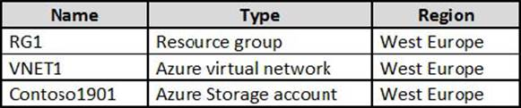

- [ ] Container registries: 0. Workspaces: 2.
- [ ] Container registries: 1. Workspaces: 3.
- [ ] Container registries: 2. Workspaces: 0.
- [x] Container registries: 0. Workspaces: 1.

### You have an Azure web app named WebApp1. You upload a certificate to WebApp1. You need to make the certificate accessible to the app code of WebApp1. What should you do?

- [ ] Add a user-assigned managed identity to WebApp1.
- [x] Add an app setting to the WebApp1 configuration.
- [ ] Enable system-assigned managed identity for the WebApp1.
- [ ] Configure the TLS/SSL binding for WebApp1.

### Your company plans to create separate subscriptions for each department. Each subscription will be associated to the same Azure Active Directory (Azure AD) tenant. You need to configure each subscription to have the same role assignments. What should you use?

- [ ] Azure Security Center.
- [x] Azure Blueprints.
- [ ] Azure AD Privileged Identity Management (PIM).
- [ ] Azure Policy.

### You have an Azure subscription that contains the resources shown in the following table. User1 is a member of Group1. Group1 and User2 are assigned the Key Vault Contributor role for Vault1. On January 1, 2019, you create a secret in Vault1. The secret is configured as shown in the exhibit. User2 is assigned an access policy to Vault1. The policy has the following configurations: Key Management Operations: Get, List, and Restore. Cryptographic Operations: Decrypt and Unwrap Key. Secret Management Operations: Get, List, and Restore. Group1 is assigned an access to Vault1. The policy has the following configurations: Key Management Operations: Get and Recover. Secret Management Operations: List, Backup, and Recover. On January 1, 2019, User1 can view the value of Password1.

- [ ] Yes.
- [x] No.

### You have an Azure subscription that contains the resources shown in the following table. User1 is a member of Group1. Group1 and User2 are assigned the Key Vault Contributor role for Vault1. On January 1, 2019, you create a secret in Vault1. The secret is configured as shown in the exhibit. User2 is assigned an access policy to Vault1. The policy has the following configurations: Key Management Operations: Get, List, and Restore. Cryptographic Operations: Decrypt and Unwrap Key. Secret Management Operations: Get, List, and Restore. Group1 is assigned an access to Vault1. The policy has the following configurations: Key Management Operations: Get and Recover. Secret Management Operations: List, Backup, and Recover. On June 1, 2019, User2 can view the value of Password1.

- [x] Yes.
- [ ] No.

### You have an Azure subscription that contains the resources shown in the following table. User1 is a member of Group1. Group1 and User2 are assigned the Key Vault Contributor role for Vault1. On January 1, 2019, you create a secret in Vault1. The secret is configured as shown in the exhibit. User2 is assigned an access policy to Vault1. The policy has the following configurations: Key Management Operations: Get, List, and Restore. Cryptographic Operations: Decrypt and Unwrap Key. Secret Management Operations: Get, List, and Restore. Group1 is assigned an access to Vault1. The policy has the following configurations: Key Management Operations: Get and Recover. Secret Management Operations: List, Backup, and Recover. On June 1, 2019, User1 can view the value of Password1.

- [ ] Yes.
- [x] No.

### You have Azure Resource Manager templates that you use to deploy Azure virtual machines. You need to disable unused Windows features automatically as instances of the virtual machines are provisioned. What should you use?

- [ ] Device configuration policies in Microsoft Intune.
- [x] Azure Desired State Configuration (DSC) virtual machine extension.
- [ ] Application security groups.
- [ ] Security policies in Azure Security Center.
- [ ] Azure Advisor.
- [ ] Device compliance policies in Microsoft Intune.

### You have a Azure subscription. You enable Azure Active Directory (Azure AD) Privileged identify (PIM). Your company's security policy for administrator accounts has the following conditions: The accounts must use multi-factor authentication (MFA). The account must use 20-character complex passwords. The passwords must be changed every 180 days. The account must be managed by using PIM. You receive alerts about administrator who have not changed their password during the last 90 days. You need to minimize the number of generated alerts. Which PIM alert should you modify?

- [ ] Roles don't require multi-factor authentication for activation.
- [ ] Administrator aren't using their privileged roles.
- [ ] Roles are being assigned outside of Privileged identity Management.
- [x] Potential stale accounts in a privileged role.

### You have an Azure subscription that contains an Azure Active Directory (Azure AD) tenant and a user named User1. The App registrations settings for the tenant are configured as shown in the following exhibit. You plan to deploy an app named App1. You need to ensure that User1 can register App1 in Azure AD. The solution must use the principle of least privilege. Which role should you assign to User1?

- [ ] App Configuration Data Owner for the subscription.
- [ ] Managed Application Contributor for the subscription.
- [ ] Cloud application administrator in Azure AD.
- [x] Application developer in Azure AD.

### You have three Azure subscriptions and a user named User1. You need to provide User1 with the ability to manage and view costs for the resources across all three subscriptions. The solution must use the principle of least privilege. Which three actions should you perform in sequence? To answer, move the appropriate actions from the list of actions to the answer area and arrange them in the correct order. NOTE: More than one order of answer choices is correct. You will receive credit for any of the correct orders you select

- [x] Box 1: Assign User1 the Cost Management Contributor role for the management group. Box 2: Assign User1 the Global administrator role. Box 3: Add the three subscriptions to the management group.
- [ ] Box 1: Assign User1 the Global administrator role. Box 2: Assign User1 the Owner role for the management group. Box 3: Create a management group.
- [ ] Box 1: Create a management group. Box 2: Assign User1 the Cost Management Contributor role for the management group. Box 3: Create a management group.
- [ ] Box 1: Assign User1 the Cost Management Contributor role for the management group. Box 2: Assign User1 the Global administrator role. Box 3: Assign User1 the Owner role for the management group.

### You have an Azure web app named webapp1. You need to configure continuous deployment for webapp1 by using an Azure Repo. What should you create first?

- [ ] Azure Application Insights service.
- [x] Azure DevOps organizations.
- [ ] Azure Storage account.
- [ ] Azure DevTest Labs lab.

### You plan to connect several Windows servers to the WS11641655 Azure Log Analytics workspace. You need to ensure that the events in the System event logs are collected automatically to the workspace after you connect the Windows servers. To complete this task, sign in to the Azure portal and modify the Azure resources

- [ ] NO ANSWER.
- [ ] NO ANSWER.
- [ ] NO ANSWER.
- [ ] NO ANSWER.

### You need to ensure that web11597200 is protected from malware by using Microsoft Antimalware for Virtual Machines and is scanned every Friday at 01:00. To complete this task, sign in to the Azure portal.

- [ ] NO ANSWER.
- [ ] NO ANSWER.
- [ ] NO ANSWER.
- [ ] NO ANSWER.

### You have an Azure Active Directory (Azure AD) tenant named Contoso.com and an Azure Service (AKS) cluster AKS1. You discover that AKS1 cannot be accessed by using accounts from Contoso.com You need to ensure AKS1 can be accessed by using accounts from Contoso.com The solution must minimize administrative effort. What should you do first?

- [x] From Azure recreate AKS1.
- [ ] From AKS1, upgrade the version of Kubermetes.
- [ ] From Azure AD, implement Azure AD Premium P2.
- [ ] From Azure AD, configure the User settings.

### You need to ensure that the AzureBackupReport log for the Vault1 Recovery Services vault is stored in the WS11641655 Azure Log Analytics workspace. To complete this task, sign in to the Azure portal and modify the Azure resources.

- [ ] NO ANSWER.
- [ ] NO ANSWER.
- [ ] NO ANSWER.
- [ ] NO ANSWER.

### You create resources in an Azure subscription as shown in the following table. VNET1 contains two subnets named Subnet1 and Subnet2. Subnet1 has a network ID of 10.0.0.0/24. Subnet2 has a network ID of 10.1.1.0/24. Contoso1901 is configured as shown in the exhibit. An Azure virtual machine on Subnet1 can access data on Contoso1901.

- [x] Yes.
- [ ] No.

### You create resources in an Azure subscription as shown in the following table. VNET1 contains two subnets named Subnet1 and Subnet2. Subnet1 has a network ID of 10.0.0.0/24. Subnet2 has a network ID of 10.1.1.0/24. Contoso1901 is configured as shown in the exhibit. An Azure virtual machine on Subnet2 can access data in Cantoso1901.

- [ ] Yes.
- [x] No.

### You create resources in an Azure subscription as shown in the following table. VNET1 contains two subnets named Subnet1 and Subnet2. Subnet1 has a network ID of 10.0.0.0/24. Subnet2 has a network ID of 10.1.1.0/24. Contoso1901 is configured as shown in the exhibit. A computer on the Internet that has an IP addres of 193.77.10.2 can access data in Contoso 1901.

- [x] Yes.
- [ ] No.

### You have an Azure subscription. You configure the subscription to use a different Azure Active Directory (Azure AD) tenant. What are two possible effects of the change?

- [x] Role assignments at the subscription level are lost.
- [x] Virtual machine managed identities are lost.
- [ ] Virtual machine disk snapshots are lost.
- [ ] Existing Azure resources are deleted.

### You need to create a web app named Intranet11597200 and enable users to authenticate to the web app by using Azure Active Directory (Azure AD). To complete this task, sign in to the Azure portal.

- [ ] NO ANSWER.
- [ ] NO ANSWER.
- [ ] NO ANSWER.
- [ ] NO ANSWER.

### You have an Azure subscription that contains the resources shown in the following table. You create the Azure Storage accounts shown in the following table. You need to configure auditing for SQL1. Which storage accounts and Log Analytics workspaces can you use as the audit log destination?

- [ ] Storage accounts that can be used as the audit log destination:: Storage1 only. Log Analytics workspaces that can be used as the audio log destination: Analytics1 only.
- [x] Storage accounts that can be used as the audit log destination:: Storage1 and Storage2 only. Log Analytics workspaces that can be used as the audio log destination: Analytics1, Analytics2, and Analytics3.
- [ ] Storage accounts that can be used as the audit log destination:: Storage1 and Storage2 only. Log Analytics workspaces that can be used as the audio log destination: Analytics1 and Analytics3 only.
- [ ] Storage accounts that can be used as the audit log destination:: Storage1, Storage2, and Storage3. Log Analytics workspaces that can be used as the audio log destination: Analytics1 and Analytics3 only.

### You need to deploy Docker containers to VM1. The containers must be able to access Azure Storage resources and Azure SQL databases by using the service endpoint. References: <https://docs.microsoft.com/en-us/azure/virtual-network/container-networking-overview>

- [ ] Create an application security group and a network security group (NSG).
- [ ] Edit the docker-compose.yml file.
- [x] Install the container network interface (CNI) plug-in.

### You company has an Azure Active Directory (Azure AD) tenant named contoso.com. You plan to create several security alerts by using Azure Monitor. You need to prepare the Azure subscription for the alerts. What should you create first?

- [ ] An Azure Storage account.
- [x] an Azure Log Analytics workspace.
- [ ] an Azure event hub.
- [ ] an Azure Automation account

### You need to deploy AKS1 to meet the platform protection requirements. Which four actions should you perform in sequence? To answer, move the appropriate actions from the list of actions to the answer area and arrange them in the correct order. NOTE: More than one order of answer choices is correct. You will receive credit for any of the correct orders you select. Explanation:Scenario: Azure AD users must be to authenticate to AKS1 by using their Azure AD credentials. Litewire plans to deploy AKS1, which is a managed AKS (Azure Kubernetes Services) cluster. Step 1: Create a server application To provide Azure AD authentication for an AKS cluster, two Azure AD applications arecreated. The first application is a server component that provides user authentication. Step 2: Create a client application The second application is a client component that's used when you're prompted by the CLI for authentication. This client application uses the server application for the actual authentication of the credentials pr vided by the client. Step 3: Deploy an AKS cluster. Use the az group create command to create a resource group for the AKS cluster. Use the az aks create command to deploy the AKS cluster. Step 4: Create an RBAC binding. Before you use an Azure Active Directory account with an AKS cluster, you must create role-binding or cluster role-binding. Roles define the permissions to grant, and bindings apply them to desired users. These assignments can be applied to a given namespace, or across the entire cluster

- [x] Deploy an AKS cluster.
- [x] Create a client application.
- [x] Create a server application.
- [x] Create an RBAC binding.
- [ ] Create a custom RBAC role.

### You have an Azure subscription that contains the virtual machines shown in the following table. Subnet1 and Subnet2 have a Microsoft.Storage service endpoint configured. You have an Azure Storage account named storageacc1 that is configured as shown in the following exhibit. For each of the following statements, select Yes if the statement is true. Otherwise, select No. Explanation: Box 1: Yes The public IP of VM1 is allowed through the firewall. Box 2: No The allowed virtual network list is empty so VM2 cannot access storageacc1 directly. The public IP address of VM2 is not in the allowed IP list so VM2 cannot access storageacc1 over the Internet. Box 3: No The allowed virtual network list is empty so VM3 cannot access storageacc1 directly. VM3 does not have a public IP address so it cannot access storageacc1 over the Internet

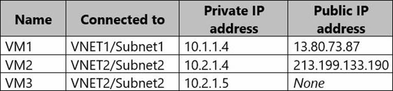

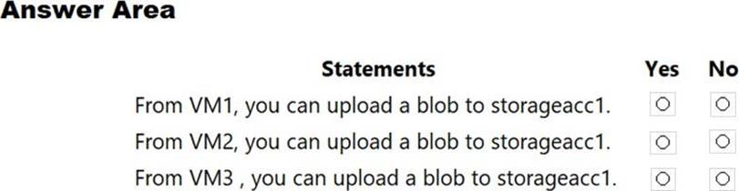

From VVM1, you can upload a blob to storageacc1.

- [x] Yes.
- [ ] No.

From VM2, you can upload a blob to storageacc1.

- [ ] Yes.
- [x] No.

From VM3, you can upload a blob to storageacc1.

- [ ] Yes.
- [x] No.

### You have an Azure subscription named Sub1 that contains the Azure Key Vaults shown in the following table.In Sub1, you create a virtual machine that has the following configurations: • Name:VM1 • Size: DS2v2 • Resource group: RG1 • Region: West Europe • Operating system: Windows Server 2016 You plan to enable Azure Disk Encryption on VM1. In which key vaults can you store the encryption key for VM1?

- [x] Vault1 or Vault3 only.
- [ ] Vault1, Vault2, Vault3, or Vault4.
- [ ] Vault1 only.
- [ ] Vault1 or Vault2 only.

### Note: This question is part of a series of questions that present the same scenario. Each question in the series contains a unique solution that might meet the stated goals. Some question sets might have more than one correct solution, while others might not have a correct solution. After you answer a question in this section, you will NOT be able to return to it. As a result, these questions will not appear in the review screen. You have an Azure Subscription named Sub1. Sub1 contains an Azure virtual machine named VM1 that runs Windows Server 2016. You need to encrypt VM1 disks by using Azure Disk Encryption. Which three actions should you perform in sequence? To answer, move the appropriate actions from the list of actions to the answer area and arrange them in the correct order. Explanation: References: <https://docs.microsoft.com/en-us/azure/virtual-machines/windows/encrypt-disks>

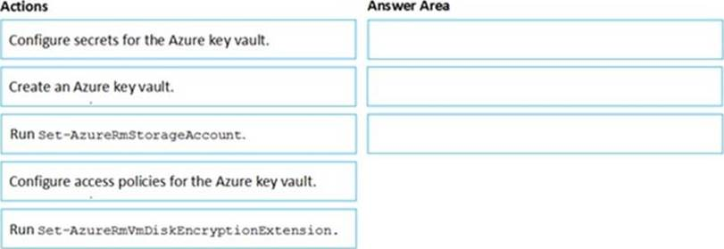

- [ ] Configure secrets for the Azure Key Vault.
- [x] Create an Azure key valut.
- [ ] Run Set-AzureRmStorageAccount.
- [x] Configure access policies for the Azure Key Vault.
- [x] Run Set-AzureRmVmDiskEncryptiomExtension.

### You are evaluating the security of VM1, VM2, and VM3 in Sub2. For each of the following statements, select Yes if the statement is true. Otherwise, select No. NOTE: Each correct selection is worth one point

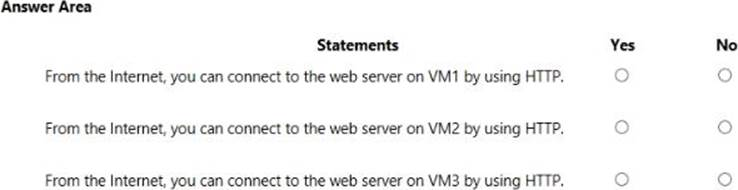

From the Internet, you can connect to the web server on VM1 by using HTTP.

- [x] Yes.
- [ ] No.

From the Internet, you can connect the web server on VM2 by using HTTP.

- [ ] Yes.
- [x] No.

From the Internet, you can connect to the server on VM3 by using HTTP.

- [x] Yes.
- [ ] No.

### You need to configure SQLDB1 to meet the data and application requirements. Which three actions should you recommend be performed in sequence? To answer, move the appropriate actions from the list of actions to the answer area and arrange them in the correct order. Explanation: From the Azure portal, create an Azure AD administrator for LitwareSQLServer1 Connect to SQLDB1 by using SSMS In SQLDB1, create contained database users <https://www.youtube.com/watch?v=pEPyPsGEevw>

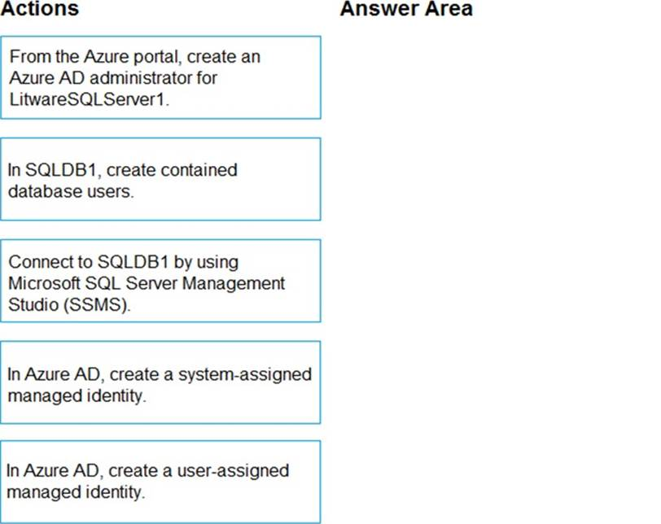

- [x] From the Azure portal, create an Azure AD administrator for LitwareSQLServer1.
- [x] In SQLDB1, create contained database users.
- [x] Connect to SQLDB1 by using Microsoft SQL Server Management Studio (SSMS).
- [ ] In Azure AD, create a system-assigned managed identity.
- [ ] In Azure AD, Create a user-assigned managed identity.

### Note: This question is part of a series of questions that present the same scenario. Each question in the series contains a unique solution that might meet the stated goals. Some question sets might have more than one correct solution, while others might not have a correct solution. After you answer a question in this section, you will NOT be able to return to it. As a result, these questions will not appear in the review screen. You have a hybrid configuration of Azure Active Directory (Azure AD). You have an Azure HDInsight cluster on a virtual network. You plan to allow users to authenticate to the cluster by using their on-premises Active Directory credentials. You need to configure the environment to support the planned authentication. Solution: You deploy Azure Active Directory Domain Services (Azure AD DS) to the Azure subscription. Does this meet the goal?

- [x] Yes.
- [ ] No.

### You have an Azure subscription named Sub1 that is associated to an Azure Active Directory (Azure AD) tenant named contoso.com. An administrator named Admin1 has access to the following identities: ✑ An OpenID-enabled user account ✑ A Hotmail account ✑ An account in contoso.com ✑ An account in an Azure AD tenant named fabrikam.com You plan to use Azure Account Center to transfer the ownership of Sub1 to Admin1. To which accounts can you transfer the ownership of Sub1?

- [ ] contoso.com only.
- [ ] contoso.com, fabrikam.com, and Hotmail only.
- [x] contoso.com and fabrikam.com only.
- [ ] contoso.com, fabrikam.com, Hotmail, and OpenID-enabled user account

### You have an Azure subscription named Sub1. You create a virtual network that contains one subnet. On the subnet, you provision the virtual machines shown in the following table.Currently, you have not provisioned any network security groups (NSGs). You need to implement network security to meet the following requirements: ✑ Allow traffic to VM4 from VM3 only. ✑ Allow traffic from the Internet to VM1 and VM2 only. ✑ Minimize the number of NSGs and network security rules. How many NSGs and network security rules should you create? To answer, select the appropriate options in the answer area. NOTE: Each correct selection is worth one point.Explanation: NSGs: 1 Network security rules: 3 Not 2: You cannot specify multiple service tags or application groups) in a security rule. References: <https://docs.microsoft.com/en-us/azure/virtual-network/security-overview>. NSGs: Network security rules

- [x] Box 1: 1. Box 2: 3.
- [ ] Box 1: 2. Box 2: 4.
- [ ] Box 1: 3. Box 2: 1.
- [ ] Box 1: 4. Box 2: 2.

### You have an Azure Active Directory (Azure AD) tenant that contains the users shown in the following table. In Azure AD Privileged Identity Management (PIM), the Role settings for the Contributor role are configured as shown in the exhibit. (Click the Exhibit tab.) You assign users the Contributor role on May 1, 2019 as shown in the following table. For each of the following statements, select Yes if the statement is true. Otherwise, select No. NOTE: Each correct selection is worth one point

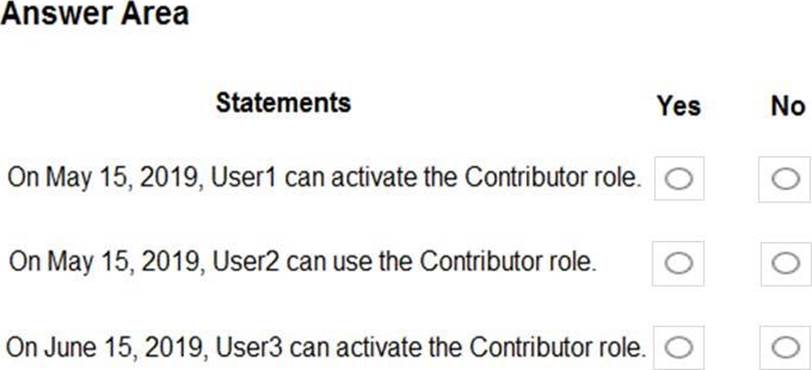

On May 15,2019, User1 can activare the Contributor role.

- [x] Yes.
- [ ] No.

On May 15,2019, User2 can use the Contributor role.

- [x] Yes.
- [ ] No.

On June 15,2019, User3 can activate the Contributor role.

- [x] Yes.
- [ ] No.

### You have an Azure subscription that contains a web app named App1 and an Azure Key Vault named Vault1. You need to configure App1 to store and access the secrets in Vault1. How should you configure App1? To answer, select the appropriate options in the answer area. NOTE: Each correct selection is worth one point. Configure App1 to authenticate by using a: Configure a Key Vault reference foe App1 from the

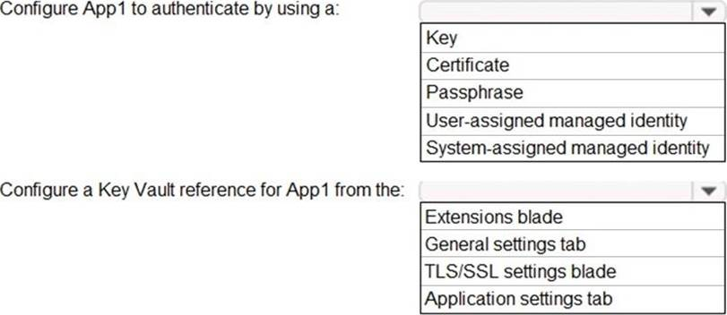

- [ ] Box 1: Key. Box 2: Extensions blade.
- [ ] Box 1: Certificate. Box 2: General settings tab.
- [ ] Box 1: Passphrase. Box 2: TLS/SSL settings blade.
- [ ] User-assigned managed identity. Box 2: Extensions blade
- [x] Box 1: System-assigned managed identity. Box 2: TLS/SSL settings blade.

### You have an Azure subscription that contains an app named App1. App1 has the app registration shown in the following table. You need to ensure that App1 can read all user calendars and create appointments. The solution must use the principle of least privilege. What should you do?

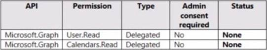

- [x] Add a new Delegated API permission for Microsoft.Graph Calendars.ReadWrite.
- [ ] Add a new Application API permission for Microsoft.Graph Calendars.ReadWrite.
- [ ] Select Grant admin consent.
- [ ] Add a new Delegated API permission for Microsoft.Graph Calendars.ReadWrite.Shared.

### You have an Azure subscription that contains the Azure virtual machines shown in the following table. You create an MDM Security Baseline profile named Profile1. You need to identify to which virtual machines Profile1 can be applied. Which virtual machines should you identify?

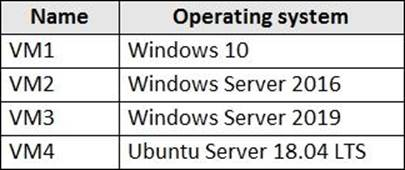

- [x] VM1 only.
- [ ] VM1, VM2, and VM3 only.
- [ ] VM1 and VM3 only.
- [ ] VM1, VM2, VM3, and VM4.

### This is a case study. Case studies are not timed separately. You can use as much exam time as you would like to complete each case. However, there may be additional case studies and sections on this exam. You must manage your time to ensure that you are able to complete all questions included on this exam in the time provided. To answer the questions included in a case study, you will need to reference information that is provided in the case study. Case studies might contain exhibits and other resources that provide more information about the scenario that is described in the case study. Each question is independent of the other question on this case study. At the end of this case study, a review screen will appear. This screen allows you to review your answers and to make changes before you move to the next sections of the exam. After you begin a new section, you cannot return to this section. To start the case study To display the first question on this case study, click the Next button. Use the buttosin the left pane to explore the content of the case study before you answer the questions. Clicking these buttons displays information such as business requirements, existing environment, and problem statements. If the case study has an All Information tab, note that the information displayed is identical to the information displayed on the subsequent tabs. When you are ready to answer a question, click the Question button to return to the question. Overview Litware, Inc. is a digital media company that has 500 employees in the Chicago area and 20 employees in the San Francisco area. Existing Environment Litware has an Azure subscription named Sub1 that has a subscription ID of 43894a43-17c2-4a39-8cfc-3540c2653ef4. Sub1 is associated to an Azure Active Directory (Azure AD) tenant named litwareinc.com. The tenant contains the user objects and the device objects of all the Litware employees and their devices. Each user is assigned an Azure AD Premium P2 license. Azure AD Privileged Identity Management (PIM) isactivated.The tenant contains the groups shown in the following table. The Azure subscription contains the objects shown in the following table.Azure Security Center is set to the Free tier. Planned changes Litware plans to deploy the Azure resources shown in the following table.dentity and Access Requirements Litware identifies the following identity and access requirements: ✑ All San Francisco users and their devices must be members of Group1. ✑ The members of Group2 must be assigned the Contributor role to Resource Group2 by using a permanent eligible assignment. ✑ Users must be prevented from registering applications in Azure AD and from consenting to applications that access company information on the users' behalf. Platform Protection Requirements Litware identifies the following platform protection requirements: ✑ Microsoft Antimalware must be installed on the virtual machines in Resource Group1. ✑ The members of Group2 must be assigned the Azure Kubernetes Service Cluster Admin Role. ✑ Azure AD users must be to authenticate to AKS1 by using their Azure AD credentials. ✑ Following the implementation of the planned changes, the IT team must be able to connect to VM0 by using JIT VM access. ✑ A new custom RBAC role named Role1 must be used to delegate the administration of the managed disks in Resource Group1. Role1 must be available only for Resource Group1. Security Operations Requirements Litware must be able to customize the operating system security configurations in Azure Security Center. HOTSPOT You need to create Role1 to meet the platform protection requirements. How should you complete the role definition of Role1? To answer, select the appropriate options in the answer area. NOTE: Each correct selection is worth one point

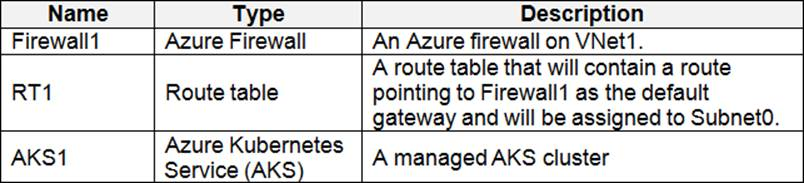

- [ ] BRAK ODPOWIEDZI

### You have an Azure subscription that contains the virtual machines shown in the following table. From Azure Security Center, you turn on Auto Provisioning. You deploy the virtual machines shown in the following table. On which virtual machines is the Microsoft Monitoring agent installed?

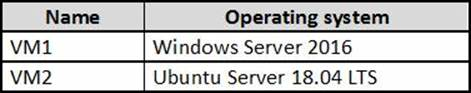
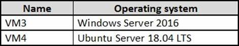

- [ ] VM3 only.
- [ ] VM1 and VM3 only.
- [ ] VM3 and VM4 only.
- [x] VM1, VM2, VM3, and VM4.

### You have an app that uses an Azure SQL database. You need to be notified if a SQL injection attack is launched against the database. What should you do?

- [ ] Modify the Diagnostics settings for the database.
- [ ] Deploy the SQL Health Check solution in Azure Monitor.
- [x] Enable Azure Defender for SQL for the database.
- [ ] Enable server-level auditing for the database.

### You have an Azure subscription that contains a storage account named storage1 and several virtual machines. The storage account and virtual machines are in the same Azure region. The network configurations of the virtual machines are shown in the following table. You configure the following Firewall and virtual networks settings for storage1: ✑ Allow access from: Selected networks ✑ Virtual networks: VNET3Subnet3 ✑ Firewall C Address range: 52.233.129.0/24 For each of the following statements, select Yes if the statement is true. Otherwise, select No. NOTE: Each correct selection is worth one point

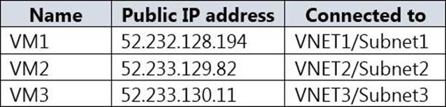
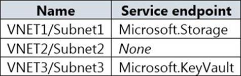
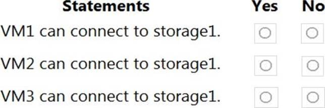

VM1 can connect to storage1.

- [ ] Yes.
- [x] No.

VM2 can connect to storage1.

- [x] Yes.
- [ ]

VM4 can connect to storage1.

- [ ] Yes.
- [x] No

### You need to create an Azure Key Vault. The solution must ensure that any object deleted from the key vault be retained for 90 days. How should you complete the command? To answer, select the appropriate options in the answer area. NOTE: Each correct selection is worth one point

- [ ] EnableForDeployment.
- [x] EnablePurgeProtection.
- [ ] Tag.

- [ ] Confirm.
- [ ] DefaultProfile.
- [x] EnableSoftDeelete.
- [ ] SKU.

### You are troubleshooting a security issue for an Azure Storage account. You enable the diagnostic logs for the storage account. What should you use to retrieve the diagnostics logs?

- [x] Azure Storage Explorer.
- [ ] SQL query editor in Azure.
- [ ] File Explorer in Windows.
- [ ] Azure Security Center.Topic 3, Fabrikam inc

### This is a case study. Case studies are not timed separately. You can use as much exam time as you would like to complete each case. However, there may be additional case studies and sections on this exam. You must manage your time to ensure that you are able to complete all questions included on this exam in the time provided.To answer the questions included in a case study, you will need to reference information that is provided in the case study. Case studies might contain exhibits and other resources that provide more information about the scenario that is described in the case study. Each question is independent of the other questions in this case study. At the end of this case study, a review screen will appear. This screen allows you to review your answers and to make changes before you move to the next section of the exam. After you begin a new section, you cannot return to this section. To start the case study To display the first question in this case study, click the Next button. Use the buttons in the left pane to explore the content of the case study before you answer the questions. Clicking these buttons displays information such as business requirements, existing environment, and problem statements. If the case study has an All Information tab, note that the information displayed is identical to the information displayed on the subsequent tabs. When you are ready to answer a question, click the Question button to return to the question. General Overview Fabrikam, Inc. is a consulting company that has a main office in Montreal and branch offices in Seattle and New York. Fabrikam has IT, human resources (HR), and finance departments. Existing Environment Network Environment Fabrikam has a Microsoft 365 subscription and an Azure subscription named subscription1. The network contains an on-premises Active Directory domain named Fabrikam.com. The domain contains two organizational units (OUs) named OU1 and OU2. Azure AD Connect cloud sync syncs only OU1. The Azure resources hierarchy is shown in the

following exhibit. The Azure Active Directory (Azure AD) tenant contains the users shown in the following table. Azure AD contains the resources shown in the following table.Subscription1 Resources Subscription1 contains the virtual networks shown in the following table. Subscription1 contains the network security groups (NSGs) shown in the following table. Subscription1 contains the virtual machines shown in the following table. Subscription1 contains the Azure Key Vaults shown in the following table. Subscription1 contains a storage account named storage1 in the West US Azure region. Planned Changes and Requirements Planned Changes Fabrikam plans to implement the following changes: ✑ Create two application security groups as shown in the following table.✑ Associate the network interface of VM1 to ASG1. ✑ Deploy SecPol1 by using Azure Security Center. ✑ Deploy a third-party app named App1. A version of App1 exists for all available operating systems. ✑ Create a resource group named RG2. ✑ Sync OU2 to Azure AD. ✑ Add User1 to Group1. Technical Requirements Fabrikam identifies the following technical requirements: ✑ The finance department users must reauthenticate after three hours when they access SharePoint Online. ✑ Storage1 must be encrypted by using customer-managed keys and automatic key rotation. ✑ From Sentinel1, you must ensure that the following notebooks can be launched: ✑ VM1, VM2, and VM3 must be encrypted by using Azure Disk Encryption. ✑ Just in time (JIT) VM access for VM1, VM2, and VM3 must be enabled. ✑ App1 must use a secure connection string stored in KeyVault1. ✑ KeyVault1 traffic must NOT travel over the internet. You need to meet the technical requirements for the finance department users.

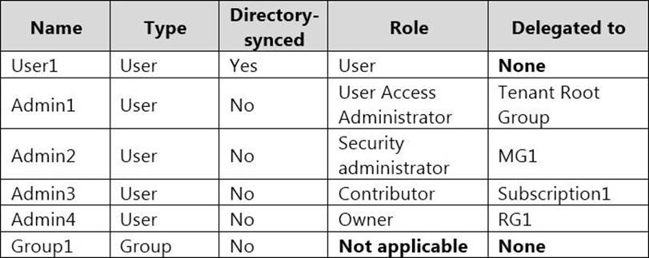

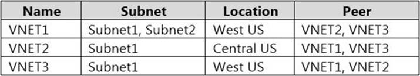

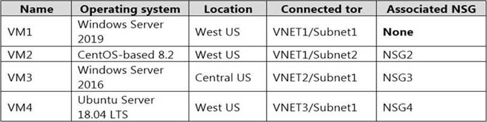
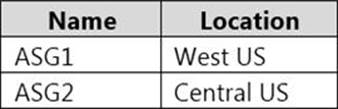

- [ ] Cloud apps or actions.
- [ ] Conditions.
- [ ] Grant.
- [x] Session.

### Note: This question is part of a series of questions that present the same scenario. Each question in the series contains a unique solution that might meet the stated goals. Some question sets might have more than one correct solution, while others might not have a correct solution. After you answer a question in this section, you will NOT be able to return to it. As a result, these questions will not appear in the review screen. You have an Azure Subscription named Sub1. You have an Azure Storage account named Sa1 in a resource group named RG1. Users and applications access the blob service and the file service in Sa1 by using several shared access signatures (SASs) and stored access policies. You discover that unauthorized users accessed both the file service and the blob service. You need to revoke all access to Sa1. Does this meet the goal?

- [x] Yes.
- [ ] No.

### You have an Azure Active Directory (Azure AD) tenant named contoso.com that contains the users shown in the following table. You create and enforce an Azure AD Identity Protection user risk policy that has the following settings: ✑ Assignment: Include Group1, Exclude Group2 ✑ Conditions: Sign-in risk of Medium and above ✑ Access: Allow access, Require password change For each of the following statements, select Yes if the statement is true. Otherwise, select No. NOTE: Each correct selection is worth one point

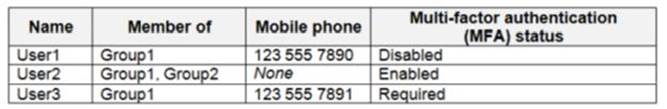
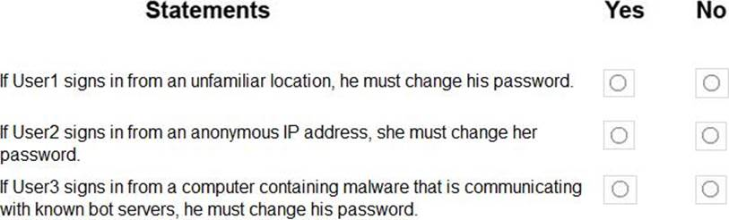
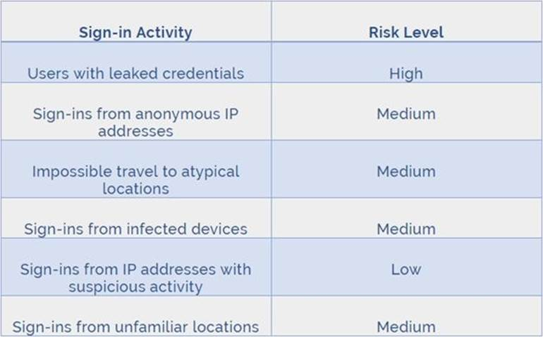

If User1 signs in from an unfamiliar location, he must change his password.

- [x] Yes.
- [ ] No.

If User2 sings in from an anonymous IP addres, she must change her password.

- [x] Yes.
- [ ] No.

If User3 sings in from a computer containing malware that is communicating with know bot servers, he must change his password.

- [ ] Yes.
- [x] No.

### You have the Azure virtual networks shown in the following table. You have the Azure virtual machines shown in the following table. The firewalls on all the virtual machines allow ping traffic. NSG1 is configured as shown in the following exhibit. Inbound security rules. Outbound security rules.For each of the following statements, select Yes if the statement is true. Otherwise, select No. NOTE: Each correct selection is worth one point

VM1 can ping VM3 successfully.

- [x] Yes.
- [ ] No.

VM2 can ping VM4 successfully.

- [ ] Yes.
- [x] No.

VM3 can be accessed by using Remote Deskopt from the internet.

- [x] Yes.
- [ ] No.

### You have an Azure subscription named Subcription1 that contains an Azure Active Directory (Azure AD) tenant named contosos.com and a resource group named RG1. You create a custom role named Role1 for contoso.com. You need to identify where you can use Role1 for permission delegation. What should you identify?

- [ ] contoso.com only.
- [ ] contoso.com and RGT only.
- [ ] contoso.com and Subscription1 only.
- [x] contoso.com, RG1, and Subcription1

### You need to ensure that the Azure AD application registration and consent configurations meet the identity and access requirements. What should you use in the Azure portal? To answer, select the appropriate options in the answer area. NOTE: Each correct selection is worth one point. To configure the registration settings: To configure the consent settings

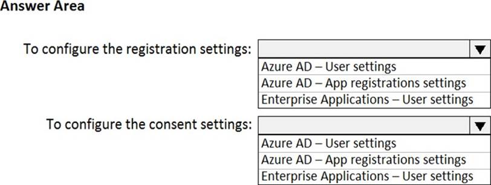

- [x] Box 1: Azure AD - User settings. Box 2: Enterprise Applications - User settings.
- [ ] Box 1: App registrations settings Box 2: Azure AD - User settings.
- [ ] Box 1: Enterprise Applications - User settings. Box 2: Azure AD - App registrations settings.

### You are configuring network connectivity for two Azure virtual networks named VNET1 and VNET2

You need to implement VPN gateways for the virtual networks to meet the following requirements:

- VNET1 must have six site-to-site connections that use BGP.
- VNET2 must have 12 site-to-site connections that use BGP.
- Costs must be minimized.
  Which VPN gateway SKI) should you use for each virtual network? To answer, drag the appropriate SKUs to the correct networks. Each SKU may be used once, more than once, or not at all. You may need to drag the split bar between panes or scroll to view content. NOTE: Each correct selection is worth one point

- [ ] ...

### You have an Azure Key Vault. You need to delegate administrative access to the key vault to meet the following requirements: ✑ Provide a user named User1 with the ability to set advanced access policies for the key vault. ✑ Provide a user named User2 with the ability to add and delete certificates in the key vault. ✑ Use the principle of least privilege. What should you use to assign access to each user? To answer, select the appropriate options in the answer area. NOTE: Each correct selection is worth one point. User1: User2

- [x] Box 1: RBAC Box 2: A key vault access policy.
- [ ] Box 1: A key vault access policy. Box 2: Azure Information Protection.
- [ ] Box 1: Azure Policy. Box 2: Managed identities for Azure resources.
- [ ] Box 1: Managed identities for Azure resources. Box 2: Azure Policy.
- [ ] Box 1: Information Protection. Box 2: PBAC.

### You need to ensure that you can meet the security operations requirements. What should you do first?

- [ ] Turn on Auto Provisioning in Security Center.
- [ ] Integrate Security Center and Microsoft Cloud App Security.
- [x] Upgrade the pricing tier of Security Center to Standard.
- [ ] Modify the Security Center workspace configuration.

### You have an Azure Active Din-dory (Azure AD) tenant named contoso.com that contains a user named User1. You plan to publish several apps in the tenant. You need to ensure that User1 can grant admin consent for the published apps. Which two possible user roles can you assign to User! to achieve this goal? Each correct answer presents a complete solution. NOTE: Each correct selection is worth one point

- [ ] Application developer.
- [ ] Security administrator.
- [x] Application administrator.
- [ ] User administrator.
- [ ] Cloud application administrator.
- [x] Cloud application administrator.

### Topic 2, Contoso. This is a case study. Case studies are not timed separately. You can use as much exam time as you would like to complete each case. However, there may be additional case studies and sections on this exam. You must manage your time to ensure that you are able to complete all questions included on this exam in the time provided. To answer the questions included in a case study, you will need to reference information that is provided in the case study. Case studies might contain exhibits and other resources that provide more information about the scenario that is described in the case study. Each question is independent of the other question on this case study. At the end of this case study, a review screen will appear. This screen allows you to review your answers and to make changes before you move to the next sections of the exam. After you begin a new section, you cannot return to this section. To start the case study To display the first question on this case study, click the Next button. Use the buttos in the left pane to explore the content of the case study before you answer the questions. Clicking these buttons displays information such as business requirements, existing environment, and problem statements. If the case study has an All Information tab, note that the information displayed is identical to the information displayed on the subsequent tabs. When you are ready to answer a question, click the Question button to return to the question. Overview Contoso, Ltd. is a consulting company that has a main office in Montreal and two branch offices in Seattle and New York. The company hosts its entire server infrastructure in Azure. Contoso has two Azure subscriptions named Sub1 and Sub2. Both subscriptions are associated to an Azure Active Directory (Azure AD) tenant named contoso.com. Technical requirements Contoso identifies the following technical requirements: ✑ Deploy Azure Firewall to VNetWork1 in Sub2. ✑ Register an application named App2 in contoso.com. ✑ Whenever possible, use the principle of least privilege. ✑ Enable Azure AD Privileged Identity Management (PIM) for contoso.co Existing Environment Azure AD Contoso.com contains the users shown in the following table.Contoso.com contains the security groups shown in the following table. Sub1 Sub1 contains six resource groups named RG1, RG2, RG3, RG4, RG5, and RG6. User2 creates the virtual networks shown in the following table. Sub1 contains the locks shown in the following table. Sub1 contains the Azure policies shown in the following table. Sub2 Sub2 contains the virtual machines shown in the following table. All virtual machines have the public IP addresses and the Web Server (IIS) role installed. The firewalls for each virtual machine allow ping requests and web requests. Sub2 contains the network security groups (NSGs) shown in the following table. NSG1 has the inbound security rules shown in the following table. NSG2 has the inbound security rules shown in the following table. NSG3 has the inbound security rules shown in the following table. NSG4 has the inbound security rules shown in the following table. NSG1, NSG2, NSG3, and NSG4 have the outbound security rules shown in the following table. Technical requirements Contoso identifies the following technical requirements: ✑ Deploy Azure Firewall to VNetwork1 in Sub2. ✑ Register an application named App2 in contoso.com. ✑ Whenever possible, use the principle of least privilege. ✑ Enable Azure AD Privileged Identity Management (PIM) for contoso.com. You need to meet the technical requirements for VNetwork1

- [x] Create a new subnet on VNetwork1.
- [ ] Remove the NSGs from Subnet11 and Subnet13.
- [ ] Associate an NSG to Subnet12.
- [ ] Configure DDoS protection for VNetwork1.

### What is the membership of Group1 and Group2? To answer, select the appropriate options in the answer area. NOTE: Each correct selection is worth one point

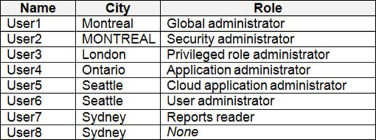

- [x] Box 1: User1, User2, User3, and User4. Box 2: Only User3.
- [ ] Box 1: No members. Box 2: User1, User2, User3, and User4.
- [ ] Box 1: Only User2. Box 2: Only User1 and User3.
- [ ] Box 1: Only User1 and User3. Box 2: No members.

### You need to perform the planned changes for OU2 and User1. Which tools should you use? To answer, drag the appropriate tools to the correct resources. Each tool may be used once, more than once, or not at all. You may need to drag the split bar between panes or scroll to view content. NOTE: Each correct selection is worth one point

- [x] The Azure portal.
- [x] Azure AD Connect
- [ ] The Active Directory admin center.
- [ ] Active Directory Sites and Services.
- [ ] Active Directory Users and Computers.

### You have an Azure Sentinel workspace that contains an Azure Active Directory (Azure AD) connector, an Azure Log Analytics query named Query1 and a playbook named Playbook1. Query1 returns a subset of security events generated by Azure AD. You plan to create an Azure Sentinel analytic rule based on Query1 that will trigger Playbook1. You need to ensure that you can add Playbook1 to the new rule. What should you do? To answer, select the appropriate options in the answer area. NOTE: Each correct selection is worth one point. Create the rule and set the type to: Configure the playbook to include

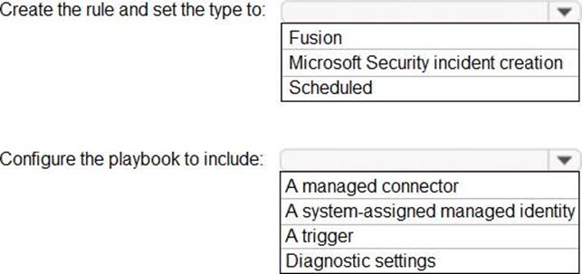

- [ ] Box 1: Fusion Box 2: A managed connector.
- [x] Box 1: Scheduled Box 2: A trigger.
- [ ] Box 1: Microsoft Security incedent creation Box 2: A system-assigned managed identity.
- [ ] Box 1: Fusion Box 2: Diagnostic settings.

### You have an Azure subscription named Subscription1. You need to view which security settings are assigned to Subscription1 by default. Which Azure policy or initiative definition should you review?

- [ ] the Audit diagnostic setting policy definition.
- [x] the Enable Monitoring in Azure Security Center initiative definition.
- [ ] the Enable Azure Monitor for VMs initiative definition.
- [ ] the Azure Monitor solution ‘Security and Audit' must be deployed policy definition

### You have an Azure subscription named Sub1. Sub1 has an Azure Storage account named Storage1 that contains the resources shown in the following table. You generate a shared access signature (SAS) to connect to the blob service and the file service. Which tool can you use to access the contents in Container1 and Share! by using the SAS? To answer, select the appropriate options in the answer area. NOTE: Each correct selection is worth one point. Tools for Container1: Tools for Share1

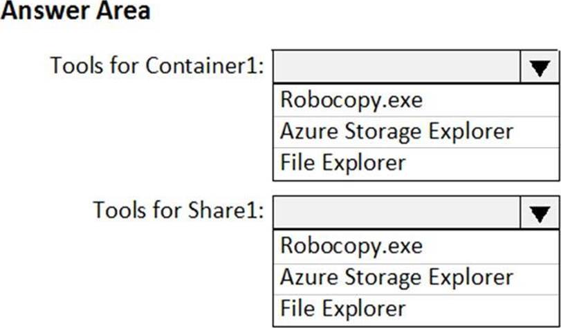

- [ ] Box 1: Robocopy.exe Box 2: Azure Storage Explorer.
- [ ] Box 1: Azure Storage Explorer Box 2: Robocopy.exe.
- [ ] Box 1: File Explorer Box 2: File Explorer.
- [x] Box 1: Azure Storage Explorer Box 2: Azure Storage Explorer.

### You need to configure WebApp1 to meet the data and application requirements. Which two actions should you perform? Each correct answer presents part of the solution. NOTE: Each correct selection is worth one point

- [ ] Upload a public certificate.
- [x] Turn on the HTTPS Only protocol setting.
- [ ] Set the Minimum TLS Version protocol setting to 1.2.
- [ ] Change the pricing tier of the App Service plan.
- [x] Turn on the Incoming client certificates protocol setting.

### You have an Azure Active Directory (Azure AD) tenant named contoso.onmicrosoft.com. The User administrator role is assigned to a user named Admin1. An external partner has a Microsoft account that uses the <user1@outlook.com> sign in. Admin1 attempts to invite the external partner to sign in to the Azure AD tenant and receives the following error message: “Unable to invite user <user1@outlook.com> Generic authorization exception.” You need to ensure that Admin1 can invite the external partner to sign in to the Azure AD tenant. What should you do?What should you do?

- [ ] From the Roles and administrators blade, assign the Security administrator role to Admin1.
- [ ] From the Organizational relationships blade, add an identity provider..
- [ ] From the Custom domain names blade, add a custom domain..
- [x] From the Users blade, modify the External collaboration settings.

### You have an Azure virtual machines shown in the following table. You create an Azure Log Analytics workspace named Analytics1 in RG1 in the East US region. Which virtual machines can be enrolled in Analytics1?

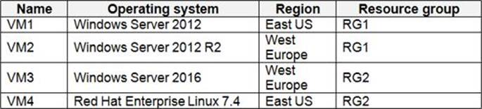

- [ ] VM1 only.
- [ ] VM1, VM2, and VM3 only.
- [x] VM1, VM2, VM3, and VM4.
- [ ] VM1 and VM4 only.

### You are securing access to the resources in an Azure subscription. A new company policy states that all the Azure virtual machines in the subscription must use managed disks. You need to prevent users from creating virtual machines that use unmanaged disks. What should you use?

- [ ] Azure Monitor.
- [x] Azure Policy.
- [ ] Azure Security Center.
- [ ] Azure Service Health

### You have a management group named Group1 that contains an Azure subscription named sub1. Sub1 has a subscription ID of 11111111-1234-1234-1234-1111111111. You need to create a custom Azure role-based access control (RBAC) role that will delegate permissions to manage the tags on all the objects in Group1. What should you include in the role definition of Role1? To answer, select the appropriate options in the answer area. NOTE: Each correct selection is worth one point. Resource provider: Assignable scope

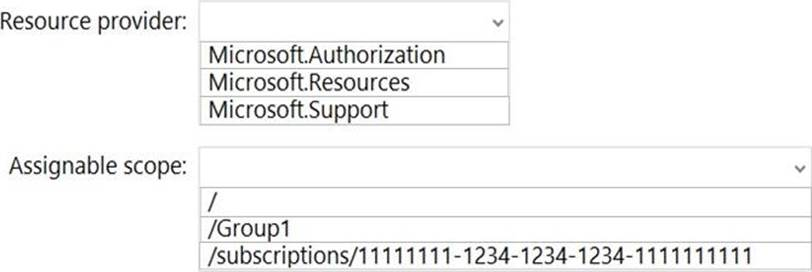

- [x] Box 1: Microsoft.Resources Box 2: /subscription/11111111-1234-1234-1234-1111111111.
- [ ] Box 1: Microsoft.Authorization Box 2: /.
- [ ] Box 1: Microsoft.Support Box 2: /Group1.

### You have 10 virtual machines on a single subnet that has a single network security group (NSG). You need to log the network traffic to an Azure Storage account. Which two actions should you perform? Each correct answer presents part of the solution. NOTE: Each correct selection is worth one point

- [ ] Install the Network Performance Monitor solution.
- [x] Enable Azure Network Watcher.
- [ ] Enable diagnostic logging for the NS.
- [ ] Enable NSG flow logs.
- [ ] Create an Azure Log Analytics workspace.

### From Azure Security Center, you need to deploy SecPol1. What should you do first?

- [ ] Enable Azure Defender.
- [ ] Create an Azure Management group.
- [x] Create an initiative.
- [ ] Configure continuous export.

### You have an Azure subscription that contains an Azure Active Directory (Azure AD) tenant. When a developer attempts to register an app named App1 in the tenant, the developer receives the error message shown in the following exhibit. You need to ensure that the developer can register App1 in the tenant. What should you do for the tenant?

- [x] Modify the User settings.
- [ ] Set Enable Security default to Yes.
- [ ] Modify the Directory properties.
- [ ] Configure the Consent and permissions settings for enterprise applications.

### You have an Azure subscription that contains an Azure Key Vault named ContosoKey1. You create users and assign them roles as shown in the following table

- [x] Box 1: User1 and User3 only Box 2: User1 only.
- [ ] Box 1: User1 only. Box 2: User1 and User2 only.
- [ ] Box 1: User1 and User2 only Box 2: User1 and User3 only.
- [ ] Box 1: User1 and User4 only Box 2: User1, User2, User3, and User4.
- [ ] Box 1: User1, User2, and User3 only Box 2: User1 and User4 only.
- [ ] Box 1: Box 1: User1, User2, User3, and User4. Box 2: User1, User2, and User3 only.

### You assign User8 the Owner role for RG4, RG5, and RG6. In which resource groups can User8 create virtual networks and NSGs? To answer, select the appropriate options in the answer area. NOTE: Each correct selection is worth one point. User8 can create virtual networks in: User8 can create NSGs in

- [x] Box 1: RG4 only Box 2: RG4, RG5, and RG6.
- [ ] Box 1: RG6 only Box 2: RG4 and RG6 only Box
- [ ] Box 1: RG4 and RG6 only Box 2: RG6 only Box 2:
- [ ] Box 1: RG4, RG5, and RG6 Box 2: RG4 only Box 2:

### You have an Azure subscription that contains an Azure Active Directory (Azure AD) tenant named contoso.com. The tenant contains the users shown in the following table. You create a resource group named RG1. Which users can modify the permissions for RG1 and which users can create virtual networks in RG1? To answer, select the appropriate options in the answer area. NOTE: Each correct selection is worth one point

- [x] Box 1: User1 only Box 2: User1 and User2 only.
- [ ] Box 1: User1 and User2 only Box 2: User1 only.
- [ ] Box 1: User1 and User3 only Box 2: User1, User2, User3, and User4.
- [ ] Box 1: User1, User2 and User3 only Box 2: User1 and User2 only.
- [ ] Box 1: User1, User2, User3, and User4 Box 2: User1 and User3 only.

### Note: This question is part of a series of questions that present the same scenario. Each question in the series contains a unique solution that might meet the stated goals. Some question sets might have more than one correct solution, while others might not have a correct solution. After you answer a question in this section, you will NOT be able to return to it. As a result, these questions will not appear in the review screen. You have a hybrid configuration of Azure Active Directory (AzureAD). You have an Azure HDInsight cluster on a virtual network. You plan to allow users to authenticate to the cluster by using their on-premises Active Directory credentials. You need to configure the environment to support the planned authentication. Solution: You deploy the On-premises data gateway to the on-premises network. Does this meet the goal?

- [ ] Yes.
- [x] No.

### You need to configure network connectivity between a virtual network named VNET1 and a virtual network named VNET2. The solution must ensure that virtual machines connected to VNET1 can communicate with virtual machines connected to VNET2. To complete this task, sign in to the Azure portal and modify the Azure resources

- [ ] BRAK ODPOWIEDZI

### Topic 1, Litware, inc This is a case study. Case studies are not timed separately. You can use as much exam time as you would like to complete each case. However, there may be additional case studies and sections on this exam. You must manage your time to ensure that you are able to complete all questions included on this exam in the time provided. To answer the questions included in a case study, you will need to reference information that is provided in the case study. Case studies might contain exhibits and other resources that provide more information about the scenario that is described in the case study. Each question is independent of the other question on this case study. At the end of this case study, a review screen will appear. This screen allows you to review your answers and to make changes before you move to the next sections of the exam. After you begin a new section, you cannot return to this section. To start the case study To display the first question on this case study, click the Next button. Use the buttons in the left pane to explore the content of the case study before you answer the questions. Clicking these buttons displays information such as business requirements, existing environment, and problem statements. If the case study has an All Information tab, note that the information displayed is identical to the information displayed on the subsequent tabs. When you are ready to answer a question, click the Question button to return to the question. Overview Litware, Inc. is a digital media company that has 500 employees in the Chicago area and 20 employees in the San Francisco area. Existing Environment Litware has an Azure subscription named Sub1 that has a subscription ID of 43894a43-17c2-4a39-8cfc-3540c2653ef4. Sub1 is associated to an Azure Active Directory (Azure AD) tenant named litwareinc.com. The tenant contains the user objects and the device objects of all the Litware employees and their devices. Each user is ssigned an Azure AD Premium P2 license. Azure AD Privileged Identity Management (PIM) is activated. The tenant contains the groups shown in the following table. The Azure subscription contains the objects shown in the following table. Azure Security Center is set to the Free tier. Planned changes bLitware plans to deploy the Azure resources shown in the following table.Identity and Access Requirements Litware identifies the following identity and access requirements:✑ All San Francisco users and their devices must be members of Group1. ✑ The members of Group2 must be assigned the Contributor role to Resource Group2 by using a permanent eligible assignment. ✑ Users must be prevented from registering applications in Azure AD and from consenting to applications that access company information on the users' behalf. Platform Protection Requirements Litware identifies the following platform protection requirements: ✑ Microsoft Antimalware must be installed on the virtual machines in Resource Group1. ✑ The members of Group2 must be assigned the Azure Kubernetes Service Cluster Admin Role. ✑ Azure AD users must be to authenticate to AKS1 by using their Azure AD credentials. ✑ Following the implementation of the planned changes, the IT team must be able to connect to VM0 by using JIT VM access. ✑ A new custom RBAC role named Role1 must be used to delegate the administration of the managed disks in Resource Group1. Role1 must be available only for Resource Group1. Security Operations Requirements Litware must be able to customize the operating system security configurations in Azure Security Center. HOTSPOT You need to deploy Microsoft Antimalware to meet the platform protection requirements. What should you do? To answer, select the appropriate options in the answer area. NOTE: Each correct selection is worth one point.

### A user named Debbie has the Azure app installed on her mobile device. You need to ensure that <debbie@contoso.com> is alerted when a resource lock is deleted. To complete this task, sign in to the Azure portal

- [ ] BRAK ODPOWIEDZI

### A user named Debbie has the Azure app installed on her mobile device. You need to ensure that [email protected] is alerted when a resource lock is deleted. To complete this task, sign in to the Azure portal

- [ ] BRAK ODPOWIEDZI

### You are configuring just in time (JIT) VM access to a set of Azure virtual machines. You need to grant users PowerShell access to the virtual machine by using JIT VM access. What should you configure? To answer, select the appropriate options in the answer area. NOTE: Each correct selection is worth one point. Permission that must be granted to users on VM: TCP potal that must be allowed

- [x] Box 1: Write Box 2: 5986.
- [ ] Box 1: Update Box 2: 23.
- [ ] Box 1: Read Box 2: 22.
- [ ] Box 1: View Box 2: 3389.

### From Azure Security Center, you enable Azure Container Registry vulnerability scanning of the images in Registry1. You perform the following actions: ✑ Push a Windows image named Image1 to Registry1. ✑ Push a Linux image named Image2 to Registry1. ✑ Push a Windows image named Image3 to Registry1. ✑ Modify Image1 and push the new image as Image4 to Registry1. ✑ Modify Image2 and push the new image as Image5 to Registry1. Which two images will be scanned for vulnerabilities? Each correct answer presents a complete solution. NOTE: Each correct selection is worth one point

- [ ] Image4.
- [x] Image2.
- [x] Image1.
- [ ] Image3
- [ ] Image5.

### You have a web app named WebApp1. You create a web application firewall (WAF) policy named WAF1. You need to protect WebApp1 by using WAF1.What should you do first?

- [x] Deploy an Azure Front Door.
- [ ] Add an extension to WebApp1.
- [ ] Deploy Azure Firewall.

### You have a hybrid configuration of Azure Active Directory (Azure AD). You have an Azure SQL Database instance that is configured to support Azure AD authentication. Database developers must connect to the database instance and authenticate by using their on-premises Active Directory account. You need to ensure that developers can connect to the instance by using Microsoft SQL Server Management Studio. The solution must minimize authentication prompts.Which authentication method should you recommend?

- [ ] Active Directory – Password.
- [ ] Active Directory – Universal with MFA support.
- [ ] SQL Server Authentication.
- [x] Active Directory – Integrated

### You need to deploy AKS1 to meet the platform protection requirements. Which four actions should you perform in sequence? To answer, move the appropriate actions from the list of actions to the answer area and arrange them in the correct order. NOTE: More than one order of answer choices is correct. You will receive credit for any of the correct orders you select

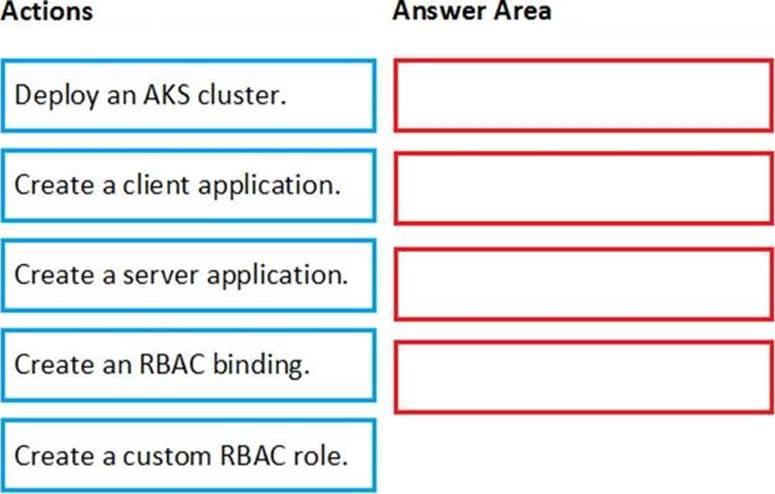

- [x] Deploy an AKS cluster.
- [x] Create a client application.
- [x] Create a server application.
- [ ] Create an RBAC binding.
- [x] Create a custom RBAC binding.

### You have an Azure subscription that contains a resource group named RG1 and a security group serverless RG1 contains 10 virtual machine, a virtual network VNET1, and a network security group (NSG) named NSG1. ServerAdmins can access the virtual machines by using RDP. You need to ensure that NSG1 only RDP connections to the virtual for a maximum of 60 minutes when a member of ServerAdmins requests access. What should you configure?

- [x] an Azure Active Directory (Azure AD) Privileged identity Management (PIM) role assignment.
- [ ] a just in time (JIT) VM access policy in Azure Security Center.
- [ ] an azure policy assigned to RG1..
- [ ] an Azure Bastion host on VNET1.

### Your company has an Azure subscription named Subscription1 that contains the users shown in the following table. The company is sold to a new owner. The company needs to transfer ownership of Subscription1. Which user can transfer the ownership and which tool should the user use? To answer, select the appropriate options in the answer area. NOTE: Each correct selection is worth one point

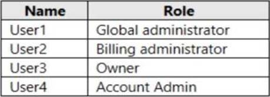
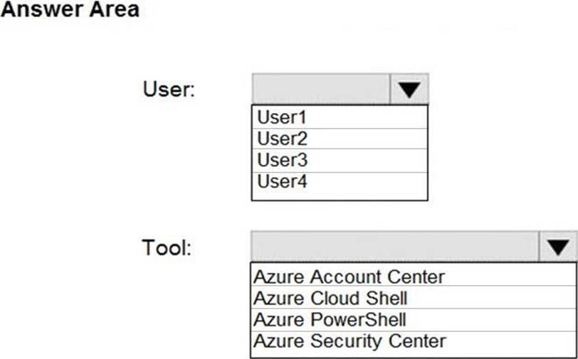

- [ ] Box 1: User 1 Box 2: Azure Cloud Shell.
- [x] Box 1: User 2 Box 2: Azure Account Center.
- [ ] Box 1: User 3 Box 2: Azure PowerShell.
- [ ] Box 1: User 4 Box 2: Azure Security Center.

### You have an Azure subscription. You create an Azure web app named Contoso1812 that uses an S1 App service plan. You create a DNS record for <www.contoso.com> that points to the IP address of Contoso1812. You need to ensure that users can access Contoso1812 by using the <https://www.contoso.com> URL Which two actions should you perform? Each correct answer presents part of the solution. NOTE: Each correct selection is worth one point

- [ ] Turn on the system-assigned managed identity for Contoso1812.
- [x] Add a hostname to Contoso1812.
- [ ] Scale out the App Service plan of Contoso1812.
- [ ] Add a deployment slot to Contoso1812.
- [ ] Scale up the App Service plan of Contoso1812.
- [x] Upload a PFX file to Contoso1812.

### You have an Azure subscription that contains an Azure Key Vault named Vault1. On January 1, 2019, Vault1 stores the following secrets. Which can each secret be used by an application? To answer, select the appropriate options in the answer area. NOTE: Each correct selection is worth one point. Password1: Password2

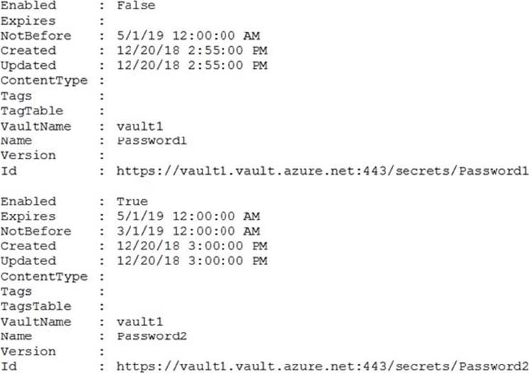
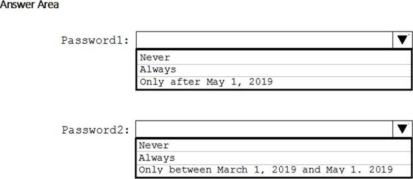

- [x] Box 1: Never Box 2: Only between March 1, 2019 and May 1.2019.
- [ ] Box 1: Always Box 2: Never.
- [ ] Box 1: Only after May 1, 2019 Box 2: Always.

### You have the Azure Information Protection conditions shown in the following table. You plan to use Azure Sentinel to monitor Windows Defender Firewall on the virtual machines. Which virtual machines you can connect to Azure Sentinel?

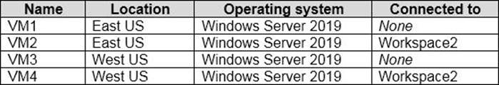

- [ ] VM1 and VM3 only.
- [ ] VM1 Only.
- [ ] VM1 and VM2 only.
- [x] VM1, VM2, VM3 and VM4.

### You have the Azure Information Protection conditions shown in the following table. You have the Azure Information Protection policies as shown in the following table. You need to identify how Azure Information Protection will label files. What should you identify? To answer, select the appropriate options in the answer area. NOTE: Each correct selection is worth one point. If User 1: creates a Microsoft World file that includes the text "Black and White", the file will be assigned: If User1 creates a Microsoft Notepad file that includes the text "Black or white", the file will be assigned

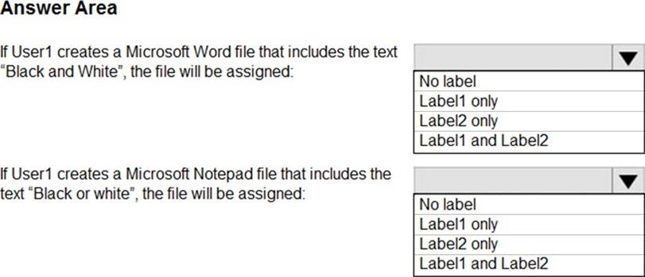

- [x] Box 1: Label2 only Box 2: No label.
- [ ] Box 1: No label Box 2: Label1 only.
- [ ] Box 1: Label1 only Box 2: Label and Label2 only.
- [ ] Box 1: Label and Label2 only Box2: Label2 only.

### You have an Azure subscription that is linked to an Azure Active Directory (Azure AD) tenant. From the Azure portal, you register an enterprise application. Which additional resource will be created in Azure AD?

- [x] a service principal.
- [ ] an.
- [ ] 509 certificate.
- [ ] a managed identity
- [ ] a user account.

### You have an Azure subscription. You plan to create a custom role-based access control (RBAC) role that will provide permission to read the Azure Storage account. Which property of the RBAC role definition should you configure?

- [ ] NotActions [].
- [ ] DataActions [].
- [ ] AssignableScopes [].
- [x] Actions []

- [ ] VM2 and VM3 only.
- [ ] VM2, VM3, and VM4 only.
- [x] VM1, VM2, and VM4 only.
- [ ] VM1, VM2, VM3, and VM4.
- [ ] VM1, VM2, and VM3 only.

### You have the Azure virtual machines shown in the following table. Each virtual machine has a single network interface. You add the network interface of VM1 to an application security group named ASG1. You need to identify the network interfaces of which virtual machines you can add to ASG1. What should you identify?

- [ ] VM2 only.
- [ ] VM2, VM3, VM4, and VM5.
- [ ] VM2, VM3, and VM5 only.
- [x] Vm2 and Vm3 only.

### You have an Azure subscription named Sub1. In Azure Security Center, you have a security playbook named Play1. Play1 is configured to send an email message to a user named User1. You need to modify Play1 to send email messages to a distribution group named Alerts. What should you use to modify Play1?

- [ ] Azure DevOps.
- [ ] Azure Application Insights.
- [ ] Azure Monitor.
- [x] Azure Logic Apps Designer

### You have an Azure subscription named Sub1 that contains the virtual machines shown in the following table. You need to ensure that the virtual machines in RG1 have the Remote Desktop port closed until an authorized user requests access. What should you configure?

- [ ] Azure Active Directory (Azure AD) Privileged Identity Management (PIM).
- [ ] An application security group.
- [ ] Azure Active Directory (Azure AD) conditional access.
- [x] Just in time (JIT) VM access

### You have an Azure subscription named Sub1 that contains an Azure Storage account named Contosostorage1 and an Azure Key Vault named Contosokeyvault1. You plan to create an Azure Automation runbook that will rotate the keys of Contosostorage1 and store them in Contosokeyvault1. You need to implement prerequisites to ensure that you can implement the runbook. Which three actions should you perform in sequence? To answer, move the appropriate actions from the list of actions to the answer area and arrange them in the correct order

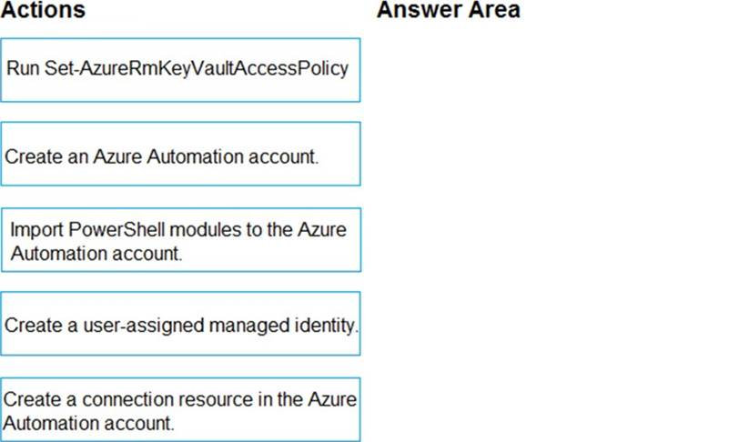

- [ ] Run Set-AzureRmKeyVaultAccessPolicy.
- [x] Create an Azure Automation account.
- [x] Import PowerShell modules to the Azure Automation account.
- [ ] Create a user-assigned managed identity.
- [x] Create a connection resource in the Azure Automation account.

### Your company has an Azure Active Directory (Azure AD) tenant named contoso.com. The company is developing an application named App1. App1 will run as a service on server that runs Windows Server 2016. App1 will authenticate to contoso.com and access Microsoft Graph to read directory data. You need to delegate the minimum required permissions to App1. Which three actions should you perform in sequence from the Azure portal? To answer, move the appropriate actions from the list of actions to the answer area and arrange them in the correct order

- [ ] Grant permissions.
- [x] Add a delegated permission.
- [ ] Configure Azure Ad Application Proxy.
- [x] Add an application permission.
- [x] Create an app registration.

### You suspect that users are attempting to sign in to resources to which they have no access. You need to create an Azure Log Analytics query to identify failed user sign-in attempts from the last three days. The results must only show users who had more than five failed sign-in attempts. How should you configure the query? To answer, select the appropriate options in the answer area. NOTE: Each correct selection is worth one point

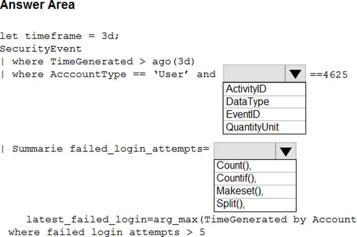

- [ ] Box 1: ActivityID Box 2: Countif(),.
- [ ] Box 1: DataTypen Box 2: Makeset(),.
- [x] Box 1: EventID Box 2: Count(),.
- [ ] Box 1: QuantityUnit Box 2: Split(),.

### You have an Azure Active Directory (Azure AD) tenant named contoso.com that contains the users shown in the following table. Contoso.com contains a group naming policy. The policy has a custom blocked word list rule that includes the word Contoso. Which users can create a group named Contoso Sales in contoso.com? To answer, select the appropriate options in the answer area. NOTE: Each correct selection is worth one point. Users who can create a security group named Contoso Sales: Users who can create an Office 365 group named Cantoso Sales

- [x] Box 1: Admin1 and Admin3 only Box 2: Admin1 and Admin3 only.
- [ ] Box 1: Admin1 only Box 2: Admin1 and Admin2 only.
- [ ] Box 1: Admin1, Admin2, and Admin3 Box 2: Admin1.
- [ ] Box 1: Admin1 and Admin2 only Box 2: Admin1, Admin2, and Admin3.

### Note: This question is part of a series of questions that present the same scenario. Each question in the series contains a unique solution that might meet the stated goals. Some question sets might have more than one correct solution, while others might not have a correct solution. After you answer a question in this section, you will NOT be able to return to it. As a result, these questions will not appear in the review screen. You have a hybrid configuration of Azure Active Directory (Azure AD). You have an Azure HDInsight cluster on a virtual network. You plan to allow users to authenticate to the cluster by using their on-premises Active Directory credentials. You need to configure the environment to support the planned authentication. Solution: You deploy an Azure AD Application Proxy. Does this meet the goal?

- [ ] Yes.
- [x] No.

### You need to ensure that the events in the NetworkSecurityGroupRuleCounter log of the VNET01-Subnet0-NSG network security group (NSG) are stored in the logs11597200 Azure Storage account for 30 days. To complete this task, sign in to the Azure portal

- [ ] ... BRAK ODPOWIEDZI

### You have an Azure Active Directory (Azure AD) tenant and a root management group. You create 10 Azure subscriptions and add the subscriptions to the rout management group. You need to create an Azure Blueprints definition that will be stored in the root management group. What should you do first?

- [ ] Add an Azure Policy definition to the root management group.
- [x] Modify the role-based access control (RBAC) role assignments for the root management group..
- [ ] Create a user-assigned identity..
- [ ] Create a service principal.

### You have 15 Azure virtual machines in a resource group named RG1. All virtual machines run identical applications. You need to prevent unauthorized applications and malware from running on the virtual machines. What should you do?

- [ ] Apply an Azure policy to RG1.
- [x] From Azure Security Center, configure adaptive application controls..
- [ ] Configure Azure Active Directory (Azure AD) Identity Protection..
- [ ] Apply a resource lock to RG1.

### You have an Azure Active Directory (Azure AD) tenant named contoso1812.onmicrosoft.com that contains the users shown in the following table. You create an Azure Information Protection label named Label1. The Protection settings for Label1 are configured as shown in the exhibit. (Click the Exhibit tab.) Label1 is applied to a file named File1. For each of the following statements, select Yes if the statement is true, Otherwise, select No. NOTE: Each correct selection is worth one point

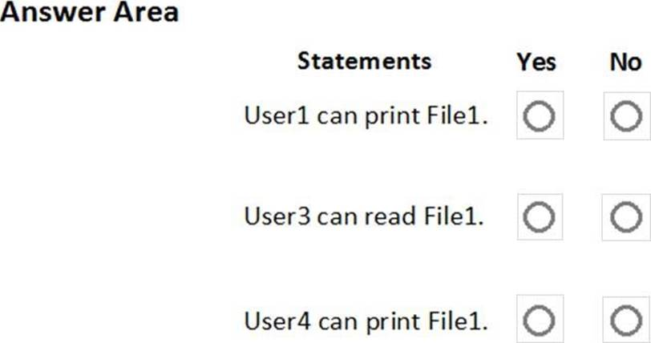

User1 cam print File1.

- [x] Yes.
- [ ] No.

User3 can read File1.

- [x] Yes.
- [ ] No.

User4 can print File1.

- [ ] Yes.
- [x] No.

### You have an Azure subscription named Sub1. In Azure Security Center, you have a workflow automation named WF1. WF1 is configured to send an email message to a user named User1. You need to modify WF1 to send email messages to a distribution group named Alerts. What should you use to modify WF1?

- [ ] Azure Application Insights.
- [ ] Azure Monitor.
- [x] Azure Logic Apps Designer.
- [ ] Azure DevOps.

### You have an Azure subscription named Sub1. You have an Azure Active Directory (Azure AD) group named Group1 that contains all the members of your IT team. You need to ensure that the members of Group1 can stop, start, and restart the Azure virtual machines in Sub1. The solution must use the principle of least privilege. Which three actions should you perform in sequence? To answer, move the appropriate actions from the list of actions to the answer area and arrange them in the correct order

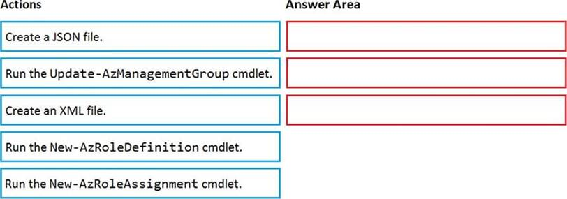

- [ ] Create a JSON file.
- [ ] Run the Update-AzManagementGroup cmdlet.
- [x] Create an XML file.
- [x] Run the New-AzRoleDefinition cmdlet.
- [x] Run the New-AzRoleAssignment cmdlet.

### You have three on-premises servers named Server1, Server2, and Server3 that run Windows Server1 and Server2 and located on the Internal network. Server3 is located on the premises network. All servers have access to Azure. From Azure Sentinel, you install a Windows firewall data connector. You need to collect Microsoft Defender Firewall data from the servers for Azure Sentinel. What should you do?

- [ ] Create an event subscription from Server1, Server2 and Server3.
- [ ] Install the On-premises data gateway on each server..
- [x] Install the Microsoft Agent on each server..
- [ ] Install the Microsoft Agent on Server1 and Server2 install the on-premises data gateway on Server3.

### You plan to use Azure Log Analytics to collect logs from 200 servers that run Windows Server 2016. You need to automate the deployment of the Microsoft Monitoring Agent to all the servers by using an Azure Resource Manager template. How should you complete the template? To answer, select the appropriate options in the answer area. NOTE: Each correct selection is worth one point

- [x] Box 1: WorkspaceID Box 2: WorkspaceKey.
- [ ] Box 1: AzureADApplicationID Box 2: WorkspaceID
- [ ] Box 1: WorkspaceName Box 2: StorageAccountKey.
- [ ] Box 1: AzureADApplicationSecret Box 2: WorkspaceURL.

### You have an Azure Kubernetes Service (AKS) cluster that will connect to an Azure Container Registry. You need to use automatically generated service principal for the AKS cluster to authenticate to the Azure Container Registry. What should you create?

- [ ] a secret in Azure Key Vault.
- [x] a role assignment.
- [ ] an Azure Active Directory (Azure AD) user.
- [ ] an Azure Active Directory (Azure AD) group

### You have a Azure subscription that contains an Azure Container Registry named Registry1. The subscription uses the Standard use tier of Azure Security Center. You upload several container images to Register1. You discover that vulnerability security scans were not performed. You need to ensured that the images are scanned for vulnerabilities when they are uploaded to Registry1. What should you do?

- [x] From the Azure portal modify the Pricing tier settings.
- [ ] From Azure CLI, lock the container images..
- [ ] Upload the container images by using AzCopy.
- [ ] Push the container images to Registry1 by using Docker

### You have the Azure Key Vaults shown in the following table. KV1 stores a secret named Secret1 and a key for a managed storage account named Key1. You back up Secret1 and Key1. To which key vaults can you restore each backup? To answer, select the appropriate options in the answer area. NOTE: Each correct selection is worth one point. You can restore the Secret1 backup to: You can restore the Key1 backup to

- [ ] Box 1: KV1 only Box 2: KV1, KV2, KV3, KV4, and KV5.
- [ ] Box 1: KV1 and KV2 only Box 2: KV1, KV2 and KV4 only Box.
- [x] Box 1: KV1, KV2 and KV3 only Box 2: KV1, KV2 and KV3 only.
- [ ] Box 1: KV1, KV2 and KV4 only Box 2: KV1 and KV2 only Box.
- [ ] Box 1: KV1, KV2, KV3, KV4, and KV5 Box 2: KV1 only.

### You need to meet the technical requirements for VNetwork1. What should you do first?

- [x] Create a new subnet on VNetwork1.
- [ ] Remove the NSGs from Subnet11 and Subnet13.
- [ ] Associate an NSG to Subnet12.
- [ ] Configure DDoS protection for VNetwork1.

### You network contains an on-premises Active Directory domain that syncs to an Azure Active Directory (Azure AD) tenant. The tenant contains the users shown in the following table. The tenant contains the groups shown in the following table. The tenant contains the groups shown in the following table. You configure a multi-factor authentication (MFA) registration policy that and the following settings: • Assignments: • Include: Group1 • Exclude Group2 • Controls: Require Azure MFA registration • Enforce Policy: On For each of the following statements, select Yes if the statement is true. Otherwise, select No

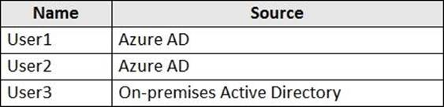
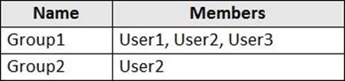
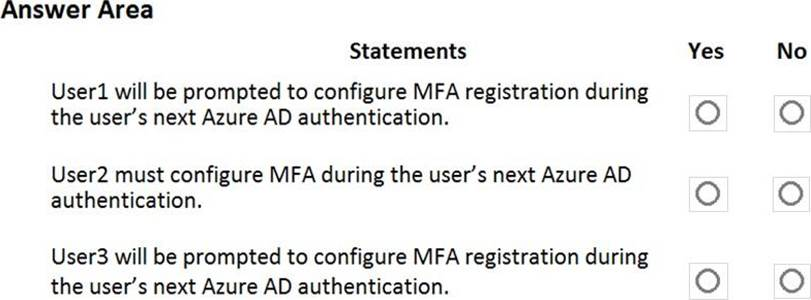

User1 will be promped to configure MFA registration during the user's next Azure AD authentication.

- [x] Yes.
- [ ] No.

User2 must configure MFA during the user's next Azure AD authentication.

- [ ] Yes.
- [x] No.

User3 will be promped to configure MFA registration during the user's next Azure AD authentication.

- [x] Yes.
- [ ] No.

### You have an Azure subscription that contains virtual machines. You enable just in time (JIT) VM access to all the virtual machines. You need to connect to a virtual machine by using Remote Desktop. What should you do first?

- [ ] From Azure Directory (Azure AD) Privileged Identity Management (PIM), activate the Security administrator user role.
- [ ] From Azure Active Directory (Azure AD) Privileged Identity Management (PIM), activate the Owner role for the virtual machine.
- [x] From the Azure portal, select the virtual machine, select Connect, and then select Request access.
- [ ] From the Azure portal, select the virtual machine and add the Network Watcher Agent machine extension.

### You have an azure active Directory (Azure AD) tenant that contains the resources shown in the following table. User2 is the owner of Group2. The user and group settings for App1 are configured as shown in the following exhibit. Groupe awanser: App1 users

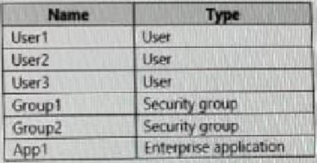
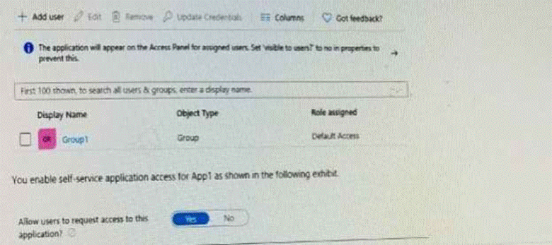
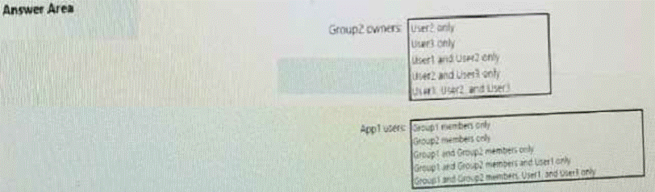

- [x] Box 1: User2 and User3 only Box 2: Group1 members only.
- [ ] Box 1: User2 only Box 2: Group1 amd Group2 members, User1 and User2 only.
- [ ] Box 1: User1, User2, and User3 Box 2: Group1 amd Group2 members and User1 only.
- [ ] Box 1: User1 and User2 only Box 2: Group1 amd Group2 members only.
- [ ] Box 1: User3 only Box 2: Group2 members only.

### You have an Azure subscription named Sub1 that contains an Azure Log Analytics workspace named LAW1. You have 100 on-premises servers that run Windows Server 2012 R2 and Windows Server 2016. The servers connect to LAW1. LAW1 is configured to collect security-related performance counters from the connected servers. You need to configure alerts based on the data collected by LAW1. The solution must meet the following requirements: • Alert rules must support dimensions. • The time it takes to generate an alert must be minimized. • Alert notifications must be generated only once when the alert is generated and once when the alert is • resolved. Which signal type should you use when you create the alert rules?

- [ ] Log.
- [ ] Log (Saved Query).
- [x] Metric.
- [ ] Activity Log

### Your network contains an Active Directory forest named contoso.com. You have an Azure Directory (Azure AD) tenant named contoso.com. You plan to configure synchronization by using the Express Settings installation option in Azure AD Connect. You need to identify which roles and groups are required to perform the planned configurations. The solution must use the principle of least privilege. Which two roles and groups should you identify? Each correct answer presents part of the solution. NOTE: Each correct selection is worth one point

- [x] the Domain Admins group in Active Directory.
- [ ] the Security administrator role in Azure AD.
- [x] the Global administrator role in Azure AD.
- [ ] the User administrator role in Azure AD.
- [x] the Enterprise Admins group in Active Directory.

### You onboard Azure Sentinel. You connect Azure Sentinel to Azure Security Center. You need to automate the mitigation of incidents in Azure Sentinel. The solution must minimize administrative effort. What should you create?

- [ ] an alert rule.
- [ ] a playbook.
- [x] a function app.
- [ ] a runbook.

### You need to ensure that connections from the Internet to VNET1subnet0 are allowed only over TCP port 7777. The solution must use only currently deployed resources. To complete this task, sign in to the Azure portal

- [ ] BRAK ODPOWEIDZI

### You need to configure a weekly backup of an Azure SQL database named Homepage. The backup must be retained for eight weeks. To complete this task, sign in to the Azure portal

- [ ] ... BRAK ODPWIEDZI

### You need to ensure that connections through an Azure Application Gateway named Homepage-AGW are inspected for malicious requests. To complete this task, sign in to the Azure portal. You do not need to wait for the task to complete

- [ ] BRAK ODPOWIEDZI

### You have an Azure subscription that contains a user named Admin1 and a resource group named RG1. In Azure Monitor, you create the alert rules shown in the following table. Admin1 performs the following actions on RG1: • Adds a virtual network named VNET1 • Adds a Delete lock named Lock1 Which rules will trigger an alert as a result of the actions of Admin1? To answer, select the appropriate options in the answer area. NOTE: Each correct selection is worth one point. Adding Vnet1: Adding Lock1

- [ ] Box 1: Rule2 only Box 2: Rule1, Rule2, Rule3, and Rule 4 Box 2.
- [ ] Box 1: Rule4 only Box 2: Rule3 and Rule 4 only Box 2.
- [x] Box 1: Rule2 and Rule 4 only Box 2: Rule2 and Rule 4 only.
- [ ] Box 1: Rule3 and Rule 4 only Box 2: Rule4 only.
- [ ] Box 1: Rule1, Rule2, Rule3, and Rule 4 Box 2: Rule2 only.

### You plan to use Azure Resource Manager templates to perform multiple deployments of identically configured Azure virtual machines. The password for the administrator account of each deployment is stored as a secret in different Azure Key Vaults. You need to identify a method to dynamically construct a resource ID that will designate the key vault containing the appropriate secret during each deployment. The name of the key vault and the name of the secret will be provided as inline parameters. What should you use to construct the resource ID?

- [ ] a key vault access policy.
- [x] a linked template.
- [ ] a parameters file.
- [ ] an automation account.

### Note: This question is part of a series of questions that present the same scenario. Each question in the series contains a unique solution that might meet the stated goals. Some question sets might have more than one correct solution, while others might not have a correct solution. After you answer a question in this section, you will NOT be able to return to it. As a result, these questions will not appear in the review screen. You have a hybrid configuration of Azure Active Directory (AzureAD). You have an Azure HDInsight cluster on a virtual network. You plan to allow users to authenticate to the cluster by using their on-premises Active Directory credentials. You need to configure the environment to support the planned authentication. Solution: You create a site-to-site VPN between the virtual network and the on-premises network. Does this meet the goal?

- [x] Yes.
- [ ] No.

### You need to create Role1 to meet the platform protection requirements. How should you complete the role definition of Role1? To answer, select the appropriate options in the answer area. NOTE: Each correct selection is worth one point

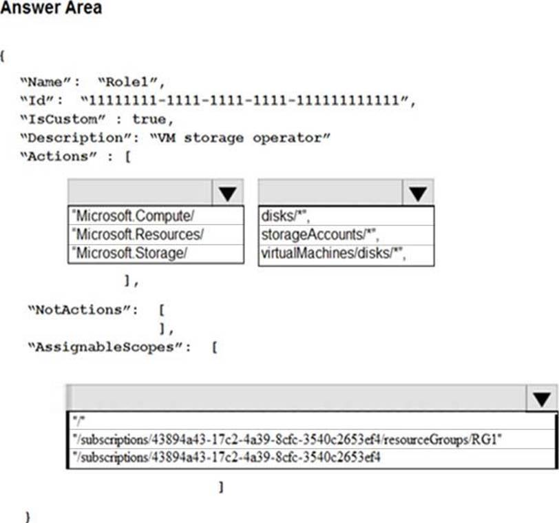

- [x] Box 1: "Microsoft.Compute/ Box 2: disks/". Box 3: "/subscription/4389a43-17c24a39-8cfc-3540c2653ef4/resourceGrups/RG1".
- [ ] Box 1: "Microsoft.Resources/ Box 2: storageAccounts/\*", Box 4: /subscription/4389a43-17c24a39-8cfc-3540c2653ef4.
- [ ] Box 1: "Microsoft.Storage/ Box 2: virtualMachines/disks/\*"/, Box 3: "/" .

### You need to configure a virtual network named VNET2 to meet the following requirements: Administrators must be prevented from deleting VNET2 accidentally. Administrators must be able to add subnets to VNET2 regularly. To complete this task, sign in to the Azure portal and modify the Azure resources

- [ ] BRAK ODPOWIEDZI

### You need to enable Advanced Data Security for the SQLdb1 Azure SQL database. The solution must ensure that Azure Advanced Threat Protection (ATP) alerts are sent to <User1@contoso.com>. To complete this task, sign in to the Azure portal and modify the Azure resources

-[x] BRAK ODPOWEIDZI

### You have an Azure subscription that contains the resources shown in the following table

Delting the security rule that has a priority of 100 will revoke the approved JIT acces request.

- [x] Yes.
- [ ] No.

Remote Desktop access to VM5 is blocked.

- [x] Yes.
- [ ] No.

An Azure Bastion host will eneble Remote Desktop access to VM5 from the.

- [ ] Yes.
- [x] No.

### You are implementing conditional access policies. You must evaluate the existing Azure Active Directory (Azure AD) risk events and risk levels to configure and implement the policies. You need to identify the risk level of the following risk events: Users with leaked credentials Impossible travel to atypical locations Sign ins from IP addresses with suspicious activity Which level should you identify for each risk event? To answer, drag the appropriate levels to the correct risk events. Each level may be used once, more than once, or not at all. You may need to drag the split bar between panes or scroll to view content. NOTE: Each correct selection is worth one point

Impossible travel to atypical location:

- [ ] High.
- [x] Medium.

Users with leaked credentails:

- [ ] Low.
- [x] High.

Sing ins From IP addresses with supicious activity:

- [ ] Medium.
- [x] Medium.

### You create an Azure subscription with Azure AD Premium P2. You need to ensure that you can use Azure Active Directory (Azure AD) Privileged Identity Management (PIM) to secure Azure roles. Which three actions should you perform in sequence? To answer, move the appropriate actions from the list of actions to the answer area and arrange them in the correct order

- [ ] Discover privileged roles.
- [x] Sing up PIM for Azure AD roles.
- [x] Consent to PIM.
- [ ] Discover resources.
- [x] Verify your identity by using multi-factor authentication (MFA).

### Note: This question is part of a series of questions that present the same scenario. Each question in the series contains a unique solution that might meet the stated goals. Some question sets might have more than one correct solution, while others might not have a correct solution. After you answer a question in this section, you will NOT be able to return to it. As a result, these questions will not appear in the review screen. You use Azure Security Center for the centralized policy management of three Azure subscriptions. You use several policy definitions to manage the security of the subscriptions. You need to deploy the policy definitions as a group to all three subscriptions. Solution: You create an initiative and an assignment that is scoped to a management group. Does this meet the goal?

- [x] Yes.
- [ ] No.

### You create a new Azure subscription that is associated to a new Azure Active Directory (Azure AD) tenant. You create one active conditional access policy named Portal Policy. Portal Policy is used to provide access to the Microsoft Azure Management cloud app. The Conditions settings for Portal Policy are configured as shown in the Conditions exhibit. (Click the Conditions tab.) For each of the following statements, select Yes if the statement is true. Otherwise, select No. NOTE: Each correct selection is worth one point

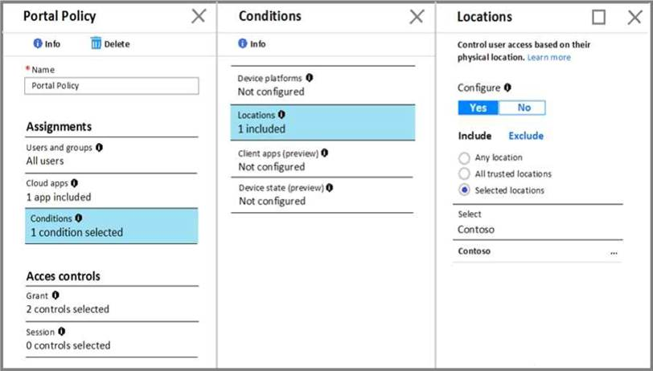

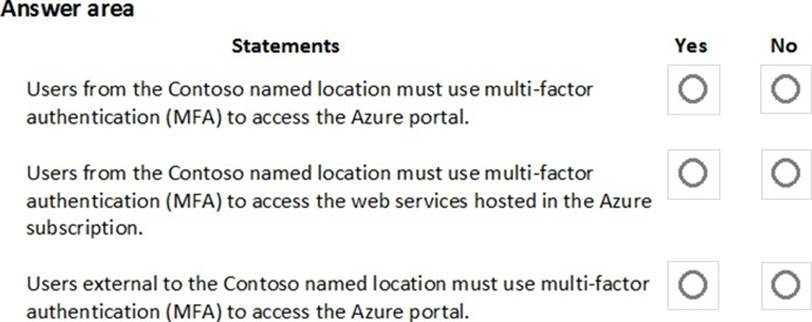

Users from the Contoso named location must use multi-factor authentication (MFA) to access the Azure portal.

- [ ] Yes.
- [x] No.

Users from the Contoso named location must use multi-factor authentication (MFA) to access the web services hosted in the Azure subscryption.

- [ ] Yes.
- [x] No.

Users external to the Contoso named location must use multi-factor authentication (MFA) to access the Azure portal.

- [ ] Yes.
- [x] No.

### DRAG DROP Note: This question is part of a series of questions that present the same scenario. Each question in the series contains a unique solution that might meet the stated goals. Some question sets might have more than one correct solution, while others might not have a correct solution. After you answer a question in this section, you will NOT be able to return to it. As a result, these questions will not appear in the review screen. You have an Azure Subscription named Sub1. Sub1 contains an Azure virtual machine named VM1 that runs Windows Server 2016. You need to encrypt VM1 disks by using Azure Disk Encryption. Which three actions should you perform in sequence? To answer, move the appropriate actions from the list of actions to the answer area and arrange them in the correct order

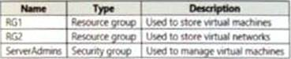

- [ ] Configure secrets for Azure Key Vault.
- [x] Create an Azure Key Vault.
- [ ] Run Set-AzureRmStorageAccount.
- [x] Configure access policies for the Azure Key Vault.
- [x] Run Set-AzureRmVmDiskEncryptionExtension.

### You have an Azure subscription that contains the resources shown in the following table. You need to ensure that ServerAdmins can perform the following tasks: Create virtual machine to the existing virtual network in RG2 only. The solution must use the principle of least privilege. Which two role-based access control (RBAC) roles should you assign to ServerAdmins? Each correct answer presents part of the solution. NOTE: Each correct selection is worth one point

- [ ] The Contributor role for the subscription.
- [x] The Network Contributor role for RG2
- [ ] A custom RBAC role for the subscription.
- [ ] A custom RBAC role for RG2.
- [ ] The Network Contributor role for RG1.
- [x] The Virtual Machine Contributor role for RG1.

### CORRECT TEXT You need to deploy an Azure firewall to a virtual network named VNET3. To complete this task, sign in to the Azure portal and modify the Azure resources. This task might take several minutes to complete. You can perform other tasks while the task completes

- [ ] ... BRAK OPOWIEDZI

### Which two actions should you perform? Each correct answer presents part of the solution. NOTE: Each correct selection is worth one point

- [ ] Upload a public certificate.
- [x] Turn on the HTTPS Only protocol setting..
- [ ] Set the Minimum TLS Version protocol setting to 1.2..
- [ ] Change the pricing tier of the App Service plan.
- [x] Turn on the Incoming client certificates protocol setting.

### You have an Azure subscription named Sub1. Sub1 contains a virtual network named VNet1 that contains one subnet named Subnet1. You create a service endpoint for Subnet1. Subnet1 contains an Azure virtual machine named VM1 that runs Ubuntu Server 18.04. You need to deploy Docker containers to VM1. The containers must be able to access Azure Storage resources and Azure SQL databases by using the service endpoint

- [ ] Create an application security group and a network security group (NSG).
- [ ] Edit the docker-compose.yml file..
- [x] Install the container network interface (CNI) plug-in.

### You have an Azure Container Registry named Registry1. You add role assignment for Registry1 as shown in the following table. Which users can upload images to Registry1 and download images from Registry1? To answer, select the appropriate options in the answer area. NOTE: Each correct selection is worth one point. Upload images: Download images

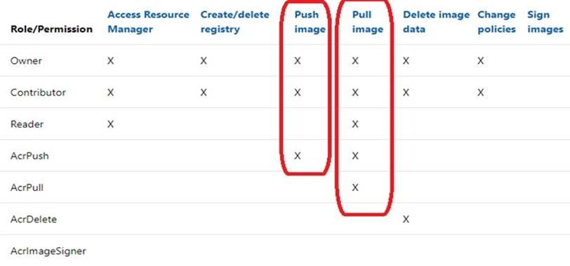

- [x] Box 1: User1 and User4 only Box 2: User1, User2, and User4.
- [ ] Box 1: User1 only Box 2: User2 only.
- [ ] Box 1: User1 and User2 only Box 2: User1 and User2 only.
- [ ] Box 1: User2 and User4 only Box 2: User1, User2, User3 and User4.
- [ ] Box 1: User1 and User4 only Box 2: User2 ad User4 only.

### You need to configure an access review. The review will be assigned to a new collection of reviews and reviewed by resource owners. Which three actions should you perform in sequence? To answer, move the appropriate actions from the list of actions to the answer area and arrange them in the correct order

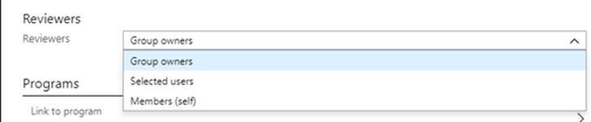

- [x] Create an access review program.
- [ ] Set Reviewers to Selected users.
- [ ] Create an access review audit.
- [x] Create an access review control.
- [x] Set Reviewers to Group owners.
- [ ] Set Reviewers to Members.

### You have an Azure Active Directory (Azure AD) tenant. You have the deleted objects shown in the following table. On May 4, 2020, you attempt to restore the deleted objects by using the Azure Active Directory admin center. Which two objects can you restore? Each correct answer presents a complete solution. NOTE: Each correct selection is worth one point

- [ ] Group1.
- [x] Group2
- [x] User2
- [ ] User1

### You have an Azure Active Directory (Azure AD) tenant named contoso.com that contains the users shown in the following table. Azure AD Privileged Identity Management (PIM) is enabled for the tenant. In PIM, the Password Administrator role has the following settings: • Maximum activation duration (hours): 2 • Send email notifying admins of activation: Disable • Require incident/request ticket number during activation: Disable • Require Azure Multi-Factor Authentication for activation: Enable • Require approval to activate this role: Enable • Selected approver: Group1 You assign users the Password Administrator role as shown in the following table. For each of the following statements, select Yes if the statement is true. Otherwise, select No. NOTE: Each correct selection is worth one point

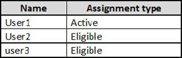

When User 1 sings in, the user is assigned the password Administraror role automatically.

- [ ] Yes.
- [x] No.

User 2 can request to activate the Password Administrator role.

- [x] Yes.
- [ ] No.

If User3 wants to activate the Password Administrator role, the user can approve their own reguest.

- [ ] Yes.
- [x] No.

### You have an Azure subscription that contains the following resources: A virtual network named VNET1 that contains two subnets named Subnet1 and Subnet2. A virtual machine named VM1 that has only a private IP address and connects to Subnet1. You need to ensure that Remote Desktop connections can be established to VM1 from the internet. Which three actions should you perform in sequence? To answer, move the appropriate actions from the list of actions to the answer area and arrange then in the correct order

- [ ] Configure a network security group (NGS).
- [ ] Create a netowrk rule collection.
- [x] Create a NAT rule collection.
- [x] Create a new subnet.
- [ ] Deploy Azure Application Gateway.
- [x] Deploy Azure Firewall.

### Note: This question is part of a series of questions that present the same scenario. Each question in the series contains a unique solution that might meet the stated goals. Some question sets might have more than one correct solution, while others might not have a correct solution. After you answer a question in this section, you will NOT be able to return to it. As a result, these questions will not appear in the review screen. You have an Azure subscription named Sub1. You have an Azure Storage account named Sa1 in a resource group named RG1. Users and applications access the blob service and the file service in Sa1 by using several shared access signatures (SASs) and stored access policies. You discover that unauthorized users accessed both the file service and the blob service. You need to revoke all access to Sa1. Solution: You create a lock on Sa1. Does this meet the goal?

- [ ] Yes.
- [x] No.

### Your network contains an on-premises Active Directory domain named corp.contoso.com. You have an Azure subscription named Sub1 that is associated to an Azure Active Directory (Azure AD) tenant named contoso.com. You sync all on-premises identities to Azure AD. You need to prevent users who have a givenName attribute that starts with TEST from being synced to Azure AD. The solution must minimize administrative effort. What should you use?

- [x] Synchronization Rules Editor.
- [ ] Web Service Configuration Tool.
- [ ] the Azure AD Connect wizard.
- [ ] Active Directory Users and Computers

### Note: This question is part of a series of questions that present the same scenario. Each question in the series contains a unique solution that might meet the stated goals. Some question sets might have more than one correct solution, while others might not have a correct solution. After you answer a question in this section, you will NOT be able to return to it. As a result, these questions will not appear in the review screen. You use Azure Security Center for the centralized policy management of three Azure subscriptions. You use several policy definitions to manage the security of the subscriptions. You need to deploy the policy definitions as a group to all three subscriptions. Solution: You create a resource graph and an assignment that is scoped to a management group. Does this meet the goal?

- [ ] Yes.
- [x] No.

### You have an Azure subscription that contains the virtual machines shown in the following table. From Azure Security Center, you turn on Auto Provisioning. You deploy the virtual machines shown in the following table. On which virtual machines is the Log Analytics agent installed?

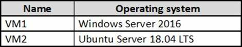

- [ ] VM3 only.
- [ ] VM1 and VM3 only.
- [ ] VM3 and VM4 only.
- [x] VM1, VM2, VM3, and VM4.

### Your company has an Azure subscription named Sub1 that is associated to an Azure Active Directory Azure (Azure AD) tenant named contoso.com. The company develops a mobile application named App1. App1 uses the OAuth 2 implicit grant type to acquire Azure AD access tokens. You need to register App1 in Azure AD. What information should you obtain from the developer to register the application?

- [x] a redirect URI.
- [ ] a reply URL.
- [ ] a key.
- [ ] an application ID.

### You have an Azure subscription named Subscription1 that contains the resources shown in the following table. You assign Role1 to User1 for RG1. For each of the following statements, select Yes if the statement is true. Otherwise, select No. NOTE: Each correct selection is worth one point

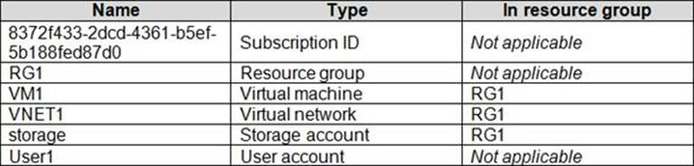

User1 can create a new virtual machine in RG1.

- [x] Yes.
- [ ] No.

User can modify the properties of storage1.

- [ ] Yes.
- [x] No.

User1 can attach the network interface of VM1 to VNET1.

- [ ] Yes.
- [x] No.

### You are testing an Azure Kubernetes Service (AKS) cluster. The cluster is configured as shown in the exhibit. (Click the Exhibit tab.) You plan to deploy the cluster to production. You disable HTTP application routing. You need to implement application routing that will provide reverse proxy and TLS termination for AKS services by using a single IP address. What should you do?

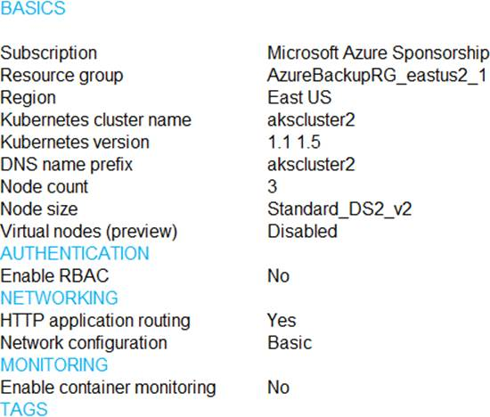

- [x] Create an AKS Ingress controller.
- [ ] Install the container network interface (CNI) plug-in.
- [ ] Create an Azure Standard Load Balancer.
- [ ] Create an Azure Basic Load Balancer.

### Your company has an Azure subscription named Sub1 that is associated to an Azure Active Directory (Azure AD) tenant named contoso.com. The company develops an application named App1. App1 is registered in Azure AD. You need to ensure that App1 can access secrets in Azure Key Vault on behalf of the application users. What should you configure?

- [ ] an application permission without admin consent.
- [x] a delegated permission without admin consent.
- [ ] a delegated permission that requires admin consent.
- [ ] an application permission that requires admin consent.

### You need to create an Azure Key Vault. The solution must ensure that any object deleted from the key vault be retained for 90 days. How should you complete the command? To answer, select the appropriate options in the answer area. NOTE: Each correct selection is worth one point

- [ ] Box 1: EnableForDeployment Box 2: Confirm.
- [x] Box 1: EnablePurgeProtection Box 2: EnableSoftDelete.
- [ ] Box 1: Tag Box 2: DefaultProfile.
- [ ] Box 1: EnableForDeployment Box 2 SKU.

### You have a hybrid configuration of Azure Active Directory (Azure AD). All users have computers that run Windows 10 and are hybrid Azure AD joined. You have an Azure SQL database that is configured to support Azure AD authentication. Database developers must connect to the SQL database by using Microsoft SQL Server Management Studio (SSMS) and authenticate by using their on-premises Active Directory account. You need to tell the developers which authentication method to use to connect to the SQL database from SSMS. The solution must minimize authentication prompts. Which authentication method should you instruct the developers to use?

- [ ] SQL Login.
- [ ] Active Directory C Universal with MFA support.
- [x] Active Directory C Integrated.
- [ ] Active Directory C Password

### What should you do first?

- [x] Create a new subnet on VNetwork1.
- [ ] Remove the NSGs from Subnet11 and Subnet13..
- [ ] Associate an NSG to Subnet12..
- [ ] Configure DDoS protection for VNetwork1.

### You have an Azure subscription. The subscription contains Azure virtual machines that run Windows Server 2016. You need to implement a policy to ensure that each virtual machine has a custom antimalware virtual machine extension installed. How should you complete the policy? To answer, select the appropriate options in the answer area. NOTE: Each correct selection is worth one point

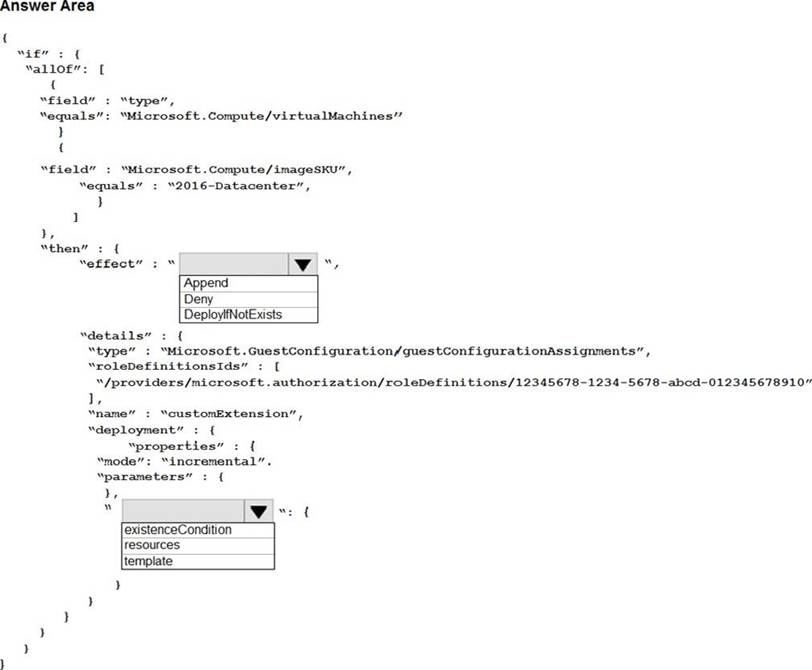

- [ ] Box 1: Append Box 2: existenceCondition.
- [ ] Box 1: Deny Box 2: resources.
- [x] Box 1: DeployNotExists Box 2: template.

### You have an Azure subscription named Sub1 that is associated to an Azure Active Directory (Azure AD) tenant named contoso.com. You are assigned the Global administrator role for the tenant. You are responsible for managing Azure Security Center settings. You need to create a custom sensitivity label. What should you do first?

- [x] Create a custom sensitive information type.
- [ ] Elevate access for global administrators in Azure A.
- [ ] Upgrade the pricing tier of the Security Center to Standard.
- [ ] Enable integration with Microsoft Cloud App Security.

### Topic 3, Mix Questions Note: This question is part of a series of questions that present the same scenario. Each question in the series contains a unique solution that might meet the stated goals. Some question sets might have more than one correct solution, while others might not have a correct solution. After you answer a question in this section, you will NOT be able to return to it. As a result, these questions will not appear in the review screen You have an Azure Subscription named Sub1. You have an Azure Storage account named Sa1 in a resource group named RG1. Users and applications access the blob service and the file service in Sa1 by using several shared access signatures (SASs) and stored access policies. You discover that unauthorized users accessed both the file service and the blob service. You need to revoke all access to Sa1. Solution: You generate new SASs. Does this meet the goal?

- [ ] Yes.
- [x] No.

### You have an Azure subscription that contains 100 virtual machines. Azure Diagnostics is enabled on all the virtual machines. You are planning the monitoring of Azure services in the subscription. You need to retrieve the following details: Identify the user who deleted a virtual machine three weeks ago. Query the security events of a virtual machine that runs Windows Server 2016. What should you use in Azure Monitor? To answer, drag the appropriate configuration settings to the correct details. Each configuration setting may be used once, more than once, or not at all. You may need to drag the split bar between panes or scroll to view content. NOTE: Each correct selection is worth one point. Identify the user who deleted a virtual machine three weeks ago: Querty the security events of a vitual machine that runs Windows Server 2016

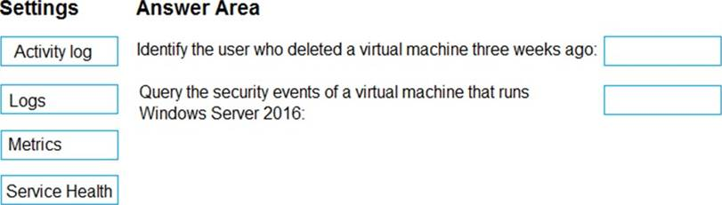

- [x] Activity log
- [x] Logs
- [ ] Metrics
- [ ] Service Health

### You have two Azure virtual machines in the East US2 region as shown in the following table. You deploy and configure an Azure Key vault. You need to ensure that you can enable Azure Disk Encryption on VM1 and VM2. What should you modify on each virtual machine? To answer, select the appropriate options in the answer area . NOTE: Each correct selection is worth one point. VM1: VM2

- [x] Box 1: The tier Box 2: The operating system version.
- [ ] Box 1: The operating system version. Box 2: The type.
- [ ] Box 1: The type Box 2: The tier.

### You have an Azure SQL database. You implement Always Encrypted. You need to ensure that application developers can retrieve and decrypt data in the database. Which two pieces of information should you provide to the developers? Each correct answer presents part of the solution. NOTE: Each correct selection is worth one point

- [ ] a stored access policy.
- [ ] a shared access signature (SAS).
- [x] the column encryption key.
- [ ] user credentials.
- [x] the column master key.

### You have an Azure SQL Database server named SQL1. You plan to turn on Advanced Threat Protection for SQL1 to detect all threat detection types. Which action will Advanced Threat Protection detect as a threat?

- [ ] A user updates more than 50 percent of the records in a table.
- [x] A user attempts to sign as select \* from table1..
- [ ] A user is added to the db_owner database role..
- [ ] A user deletes more than 100 records from the same table.

### Your company uses Azure DevOps. You need to recommend a method to validate whether the code meets the company's quality standards and code review standards. What should you recommend implementing in Azure DevOps?

- [ ] branch folders.
- [ ] branch permissions.
- [x] branch policies.
- [ ] branch locking

### You have an Azure subscription that contains an Azure Key Vault named Vault1. In Vault1, you create a secret named Secret1. An application developer registers an application in Azure Active Directory (Azure AD). You need to ensure that the application can use Secret1. What should you do?

- [ ] In Azure AD, create a role.
- [ ] In Azure Key Vault, create a key.
- [x] In Azure Key Vault, create an access policy.
- [ ] In Azure AD, enable Azure AD Application Proxy.

### You have an Azure Active Directory (Azure AD) tenant named contoso.com. The tenant contains the users shown in the following table. You configure an access review named Review1 as shown in the following exhibit. Use the drop-down menus to select the answer choice that completes each statement based on the information presented in the graphic . NOTE: Each correct selection is worth one point. User 3 can perform Review1 for: If User2 fails complete Review by March 2, 2019

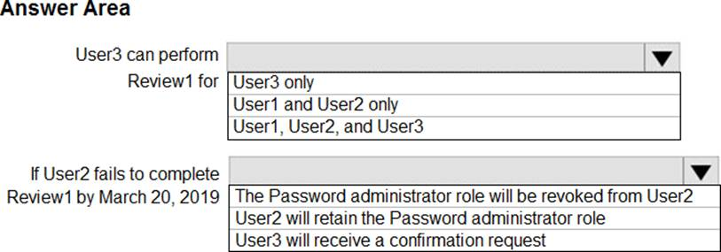

- [x] Box 1: User3 only Box 2: User3 will receive a confirmation request.
- [ ] Box 1: User1 and User2 only Box 2: The Password administrator role will be revoked from User2.
- [ ] Box 1: User1, User2 and User3 Box 2: User2 will retain the Password administrator role.

### Which virtual networks in Sub1 can User2 modify and delete in their current state? To answer, select the appropriate options in the answer area. NOTE: Each correct selection is worth one point. Virtual networks that User2 can modify: Virtual networks that User2 can delete

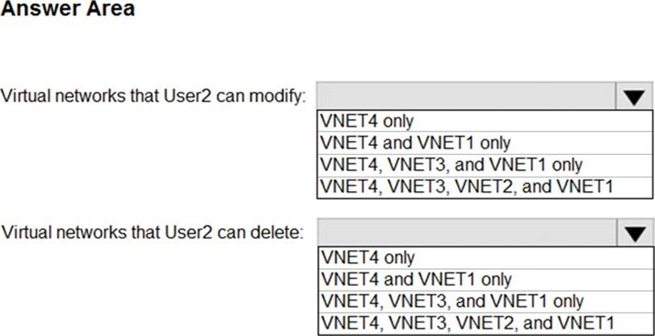

- [x] Box 1: VNET4 and VNET1 only Box 2: VNET4 only.
- [ ] Box 1: VNET4 only Box 2: VNET4 and VNET1 only
- [ ] Box 1: VNET4, VNET3 and VNET1 only Box 2: VNET4, VNET3 VNET2, and VNET1.
- [ ] Box 1: VNET4, VNET3 VNET2, and VNET1 Box 2: VNET4, VNET3 and VNET1 only.

### HOTSPOT Your company has two offices in Seattle and New York. Each office connects to the Internet by using a NAT device. The offices use the IP addresses shown in the following table. The company has an Azure Active Directory (Azure AD) tenant named contoso.com. The tenant contains the users shown in the following table. The MFA service settings are configured as shown in the exhibit. (Click the Exhibit tab.) For each of the following statements, select Yes if the statement is true. Otherwise, select No . NOTE: Each correct selection is worth one point

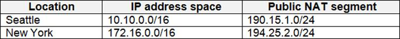
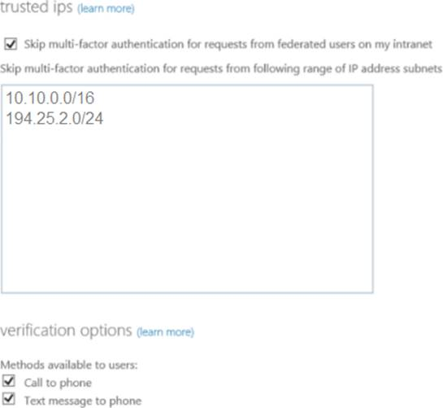
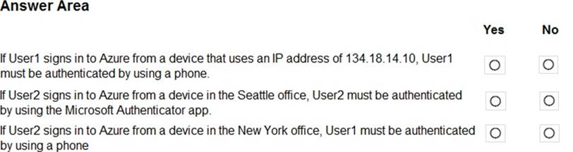

If User1 signs in to Azure from a device that users an IP address of 134.18.14.10, User1 must be authenticated by using a phone.

- [x] Yes.
- [ ] No.

If User2 signs in to Azure from a device in the Seattle office, User2 must be authenticated by using the Microsoft Authenticator app.

- [ ] Yes.
- [x] No.

If User2 signs in to Azure from a device in the New York office, User1 must be authenticated by using a phone.

- [ ] Yes.
- [x] No.

### You have Azure virtual machines that have Update Management enabled. The virtual machines are configured as shown in the following table. You schedule two update deployments named Update1 and Update2. Update1 updates VM3. Update2 updates VM6. Which additional virtual machines can be updated by using Update1 and Update2? To answer, select the appropriate options in the answer area . NOTE: Each correct selection is worth one point. Update1: Update2

- [x] Box 1: VM1 and VM2 only Box 2: VM4 and VM5 only.
- [ ] Box 1: VM2 only Box 2: VM5 only.
- [ ] Box 1: VM4 only Box 2: VM1 and VM2 only.
- [ ] Box 1: VM1, VM2, VM4, VM4, and VM6 Box 2: VM1, VM2, and VM5 only.
- [ ] Box 1: VM1 and VM2 only Box 2: VM1, VM2, VM4, VM4, and VM5.

### From the Azure portal, you are configuring an Azure policy. You plan to assign policies that use the DeployIfNotExist, AuditIfNotExist, Append, and Deny effects. Which effect requires a managed identity for the assignment?

- [ ] AuditIfNotExist.
- [ ] Append.
- [x] DeployIfNotExist.
- [ ] Deny.

### You are configuring an Azure Kubernetes Service (AKS) cluster that will connect to an Azure Container Registry. You need to use the auto-generated service principal to authenticate to the Azure Container Registry. What should you create?

- [ ] an Azure Active Directory (Azure AD) group.
- [x] an Azure Active Directory (Azure AD) role assignment.
- [ ] an Azure Active Directory (Azure AD) user.
- [ ] a secret in Azure Key Vault

### You create a new Azure subscription. You need to ensure that you can create custom alert rules in Azure Security Center. Which two actions should you perform? Each correct answer presents part of the solution. NOTE: Each correct selection is worth one point

- [ ] Onboard Azure Active Directory (Azure AD) Identity Protection.
- [x] Create an Azure Storage account..
- [ ] Implement Azure Advisor recommendations..
- [x] Create an Azure Log Analytics workspace.
- [ ] Upgrade the pricing tier of Security Center to Standard.

### You have an Azure subscription that contains the virtual networks shown in the following table. The Azure virtual machines on SpokeVNetSubnet0 can communicate with the computers on the on-premises network. You plan to deploy an Azure firewall to HubVNet. You create the following two routing tables: • RT1: Includes a user-defined route that points to the private IP address of the Azure firewall as a next hop address • RT2: Disables BGP route propagation and defines the private IP address of the Azure firewall as the default gateway You need to ensure that traffic between SpokeVNetSubnet0 and the on-premises network flows through the Azure firewall. To which subnet should you associate each route table? To answer, drag the appropriate subnets to the correct route tables. Each subnet may be used once, more than once, or not at all. You may need to drag the split bar between panes or scroll to view content . NOTE: Each correct selection is worth one point

- [ ] Azure FirewallSubnet.
- [x] GatewaySubnet.
- [x] HubVNetSybnet.

### This is a case study. Case studies are not timed separately. You can use as much exam time as you would like to complete each case. However, there may be additional case studies and sections on this exam. You must manage your time to ensure that you are able to complete all questions included on this exam in the time provided. To answer the questions included in a case study, you will need to reference information that is provided in the case study. Case studies might contain exhibits and other resources that provide more information about the scenario that is described in the case study. Each question is independent of the other question on this case study. At the end of this case study, a review screen will appear. This screen allows you to review your answers and to make changes before you move to the next sections of the exam. After you begin a new section, you cannot return to this section. To start the case study To display the first question on this case study, click the Next button. Use the buttons in the left pane to explore the content of the case study before you answer the questions. Clicking these buttons displays information such as business requirements, existing environment, and problem statements. If the case study has an All Information tab, note that the information displayed is identical to the information displayed on the subsequent tabs. When you are ready to answer a question, click the Question button to return to the question. Overview Litware, Inc. is a digital media company that has 500 employees in the Chicago area and 20 employees in the San Francisco area. Existing Environment Litware has an Azure subscription named Sub1 that has a subscription ID of 43894a43-17c2-4a39-8cfc-3540c2653ef4. Sub1 is associated to an Azure Active Directory (Azure AD) tenant named litwareinc.com. The tenant contains the user objects and the device objects of all the Litware employees and their devices. Each user is assigned an Azure AD Premium P2 license. Azure AD Privileged Identity Management (PIM) is activated. The tenant contains the groups shown in the following table. The Azure subscription contains the objects shown in the following table. Azure Security Center is set to the Free tier. Requirements Planned changes Litware plans to deploy the Azure resources shown in the following table. Identity and Access Requirements Litware identifies the following identity and access requirements: – All San Francisco users and their devices must be members of Group1. – The members of Group2 must be assigned the Contributor role to Resource Group2 by using a permanent eligible assignment. – Users must be prevented from registering applications in Azure AD and from consenting to applications that access company information on the users' behalf. Platform Protection Requirements Litware identifies the following platform protection requirements: – Microsoft Antimalware must be installed on the virtual machines in Resource Group1. – The members of Group2 must be assigned the Azure Kubernetes Service Cluster Admin Role. – Azure AD users must be to authenticate to AKS1 by using their Azure AD credentials. – Following the implementation of the planned changes, the IT team must be able to connect to VM0 by using JIT VM access. – A new custom RBAC role named Role1 must be used to delegate the administration of the managed disks in Resource Group1. Role1 must be available only for Resource Group1. Security Operations Requirements Litware must be able to customize the operating system security configurations in Azure Security Center. You need to meet the identity and access requirements for Group1. What should you use?

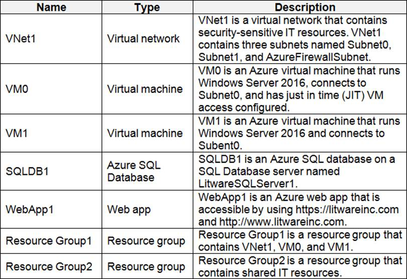

- [ ] Add a membership rule to Group1.
- [ ] Delete Group1. Create a new group named Group1 that has a membership type of Office 365. Add users and devices to the group.
- [ ] Modify the membership rule of Group1.
- [x] Change the membership type of Group1 to Assigned. Create two groups that have dynamic memberships. Add the new groups to Group1.

### You have an Azure subscription named Sub1. Sub1 contains a virtual network named VNet1 that contains one subnet named Subnet1. You create a service endpoint for Subnet1. Subnet1 contains an Azure virtual machine named VM1 that runs Ubuntu Server 18.04. You create a service endpoint for MicrosoftStorage in Subnet1. You need to ensure that when you deploy Docker containers to VM1, the containers can access Azure Storage resources by using the service endpoint. What should you do on VM1 before you deploy the container?

- [ ] Create an application security group and a network security group (NSG).
- [ ] Edit the docker-compose.yml file.
- [x] Install the container network interface (CNI) plug-in.

### You have an Azure subscription that contains the virtual machines shown in the following table. You create the Azure policies shown in the following table. You create the resource locks shown in the following table. For each of the following statements, select Yes if the statement is true. Otherwise, select No. NOTE: Each correct selection is worth one point

You can start VM1.

- [ ] Yes.
- [x] No.

You can start VM2.

- [x] Yes.
- [ ] No.

You can create a virtual machine in RG2.

- [x] Yes.
- [ ] No.

### Note: This question is part of a series of questions that present the same scenario. Each question in the series contains a unique solution that might meet the stated goals. Some question sets might have more than one correct solution, while others might not have a correct solution. After you answer a question in this section, you will NOT be able to return to it. As a result, these questions will not appear in the review screen. You have an Azure subscription. The subscription contains 50 virtual machines that run Windows Server 2012 R2 or Windows Server 2016. You need to deploy Microsoft Antimalware to the virtual machines. Solution: You connect to each virtual machine and add a Windows feature. Does this meet the goal?

- [ ] Yes.
- [x] No.

### You create and enforce an Azure AD Identity Protection user risk policy that has the following settings: – Assignment: Include Group1, Exclude Group2 – Conditions: Sign-in risk of Medium and above – Access: Allow access, Require password change You have an Azure Active Directory (Azure AD) ten ant named contoso.com that contains the u sers shown in the following table. You create and enforce an Azure AD Identity Protection user risk policy that has the following settings: • Assignment: Include Group1, Exclude Group2 • Conditions: Sign-in risk of Medium and above • Access: Allow access, Require password change For each of the following statements, select Yes if the statement is true. Otherwise, select No. NOTE: Each correct selection is worth one point

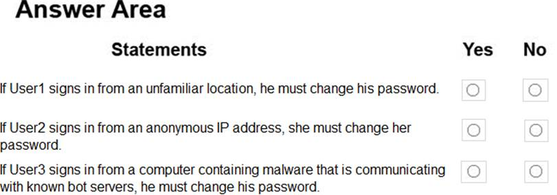
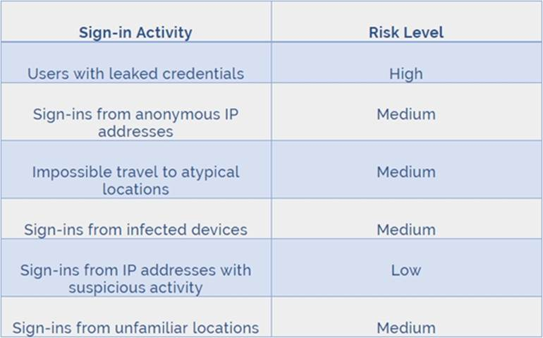

If User1 sings in unfamiliar location, he must change his password.

- [x] Yes.
- [ ] No.

If User2 sings in from an anonymous IP address, she must change her password.

- [x] Yes.
- [ ] No.

If User3 sings in from a computer containing malware that is communicating with known bot servers, he must change his password.

- [ ] Yes.
- [x] No.

### This is a case study. Case studies are not timed separately. You can use as much exam time as you would like to complete each case. However, there may be additional case studies and sections on this exam. You must manage your time to ensure that you are able to complete all questions included on this exam in the time provided. To answer the questions included in a case study, you will need to reference information that is provided in the case study. Case studies might contain exhibits and other resources that provide more information about the scenario that is described in the case study. Each question is independent of the other questions in this case study. At the end of this case study, a review screen will appear. This screen allows you to review your answers and to make changes before you move to the next section of the exam. After you begin a new section, you cannot return to this section. To start the case study To display the first question in this case study, click the Next button. Use the buttons in the left pane to explore the content of the case study before you answer the questions. Clicking these buttons displays information such as business requirements, existing environment, and problem statements. If the case study has an All Information tab, note that the information displayed is identical to the information displayed on the subsequent tabs. When you are ready to answer a question, click the Question button to return to the question. Overview Litware, Inc. is a digital media company that has 500 employees in the Chicago area and 20 employees in the San Francisco area. Existing Environment Litware has an Azure subscription named Sub1 that has a subscription ID of 43894a43-17c2-4a39-8cfc-3540c2653ef4. Sub1 is associated to an Azure Active Directory (Azure AD) tenant named litwareinc.com. The tenant contains the user objects and the device objects of all the Litware employees and their devices. Each user is assigned an Azure AD Premium P2 license. Azure AD Privileged Identity Management (PIM) is activated. The tenant contains the groups shown in the following table. The Azure subscription contains the objects shown in the following table. Identity and Access Requirements Azure Security Center is set to the Standard tier. Requirements Planned Changes Litware plans to deploy the Azure resources shown in the following table. Litware identifies the following identity and access requirements: – All San Francisco users and their devices must be members of Group1. – The members of Group2 must be assigned the Contributor role to RG2 by using a permanent eligible assignment. – Users must be prevented from registering applications in Azure AD and from consenting to applications that access company information on the users' behalf. Platform Protection Requirements Litware identifies the following platform protection requirements: – Microsoft Antimalware must be installed on the virtual machines in RG1. – The members of Group2 must be assigned the Azure Kubernetes Service Cluster Admin Role. – Azure AD users must be able to authenticate to AKS1 by using their Azure AD credentials. – Following the implementation of the planned changes, the IT team must be able to connect to VM0 by using JIT VM access. – A new custom RBAC role named Role1 must be used to delegate the administration of the managed disks in RG1. Role1 must be available only for RG1. Security Operations Requirements Litware must be able to customize the operating system security configurations in Azure Security Center. Data and Application Requirements Litware identifies the following data and applications requirements: – The users in Group2 must be able to authenticate to SQLDB1 by using their Azure AD credentials. – WebApp1 must enforce mutual authentication. General Requirements Litware identifies the following general requirements: – Whenever possible, administrative effort must be minimized.– Whenever possible, use of automation must be maximized.DRAG DROP You need to deploy AKS1 to meet the platform protection requirements. Which four actions should you perform in sequence? To answer, move the appropriate actions from the list of actions to the answer area and arrange them in the correct order. NOTE: More than one order of answer choices is correct. You will receive credit for any of the correct orders you select

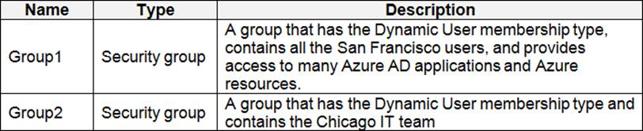

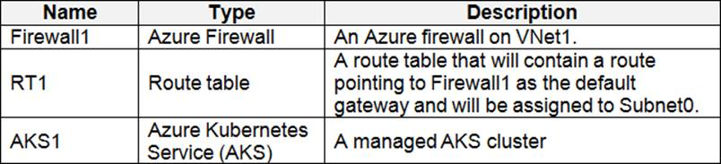

- [x] Deploy an AKS cluster.
- [x] Create a client appplication.
- [x] Create a server application.
- [ ] Create an RBAC binding.
- [x] Create a custom RBAC role.

### You plan to use Azure Resource Manager templates to perform multiple deployments of identically configured Azure virtual machines. The password for the administrator account of each deployment is stored as a secret in different Azure Key Vaults. You need to identify a method to dynamically construct a resource ID that will designate the key vault containing the appropriate secret during each deployment. The name of the key vault and the name of the secret will be provided as inline parameters. What should you use to construct the resource ID?

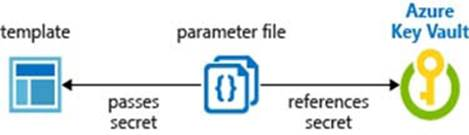

- [ ] a key vault access policy.
- [ ] a linked template.
- [x] a parameters file.
- [ ] an automation account.

### The developers at your company plan to publish an app named App11641655 to Azure. You need to ensure that the app is registered to Azure Active Directory (Azure AD). The registration must use the sign-on URLs of <https://app.contoso.com>. To complete this task, sign in to the Azure portal and modify the Azure resources

- [ ] BRAK ODPOWIEDZI

### You have two Azure virtual machines in the East US2 region as shown in the following table. You deploy and configure an Azure Key vault. You need to ensure that you can enable Azure Disk Encryption on VM1 and VM2. What should you modify on each virtual machine? To answer, select the appropriate options in the answer area. NOTE: Each correct selection is worth one point. VM1: VM2

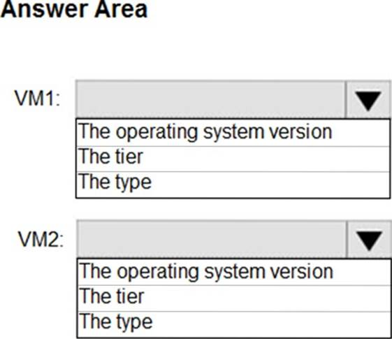

- [ ] Box 1: The tier Box 2: The type
- [ ] Box 1: The type Box 2: Tier Box .
- [ ] Box 1: The opperating sysem version Box 2: The tier.

### Note: This question is part of a series of questions that present the same scenario. Each question in the series contains a unique solution that might meet the stated goals. Some question sets might have more than one correct solution, while others might not have a correct solution. After you answer a question in this section, you will NOT be able to return to it. As a result, these questions will not appear in the review screen. You use Azure Security Center for the centralized policy management of three Azure subscriptions. You use several policy definitions to manage the security of the subscriptions. You need to deploy the policy definitions as a group to all three subscriptions. Solution: You create a policy definition and assignments that are scoped to resource groups. Does this meet the goal?

- [ ] Yes.
- [x] No.

### From Azure Security Center, you create a custom alert rule. You need to configure which users will receive an email message when the alert is triggered. What should you do?

- [x] From Azure Monitor, create an action group.
- [ ] From Security Center, modify the Security policy settings of the Azure subscription..
- [ ] From Azure Active Directory (Azure AD), modify the members of the Security Reader role group..
- [ ] From Security Center, modify the alert rule.

### Note: This question is part of a series of questions that present the same scenario. Each question in the series contains a unique solution that might meet the stated goals. Some question sets might have more than one correct solution, while others might not have a correct solution. After you answer a question in this section, you will NOT be able to return to it. As a result, these questions will not appear in the review screen. You have an Azure subscription. The subscription contains 50 virtual machines that run Windows Server 2012 R2 or Windows Server 2016. You need to deploy Microsoft Antimalware to the virtual machines. Solution: You add an extension to each virtual machine. Does this meet the goal?

- [x] Yes
- [ ] No.

### Your network contains an on-premises Active Directory domain that syncs to an Azure Active Directory (Azure AD) tenant. The tenant contains the users shown in the following table. You configure a multi-factor authentication (MFA) registration policy that has the following settings: – Assignments: – Include: Group1 – Exclude Group2 – Controls: Require Azure MFA registration – Enforce Policy: On For each of the following statements, select Yes if the statement is true. Otherwise, select No. NOTE: Each correct selection is worth one point

User1 will be prompted to configure MFA registration during the user's next Azure AD authentication.

- [x] Yes.
- [ ] No.

User2 must configure MFA during the user's next Azure AD authentication.

- [ ] Yes.
- [x] No.

User3 will be prompted to configure MFA registration during the user's next Azure AD authentication.

- [x] Yes.
- [ ] No.

### You need to deploy Microsoft Antimalware to meet the platform protection requirements. What should you do? To answer, select the appropriate options in the answer area. NOTE: Each correct selection is worth one point. Create a custom policy definition that has effect to: Create a policy assignment and modify

- [ ] Box 1: Append Box 2: The wxlusion settings.
- [ ] Box 1: Deny Box 2: The scope.
- [x] Box 1: DeployIfNotExists Box 2: The Create a Managed Identity setting.

### You need to ensure that users can access VM0. The solution must meet the platform protection requirements. What should you do?

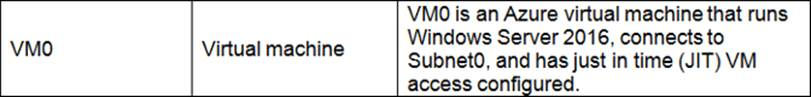

- [x] Move VM0 to Subnet1.
- [ ] On Firewall, configure a network traffic filtering rule..
- [ ] Assign RT1 to AzureFirewallSubnet..
- [ ] On Firewall, configure a DNAT rule.

### You have two Azure virtual machines in the East US 2 region as shown in the following table. You deploy and configure an Azure Key vault. You need to ensure that you can enable Azure Disk Encryption on VM1 and VM2. What should you modify on each virtual machine? To answer, select the appropriate options in the answer area. NOTE: Each correct selection is worth one point. VM1: VM2

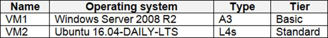

- [ ] Box 1: The operating system version Box 2:
- [x] Box 1: The tier Box 2: The type.
- [ ] Box 1: The type Box 2:The operating system version.

### You have the Azure virtual machines shown in the following table. You create an Azure Log Analytics workspace named Analytics1 in RG1 in the East US region. Which virtual machines can be enrolled in Analytics1?

- [x] VM1 only.
- [ ] VM1, VM2, and VM3 only.
- [ ] VM1, VM2, VM3, and VM4.
- [ ] VM1 and VM4 only.

### You have an Azure subscription named Sub1. You create a virtual network that contains one subnet. On the subnet, you provision the virtual machines shown in the following table. Currently, you have not provisioned any network security groups (NSGs). You need to implement network security to meet the following requirements: – Allow traffic to VM4 from VM3 only. – Allow traffic from the Internet to VM1 and VM2 only. – Minimize the number of NSGs and network security rules. How many NSGs and network security rules should you create? To answer, select the appropriate options in the answer area. NOTE: Each correct selection is worth one point. NSGs: Network security rules

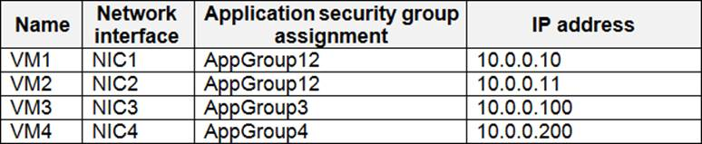
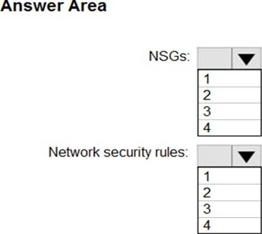

- [ ] Box 1: 1 Box 2: 1.
- [x] Box 1: 2 Box 2: 3.
- [ ] Box 1: 3 Box 2: 2.
- [ ] Box 1: 4 Box 2: 4.

### You have an Azure Active Directory (Azure AD) tenant that contains the users shown in the following table. The tenant contains the named locations shown in the following table. You create the conditional access policies for a cloud app named App1 as shown in the following table. For each of the following statements, select Yes if the statement is true. Otherwise, select No. NOTE: Each correct selection is worth one point

User1 can access App1 from an IP address of 154.12.18.10.

- [ ] Yes.
- [x] No.

User2 can access App1 from an IP address of 192.77.10.15

- [x] Yes.
- [ ] No.

User2 can access App1 from an IP address of 154.12.18.10.

- [ ] Yes.
- [x] No.

### Your network contains an Active Directory forest named contoso.com. You have an Azure Directory (Azure AD) tenant named contoso.com. You plan to configure synchronization by using the Express Settings installation option in Azure AD Connect. You need to identify which roles and groups are required to perform the planned configuration. The solution must use the principle of least privilege. Which two roles and groups should you identify? Each correct answer presents part of the solution. NOTE: Each correct selection is worth one point

- [ ] the Domain Admins group in Active Directory.
- [ ] the Security administrator role in Azure AD.
- [x] the Global administrator role in Azure AD.
- [ ] the User administrator role in Azure AD.
- [x] the Enterprise Admins group in Active Directory.

### You create a new Azure subscription. You need to ensure that you can create custom alert rules in Azure Security Center. Which two actions should you perform? Each correct answer presents part of the solution. NOTE: Each correct selection is worth one point

- [x] Onboard Azure Active Directory (Azure AD) Identity Protection.
- [x] Create an Azure Storage account.
- [ ] Implement Azure Advisor recommendations.
- [x] Create an Azure Log Analytics workspace.
- [ ] Upgrade the pricing tier of Security Center to Standard.

### Note: This question is part of a series of questions that present the same scenario. Each question in the series contains a unique solution that might meet the stated goals. Some question sets might have more than one correct solution, while others might not have a correct solution. After you answer a question in this section, you will NOT be able to return to it. As a result, these questions will not appear in the review screen. You have an Azure subscription named Sub1. You have an Azure Storage account named sa1 in a resource group named RG1. Users and applications access the blob service and the file service in sa1 by using several shared access signatures (SASs) and stored access policies. You discover that unauthorized users accessed both the file service and the blob service. You need to revoke all access to sa1. Solution: You regenerate the access keys. Does this meet the goal?

- [ ] Yes.
- [x] No.

### You create and enforce an Azure AD Identity Protection user risk policy that has the following settings: – Assignment: Include Group1, Exclude Group2 – Conditions: Sign-in risk of Medium and above– Access: Allow access, Require password change You have an Azure Active Directory (Azure AD) tenant named contoso.com that contains the users shown in the following table. For each of the following statements, select Yes if the statement is true. Otherwise, select No. NOTE: Each correct selection is worth one point

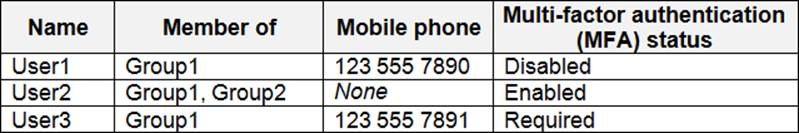
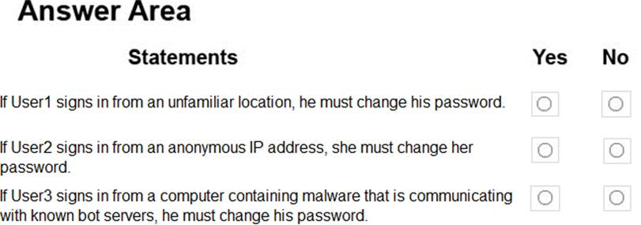

If User1 sings in from an unfamiliar location, he must change his password.

- [x] Yes.
- [ ] No.

If User2 sings in from an anonymous IP address, she must change her password.

- [x] Yes.
- [ ] No.

If User3 sings in from a computer containing malware that is communicating with known bot servers, he must change his password.

- [ ] Yes.
- [x] No.

### What is the membership of Group1 and Group2? To answer, select the appropriate options in the answer area. NOTE: Each correct selection is worth one point. Group 1: Gropu 2

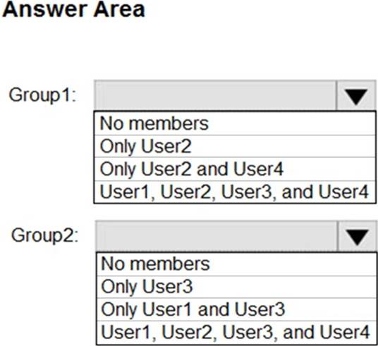

- [x] Box 1: User1, User2, User3, and User4 Box 2: Only User3.
- [ ] Box 1: Only User3 Box 2: User1, User2, User3, and User4.
- [ ] Box 1: Only User2 and User4 Box 2: Only User1 and User3.
- [ ] Box 1: No members Box 2: No members.

### You have an Azure Active Directory (Azure AD) tenant that contains the users shown in the following table. From Azure AD Privileged Identity Management (PIM), you configure the settings for the Security Administrator role as shown in the following exhibit. From PIM, you assign the Security Administrator role to the following groups: – Group1: Active assignment type, permanently assigned – Group2: Eligible assignment type, permanently eligible For each of the following statements, select Yes if the statement is true. Otherwise, select No. NOTE: Each correct selection is worth one point

User1 can only activate the Security Administrator role in five hours.

- [x] Yes.
- [ ] No.

If User2 activates the security Administrator role, the user will be assigned the role immediately.

- [x] Yes.
- [ ] No.

User3 can activate the Security Administrator role.

- [x] Yes.
- [ ] No.

### Note: This question is part of a series of questions that present the same scenario. Each question in the series contains a unique solution that might meet the stated goals. Some question sets might have more than one correct solution, while others might not have a correct solution. After you answer a question in this section, you will NOT be able to return to it. As a result, these questions will not appear in the review screen. You have an Azure subscription named Sub1. You have an Azure Storage account named sa1 in a resource group named RG1. Users and applications access the blob service and the file service in sa1 by using several shared access signatures (SASs) and stored access policies. You discover that unauthorized users accessed both the file service and the blob service. You need to revoke all access to sa1. Solution: You generate new SASs. Does this meet the goal?

- [ ] Yes.
- [x] No.

### You create a new Azure subscription that is associated to a new Azure Active Directory (Azure AD) tenant. You create one active conditional access policy named Portal Policy. Portal Policy is used to provide access to the Microsoft Azure Management cloud app. The Conditions settings for Portal Policy are configured as shown in the Conditions exhibit. (Click the Conditions tab.) The Grant settings for Portal Policy are configured as shown in the Grant exhibit. (Click the Grant tab.) For each of the following statements, select Yes if the statement is true. Otherwise, select No. NOTE: Each correct selection is worth one point

Users from the Contoso named location must use multi-factor authentication (MFA) to access the Azure portal.

- [ ] Yes.
- [x] No.

Users from the Contoso named location must use multi-factor authentication (MFA) to access the web services hosted in the Azure subscryption.

- [x] Yes.
- [ ] No.

Users external to the Contoso named location must use multi-factor authentication (MFA) to access the Azure portal.

- [x] Yes.
- [ ] No.

### You have a hybrid configuration of Azure Active Directory (Azure AD). You have an Azure SQL Database instance that is configured to support Azure AD authentication. Database developers must connect to the database instance and authenticate by using their on-premises Active Directory account. You need to ensure that developers can connect to the instance by using Microsoft SQL Server Management Studio. The solution must minimize authentication prompts. Which authentication method should you recommend?

- [x] Active Directory – Password.
- [ ] Active Directory – Universal with MFA support.
- [ ] SQL Server Authentication.
- [ ] Active Directory – Integrated.Question Set 3

### You have an Azure subscription named Sub 1 that is associated to an Azure Active Directory (Azure AD) tenant named contoso.com. The tenant contains the users shown in the following table. Each user is assigned an Azure AD Premium P2 license. You plan to onboard and configure Azure AD Identity Protection. Which users can onboard Azure AD Identity Protection, remediate users, and configure policies? To answer, select the appropriate options in the answer area. NOTE: Each correct selection is worth one point. Users who can onboard Azure AD Identity Protection: Users who can remediate users and configure policies

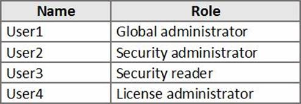
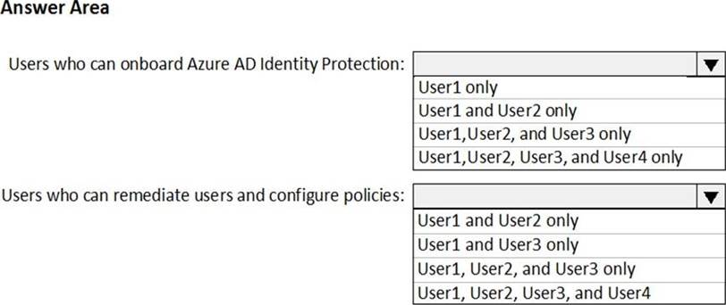

- [x] Box 1: User1 only Box 2: User1 and User2 only.
- [ ] Box 1: User1 and User2 only.Box 2: User1 and User3 only.
- [ ] Box 1: User1, User2, and User3 only Box 2: User1, User2, User3 and User4 only.
- [ ] Box 1: User1, User2, User3 and User4 only Box 2: User1, User2, and User3 only.

### You have an Azure Active Directory (Azure AD) te nant that contains the users shown in the following table. You create and enforce an Azure AD Identity Protection sign-in risk policy that has the following settings: – Assignments: Include Group1, exclude Group2 – Conditions: Sign-in risk level: Medium and above – Access Allow access, Require multi-factor authentication You need to identify what occurs when the users sign in to Azure AD. What should you identify for each user? To answer, select the appropriate options in the answer area. NOTE: Each correct selection is worth one point. When User1 sings in from an anonymous IP address, the user will: When User2 signs in from an unfamiliar location, the user will: When User3 signs in from an infceted device, the user will

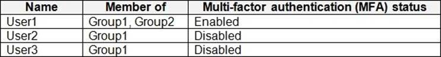
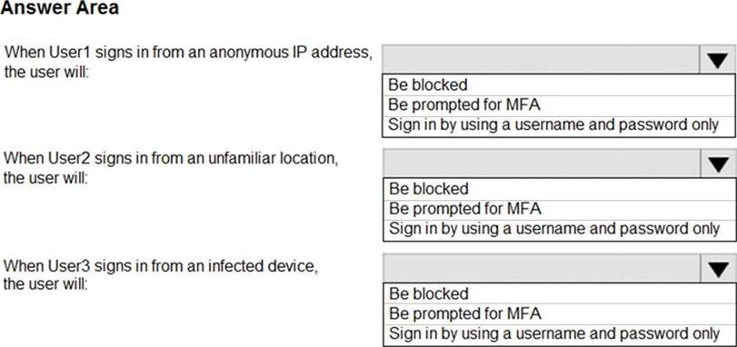

- [x] Box 1: Be prompted for MFA Box 2: Be blocked Box 3: Be blocked.
- [ ] Box 1: Be prompted for MFA Box 2: Sign in by using a username and password only Box 3: Be blocked.
- [ ] Box 1: Be blocked Box 2: Be prompted for MFA Box 3: Sign in by using a username and password.

### You work at a company named Contoso, Ltd. that has the offices shown in the following table. Contoso has an Azure Active Directory (Azure AD) tenant named contoso.com. All contoso.com users have Azure Multi-Factor Authentication (MFA) enabled. The tenant contains the users shown in the following table. The multi-factor settings for contoso.com are configured as shown in the following exhibit. For each of the following statements, select Yes if the statement is true. Otherwise, select No. NOTE: Each correct selection is worth one point

When User1 signs in to Device1 from the Seattle office on June 10, the user will be prompted for MFA.

- [ ] Yes.
- [x] No.

When User1 signs in to Device2 from the Seattle office on June 5, the user will be prompted for MFA.

- [x] Yes.
- [ ] No.

When User1 signs in to to a new device from the Seattle office on June 7, the user will be prompted for MFA.

- [x] Yes.
- [ ] No.

### You have an Azure subscription. You create an Azure web app named Contoso1812 that uses an S1 App Service plan. You plan to create a CNAME DNS record for <www.contoso.com> that points to Contoso1812. You need to ensure that users can access Contoso1812 by using the <https://www.contoso.com> URL. Which two actions should you perform? Each correct answer presents part of the solution. NOTE: Each correct selection is worth one point

- [ ] Turn on the system-assigned managed identity for Contoso1812.
- [x] Add a hostname to Contoso1812.
- [ ] Scale out the App Service plan of Contoso1812.
- [ ] Add a deployment slot to Contoso1812.
- [ ] Scale up the App Service plan of Contoso1812.
- [x] Upload a PFX file to Contoso1812.

### You have an Azure Container Registry named Registry1. You add role assignments for Registry1 as shown in the following table. Which users can upload images to Registry1 and download images from Registry1? To answer, select the appropriate options in the answer area. NOTE: Each correct selection is worth one point. Upload images: Download images

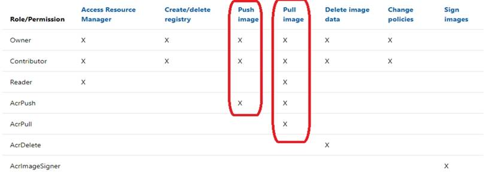

- [x] Box 1: User1 and User4 only Box 2: User1, User2, and User4.
- [ ] Box 1: User1 only Box 2: User1, User2, User3 and User4.
- [ ] Box 1: User2 only Box 2: User1, User3, and User4.
- [ ] Box 1: User1, User2, User3 and User4 Box 2: User2 ad User4 only.
- [ ] Box 1: User1, User2, User3 and User4 Box 2: User1 and User2 only.

### This is a case study. Case studies are not timed separately. You can use as much exam time as you would like to complete each case. However, there may be additional case studies and sections on this exam. You must manage your time to ensure that you are able to complete all questions included on this exam in the time provided. To answer the questions included in a case study, you will need to reference information that is provided in the case study. Case studies might contain exhibits and other resources that provide more information about the scenario that is described in the case study. Each question is independent of the other question on this case study. At the end of this case study, a review screen will appear. This screen allows you to review your answers and to make changes before you move to the next sections of the exam. After you begin a new section, you cannot return to this section. To start the case study To display the first question on this case study, click the Next button. Use the buttons in the left pane to explore the content of the case study before you answer the questions. Clicking these buttons displays information such as business requirements, existing environment, and problem statements. If the case study has an All Information tab, note that the information displayed is identical to the information displayed on the subsequent tabs. When you are ready to answer a question, click the Question button to return to the question. Overview Litware, Inc. is a digital media company that has 500 employees in the Chicago area and 20 employees in the San Francisco area. Existing Environment Litware has an Azure subscription named Sub1 that has a subscription ID of 43894a43-17c2-4a39-8cfc- 3540c2653ef4. Sub1 is associated to an Azure Active Directory (Azure AD) tenant named litwareinc.com. The tenant contains the user objects and the device objects of all the Litware employees and their devices. Each user is assigned an Azure AD Premium P2 license. Azure AD Privileged Identity Management (PIM) is activated. The tenant contains the groups shown in the following table. The Azure subscription contains the objects shown in the following table. Identity and Access Requirements Azure Security Center is set to the Free tier. Planned changes Litware plans to deploy the Azure resources shown in the following table. Litware identifies the following identity and access requirements: – All San Francisco users and their devices must be members of Group1. – The members of Group2 must be assigned the Contributor role to Resource Group2 by using a permanent eligible assignment. – Users must be prevented from registering applications in Azure AD and from consenting to applications that access company information on the users' behalf. Platform Protection Requirements Litware identifies the following platform protection requirements: – Microsoft Antimalware must be installed on the virtual machines in Resource Group1. – The members of Group2 must be assigned the Azure Kubernetes Service Cluster Admin Role. – Azure AD users must be to authenticate to AKS1 by using their Azure AD credentials. – Following the implementation of the planned changes, the IT team must be able to connect to VM0 by using JIT VM access. – A new custom RBAC role named Role1 must be used to delegate the administration of the managed disks in Resource Group1. Role1 must be available only for Resource Group1. Security Operations Requirements Litware must be able to customize the operating system security configurations in Azure Security Center. Data and Application Requirements Litware identifies the following data and applications requirements: – The users in Group2 must be able to authenticate to SQLDB1 by using their Azure AD credentials – WebApp1 must enforce mutual authentication General Requirements Litware identifies the following general requirements: – Whenever possible, administrative effort must be minimized. – Whenever possible, use of automation must be minimized. You need to ensure that users can access VM0. The solution must meet the platform protection requirements. What should you do?

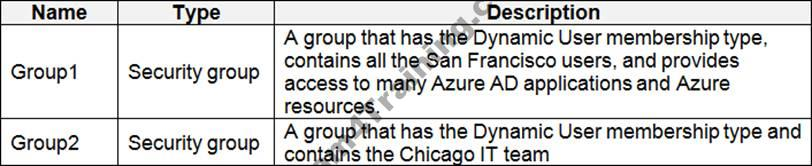
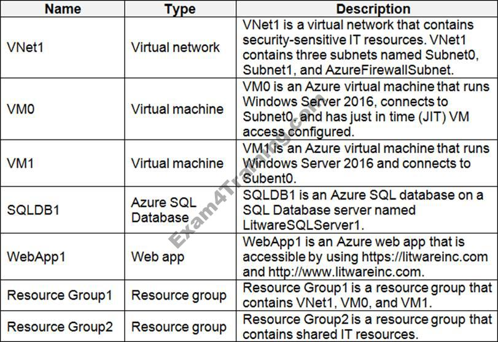

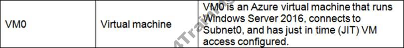
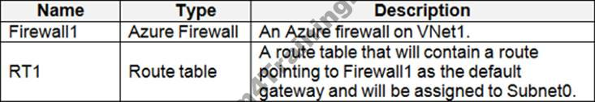

- [x] Move VM0 to Subnet1.
- [ ] On Firewall, configure a network traffic filtering rule.
- [ ] Assign RT1 to AzureFirewallSubnet.
- [ ] On Firewall, configure a DNAT rule.

### Note: This question is part of a series of questions that present the same scenario. Each question in the series contains a unique solution that might meet the stated goals. Some question sets might have more than one correct solution, while others might not have a correct solution. After you answer a question in this section, you will NOT be able to return to it. As a result, these questions will not appear in the review screen. You have an Azure Subscription named Sub1. You have an Azure Storage account named Sa1 in a resource group named RG1. Users and applications access the blob service and the file service in Sa1 by using several shared access signatures (SASs) and stored access policies. You discover that unauthorized users accessed both the file service and the blob service. You need to revoke all access to Sa1. Solution: You create a new stored access policy. Does this meet the goal?

- [x] Yes.
- [ ] No.
