# ⬆️ Microsoft Azure AZ-500 (Azure Security Engineer) Practice Tests Exams Questions & Answers

## ❣️ Support

There are many ways to support us; in exchange, you'll get this material in a proper format:

- ❤️ [shop.ditectrev.com, in EPUB or PDF formats, with answers marked](https://shop.ditectrev.com/product/microsoft-azure-az-500-azure-security-engineer-practice-tests-exams-questions-answers),
- ❤️ [shop.ditectrev.com, in EPUB or PDF formats, without answers marked](https://shop.ditectrev.com/product/microsoft-azure-az-500-azure-security-engineer-practice-tests-exams-questions-no-answers),
- 📖 [Udemy is the only one to have explanations for questions](https://www.udemy.com/course/ms-azure-security-technologies-az-500-practice-test-exams/?referralCode=D12B3B0EC37361123DCD),
- 📚 [Google Play Books, in PDF format, with answers marked](https://play.google.com/store/books/details?id=geL4EAAAQBAJ),
- 📚 [Google Play Books, in PDF format, without answers marked](https://play.google.com/store/books/details?id=UGX6EAAAQBAJ),
- 🛍️ [Etsy, in PDF format, with answers marked](https://ditectrev.etsy.com/listing/1672744726),
- 🛍️ [Etsy, in PDF format, without answers marked](https://ditectrev.etsy.com/listing/1686919453),
- 🛒 [eBay, in PDF format, with answers marked](https://www.ebay.com/itm/404900285691?mkcid=16&mkevt=1&mkrid=711-127632-2357-0&ssspo=_ptbuk3gqdw&sssrc=2524149&ssuid=_ptbuk3gqdw&widget_ver=artemis&media=COPY),
- 🛒 [eBay, in PDF format, without answers marked](https://www.ebay.com/itm/404899852344?mkcid=16&mkevt=1&mkrid=711-127632-2357-0&ssspo=_ptbuk3gqdw&sssrc=2524149&ssuid=_ptbuk3gqdw&widget_ver=artemis&media=COPY),
- 🔄 [Patreon subscription allows you to get access to all of the materials in EPUB and PDF formats. You can also buy separate items on Patreon, but the subscription technically allows us to include all updates for EPUB and PDF formats. Hence, you get EPUB and PDF updates when you subscribe to Patreon](https://patreon.com/Ditectrev?utm_medium=unknown&utm_source=join_link&utm_campaign=creatorshare_creator&utm_content=copyLink).

💰 If you work for a company, you could probably easily claim this expense while preparing for your exam. For us, it's about being in the game or not.

⭐ Good ratings & reviews help us to survive. Please don't forget to leave a nice one when you purchase an item. 

## ✨ This course is unlike any Microsoft Azure AZ-500 (Azure Security Engineer) course you will find online

✋ Join a live online community and a course taught by industry experts and pass the Microsoft Azure AZ-500 (Azure Security Engineer) confidently. We aim to build an ecosystem of Information Technology (IT) certifications and online courses in cooperation with the technology industry. We believe it will give our students 100% confidence in the pacing market in an open-source environment. We are just at the beginning of our way, so it's even better for you to join now!

## ⌛️ Short and to the point; why should you take the course:

1. Always happy to answer your questions on Udemy's Q&A's and outside :)
2. Failed? Please submit a screenshot of your exam result and request a refund (via our upcoming platform, not possible on Udemy); we'll always accept it.
3. Learn about topics, such as:
   - Access Control;
   - Application Security Groups (ASGs);
   - Authentication & Authorization;
   - Azure Active Directory (Azure AD);
   - Azure Container Registry;
   - Azure Kubernetes Service (AKS);
   - Azure Policy;
   - Azure SQL Databases;
   - Azure Security Center;
   - Azure Storage;
   - Azure Virtual Networks (VNets);
   - Key Vaults;
   - Locks;
   - Log Analytics;
   - Microsoft Antimalware for Azure;
   - Microsoft Sentinel;
   - Multi-Factor Authentication (MFA);
   - Network Security Groups (NSGs);
   - Network Security Rules;
   - Privileged Identity Management (PIM);
   - Role Based Access Control (RBAC);
   - Subnets;
   - Virtual Machines (VMs);
   - **Much More!**
4. Questions are similar to the actual exam, without duplications (like in other courses ;-)).
5. The Practice Tests Exams simulate the actual exam's content, timing, and percentage required to pass the exam.
6. This course is **not** a Microsoft Azure AZ-500 (Azure Security Engineer) Exam Dump. Some people use brain dumps or exam dumps, but that's absurd, which we don't practice.
7. 308 **unique** questions.

## ☝️ Course Updates

**[v1.0.0](../../releases/tag/v1.0.0): February 29, 2024.**

- Launch of the course.

**[v1.0.0](../../releases/tag/v1.0.0): July 29, 2024.**

- AI-generated explanations (only paid [Udemy](https://www.udemy.com/course/ms-azure-security-technologies-az-500-practice-test-exams/?referralCode=D12B3B0EC37361123DCD)).

## 🙋‍♀️ & 🙋‍♂️ Contribution

We are so thankful for every contribution, which makes sure we can deliver top-notch content. Whenever you find a missing resource, broken link in a [Table of Contents](../..#table-of-contents), the wrong answer, please submit an [issue](../../issues). Even better would be a [Pull Request (PR)](../../pulls).

## Who this course is for:

- 👨‍🎓 Students preparing for the Azure Security Engineer (AZ-500) Exam;
- 👨‍🎓 Azure Engineers;
- 👨‍🎓 Cloud Architects;
- 👨‍🎓 Cloud Engineers;
- 👨‍🎓 DevOps Engineers;
- 👨‍🎓 Enterprise Architects;
- 👨‍🎓 Infrastructure Engineers;
- 👨‍🎓 Network Engineers;
- 👨‍🎓 Security Specialists;
- 👨‍🎓 Site Reliability Engineers;
- 👨‍🎓 Software Developers/Engineers;
- 👨‍🎓 Solution Architects.

## Requirements

- 🤩 Excitement to learn!
- 0️⃣ Prior knowledge is required;
- ✅ You can pass the Azure Security Engineer (AZ-500) Exam solely based on our Practice Tests Exams.

## Table of Contents

| No. | Questions |
| --- | --------- |
| 1   | [Please wait while the virtual machine loads. Once loaded, you may proceed to the lab section. This may take a few minutes, and the wait time will not be deducted from your overall test time. Use the following login credentials as needed: To enter your username, place your cursor in the Sign in box and click on the username below. To enter your password, place your cursor in the Enter password box and click on the password below. Azure Username: admin@abc.com. Azure Password: XXXXXXXX. The following information is for technical support purposes only: Lab Instance: 12345678. You need to prevent administrative users from accidentally deleting a virtual network named VNET1. The administrative users must be allowed to modify the settings of VNET1. To complete this task, sign in to the Azure portal. This task might take several minutes to complete. You can perform other tasks while the task completes.](#please-wait-while-the-virtual-machine-loads-once-loaded-you-may-proceed-to-the-lab-section-this-may-take-a-few-minutes-and-the-wait-time-will-not-be-deducted-from-your-overall-test-time-use-the-following-login-credentials-as-needed-to-enter-your-username-place-your-cursor-in-the-sign-in-box-and-click-on-the-username-below-to-enter-your-password-place-your-cursor-in-the-enter-password-box-and-click-on-the-password-below-azure-username-adminabccom-azure-password-xxxxxxxx-the-following-information-is-for-technical-support-purposes-only-lab-instance-12345678-you-need-to-prevent-administrative-users-from-accidentally-deleting-a-virtual-network-named-vnet1-the-administrative-users-must-be-allowed-to-modify-the-settings-of-vnet1-to-complete-this-task-sign-in-to-the-azure-portal-this-task-might-take-several-minutes-to-complete-you-can-perform-other-tasks-while-the-task-completes)
| 2   | [Please wait while the virtual machine loads. Once loaded, you may proceed to the lab section. This may take a few minutes, and the wait time will not be deducted from your overall test time. Use the following login credentials as needed: To enter your username, place your cursor in the Sign in box and click on the username below. To enter your password, place your cursor in the Enter password box and click on the password below. Azure Username: admin@abc.com. Azure Password: XXXXXXXX. The following information is for technical support purposes only: Lab Instance: 12345678. The developers at your company plan to create a web app named App10598168 and to publish the app to https://www.contoso.com. The developers at your company plan to create a web app named App12345678 and to publish the app to https://www.contoso.com. You need to perform the following tasks: Ensure that App12345678 is registered to Azure Active Directory (Azure AD). Generate a password for App12345678. To complete this task, sign in to the Azure portal. This task might take several minutes to complete. You can perform other tasks while the task completes.](#please-wait-while-the-virtual-machine-loads-once-loaded-you-may-proceed-to-the-lab-section-this-may-take-a-few-minutes-and-the-wait-time-will-not-be-deducted-from-your-overall-test-time-use-the-following-login-credentials-as-needed-to-enter-your-username-place-your-cursor-in-the-sign-in-box-and-click-on-the-username-below-to-enter-your-password-place-your-cursor-in-the-enter-password-box-and-click-on-the-password-below-azure-username-adminabccom-azure-password-xxxxxxxx-the-following-information-is-for-technical-support-purposes-only-lab-instance-12345678-the-developers-at-your-company-plan-to-create-a-web-app-named-app10598168-and-to-publish-the-app-to-httpswwwcontosocom-the-developers-at-your-company-plan-to-create-a-web-app-named-app12345678-and-to-publish-the-app-to-httpswwwcontosocom-you-need-to-perform-the-following-tasks-ensure-that-app12345678-is-registered-to-azure-active-directory-azure-ad-generate-a-password-for-app12345678-to-complete-this-task-sign-in-to-the-azure-portal-this-task-might-take-several-minutes-to-complete-you-can-perform-other-tasks-while-the-task-completes)
| 3   | [Please wait while the virtual machine loads. Once loaded, you may proceed to the lab section. This may take a few minutes, and the wait time will not be deducted from your overall test time. Use the following login credentials as needed: To enter your username, place your cursor in the Sign in box and click on the username below. To enter your password, place your cursor in the Enter password box and click on the password below. Azure Username: admin@abc.com. Azure Password: XXXXXXXX. The following information is for technical support purposes only: Lab Instance: 12345678. You need to email an alert to a user named admin1@contoso.com if the average CPU usage of a virtual machine named VM1 is greater than 70 percent for a period of 15 minutes. To complete this task, sign in to the Azure portal. This task might take several minutes to complete. You can perform other tasks while the task completes.](#please-wait-while-the-virtual-machine-loads-once-loaded-you-may-proceed-to-the-lab-section-this-may-take-a-few-minutes-and-the-wait-time-will-not-be-deducted-from-your-overall-test-time-use-the-following-login-credentials-as-needed-to-enter-your-username-place-your-cursor-in-the-sign-in-box-and-click-on-the-username-below-to-enter-your-password-place-your-cursor-in-the-enter-password-box-and-click-on-the-password-below-azure-username-adminabccom-azure-password-xxxxxxxx-the-following-information-is-for-technical-support-purposes-only-lab-instance-12345678-you-need-to-email-an-alert-to-a-user-named-admin1contosocom-if-the-average-cpu-usage-of-a-virtual-machine-named-vm1-is-greater-than-70-percent-for-a-period-of-15-minutes-to-complete-this-task-sign-in-to-the-azure-portal-this-task-might-take-several-minutes-to-complete-you-can-perform-other-tasks-while-the-task-completes)
| 4   | [Please wait while the virtual machine loads. Once loaded, you may proceed to the lab section. This may take a few minutes, and the wait time will not be deducted from your overall test time. Use the following login credentials as needed: To enter your username, place your cursor in the Sign in box and click on the username below. To enter your password, place your cursor in the Enter password box and click on the password below. Azure Username: admin@abc.com. Azure Password: XXXXXXXX. The following information is for technical support purposes only: Lab Instance: 12345678. You need to create a new Azure Active Directory (Azure AD) directory named 12345678.onmicrosoft.com. The new directory must contain a user named user12345678 who is configured to sign in by using Azure Multi-Factor Authentication (MFA). To complete this task, sign in to the Azure portal. This task might take several minutes to complete. You can perform other tasks while the task completes.](#please-wait-while-the-virtual-machine-loads-once-loaded-you-may-proceed-to-the-lab-section-this-may-take-a-few-minutes-and-the-wait-time-will-not-be-deducted-from-your-overall-test-time-use-the-following-login-credentials-as-needed-to-enter-your-username-place-your-cursor-in-the-sign-in-box-and-click-on-the-username-below-to-enter-your-password-place-your-cursor-in-the-enter-password-box-and-click-on-the-password-below-azure-username-adminabccom-azure-password-xxxxxxxx-the-following-information-is-for-technical-support-purposes-only-lab-instance-12345678-you-need-to-create-a-new-azure-active-directory-azure-ad-directory-named-12345678onmicrosoftcom-the-new-directory-must-contain-a-user-named-user12345678-who-is-configured-to-sign-in-by-using-azure-multi-factor-authentication-mfa-to-complete-this-task-sign-in-to-the-azure-portal-this-task-might-take-several-minutes-to-complete-you-can-perform-other-tasks-while-the-task-completes)
| 5   | [Please wait while the virtual machine loads. Once loaded, you may proceed to the lab section. This may take a few minutes, and the wait time will not be deducted from your overall test time. Use the following login credentials as needed: To enter your username, place your cursor in the Sign in box and click on the username below. To enter your password, place your cursor in the Enter password box and click on the password below. Azure Username: admin@abc.com. Azure Password: XXXXXXXX. The following information is for technical support purposes only: Lab Instance: 12345678. You need to ensure that only devices connected to a 131.107.0.0/16 subnet can access data in the rg1lod1234578 Azure Storage account. To complete this task, sign in to the Azure portal. This task might take several minutes to complete. You can perform other tasks while the task completes.](#please-wait-while-the-virtual-machine-loads-once-loaded-you-may-proceed-to-the-lab-section-this-may-take-a-few-minutes-and-the-wait-time-will-not-be-deducted-from-your-overall-test-time-use-the-following-login-credentials-as-needed-to-enter-your-username-place-your-cursor-in-the-sign-in-box-and-click-on-the-username-below-to-enter-your-password-place-your-cursor-in-the-enter-password-box-and-click-on-the-password-below-azure-username-adminabccom-azure-password-xxxxxxxx-the-following-information-is-for-technical-support-purposes-only-lab-instance-12345678-you-need-to-ensure-that-only-devices-connected-to-a-1311070016-subnet-can-access-data-in-the-rg1lod1234578-azure-storage-account-to-complete-this-task-sign-in-to-the-azure-portal-this-task-might-take-several-minutes-to-complete-you-can-perform-other-tasks-while-the-task-completes)
| 6   | [Please wait while the virtual machine loads. Once loaded, you may proceed to the lab section. This may take a few minutes, and the wait time will not be deducted from your overall test time. Use the following login credentials as needed: To enter your username, place your cursor in the Sign in box and click on the username below. To enter your password, place your cursor in the Enter password box and click on the password below. Azure Username: admin@abc.com. Azure Password: XXXXXXXX. The following information is for technical support purposes only: Lab Instance: 12345678. You need to collect all the audit failure data from the security log of a virtual machine named VM1 to an Azure Storage account. To complete this task, sign in to the Azure portal. This task might take several minutes to complete. You can perform other tasks while the task completes.](#please-wait-while-the-virtual-machine-loads-once-loaded-you-may-proceed-to-the-lab-section-this-may-take-a-few-minutes-and-the-wait-time-will-not-be-deducted-from-your-overall-test-time-use-the-following-login-credentials-as-needed-to-enter-your-username-place-your-cursor-in-the-sign-in-box-and-click-on-the-username-below-to-enter-your-password-place-your-cursor-in-the-enter-password-box-and-click-on-the-password-below-azure-username-adminabccom-azure-password-xxxxxxxx-the-following-information-is-for-technical-support-purposes-only-lab-instance-12345678-you-need-to-collect-all-the-audit-failure-data-from-the-security-log-of-a-virtual-machine-named-vm1-to-an-azure-storage-account-to-complete-this-task-sign-in-to-the-azure-portal-this-task-might-take-several-minutes-to-complete-you-can-perform-other-tasks-while-the-task-completes)
| 7   | [Please wait while the virtual machine loads. Once loaded, you may proceed to the lab section. This may take a few minutes, and the wait time will not be deducted from your overall test time. Use the following login credentials as needed: To enter your username, place your cursor in the Sign in box and click on the username below. To enter your password, place your cursor in the Enter password box and click on the password below. Azure Username: admin@abc.com. Azure Password: XXXXXXXX. The following information is for technical support purposes only: Lab Instance: 12345678. You need to configure Azure to allow RDP connections from the Internet to a virtual machine named VM1. The solution must minimize the attack surface of VM1.To complete this task, sign in to the Azure portal. This task might take several minutes to complete. You can perform other tasks while the task completes.](#please-wait-while-the-virtual-machine-loads-once-loaded-you-may-proceed-to-the-lab-section-this-may-take-a-few-minutes-and-the-wait-time-will-not-be-deducted-from-your-overall-test-time-use-the-following-login-credentials-as-needed-to-enter-your-username-place-your-cursor-in-the-sign-in-box-and-click-on-the-username-below-to-enter-your-password-place-your-cursor-in-the-enter-password-box-and-click-on-the-password-below-azure-username-adminabccom-azure-password-xxxxxxxx-the-following-information-is-for-technical-support-purposes-only-lab-instance-12345678-you-need-to-configure-azure-to-allow-rdp-connections-from-the-internet-to-a-virtual-machine-named-vm1-the-solution-must-minimize-the-attack-surface-of-vm1to-complete-this-task-sign-in-to-the-azure-portal-this-task-might-take-several-minutes-to-complete-you-can-perform-other-tasks-while-the-task-completes)
| 8   | [Please wait while the virtual machine loads. Once loaded, you may proceed to the lab section. This may take a few minutes, and the wait time will not be deducted from your overall test time. Use the following login credentials as needed: To enter your username, place your cursor in the Sign in box and click on the username below. To enter your password, place your cursor in the Enter password box and click on the password below. Azure Username: admin@abc.com. Azure Password: XXXXXXXX. The following information is for technical support purposes only: Lab Instance: 12345678. You need to add the network interface of a virtual machine named VM1 to an application security group named ASG1. To complete this task, sign in to the Azure portal. This task might take several minutes to complete. You can perform other tasks while the task completes.](#please-wait-while-the-virtual-machine-loads-once-loaded-you-may-proceed-to-the-lab-section-this-may-take-a-few-minutes-and-the-wait-time-will-not-be-deducted-from-your-overall-test-time-use-the-following-login-credentials-as-needed-to-enter-your-username-place-your-cursor-in-the-sign-in-box-and-click-on-the-username-below-to-enter-your-password-place-your-cursor-in-the-enter-password-box-and-click-on-the-password-below-azure-username-adminabccom-azure-password-xxxxxxxx-the-following-information-is-for-technical-support-purposes-only-lab-instance-12345678-you-need-to-add-the-network-interface-of-a-virtual-machine-named-vm1-to-an-application-security-group-named-asg1-to-complete-this-task-sign-in-to-the-azure-portal-this-task-might-take-several-minutes-to-complete-you-can-perform-other-tasks-while-the-task-completes)
| 9   | [Please wait while the virtual machine loads. Once loaded, you may proceed to the lab section. This may take a few minutes, and the wait time will not be deducted from your overall test time. Use the following login credentials as needed: To enter your username, place your cursor in the Sign in box and click on the username below. To enter your password, place your cursor in the Enter password box and click on the password below. Azure Username: admin@abc.com. Azure Password: XXXXXXXX. The following information is for technical support purposes only: Lab Instance: 12345678. You need to ensure that a user named user2-12345678 can manage the properties of the virtual machines in the RG1lod12345678 resource group. The solution must use the principle of least privilege. To complete this task, sign in to the Azure portal. This task might take several minutes to complete. You can perform other tasks while the task completes.](#please-wait-while-the-virtual-machine-loads-once-loaded-you-may-proceed-to-the-lab-section-this-may-take-a-few-minutes-and-the-wait-time-will-not-be-deducted-from-your-overall-test-time-use-the-following-login-credentials-as-needed-to-enter-your-username-place-your-cursor-in-the-sign-in-box-and-click-on-the-username-below-to-enter-your-password-place-your-cursor-in-the-enter-password-box-and-click-on-the-password-below-azure-username-adminabccom-azure-password-xxxxxxxx-the-following-information-is-for-technical-support-purposes-only-lab-instance-12345678-you-need-to-ensure-that-a-user-named-user2-12345678-can-manage-the-properties-of-the-virtual-machines-in-the-rg1lod12345678-resource-group-the-solution-must-use-the-principle-of-least-privilege-to-complete-this-task-sign-in-to-the-azure-portal-this-task-might-take-several-minutes-to-complete-you-can-perform-other-tasks-while-the-task-completes)
| 10  | [Please wait while the virtual machine loads. Once loaded, you may proceed to the lab section. This may take a few minutes, and the wait time will not be deducted from your overall test time. Use the following login credentials as needed: To enter your username, place your cursor in the Sign in box and click on the username below. To enter your password, place your cursor in the Enter password box and click on the password below. Azure Username: admin@abc.com. Azure Password: XXXXXXXX. The following information is for technical support purposes only: Lab Instance: 12345678. You need to ensure that the rg1lod1234578n1 Azure Storage account is encrypted by using a key stored in the KeyVault12345678 Azure Key Vault. To complete this task, sign in to the Azure portal. This task might take several minutes to complete. You can perform other tasks while the task completes.](#please-wait-while-the-virtual-machine-loads-once-loaded-you-may-proceed-to-the-lab-section-this-may-take-a-few-minutes-and-the-wait-time-will-not-be-deducted-from-your-overall-test-time-use-the-following-login-credentials-as-needed-to-enter-your-username-place-your-cursor-in-the-sign-in-box-and-click-on-the-username-below-to-enter-your-password-place-your-cursor-in-the-enter-password-box-and-click-on-the-password-below-azure-username-adminabccom-azure-password-xxxxxxxx-the-following-information-is-for-technical-support-purposes-only-lab-instance-12345678-you-need-to-ensure-that-the-rg1lod1234578n1-azure-storage-account-is-encrypted-by-using-a-key-stored-in-the-keyvault12345678-azure-key-vault-to-complete-this-task-sign-in-to-the-azure-portal-this-task-might-take-several-minutes-to-complete-you-can-perform-other-tasks-while-the-task-completes)
| 11  | [Please wait while the virtual machine loads. Once loaded, you may proceed to the lab section. This may take a few minutes, and the wait time will not be deducted from your overall test time. Use the following login credentials as needed: To enter your username, place your cursor in the Sign in box and click on the username below. To enter your password, place your cursor in the Enter password box and click on the password below. Azure Username: admin@abc.com. Azure Password: XXXXXXXX. The following information is for technical support purposes only: Lab Instance: 12345678. You need to perform a full malware scan every Sunday at 02:00 on a virtual machine named VM1 by using Microsoft Antimalware for Virtual Machines. To complete this task, sign in to the Azure portal. This task might take several minutes to complete. You can perform other tasks while the task completes.](#please-wait-while-the-virtual-machine-loads-once-loaded-you-may-proceed-to-the-lab-section-this-may-take-a-few-minutes-and-the-wait-time-will-not-be-deducted-from-your-overall-test-time-use-the-following-login-credentials-as-needed-to-enter-your-username-place-your-cursor-in-the-sign-in-box-and-click-on-the-username-below-to-enter-your-password-place-your-cursor-in-the-enter-password-box-and-click-on-the-password-below-azure-username-adminabccom-azure-password-xxxxxxxx-the-following-information-is-for-technical-support-purposes-only-lab-instance-12345678-you-need-to-perform-a-full-malware-scan-every-sunday-at-0200-on-a-virtual-machine-named-vm1-by-using-microsoft-antimalware-for-virtual-machines-to-complete-this-task-sign-in-to-the-azure-portal-this-task-might-take-several-minutes-to-complete-you-can-perform-other-tasks-while-the-task-completes)
| 12  | [Please wait while the virtual machine loads. Once loaded, you may proceed to the lab section. This may take a few minutes, and the wait time will not be deducted from your overall test time. Use the following login credentials as needed: To enter your username, place your cursor in the Sign in box and click on the username below. To enter your password, place your cursor in the Enter password box and click on the password below. Azure Username: admin@abc.com. Azure Password: XXXXXXXX. The following information is for technical support purposes only: Lab Instance: 12345678. You need to prevent HTTP connections to the rg1lod1234578n1 Azure Storage account. To complete this task, sign in to the Azure portal. This task might take several minutes to complete. You can perform other tasks while the task completes.](#please-wait-while-the-virtual-machine-loads-once-loaded-you-may-proceed-to-the-lab-section-this-may-take-a-few-minutes-and-the-wait-time-will-not-be-deducted-from-your-overall-test-time-use-the-following-login-credentials-as-needed-to-enter-your-username-place-your-cursor-in-the-sign-in-box-and-click-on-the-username-below-to-enter-your-password-place-your-cursor-in-the-enter-password-box-and-click-on-the-password-below-azure-username-adminabccom-azure-password-xxxxxxxx-the-following-information-is-for-technical-support-purposes-only-lab-instance-12345678-you-need-to-prevent-http-connections-to-the-rg1lod1234578n1-azure-storage-account-to-complete-this-task-sign-in-to-the-azure-portal-this-task-might-take-several-minutes-to-complete-you-can-perform-other-tasks-while-the-task-completes)
| 13  | [Contoso, Ltd. is a consulting company that has a main office in Montreal and two branch offices in Seattle and New York. The company hosts its entire server infrastructure in Azure. Contoso has two Azure subscriptions named Sub1 and Sub2. Both subscriptions are associated to an Azure Active Directory (Azure AD) tenant named contoso.com. Contoso identifies the following technical requirements: Deploy Azure Firewall to VNetwork1 in Sub2. Register an application named App2 in contoso.com. Whenever possible, use the principle of least privilege. Enable Azure AD Privileged Identity Management (PIM) for contoso.com. Contoso.com contains the users shown in the following table. Contoso.com contains the security groups shown in the following table. Sub1 contains six resource groups named RG1, RG2, RG3, RG4, RG5, and RG6. User9 creates the virtual networks shown in the following table. Sub1 contains the locks shown in the following table. Sub1 contains the Azure policies shown in the following table. Sub2 contains the virtual networks shown in the following table. Sub2 contains the virtual machines shown in the following table. All virtual machines have the public IP addresses and the Web Server (IIS) role installed. The firewalls for each virtual machine allow ping requests and web requests. Sub2 contains the network security groups (NSGs) shown in the following table. NSG1 has the inbound security rules shown in the following table. NSG2 has the inbound security rules shown in the following table. NSG3 has the inbound security rules shown in the following table. NSG4 has the inbound security rules shown in the following table. NSG1, NSG2, NSG3, and NSG4 have the outbound security rules shown in the following table. You are evaluating the security of the network communication between the virtual machines in Sub2. From VM1, you can successfully ping the public IP address of VM3.](#contoso-ltd-is-a-consulting-company-that-has-a-main-office-in-montreal-and-two-branch-offices-in-seattle-and-new-york-the-company-hosts-its-entire-server-infrastructure-in-azure-contoso-has-two-azure-subscriptions-named-sub1-and-sub2-both-subscriptions-are-associated-to-an-azure-active-directory-azure-ad-tenant-named-contosocom-contoso-identifies-the-following-technical-requirements-deploy-azure-firewall-to-vnetwork1-in-sub2-register-an-application-named-app2-in-contosocom-whenever-possible-use-the-principle-of-least-privilege-enable-azure-ad-privileged-identity-management-pim-for-contosocom-contosocom-contains-the-users-shown-in-the-following-table-contosocom-contains-the-security-groups-shown-in-the-following-table-sub1-contains-six-resource-groups-named-rg1-rg2-rg3-rg4-rg5-and-rg6-user9-creates-the-virtual-networks-shown-in-the-following-table-sub1-contains-the-locks-shown-in-the-following-table-sub1-contains-the-azure-policies-shown-in-the-following-table-sub2-contains-the-virtual-networks-shown-in-the-following-table-sub2-contains-the-virtual-machines-shown-in-the-following-table-all-virtual-machines-have-the-public-ip-addresses-and-the-web-server-iis-role-installed-the-firewalls-for-each-virtual-machine-allow-ping-requests-and-web-requests-sub2-contains-the-network-security-groups-nsgs-shown-in-the-following-table-nsg1-has-the-inbound-security-rules-shown-in-the-following-table-nsg2-has-the-inbound-security-rules-shown-in-the-following-table-nsg3-has-the-inbound-security-rules-shown-in-the-following-table-nsg4-has-the-inbound-security-rules-shown-in-the-following-table-nsg1-nsg2-nsg3-and-nsg4-have-the-outbound-security-rules-shown-in-the-following-table-you-are-evaluating-the-security-of-the-network-communication-between-the-virtual-machines-in-sub2-from-vm1-you-can-successfully-ping-the-public-ip-address-of-vm3)
| 14  | [Contoso, Ltd. is a consulting company that has a main office in Montreal and two branch offices in Seattle and New York. The company hosts its entire server infrastructure in Azure. Contoso has two Azure subscriptions named Sub1 and Sub2. Both subscriptions are associated to an Azure Active Directory (Azure AD) tenant named contoso.com. Contoso identifies the following technical requirements: Deploy Azure Firewall to VNetwork1 in Sub2. Register an application named App2 in contoso.com. Whenever possible, use the principle of least privilege. Enable Azure AD Privileged Identity Management (PIM) for contoso.com. Contoso.com contains the users shown in the following table. Contoso.com contains the security groups shown in the following table. Sub1 contains six resource groups named RG1, RG2, RG3, RG4, RG5, and RG6. User9 creates the virtual networks shown in the following table. Sub1 contains the locks shown in the following table. Sub1 contains the Azure policies shown in the following table. Sub2 contains the virtual networks shown in the following table. Sub2 contains the virtual machines shown in the following table. All virtual machines have the public IP addresses and the Web Server (IIS) role installed. The firewalls for each virtual machine allow ping requests and web requests. Sub2 contains the network security groups (NSGs) shown in the following table. NSG1 has the inbound security rules shown in the following table. NSG2 has the inbound security rules shown in the following table. NSG3 has the inbound security rules shown in the following table. NSG4 has the inbound security rules shown in the following table. NSG1, NSG2, NSG3, and NSG4 have the outbound security rules shown in the following table. You are evaluating the security of the network communication between the virtual machines in Sub2. From VM1, you can successfully ping the private IP address of VM3.](#contoso-ltd-is-a-consulting-company-that-has-a-main-office-in-montreal-and-two-branch-offices-in-seattle-and-new-york-the-company-hosts-its-entire-server-infrastructure-in-azure-contoso-has-two-azure-subscriptions-named-sub1-and-sub2-both-subscriptions-are-associated-to-an-azure-active-directory-azure-ad-tenant-named-contosocom-contoso-identifies-the-following-technical-requirements-deploy-azure-firewall-to-vnetwork1-in-sub2-register-an-application-named-app2-in-contosocom-whenever-possible-use-the-principle-of-least-privilege-enable-azure-ad-privileged-identity-management-pim-for-contosocom-contosocom-contains-the-users-shown-in-the-following-table-contosocom-contains-the-security-groups-shown-in-the-following-table-sub1-contains-six-resource-groups-named-rg1-rg2-rg3-rg4-rg5-and-rg6-user9-creates-the-virtual-networks-shown-in-the-following-table-sub1-contains-the-locks-shown-in-the-following-table-sub1-contains-the-azure-policies-shown-in-the-following-table-sub2-contains-the-virtual-networks-shown-in-the-following-table-sub2-contains-the-virtual-machines-shown-in-the-following-table-all-virtual-machines-have-the-public-ip-addresses-and-the-web-server-iis-role-installed-the-firewalls-for-each-virtual-machine-allow-ping-requests-and-web-requests-sub2-contains-the-network-security-groups-nsgs-shown-in-the-following-table-nsg1-has-the-inbound-security-rules-shown-in-the-following-table-nsg2-has-the-inbound-security-rules-shown-in-the-following-table-nsg3-has-the-inbound-security-rules-shown-in-the-following-table-nsg4-has-the-inbound-security-rules-shown-in-the-following-table-nsg1-nsg2-nsg3-and-nsg4-have-the-outbound-security-rules-shown-in-the-following-table-you-are-evaluating-the-security-of-the-network-communication-between-the-virtual-machines-in-sub2-from-vm1-you-can-successfully-ping-the-private-ip-address-of-vm3)
| 15  | [Contoso, Ltd. is a consulting company that has a main office in Montreal and two branch offices in Seattle and New York. The company hosts its entire server infrastructure in Azure. Contoso has two Azure subscriptions named Sub1 and Sub2. Both subscriptions are associated to an Azure Active Directory (Azure AD) tenant named contoso.com. Contoso identifies the following technical requirements: Deploy Azure Firewall to VNetwork1 in Sub2. Register an application named App2 in contoso.com. Whenever possible, use the principle of least privilege. Enable Azure AD Privileged Identity Management (PIM) for contoso.com. Contoso.com contains the users shown in the following table. Contoso.com contains the security groups shown in the following table. Sub1 contains six resource groups named RG1, RG2, RG3, RG4, RG5, and RG6. User9 creates the virtual networks shown in the following table. Sub1 contains the locks shown in the following table. Sub1 contains the Azure policies shown in the following table. Sub2 contains the virtual networks shown in the following table. Sub2 contains the virtual machines shown in the following table. All virtual machines have the public IP addresses and the Web Server (IIS) role installed. The firewalls for each virtual machine allow ping requests and web requests. Sub2 contains the network security groups (NSGs) shown in the following table. NSG1 has the inbound security rules shown in the following table. NSG2 has the inbound security rules shown in the following table. NSG3 has the inbound security rules shown in the following table. NSG4 has the inbound security rules shown in the following table. NSG1, NSG2, NSG3, and NSG4 have the outbound security rules shown in the following table. You are evaluating the security of the network communication between the virtual machines in Sub2. From VM1, you can successfully ping the private IP address of VM5.](#contoso-ltd-is-a-consulting-company-that-has-a-main-office-in-montreal-and-two-branch-offices-in-seattle-and-new-york-the-company-hosts-its-entire-server-infrastructure-in-azure-contoso-has-two-azure-subscriptions-named-sub1-and-sub2-both-subscriptions-are-associated-to-an-azure-active-directory-azure-ad-tenant-named-contosocom-contoso-identifies-the-following-technical-requirements-deploy-azure-firewall-to-vnetwork1-in-sub2-register-an-application-named-app2-in-contosocom-whenever-possible-use-the-principle-of-least-privilege-enable-azure-ad-privileged-identity-management-pim-for-contosocom-contosocom-contains-the-users-shown-in-the-following-table-contosocom-contains-the-security-groups-shown-in-the-following-table-sub1-contains-six-resource-groups-named-rg1-rg2-rg3-rg4-rg5-and-rg6-user9-creates-the-virtual-networks-shown-in-the-following-table-sub1-contains-the-locks-shown-in-the-following-table-sub1-contains-the-azure-policies-shown-in-the-following-table-sub2-contains-the-virtual-networks-shown-in-the-following-table-sub2-contains-the-virtual-machines-shown-in-the-following-table-all-virtual-machines-have-the-public-ip-addresses-and-the-web-server-iis-role-installed-the-firewalls-for-each-virtual-machine-allow-ping-requests-and-web-requests-sub2-contains-the-network-security-groups-nsgs-shown-in-the-following-table-nsg1-has-the-inbound-security-rules-shown-in-the-following-table-nsg2-has-the-inbound-security-rules-shown-in-the-following-table-nsg3-has-the-inbound-security-rules-shown-in-the-following-table-nsg4-has-the-inbound-security-rules-shown-in-the-following-table-nsg1-nsg2-nsg3-and-nsg4-have-the-outbound-security-rules-shown-in-the-following-table-you-are-evaluating-the-security-of-the-network-communication-between-the-virtual-machines-in-sub2-from-vm1-you-can-successfully-ping-the-private-ip-address-of-vm5)
| 16  | [Contoso, Ltd. is a consulting company that has a main office in Montreal and two branch offices in Seattle and New York. The company hosts its entire server infrastructure in Azure. Contoso has two Azure subscriptions named Sub1 and Sub2. Both subscriptions are associated to an Azure Active Directory (Azure AD) tenant named contoso.com. Contoso identifies the following technical requirements: Deploy Azure Firewall to VNetwork1 in Sub2. Register an application named App2 in contoso.com. Whenever possible, use the principle of least privilege. Enable Azure AD Privileged Identity Management (PIM) for contoso.com. Contoso.com contains the users shown in the following table. Contoso.com contains the security groups shown in the following table. Sub1 contains six resource groups named RG1, RG2, RG3, RG4, RG5, and RG6. User9 creates the virtual networks shown in the following table. Sub1 contains the locks shown in the following table. Sub1 contains the Azure policies shown in the following table. Sub2 contains the virtual networks shown in the following table. Sub2 contains the virtual machines shown in the following table. All virtual machines have the public IP addresses and the Web Server (IIS) role installed. The firewalls for each virtual machine allow ping requests and web requests. Sub2 contains the network security groups (NSGs) shown in the following table. NSG1 has the inbound security rules shown in the following table. NSG2 has the inbound security rules shown in the following table. NSG3 has the inbound security rules shown in the following table. NSG4 has the inbound security rules shown in the following table. NSG1, NSG2, NSG3, and NSG4 have the outbound security rules shown in the following table. You are evaluating the effect of the application security groups on the network communication between the virtual machines in Sub2. From VM1, you can successfully ping the private IP address of VM4.](#contoso-ltd-is-a-consulting-company-that-has-a-main-office-in-montreal-and-two-branch-offices-in-seattle-and-new-york-the-company-hosts-its-entire-server-infrastructure-in-azure-contoso-has-two-azure-subscriptions-named-sub1-and-sub2-both-subscriptions-are-associated-to-an-azure-active-directory-azure-ad-tenant-named-contosocom-contoso-identifies-the-following-technical-requirements-deploy-azure-firewall-to-vnetwork1-in-sub2-register-an-application-named-app2-in-contosocom-whenever-possible-use-the-principle-of-least-privilege-enable-azure-ad-privileged-identity-management-pim-for-contosocom-contosocom-contains-the-users-shown-in-the-following-table-contosocom-contains-the-security-groups-shown-in-the-following-table-sub1-contains-six-resource-groups-named-rg1-rg2-rg3-rg4-rg5-and-rg6-user9-creates-the-virtual-networks-shown-in-the-following-table-sub1-contains-the-locks-shown-in-the-following-table-sub1-contains-the-azure-policies-shown-in-the-following-table-sub2-contains-the-virtual-networks-shown-in-the-following-table-sub2-contains-the-virtual-machines-shown-in-the-following-table-all-virtual-machines-have-the-public-ip-addresses-and-the-web-server-iis-role-installed-the-firewalls-for-each-virtual-machine-allow-ping-requests-and-web-requests-sub2-contains-the-network-security-groups-nsgs-shown-in-the-following-table-nsg1-has-the-inbound-security-rules-shown-in-the-following-table-nsg2-has-the-inbound-security-rules-shown-in-the-following-table-nsg3-has-the-inbound-security-rules-shown-in-the-following-table-nsg4-has-the-inbound-security-rules-shown-in-the-following-table-nsg1-nsg2-nsg3-and-nsg4-have-the-outbound-security-rules-shown-in-the-following-table-you-are-evaluating-the-effect-of-the-application-security-groups-on-the-network-communication-between-the-virtual-machines-in-sub2-from-vm1-you-can-successfully-ping-the-private-ip-address-of-vm4)
| 17  | [Contoso, Ltd. is a consulting company that has a main office in Montreal and two branch offices in Seattle and New York. The company hosts its entire server infrastructure in Azure. Contoso has two Azure subscriptions named Sub1 and Sub2. Both subscriptions are associated to an Azure Active Directory (Azure AD) tenant named contoso.com. Contoso identifies the following technical requirements: Deploy Azure Firewall to VNetwork1 in Sub2. Register an application named App2 in contoso.com. Whenever possible, use the principle of least privilege. Enable Azure AD Privileged Identity Management (PIM) for contoso.com. Contoso.com contains the users shown in the following table. Contoso.com contains the security groups shown in the following table. Sub1 contains six resource groups named RG1, RG2, RG3, RG4, RG5, and RG6. User9 creates the virtual networks shown in the following table. Sub1 contains the locks shown in the following table. Sub1 contains the Azure policies shown in the following table. Sub2 contains the virtual networks shown in the following table. Sub2 contains the virtual machines shown in the following table. All virtual machines have the public IP addresses and the Web Server (IIS) role installed. The firewalls for each virtual machine allow ping requests and web requests. Sub2 contains the network security groups (NSGs) shown in the following table. NSG1 has the inbound security rules shown in the following table. NSG2 has the inbound security rules shown in the following table. NSG3 has the inbound security rules shown in the following table. NSG4 has the inbound security rules shown in the following table. NSG1, NSG2, NSG3, and NSG4 have the outbound security rules shown in the following table. You are evaluating the effect of the application security groups on the network communication between the virtual machines in Sub2. From VM2, you can successfully ping the private IP address of VM4.](#contoso-ltd-is-a-consulting-company-that-has-a-main-office-in-montreal-and-two-branch-offices-in-seattle-and-new-york-the-company-hosts-its-entire-server-infrastructure-in-azure-contoso-has-two-azure-subscriptions-named-sub1-and-sub2-both-subscriptions-are-associated-to-an-azure-active-directory-azure-ad-tenant-named-contosocom-contoso-identifies-the-following-technical-requirements-deploy-azure-firewall-to-vnetwork1-in-sub2-register-an-application-named-app2-in-contosocom-whenever-possible-use-the-principle-of-least-privilege-enable-azure-ad-privileged-identity-management-pim-for-contosocom-contosocom-contains-the-users-shown-in-the-following-table-contosocom-contains-the-security-groups-shown-in-the-following-table-sub1-contains-six-resource-groups-named-rg1-rg2-rg3-rg4-rg5-and-rg6-user9-creates-the-virtual-networks-shown-in-the-following-table-sub1-contains-the-locks-shown-in-the-following-table-sub1-contains-the-azure-policies-shown-in-the-following-table-sub2-contains-the-virtual-networks-shown-in-the-following-table-sub2-contains-the-virtual-machines-shown-in-the-following-table-all-virtual-machines-have-the-public-ip-addresses-and-the-web-server-iis-role-installed-the-firewalls-for-each-virtual-machine-allow-ping-requests-and-web-requests-sub2-contains-the-network-security-groups-nsgs-shown-in-the-following-table-nsg1-has-the-inbound-security-rules-shown-in-the-following-table-nsg2-has-the-inbound-security-rules-shown-in-the-following-table-nsg3-has-the-inbound-security-rules-shown-in-the-following-table-nsg4-has-the-inbound-security-rules-shown-in-the-following-table-nsg1-nsg2-nsg3-and-nsg4-have-the-outbound-security-rules-shown-in-the-following-table-you-are-evaluating-the-effect-of-the-application-security-groups-on-the-network-communication-between-the-virtual-machines-in-sub2-from-vm2-you-can-successfully-ping-the-private-ip-address-of-vm4)
| 18  | [Contoso, Ltd. is a consulting company that has a main office in Montreal and two branch offices in Seattle and New York. The company hosts its entire server infrastructure in Azure. Contoso has two Azure subscriptions named Sub1 and Sub2. Both subscriptions are associated to an Azure Active Directory (Azure AD) tenant named contoso.com. Contoso identifies the following technical requirements: Deploy Azure Firewall to VNetwork1 in Sub2. Register an application named App2 in contoso.com. Whenever possible, use the principle of least privilege. Enable Azure AD Privileged Identity Management (PIM) for contoso.com. Contoso.com contains the users shown in the following table. Contoso.com contains the security groups shown in the following table. Sub1 contains six resource groups named RG1, RG2, RG3, RG4, RG5, and RG6. User9 creates the virtual networks shown in the following table. Sub1 contains the locks shown in the following table. Sub1 contains the Azure policies shown in the following table. Sub2 contains the virtual networks shown in the following table. Sub2 contains the virtual machines shown in the following table. All virtual machines have the public IP addresses and the Web Server (IIS) role installed. The firewalls for each virtual machine allow ping requests and web requests. Sub2 contains the network security groups (NSGs) shown in the following table. NSG1 has the inbound security rules shown in the following table. NSG2 has the inbound security rules shown in the following table. NSG3 has the inbound security rules shown in the following table. NSG4 has the inbound security rules shown in the following table. NSG1, NSG2, NSG3, and NSG4 have the outbound security rules shown in the following table. You are evaluating the effect of the application security groups on the network communication between the virtual machines in Sub2. From VM1, you can connect to the web server on VM4.](#contoso-ltd-is-a-consulting-company-that-has-a-main-office-in-montreal-and-two-branch-offices-in-seattle-and-new-york-the-company-hosts-its-entire-server-infrastructure-in-azure-contoso-has-two-azure-subscriptions-named-sub1-and-sub2-both-subscriptions-are-associated-to-an-azure-active-directory-azure-ad-tenant-named-contosocom-contoso-identifies-the-following-technical-requirements-deploy-azure-firewall-to-vnetwork1-in-sub2-register-an-application-named-app2-in-contosocom-whenever-possible-use-the-principle-of-least-privilege-enable-azure-ad-privileged-identity-management-pim-for-contosocom-contosocom-contains-the-users-shown-in-the-following-table-contosocom-contains-the-security-groups-shown-in-the-following-table-sub1-contains-six-resource-groups-named-rg1-rg2-rg3-rg4-rg5-and-rg6-user9-creates-the-virtual-networks-shown-in-the-following-table-sub1-contains-the-locks-shown-in-the-following-table-sub1-contains-the-azure-policies-shown-in-the-following-table-sub2-contains-the-virtual-networks-shown-in-the-following-table-sub2-contains-the-virtual-machines-shown-in-the-following-table-all-virtual-machines-have-the-public-ip-addresses-and-the-web-server-iis-role-installed-the-firewalls-for-each-virtual-machine-allow-ping-requests-and-web-requests-sub2-contains-the-network-security-groups-nsgs-shown-in-the-following-table-nsg1-has-the-inbound-security-rules-shown-in-the-following-table-nsg2-has-the-inbound-security-rules-shown-in-the-following-table-nsg3-has-the-inbound-security-rules-shown-in-the-following-table-nsg4-has-the-inbound-security-rules-shown-in-the-following-table-nsg1-nsg2-nsg3-and-nsg4-have-the-outbound-security-rules-shown-in-the-following-table-you-are-evaluating-the-effect-of-the-application-security-groups-on-the-network-communication-between-the-virtual-machines-in-sub2-from-vm1-you-can-connect-to-the-web-server-on-vm4)
| 19  | [Contoso, Ltd. is a consulting company that has a main office in Montreal and two branch offices in Seattle and New York. The company hosts its entire server infrastructure in Azure. Contoso has two Azure subscriptions named Sub1 and Sub2. Both subscriptions are associated to an Azure Active Directory (Azure AD) tenant named contoso.com. Contoso identifies the following technical requirements: Deploy Azure Firewall to VNetwork1 in Sub2. Register an application named App2 in contoso.com. Whenever possible, use the principle of least privilege. Enable Azure AD Privileged Identity Management (PIM) for contoso.com. Contoso.com contains the users shown in the following table. Contoso.com contains the security groups shown in the following table. Sub1 contains six resource groups named RG1, RG2, RG3, RG4, RG5, and RG6. User9 creates the virtual networks shown in the following table. Sub1 contains the locks shown in the following table. Sub1 contains the Azure policies shown in the following table. Sub2 contains the virtual networks shown in the following table. Sub2 contains the virtual machines shown in the following table. All virtual machines have the public IP addresses and the Web Server (IIS) role installed. The firewalls for each virtual machine allow ping requests and web requests. Sub2 contains the network security groups (NSGs) shown in the following table. NSG1 has the inbound security rules shown in the following table. NSG2 has the inbound security rules shown in the following table. NSG3 has the inbound security rules shown in the following table. NSG4 has the inbound security rules shown in the following table. NSG1, NSG2, NSG3, and NSG4 have the outbound security rules shown in the following table. You need to ensure that User2 can implement PIM. What should you do first?](#contoso-ltd-is-a-consulting-company-that-has-a-main-office-in-montreal-and-two-branch-offices-in-seattle-and-new-york-the-company-hosts-its-entire-server-infrastructure-in-azure-contoso-has-two-azure-subscriptions-named-sub1-and-sub2-both-subscriptions-are-associated-to-an-azure-active-directory-azure-ad-tenant-named-contosocom-contoso-identifies-the-following-technical-requirements-deploy-azure-firewall-to-vnetwork1-in-sub2-register-an-application-named-app2-in-contosocom-whenever-possible-use-the-principle-of-least-privilege-enable-azure-ad-privileged-identity-management-pim-for-contosocom-contosocom-contains-the-users-shown-in-the-following-table-contosocom-contains-the-security-groups-shown-in-the-following-table-sub1-contains-six-resource-groups-named-rg1-rg2-rg3-rg4-rg5-and-rg6-user9-creates-the-virtual-networks-shown-in-the-following-table-sub1-contains-the-locks-shown-in-the-following-table-sub1-contains-the-azure-policies-shown-in-the-following-table-sub2-contains-the-virtual-networks-shown-in-the-following-table-sub2-contains-the-virtual-machines-shown-in-the-following-table-all-virtual-machines-have-the-public-ip-addresses-and-the-web-server-iis-role-installed-the-firewalls-for-each-virtual-machine-allow-ping-requests-and-web-requests-sub2-contains-the-network-security-groups-nsgs-shown-in-the-following-table-nsg1-has-the-inbound-security-rules-shown-in-the-following-table-nsg2-has-the-inbound-security-rules-shown-in-the-following-table-nsg3-has-the-inbound-security-rules-shown-in-the-following-table-nsg4-has-the-inbound-security-rules-shown-in-the-following-table-nsg1-nsg2-nsg3-and-nsg4-have-the-outbound-security-rules-shown-in-the-following-table-you-need-to-ensure-that-user2-can-implement-pim-what-should-you-do-first)
| 20  | [Contoso, Ltd. is a consulting company that has a main office in Montreal and two branch offices in Seattle and New York. The company hosts its entire server infrastructure in Azure. Contoso has two Azure subscriptions named Sub1 and Sub2. Both subscriptions are associated to an Azure Active Directory (Azure AD) tenant named contoso.com. Contoso identifies the following technical requirements: Deploy Azure Firewall to VNetwork1 in Sub2. Register an application named App2 in contoso.com. Whenever possible, use the principle of least privilege. Enable Azure AD Privileged Identity Management (PIM) for contoso.com. Contoso.com contains the users shown in the following table. Contoso.com contains the security groups shown in the following table. Sub1 contains six resource groups named RG1, RG2, RG3, RG4, RG5, and RG6. User9 creates the virtual networks shown in the following table. Sub1 contains the locks shown in the following table. Sub1 contains the Azure policies shown in the following table. Sub2 contains the virtual networks shown in the following table. Sub2 contains the virtual machines shown in the following table. All virtual machines have the public IP addresses and the Web Server (IIS) role installed. The firewalls for each virtual machine allow ping requests and web requests. Sub2 contains the network security groups (NSGs) shown in the following table. NSG1 has the inbound security rules shown in the following table. NSG2 has the inbound security rules shown in the following table. NSG3 has the inbound security rules shown in the following table. NSG4 has the inbound security rules shown in the following table. NSG1, NSG2, NSG3, and NSG4 have the outbound security rules shown in the following table. Which virtual networks in Sub1 can User9 modify and delete in their current state?](#contoso-ltd-is-a-consulting-company-that-has-a-main-office-in-montreal-and-two-branch-offices-in-seattle-and-new-york-the-company-hosts-its-entire-server-infrastructure-in-azure-contoso-has-two-azure-subscriptions-named-sub1-and-sub2-both-subscriptions-are-associated-to-an-azure-active-directory-azure-ad-tenant-named-contosocom-contoso-identifies-the-following-technical-requirements-deploy-azure-firewall-to-vnetwork1-in-sub2-register-an-application-named-app2-in-contosocom-whenever-possible-use-the-principle-of-least-privilege-enable-azure-ad-privileged-identity-management-pim-for-contosocom-contosocom-contains-the-users-shown-in-the-following-table-contosocom-contains-the-security-groups-shown-in-the-following-table-sub1-contains-six-resource-groups-named-rg1-rg2-rg3-rg4-rg5-and-rg6-user9-creates-the-virtual-networks-shown-in-the-following-table-sub1-contains-the-locks-shown-in-the-following-table-sub1-contains-the-azure-policies-shown-in-the-following-table-sub2-contains-the-virtual-networks-shown-in-the-following-table-sub2-contains-the-virtual-machines-shown-in-the-following-table-all-virtual-machines-have-the-public-ip-addresses-and-the-web-server-iis-role-installed-the-firewalls-for-each-virtual-machine-allow-ping-requests-and-web-requests-sub2-contains-the-network-security-groups-nsgs-shown-in-the-following-table-nsg1-has-the-inbound-security-rules-shown-in-the-following-table-nsg2-has-the-inbound-security-rules-shown-in-the-following-table-nsg3-has-the-inbound-security-rules-shown-in-the-following-table-nsg4-has-the-inbound-security-rules-shown-in-the-following-table-nsg1-nsg2-nsg3-and-nsg4-have-the-outbound-security-rules-shown-in-the-following-table-which-virtual-networks-in-sub1-can-user9-modify-and-delete-in-their-current-state)
| 21  | [Your network contains an Active Directory forest named contoso.com. The forest contains a single domain. You have an Azure subscription named Sub1 that is associated to an Azure Active Directory (Azure AD) tenant named contoso.com. You plan to deploy Azure AD Connect and to integrate Active Directory and the Azure AD tenant. You need to recommend an integration solution that meets the following requirements: Ensures that password policies and user logon restrictions apply to user accounts that are synced to the Tenant. Minimizes the number of servers required for the solution. Which authentication method should you include in the recommendation?](#your-network-contains-an-active-directory-forest-named-contosocom-the-forest-contains-a-single-domain-you-have-an-azure-subscription-named-sub1-that-is-associated-to-an-azure-active-directory-azure-ad-tenant-named-contosocom-you-plan-to-deploy-azure-ad-connect-and-to-integrate-active-directory-and-the-azure-ad-tenant-you-need-to-recommend-an-integration-solution-that-meets-the-following-requirements-ensures-that-password-policies-and-user-logon-restrictions-apply-to-user-accounts-that-are-synced-to-the-tenant-minimizes-the-number-of-servers-required-for-the-solution-which-authentication-method-should-you-include-in-the-recommendation)
| 22  | [You need to deploy Microsoft Antimalware to meet the platform protection requirements. What should you do?](#you-need-to-deploy-microsoft-antimalware-to-meet-the-platform-protection-requirements-what-should-you-do)
| 23  | [Fabrikam, Inc. is a consulting company that has a main office in Montreal and branch offices in Seattle and New York. Fabrikam has IT, human resources (HR), and finance departments. Fabrikam has a Microsoft 365 subscription and an Azure subscription named subscription1. The network contains an on-premises Active Directory domain named Fabrikam.com. The domain contains two organizational units (OUs) named OU1 and OU2. Azure AD Connect cloud sync syncs only OU1. The Azure resources hierarchy is shown in the following exhibit. The Azure Active Directory (Azure AD) tenant contains the users shown in the following table. Azure AD contains the resources shown in the following table. Subscription1 contains the virtual networks shown in the following table. Subscription1 contains the network security groups (NSGs) shown in the following table. Subscription1 contains the virtual machines shown in the following table. Subscription1 contains the Azure Key Vaults shown in the following table. Subscription1 contains a storage account named storage1 in the West US Azure region. Fabrikam plans to implement the following changes: Create two application security groups as shown in the following table. Associate the network interface of VM1 to ASG1. Deploy SecPol1 by using Azure Security Center. Deploy a third-party app named App1. A version of App1 exists for all available operating systems. Create a resource group named RG2. Sync OU2 to Azure AD. Add User1 to Group1. Fabrikam identifies the following technical requirements: The finance department users must reauthenticate after three hours when they access SharePoint Online. Storage1 must be encrypted by using customer-managed keys and automatic key rotation. From Sentinel1, you must ensure that the following notebooks can be launched: Entity Explorer – Account. Entity Explorer – Windows Host. Guided Investigation Process Alerts. VM1, VM2, and VM3 must be encrypted by using Azure Disk Encryption. Just in time (JIT) VM access for VM1, VM2, and VM3 must be enabled. App1 must use a secure connection string stored in KeyVault1. KeyVault1 traffic must NOT travel over the internet. You need to configure support for Microsoft Sentinel notebooks to meet the technical requirements. What is the minimum number of Azure container registries and Azure Machine Learning workspaces required?](#fabrikam-inc-is-a-consulting-company-that-has-a-main-office-in-montreal-and-branch-offices-in-seattle-and-new-york-fabrikam-has-it-human-resources-hr-and-finance-departments-fabrikam-has-a-microsoft-365-subscription-and-an-azure-subscription-named-subscription1-the-network-contains-an-on-premises-active-directory-domain-named-fabrikamcom-the-domain-contains-two-organizational-units-ous-named-ou1-and-ou2-azure-ad-connect-cloud-sync-syncs-only-ou1-the-azure-resources-hierarchy-is-shown-in-the-following-exhibit-the-azure-active-directory-azure-ad-tenant-contains-the-users-shown-in-the-following-table-azure-ad-contains-the-resources-shown-in-the-following-table-subscription1-contains-the-virtual-networks-shown-in-the-following-table-subscription1-contains-the-network-security-groups-nsgs-shown-in-the-following-table-subscription1-contains-the-virtual-machines-shown-in-the-following-table-subscription1-contains-the-azure-key-vaults-shown-in-the-following-table-subscription1-contains-a-storage-account-named-storage1-in-the-west-us-azure-region-fabrikam-plans-to-implement-the-following-changes-create-two-application-security-groups-as-shown-in-the-following-table-associate-the-network-interface-of-vm1-to-asg1-deploy-secpol1-by-using-azure-security-center-deploy-a-third-party-app-named-app1-a-version-of-app1-exists-for-all-available-operating-systems-create-a-resource-group-named-rg2-sync-ou2-to-azure-ad-add-user1-to-group1-fabrikam-identifies-the-following-technical-requirements-the-finance-department-users-must-reauthenticate-after-three-hours-when-they-access-sharepoint-online-storage1-must-be-encrypted-by-using-customer-managed-keys-and-automatic-key-rotation-from-sentinel1-you-must-ensure-that-the-following-notebooks-can-be-launched-entity-explorer--account-entity-explorer--windows-host-guided-investigation-process-alerts-vm1-vm2-and-vm3-must-be-encrypted-by-using-azure-disk-encryption-just-in-time-jit-vm-access-for-vm1-vm2-and-vm3-must-be-enabled-app1-must-use-a-secure-connection-string-stored-in-keyvault1-keyvault1-traffic-must-not-travel-over-the-internet-you-need-to-configure-support-for-microsoft-sentinel-notebooks-to-meet-the-technical-requirements-what-is-the-minimum-number-of-azure-container-registries-and-azure-machine-learning-workspaces-required)
| 24  | [You have an Azure web app named WebApp1. You upload a certificate to WebApp1. You need to make the certificate accessible to the app code of WebApp1. What should you do?](#you-have-an-azure-web-app-named-webapp1-you-upload-a-certificate-to-webapp1-you-need-to-make-the-certificate-accessible-to-the-app-code-of-webapp1-what-should-you-do)
| 25  | [Your company plans to create separate subscriptions for each department. Each subscription will be associated to the same Azure Active Directory (Azure AD) tenant. You need to configure each subscription to have the same role assignments. What should you use?](#your-company-plans-to-create-separate-subscriptions-for-each-department-each-subscription-will-be-associated-to-the-same-azure-active-directory-azure-ad-tenant-you-need-to-configure-each-subscription-to-have-the-same-role-assignments-what-should-you-use)
| 26  | [You have an Azure subscription that contains the resources shown in the following table. User1 is a member of Group1. Group1 and User2 are assigned the Key Vault Contributor role for Vault1. On January 1, 2019, you create a secret in Vault1. The secret is configured as shown in the exhibit. User2 is assigned an access policy to Vault1. The policy has the following configurations: Key Management Operations: Get, List, and Restore. Cryptographic Operations: Decrypt and Unwrap Key. Secret Management Operations: Get, List, and Restore. Group1 is assigned an access to Vault1. The policy has the following configurations: Key Management Operations: Get and Recover. Secret Management Operations: List, Backup, and Recover. On January 1, 2019, User1 can view the value of Password1.](#you-have-an-azure-subscription-that-contains-the-resources-shown-in-the-following-table-user1-is-a-member-of-group1-group1-and-user2-are-assigned-the-key-vault-contributor-role-for-vault1-on-january-1-2019-you-create-a-secret-in-vault1-the-secret-is-configured-as-shown-in-the-exhibit-user2-is-assigned-an-access-policy-to-vault1-the-policy-has-the-following-configurations-key-management-operations-get-list-and-restore-cryptographic-operations-decrypt-and-unwrap-key-secret-management-operations-get-list-and-restore-group1-is-assigned-an-access-to-vault1-the-policy-has-the-following-configurations-key-management-operations-get-and-recover-secret-management-operations-list-backup-and-recover-on-january-1-2019-user1-can-view-the-value-of-password1)
| 27  | [You have an Azure subscription that contains the resources shown in the following table. User1 is a member of Group1. Group1 and User2 are assigned the Key Vault Contributor role for Vault1. On January 1, 2019, you create a secret in Vault1. The secret is configured as shown in the exhibit. User2 is assigned an access policy to Vault1. The policy has the following configurations: Key Management Operations: Get, List, and Restore. Cryptographic Operations: Decrypt and Unwrap Key. Secret Management Operations: Get, List, and Restore. Group1 is assigned an access to Vault1. The policy has the following configurations: Key Management Operations: Get and Recover. Secret Management Operations: List, Backup, and Recover. On June 1, 2019, User2 can view the value of Password1.](#you-have-an-azure-subscription-that-contains-the-resources-shown-in-the-following-table-user1-is-a-member-of-group1-group1-and-user2-are-assigned-the-key-vault-contributor-role-for-vault1-on-january-1-2019-you-create-a-secret-in-vault1-the-secret-is-configured-as-shown-in-the-exhibit-user2-is-assigned-an-access-policy-to-vault1-the-policy-has-the-following-configurations-key-management-operations-get-list-and-restore-cryptographic-operations-decrypt-and-unwrap-key-secret-management-operations-get-list-and-restore-group1-is-assigned-an-access-to-vault1-the-policy-has-the-following-configurations-key-management-operations-get-and-recover-secret-management-operations-list-backup-and-recover-on-june-1-2019-user2-can-view-the-value-of-password1)
| 28  | [You have an Azure subscription that contains the resources shown in the following table. User1 is a member of Group1. Group1 and User2 are assigned the Key Vault Contributor role for Vault1. On January 1, 2019, you create a secret in Vault1. The secret is configured as shown in the exhibit. User2 is assigned an access policy to Vault1. The policy has the following configurations: Key Management Operations: Get, List, and Restore. Cryptographic Operations: Decrypt and Unwrap Key. Secret Management Operations: Get, List, and Restore. Group1 is assigned an access to Vault1. The policy has the following configurations: Key Management Operations: Get and Recover. Secret Management Operations: List, Backup, and Recover. On June 1, 2019, User1 can view the value of Password1.](#you-have-an-azure-subscription-that-contains-the-resources-shown-in-the-following-table-user1-is-a-member-of-group1-group1-and-user2-are-assigned-the-key-vault-contributor-role-for-vault1-on-january-1-2019-you-create-a-secret-in-vault1-the-secret-is-configured-as-shown-in-the-exhibit-user2-is-assigned-an-access-policy-to-vault1-the-policy-has-the-following-configurations-key-management-operations-get-list-and-restore-cryptographic-operations-decrypt-and-unwrap-key-secret-management-operations-get-list-and-restore-group1-is-assigned-an-access-to-vault1-the-policy-has-the-following-configurations-key-management-operations-get-and-recover-secret-management-operations-list-backup-and-recover-on-june-1-2019-user1-can-view-the-value-of-password1)
| 29  | [You have Azure Resource Manager templates that you use to deploy Azure virtual machines. You need to disable unused Windows features automatically as instances of the virtual machines are provisioned. What should you use?](#you-have-azure-resource-manager-templates-that-you-use-to-deploy-azure-virtual-machines-you-need-to-disable-unused-windows-features-automatically-as-instances-of-the-virtual-machines-are-provisioned-what-should-you-use)
| 30  | [You have a Azure subscription. You enable Azure Active Directory (Azure AD) Privileged identify (PIM). Your company's security policy for administrator accounts has the following conditions: The accounts must use multi-factor authentication (MFA). The account must use 20-character complex passwords. The passwords must be changed every 180 days. The account must be managed by using PIM. You receive alerts about administrator who have not changed their password during the last 90 days. You need to minimize the number of generated alerts. Which PIM alert should you modify?](#you-have-a-azure-subscription-you-enable-azure-active-directory-azure-ad-privileged-identify-pim-your-companys-security-policy-for-administrator-accounts-has-the-following-conditions-the-accounts-must-use-multi-factor-authentication-mfa-the-account-must-use-20-character-complex-passwords-the-passwords-must-be-changed-every-180-days-the-account-must-be-managed-by-using-pim-you-receive-alerts-about-administrator-who-have-not-changed-their-password-during-the-last-90-days-you-need-to-minimize-the-number-of-generated-alerts-which-pim-alert-should-you-modify)
| 31  | [You have an Azure subscription that contains an Azure Active Directory (Azure AD) tenant and a user named User1. The App registrations settings for the tenant are configured as shown in the following exhibit. You plan to deploy an app named App1. You need to ensure that User1 can register App1 in Azure AD. The solution must use the principle of least privilege. Which role should you assign to User1?](#you-have-an-azure-subscription-that-contains-an-azure-active-directory-azure-ad-tenant-and-a-user-named-user1-the-app-registrations-settings-for-the-tenant-are-configured-as-shown-in-the-following-exhibit-you-plan-to-deploy-an-app-named-app1-you-need-to-ensure-that-user1-can-register-app1-in-azure-ad-the-solution-must-use-the-principle-of-least-privilege-which-role-should-you-assign-to-user1)
| 32  | [You have three Azure subscriptions and a user named User1. You need to provide User1 with the ability to manage and view costs for the resources across all three subscriptions. The solution must use the principle of least privilege. Which three actions should you perform in sequence?](#you-have-three-azure-subscriptions-and-a-user-named-user1-you-need-to-provide-user1-with-the-ability-to-manage-and-view-costs-for-the-resources-across-all-three-subscriptions-the-solution-must-use-the-principle-of-least-privilege-which-three-actions-should-you-perform-in-sequence)
| 33  | [You have an Azure web app named webapp1. You need to configure continuous deployment for webapp1 by using an Azure Repo. What should you create first?](#you-have-an-azure-web-app-named-webapp1-you-need-to-configure-continuous-deployment-for-webapp1-by-using-an-azure-repo-what-should-you-create-first)
| 34  | [You plan to connect several Windows servers to the WS12345678 Azure Log Analytics workspace. You need to ensure that the events in the System event logs are collected automatically to the workspace after you connect the Windows servers. To complete this task, sign in to the Azure portal and modify the Azure resources.](#you-plan-to-connect-several-windows-servers-to-the-ws12345678-azure-log-analytics-workspace-you-need-to-ensure-that-the-events-in-the-system-event-logs-are-collected-automatically-to-the-workspace-after-you-connect-the-windows-servers-to-complete-this-task-sign-in-to-the-azure-portal-and-modify-the-azure-resources)
| 35  | [You need to ensure that web11597200 is protected from malware by using Microsoft Antimalware for Virtual Machines and is scanned every Friday at 01:00. To complete this task, sign in to the Azure portal.](#you-need-to-ensure-that-web11597200-is-protected-from-malware-by-using-microsoft-antimalware-for-virtual-machines-and-is-scanned-every-friday-at-0100-to-complete-this-task-sign-in-to-the-azure-portal)
| 36  | [You have an Azure Active Directory (Azure AD) tenant named Contoso.com and an Azure Service (AKS) cluster AKS1. You discover that AKS1 cannot be accessed by using accounts from Contoso.com. You need to ensure AKS1 can be accessed by using accounts from Contoso.com. The solution must minimize administrative effort. What should you do first?](#you-have-an-azure-active-directory-azure-ad-tenant-named-contosocom-and-an-azure-service-aks-cluster-aks1-you-discover-that-aks1-cannot-be-accessed-by-using-accounts-from-contosocom-you-need-to-ensure-aks1-can-be-accessed-by-using-accounts-from-contosocom-the-solution-must-minimize-administrative-effort-what-should-you-do-first)
| 37  | [You need to ensure that the AzureBackupReport log for the Vault1 Recovery Services vault is stored in the WS11641655 Azure Log Analytics workspace. To complete this task, sign in to the Azure portal and modify the Azure resources.](#you-need-to-ensure-that-the-azurebackupreport-log-for-the-vault1-recovery-services-vault-is-stored-in-the-ws11641655-azure-log-analytics-workspace-to-complete-this-task-sign-in-to-the-azure-portal-and-modify-the-azure-resources)
| 38  | [You create resources in an Azure subscription as shown in the following table. VNET1 contains two subnets named Subnet1 and Subnet2. Subnet1 has a network ID of 10.0.0.0/24. Subnet2 has a network ID of 10.1.1.0/24. Contoso1901 is configured as shown in the exhibit. An Azure virtual machine on Subnet1 can access data on Contoso1901.](#you-create-resources-in-an-azure-subscription-as-shown-in-the-following-table-vnet1-contains-two-subnets-named-subnet1-and-subnet2-subnet1-has-a-network-id-of-1000024-subnet2-has-a-network-id-of-1011024-contoso1901-is-configured-as-shown-in-the-exhibit-an-azure-virtual-machine-on-subnet1-can-access-data-on-contoso1901)
| 39  | [You create resources in an Azure subscription as shown in the following table. VNET1 contains two subnets named Subnet1 and Subnet2. Subnet1 has a network ID of 10.0.0.0/24. Subnet2 has a network ID of 10.1.1.0/24. Contoso1901 is configured as shown in the exhibit. An Azure virtual machine on Subnet2 can access data in Cantoso1901.](#you-create-resources-in-an-azure-subscription-as-shown-in-the-following-table-vnet1-contains-two-subnets-named-subnet1-and-subnet2-subnet1-has-a-network-id-of-1000024-subnet2-has-a-network-id-of-1011024-contoso1901-is-configured-as-shown-in-the-exhibit-an-azure-virtual-machine-on-subnet2-can-access-data-in-cantoso1901)
| 40  | [You create resources in an Azure subscription as shown in the following table. VNET1 contains two subnets named Subnet1 and Subnet2. Subnet1 has a network ID of 10.0.0.0/24. Subnet2 has a network ID of 10.1.1.0/24. Contoso1901 is configured as shown in the exhibit. A computer on the Internet that has an IP address of 193.77.10.2 can access data in Contoso1901.](#you-create-resources-in-an-azure-subscription-as-shown-in-the-following-table-vnet1-contains-two-subnets-named-subnet1-and-subnet2-subnet1-has-a-network-id-of-1000024-subnet2-has-a-network-id-of-1011024-contoso1901-is-configured-as-shown-in-the-exhibit-a-computer-on-the-internet-that-has-an-ip-address-of-19377102-can-access-data-in-contoso1901)
| 41  | [You have an Azure subscription. You configure the subscription to use a different Azure Active Directory (Azure AD) tenant. What are two possible effects of the change?](#you-have-an-azure-subscription-you-configure-the-subscription-to-use-a-different-azure-active-directory-azure-ad-tenant-what-are-two-possible-effects-of-the-change)
| 42  | [You need to create a web app named Intranet11597200 and enable users to authenticate to the web app by using Azure Active Directory (Azure AD). To complete this task, sign in to the Azure portal.](#you-need-to-create-a-web-app-named-intranet11597200-and-enable-users-to-authenticate-to-the-web-app-by-using-azure-active-directory-azure-ad-to-complete-this-task-sign-in-to-the-azure-portal)
| 43  | [You have an Azure subscription that contains the resources shown in the following table. You create the Azure Storage accounts shown in the following table. You need to configure auditing for SQL1. Which storage accounts and Log Analytics workspaces can you use as the audit log destination?](#you-have-an-azure-subscription-that-contains-the-resources-shown-in-the-following-table-you-create-the-azure-storage-accounts-shown-in-the-following-table-you-need-to-configure-auditing-for-sql1-which-storage-accounts-and-log-analytics-workspaces-can-you-use-as-the-audit-log-destination)
| 44  | [You have an Azure subscription that contains three storage accounts, an Azure SQL managed instance named SQL1, and three Azure SQL databases. The storage accounts are configured as shown in the following table. SQL1 has the following settings: Auditing: On. Audit log destination: storage1. The Azure SQL databases are configured as shown in the following table. Audit events for DB1 are written to storage1.](#you-have-an-azure-subscription-that-contains-three-storage-accounts-an-azure-sql-managed-instance-named-sql1-and-three-azure-sql-databases-the-storage-accounts-are-configured-as-shown-in-the-following-table-sql1-has-the-following-settings-auditing-on-audit-log-destination-storage1-the-azure-sql-databases-are-configured-as-shown-in-the-following-table-audit-events-for-db1-are-written-to-storage1)
| 45  | [You have an Azure subscription that contains three storage accounts, an Azure SQL managed instance named SQL1, and three Azure SQL databases. The storage accounts are configured as shown in the following table. SQL1 has the following settings: Auditing: On. Audit log destination: storage1. The Azure SQL databases are configured as shown in the following table. Audit events for DB2 are written to storage1 and storage2.](#you-have-an-azure-subscription-that-contains-three-storage-accounts-an-azure-sql-managed-instance-named-sql1-and-three-azure-sql-databases-the-storage-accounts-are-configured-as-shown-in-the-following-table-sql1-has-the-following-settings-auditing-on-audit-log-destination-storage1-the-azure-sql-databases-are-configured-as-shown-in-the-following-table-audit-events-for-db2-are-written-to-storage1-and-storage2)
| 46  | [You have an Azure subscription that contains three storage accounts, an Azure SQL managed instance named SQL1, and three Azure SQL databases. The storage accounts are configured as shown in the following table. SQL1 has the following settings: Auditing: On. Audit log destination: storage1. The Azure SQL databases are configured as shown in the following table. Storage3 can be used as an audit log destination for DB3.](#you-have-an-azure-subscription-that-contains-three-storage-accounts-an-azure-sql-managed-instance-named-sql1-and-three-azure-sql-databases-the-storage-accounts-are-configured-as-shown-in-the-following-table-sql1-has-the-following-settings-auditing-on-audit-log-destination-storage1-the-azure-sql-databases-are-configured-as-shown-in-the-following-table-storage3-can-be-used-as-an-audit-log-destination-for-db3)
| 47  | [You have an Azure subscription named Sub1. Sub1 contains a virtual network named VNet1 that contains one subnet named Subnet1. You create a service endpoint for Subnet1. Subnet1 contains an Azure virtual machine named VM1 that runs Ubuntu Server 18.04. You create a service endpoint for MicrosoftStorage in Subnet1. You need to ensure that when you deploy Docker containers to VM1, the containers can access Azure Storage resources by using the service endpoint. What should you do on VM1 before you deploy the container?](#you-have-an-azure-subscription-named-sub1-sub1-contains-a-virtual-network-named-vnet1-that-contains-one-subnet-named-subnet1-you-create-a-service-endpoint-for-subnet1-subnet1-contains-an-azure-virtual-machine-named-vm1-that-runs-ubuntu-server-1804-you-create-a-service-endpoint-for-microsoftstorage-in-subnet1-you-need-to-ensure-that-when-you-deploy-docker-containers-to-vm1-the-containers-can-access-azure-storage-resources-by-using-the-service-endpoint-what-should-you-do-on-vm1-before-you-deploy-the-container)
| 48  | [Your Company's Azure subscription includes a virtual network that has a single subnet configured. You have created a service endpoint for the subnet, which includes an Azure virtual machine that has Ubuntu Server 18.04 installed. You are preparing to deploy Docker containers to the virtual machine. You need to make sure that the containers can access Azure Storage resources and Azure SQL databases via the service endpoint. You need to perform a task on the virtual machine prior to deploying containers. Solution: You create an application security group. Does the solution meet the goal?](#your-companys-azure-subscription-includes-a-virtual-network-that-has-a-single-subnet-configured-you-have-created-a-service-endpoint-for-the-subnet-which-includes-an-azure-virtual-machine-that-has-ubuntu-server-1804-installed-you-are-preparing-to-deploy-docker-containers-to-the-virtual-machine-you-need-to-make-sure-that-the-containers-can-access-azure-storage-resources-and-azure-sql-databases-via-the-service-endpoint-you-need-to-perform-a-task-on-the-virtual-machine-prior-to-deploying-containers-solution-you-create-an-application-security-group-does-the-solution-meet-the-goal)
| 49  | [Your Company's Azure subscription includes a virtual network that has a single subnet configured. You have created a service endpoint for the subnet, which includes an Azure virtual machine that has Ubuntu Server 18.04 installed. You are preparing to deploy Docker containers to the virtual machine. You need to make sure that the containers can access Azure Storage resources and Azure SQL databases via the service endpoint. You need to perform a task on the virtual machine prior to deploying containers. Solution: You install the container network interface (CNI) plug-in. Does the solution meet the goal?](#your-companys-azure-subscription-includes-a-virtual-network-that-has-a-single-subnet-configured-you-have-created-a-service-endpoint-for-the-subnet-which-includes-an-azure-virtual-machine-that-has-ubuntu-server-1804-installed-you-are-preparing-to-deploy-docker-containers-to-the-virtual-machine-you-need-to-make-sure-that-the-containers-can-access-azure-storage-resources-and-azure-sql-databases-via-the-service-endpoint-you-need-to-perform-a-task-on-the-virtual-machine-prior-to-deploying-containers-solution-you-install-the-container-network-interface-cni-plug-in-does-the-solution-meet-the-goal)
| 50  | [Your Company's Azure subscription includes a virtual network that has a single subnet configured. You have created a service endpoint for the subnet, which includes an Azure virtual machine that has Ubuntu Server 18.04 installed. You are preparing to deploy Docker containers to the virtual machine. You need to make sure that the containers can access Azure Storage resources and Azure SQL databases via the service endpoint. You need to perform a task on the virtual machine prior to deploying containers. Solution: You create an AKS Ingress controller. Does the solution meet the goal?](#your-companys-azure-subscription-includes-a-virtual-network-that-has-a-single-subnet-configured-you-have-created-a-service-endpoint-for-the-subnet-which-includes-an-azure-virtual-machine-that-has-ubuntu-server-1804-installed-you-are-preparing-to-deploy-docker-containers-to-the-virtual-machine-you-need-to-make-sure-that-the-containers-can-access-azure-storage-resources-and-azure-sql-databases-via-the-service-endpoint-you-need-to-perform-a-task-on-the-virtual-machine-prior-to-deploying-containers-solution-you-create-an-aks-ingress-controller-does-the-solution-meet-the-goal)
| 51  | [Your company has an Azure Container Registry. You have been tasked with assigning a user a role that allows for the uploading of images to the Azure Container Registry. The role assigned should not require more privileges than necessary. Which of the following is the role you should assign?](#your-company-has-an-azure-container-registry-you-have-been-tasked-with-assigning-a-user-a-role-that-allows-for-the-uploading-of-images-to-the-azure-container-registry-the-role-assigned-should-not-require-more-privileges-than-necessary-which-of-the-following-is-the-role-you-should-assign)
| 52  | [Your company has an Azure Container Registry.You have been tasked with assigning a user a role that allows for the downloading of images from the Azure Container Registry. The role assigned should not require more privileges than necessary. Which of the following is the role you should assign?](#your-company-has-an-azure-container-registryyou-have-been-tasked-with-assigning-a-user-a-role-that-allows-for-the-downloading-of-images-from-the-azure-container-registry-the-role-assigned-should-not-require-more-privileges-than-necessary-which-of-the-following-is-the-role-you-should-assign)
| 53  | [You make use of Azure Resource Manager templates to deploy Azure virtual machines. You have been tasked with making sure that Windows features that are not in use, are automatically inactivated when instances of the virtual machines are provisioned. Which of the following actions should you take?](#you-make-use-of-azure-resource-manager-templates-to-deploy-azure-virtual-machines-you-have-been-tasked-with-making-sure-that-windows-features-that-are-not-in-use-are-automatically-inactivated-when-instances-of-the-virtual-machines-are-provisioned-which-of-the-following-actions-should-you-take)
| 54  | [Your company's Azure subscription includes Windows Server 2016 Azure virtual machines.You are informed that every virtual machine must have a custom antimalware virtual machine extension installed. You are writing the necessary code for a policy that will help you achieve this. Which of the following is an effect that must be included in your code?](#your-companys-azure-subscription-includes-windows-server-2016-azure-virtual-machinesyou-are-informed-that-every-virtual-machine-must-have-a-custom-antimalware-virtual-machine-extension-installed-you-are-writing-the-necessary-code-for-a-policy-that-will-help-you-achieve-this-which-of-the-following-is-an-effect-that-must-be-included-in-your-code)
| 55  | [Your company makes use of Azure Active Directory (Azure AD) in a hybrid configuration. All users are making use of hybrid Azure AD joined Windows 10 computers. You manage an Azure SQL database that allows for Azure AD authentication. You need to make sure that database developers are able to connect to the SQL database via Microsoft SQL Server Management Studio (SSMS). You also need to make sure the developers use their on-premises Active Directory account for authentication. Your strategy should allow for authentication prompts to be kept to a minimum. Which of the following is the authentication method the developers should use?](#your-company-makes-use-of-azure-active-directory-azure-ad-in-a-hybrid-configuration-all-users-are-making-use-of-hybrid-azure-ad-joined-windows-10-computers-you-manage-an-azure-sql-database-that-allows-for-azure-ad-authentication-you-need-to-make-sure-that-database-developers-are-able-to-connect-to-the-sql-database-via-microsoft-sql-server-management-studio-ssms-you-also-need-to-make-sure-the-developers-use-their-on-premises-active-directory-account-for-authentication-your-strategy-should-allow-for-authentication-prompts-to-be-kept-to-a-minimum-which-of-the-following-is-the-authentication-method-the-developers-should-use)
| 56  | [You have been tasked with enabling Advanced Threat Protection for an Azure SQL Database server. Advanced Threat Protection must be configured to identify all types of threat detection. Which of the following will happen if when a faulty SQL statement is generate in the database by an application?](#you-have-been-tasked-with-enabling-advanced-threat-protection-for-an-azure-sql-database-server-advanced-threat-protection-must-be-configured-to-identify-all-types-of-threat-detection-which-of-the-following-will-happen-if-when-a-faulty-sql-statement-is-generate-in-the-database-by-an-application)
| 57  | [You are in the process of creating an Azure Kubernetes Service (AKS) cluster. The Azure Kubernetes Service (AKS) cluster must be able to connect to an Azure Container Registry. You want to make sure that Azure Kubernetes Service (AKS) cluster authenticates to the Azure Container Registry by making use of the auto-generated service principal. Solution: You create an Azure Active Directory (Azure AD) role assignment. Does the solution meet the goal?](#you-are-in-the-process-of-creating-an-azure-kubernetes-service-aks-cluster-the-azure-kubernetes-service-aks-cluster-must-be-able-to-connect-to-an-azure-container-registry-you-want-to-make-sure-that-azure-kubernetes-service-aks-cluster-authenticates-to-the-azure-container-registry-by-making-use-of-the-auto-generated-service-principal-solution-you-create-an-azure-active-directory-azure-ad-role-assignment-does-the-solution-meet-the-goal)
| 58  | [You company has an Azure Active Directory (Azure AD) tenant named contoso.com. You plan to create several security alerts by using Azure Monitor. You need to prepare the Azure subscription for the alerts. What should you create first?](#you-company-has-an-azure-active-directory-azure-ad-tenant-named-contosocom-you-plan-to-create-several-security-alerts-by-using-azure-monitor-you-need-to-prepare-the-azure-subscription-for-the-alerts-what-should-you-create-first)
| 59  | [Litware, Inc. is a digital media company that has 500 employees in the Chicago area and 20 employees in the San Francisco area. Existing Environment Litware has an Azure subscription named Sub1 that has a subscription ID of 43894a43-17c2-4a39-8cfc-3540c2653ef4. Sub1 is associated to an Azure Active Directory (Azure AD) tenant named litwareinc.com. The tenant contains the user objects and the device objects of all the Litware employees and their devices. Each user is assigned an Azure AD Premium P2 license. Azure AD Privileged Identity Management (PIM) isactivated. The tenant contains the groups shown in the following table. The Azure subscription contains the objects shown in the following table. Azure Security Center is set to the Free tier. Planned changes Litware plans to deploy the Azure resources shown in the following table. All San Francisco users and their devices must be members of Group1. The members of Group2 must be assigned the Contributor role to Resource Group2 by using a permanent eligible assignment. Users must be prevented from registering applications in Azure AD and from consenting to applications that access company information on the users' behalf. Microsoft Antimalware must be installed on the virtual machines in Resource Group1. The members of Group2 must be assigned the Azure Kubernetes Service Cluster Admin Role. Azure AD users must be to authenticate to AKS1 by using their Azure AD credentials. Following the implementation of the planned changes, the IT team must be able to connect to VM0 by using JIT VM access. A new custom RBAC role named Role1 must be used to delegate the administration of the managed disks in Resource Group1. Role1 must be available only for Resource Group1. Litware must be able to customize the operating system security configurations in Azure Security Center. The users in Group2 must be able to authenticate to SQLDB1 by using their Azure AD credentials. WebApp1 must enforce mutual authentication. Whenever possible, administrative effort must be minimized. Whenever possible, use of automation must be maximized. You need to deploy AKS1 to meet the platform protection requirements. Which four actions should you perform in sequence?](#litware-inc-is-a-digital-media-company-that-has-500-employees-in-the-chicago-area-and-20-employees-in-the-san-francisco-area-existing-environment-litware-has-an-azure-subscription-named-sub1-that-has-a-subscription-id-of-43894a43-17c2-4a39-8cfc-3540c2653ef4-sub1-is-associated-to-an-azure-active-directory-azure-ad-tenant-named-litwareinccom-the-tenant-contains-the-user-objects-and-the-device-objects-of-all-the-litware-employees-and-their-devices-each-user-is-assigned-an-azure-ad-premium-p2-license-azure-ad-privileged-identity-management-pim-isactivated-the-tenant-contains-the-groups-shown-in-the-following-table-the-azure-subscription-contains-the-objects-shown-in-the-following-table-azure-security-center-is-set-to-the-free-tier-planned-changes-litware-plans-to-deploy-the-azure-resources-shown-in-the-following-table-all-san-francisco-users-and-their-devices-must-be-members-of-group1-the-members-of-group2-must-be-assigned-the-contributor-role-to-resource-group2-by-using-a-permanent-eligible-assignment-users-must-be-prevented-from-registering-applications-in-azure-ad-and-from-consenting-to-applications-that-access-company-information-on-the-users-behalf-microsoft-antimalware-must-be-installed-on-the-virtual-machines-in-resource-group1-the-members-of-group2-must-be-assigned-the-azure-kubernetes-service-cluster-admin-role-azure-ad-users-must-be-to-authenticate-to-aks1-by-using-their-azure-ad-credentials-following-the-implementation-of-the-planned-changes-the-it-team-must-be-able-to-connect-to-vm0-by-using-jit-vm-access-a-new-custom-rbac-role-named-role1-must-be-used-to-delegate-the-administration-of-the-managed-disks-in-resource-group1-role1-must-be-available-only-for-resource-group1-litware-must-be-able-to-customize-the-operating-system-security-configurations-in-azure-security-center-the-users-in-group2-must-be-able-to-authenticate-to-sqldb1-by-using-their-azure-ad-credentials-webapp1-must-enforce-mutual-authentication-whenever-possible-administrative-effort-must-be-minimized-whenever-possible-use-of-automation-must-be-maximized-you-need-to-deploy-aks1-to-meet-the-platform-protection-requirements-which-four-actions-should-you-perform-in-sequence)
| 60  | [You plan to use Azure Resource Manager templates to perform multiple deployments of identically configured Azure virtual machines. The password for the administrator account of each deployment is stored as a secret in different Azure Key Vaults. You need to identify a method to dynamically construct a resource ID that will designate the key vault containing the appropriate secret during each deployment. The name of the key vault and the name of the secret will be provided as inline parameters. What should you use to construct the resource ID?](#you-plan-to-use-azure-resource-manager-templates-to-perform-multiple-deployments-of-identically-configured-azure-virtual-machines-the-password-for-the-administrator-account-of-each-deployment-is-stored-as-a-secret-in-different-azure-key-vaults-you-need-to-identify-a-method-to-dynamically-construct-a-resource-id-that-will-designate-the-key-vault-containing-the-appropriate-secret-during-each-deployment-the-name-of-the-key-vault-and-the-name-of-the-secret-will-be-provided-as-inline-parameters-what-should-you-use-to-construct-the-resource-id)
| 61  | [You have an Azure subscription that contains the virtual machines shown in the following table. Subnet1 and Subnet2 have a Microsoft.Storage service endpoint configured. You have an Azure Storage account named storageacc1 that is configured as shown in the following exhibit. From VM1, you can upload a blob to storageacc1.](#you-have-an-azure-subscription-that-contains-the-virtual-machines-shown-in-the-following-table-subnet1-and-subnet2-have-a-microsoftstorage-service-endpoint-configured-you-have-an-azure-storage-account-named-storageacc1-that-is-configured-as-shown-in-the-following-exhibit-from-vm1-you-can-upload-a-blob-to-storageacc1)
| 62  | [You have an Azure subscription that contains the virtual machines shown in the following table. Subnet1 and Subnet2 have a Microsoft.Storage service endpoint configured. You have an Azure Storage account named storageacc1 that is configured as shown in the following exhibit. From VM2, you can upload a blob to storageacc1.](#you-have-an-azure-subscription-that-contains-the-virtual-machines-shown-in-the-following-table-subnet1-and-subnet2-have-a-microsoftstorage-service-endpoint-configured-you-have-an-azure-storage-account-named-storageacc1-that-is-configured-as-shown-in-the-following-exhibit-from-vm2-you-can-upload-a-blob-to-storageacc1)
| 63  | [You have an Azure subscription that contains the virtual machines shown in the following table. Subnet1 and Subnet2 have a Microsoft.Storage service endpoint configured. You have an Azure Storage account named storageacc1 that is configured as shown in the following exhibit. From VM3, you can upload a blob to storageacc1.](#you-have-an-azure-subscription-that-contains-the-virtual-machines-shown-in-the-following-table-subnet1-and-subnet2-have-a-microsoftstorage-service-endpoint-configured-you-have-an-azure-storage-account-named-storageacc1-that-is-configured-as-shown-in-the-following-exhibit-from-vm3-you-can-upload-a-blob-to-storageacc1)
| 64  | [You have an Azure subscription named Sub1 that contains the Azure Key Vaults shown in the following table. In Sub1, you create a virtual machine that has the following configurations: Name: VM1. Size: DS2v2. Resource group: RG1. Region: West Europe. Operating system: Windows Server 2016. You plan to enable Azure Disk Encryption on VM1. In which key vaults can you store the encryption key for VM1?](#you-have-an-azure-subscription-named-sub1-that-contains-the-azure-key-vaults-shown-in-the-following-table-in-sub1-you-create-a-virtual-machine-that-has-the-following-configurations-name-vm1-size-ds2v2-resource-group-rg1-region-west-europe-operating-system-windows-server-2016-you-plan-to-enable-azure-disk-encryption-on-vm1-in-which-key-vaults-can-you-store-the-encryption-key-for-vm1)
| 65  | [You have an Azure Subscription named Sub1. Sub1 contains an Azure virtual machine named VM1 that runs Windows Server 2016. You need to encrypt VM1 disks by using Azure Disk Encryption. Which three actions should you perform in sequence?](#you-have-an-azure-subscription-named-sub1-sub1-contains-an-azure-virtual-machine-named-vm1-that-runs-windows-server-2016-you-need-to-encrypt-vm1-disks-by-using-azure-disk-encryption-which-three-actions-should-you-perform-in-sequence)
| 66  | [Contoso, Ltd. is a consulting company that has a main office in Montreal and two branch offices in Seattle and New York. The company hosts its entire server infrastructure in Azure. Contoso has two Azure subscriptions named Sub1 and Sub2. Both subscriptions are associated to an Azure Active Directory (Azure AD) tenant named contoso.com. Contoso identifies the following technical requirements: Deploy Azure Firewall to VNetwork1 in Sub2. Register an application named App2 in contoso.com. Whenever possible, use the principle of least privilege. Enable Azure AD Privileged Identity Management (PIM) for contoso.com. Contoso.com contains the users shown in the following table. Contoso.com contains the security groups shown in the following table. Sub1 contains six resource groups named RG1, RG2, RG3, RG4, RG5, and RG6. User9 creates the virtual networks shown in the following table. Sub1 contains the locks shown in the following table. Sub1 contains the Azure policies shown in the following table. Sub2 contains the virtual networks shown in the following table. Sub2 contains the virtual machines shown in the following table. All virtual machines have the public IP addresses and the Web Server (IIS) role installed. The firewalls for each virtual machine allow ping requests and web requests. Sub2 contains the network security groups (NSGs) shown in the following table. NSG1 has the inbound security rules shown in the following table. NSG2 has the inbound security rules shown in the following table. NSG3 has the inbound security rules shown in the following table. NSG4 has the inbound security rules shown in the following table. NSG1, NSG2, NSG3, and NSG4 have the outbound security rules shown in the following table. You are evaluating the security of the network communication between the virtual machines in Sub2. From VM1, you can successfully ping the public IP address of VM2.](#contoso-ltd-is-a-consulting-company-that-has-a-main-office-in-montreal-and-two-branch-offices-in-seattle-and-new-york-the-company-hosts-its-entire-server-infrastructure-in-azure-contoso-has-two-azure-subscriptions-named-sub1-and-sub2-both-subscriptions-are-associated-to-an-azure-active-directory-azure-ad-tenant-named-contosocom-contoso-identifies-the-following-technical-requirements-deploy-azure-firewall-to-vnetwork1-in-sub2-register-an-application-named-app2-in-contosocom-whenever-possible-use-the-principle-of-least-privilege-enable-azure-ad-privileged-identity-management-pim-for-contosocom-contosocom-contains-the-users-shown-in-the-following-table-contosocom-contains-the-security-groups-shown-in-the-following-table-sub1-contains-six-resource-groups-named-rg1-rg2-rg3-rg4-rg5-and-rg6-user9-creates-the-virtual-networks-shown-in-the-following-table-sub1-contains-the-locks-shown-in-the-following-table-sub1-contains-the-azure-policies-shown-in-the-following-table-sub2-contains-the-virtual-networks-shown-in-the-following-table-sub2-contains-the-virtual-machines-shown-in-the-following-table-all-virtual-machines-have-the-public-ip-addresses-and-the-web-server-iis-role-installed-the-firewalls-for-each-virtual-machine-allow-ping-requests-and-web-requests-sub2-contains-the-network-security-groups-nsgs-shown-in-the-following-table-nsg1-has-the-inbound-security-rules-shown-in-the-following-table-nsg2-has-the-inbound-security-rules-shown-in-the-following-table-nsg3-has-the-inbound-security-rules-shown-in-the-following-table-nsg4-has-the-inbound-security-rules-shown-in-the-following-table-nsg1-nsg2-nsg3-and-nsg4-have-the-outbound-security-rules-shown-in-the-following-table-you-are-evaluating-the-security-of-the-network-communication-between-the-virtual-machines-in-sub2-from-vm1-you-can-successfully-ping-the-public-ip-address-of-vm2)
| 67  | [Contoso, Ltd. is a consulting company that has a main office in Montreal and two branch offices in Seattle and New York. The company hosts its entire server infrastructure in Azure. Contoso has two Azure subscriptions named Sub1 and Sub2. Both subscriptions are associated to an Azure Active Directory (Azure AD) tenant named contoso.com. Contoso identifies the following technical requirements: Deploy Azure Firewall to VNetwork1 in Sub2. Register an application named App2 in contoso.com. Whenever possible, use the principle of least privilege. Enable Azure AD Privileged Identity Management (PIM) for contoso.com. Contoso.com contains the users shown in the following table. Contoso.com contains the security groups shown in the following table. Sub1 contains six resource groups named RG1, RG2, RG3, RG4, RG5, and RG6. User9 creates the virtual networks shown in the following table. Sub1 contains the locks shown in the following table. Sub1 contains the Azure policies shown in the following table. Sub2 contains the virtual networks shown in the following table. Sub2 contains the virtual machines shown in the following table. All virtual machines have the public IP addresses and the Web Server (IIS) role installed. The firewalls for each virtual machine allow ping requests and web requests. Sub2 contains the network security groups (NSGs) shown in the following table. NSG1 has the inbound security rules shown in the following table. NSG2 has the inbound security rules shown in the following table. NSG3 has the inbound security rules shown in the following table. NSG4 has the inbound security rules shown in the following table. NSG1, NSG2, NSG3, and NSG4 have the outbound security rules shown in the following table. You are evaluating the security of VM1, VM2, and VM3 in Sub2. From the Internet, you can connect to the web server on VM2 by using HTTP.](#contoso-ltd-is-a-consulting-company-that-has-a-main-office-in-montreal-and-two-branch-offices-in-seattle-and-new-york-the-company-hosts-its-entire-server-infrastructure-in-azure-contoso-has-two-azure-subscriptions-named-sub1-and-sub2-both-subscriptions-are-associated-to-an-azure-active-directory-azure-ad-tenant-named-contosocom-contoso-identifies-the-following-technical-requirements-deploy-azure-firewall-to-vnetwork1-in-sub2-register-an-application-named-app2-in-contosocom-whenever-possible-use-the-principle-of-least-privilege-enable-azure-ad-privileged-identity-management-pim-for-contosocom-contosocom-contains-the-users-shown-in-the-following-table-contosocom-contains-the-security-groups-shown-in-the-following-table-sub1-contains-six-resource-groups-named-rg1-rg2-rg3-rg4-rg5-and-rg6-user9-creates-the-virtual-networks-shown-in-the-following-table-sub1-contains-the-locks-shown-in-the-following-table-sub1-contains-the-azure-policies-shown-in-the-following-table-sub2-contains-the-virtual-networks-shown-in-the-following-table-sub2-contains-the-virtual-machines-shown-in-the-following-table-all-virtual-machines-have-the-public-ip-addresses-and-the-web-server-iis-role-installed-the-firewalls-for-each-virtual-machine-allow-ping-requests-and-web-requests-sub2-contains-the-network-security-groups-nsgs-shown-in-the-following-table-nsg1-has-the-inbound-security-rules-shown-in-the-following-table-nsg2-has-the-inbound-security-rules-shown-in-the-following-table-nsg3-has-the-inbound-security-rules-shown-in-the-following-table-nsg4-has-the-inbound-security-rules-shown-in-the-following-table-nsg1-nsg2-nsg3-and-nsg4-have-the-outbound-security-rules-shown-in-the-following-table-you-are-evaluating-the-security-of-vm1-vm2-and-vm3-in-sub2-from-the-internet-you-can-connect-to-the-web-server-on-vm2-by-using-http)
| 68  | [Contoso, Ltd. is a consulting company that has a main office in Montreal and two branch offices in Seattle and New York. The company hosts its entire server infrastructure in Azure. Contoso has two Azure subscriptions named Sub1 and Sub2. Both subscriptions are associated to an Azure Active Directory (Azure AD) tenant named contoso.com. Contoso identifies the following technical requirements: Deploy Azure Firewall to VNetwork1 in Sub2. Register an application named App2 in contoso.com. Whenever possible, use the principle of least privilege. Enable Azure AD Privileged Identity Management (PIM) for contoso.com. Contoso.com contains the users shown in the following table. Contoso.com contains the security groups shown in the following table. Sub1 contains six resource groups named RG1, RG2, RG3, RG4, RG5, and RG6. User9 creates the virtual networks shown in the following table. Sub1 contains the locks shown in the following table. Sub1 contains the Azure policies shown in the following table. Sub2 contains the virtual networks shown in the following table. Sub2 contains the virtual machines shown in the following table. All virtual machines have the public IP addresses and the Web Server (IIS) role installed. The firewalls for each virtual machine allow ping requests and web requests. Sub2 contains the network security groups (NSGs) shown in the following table. NSG1 has the inbound security rules shown in the following table. NSG2 has the inbound security rules shown in the following table. NSG3 has the inbound security rules shown in the following table. NSG4 has the inbound security rules shown in the following table. NSG1, NSG2, NSG3, and NSG4 have the outbound security rules shown in the following table. You are evaluating the security of VM1, VM2, and VM3 in Sub2. From the Internet, you can connect to the web server on VM3 by using HTTP.](#contoso-ltd-is-a-consulting-company-that-has-a-main-office-in-montreal-and-two-branch-offices-in-seattle-and-new-york-the-company-hosts-its-entire-server-infrastructure-in-azure-contoso-has-two-azure-subscriptions-named-sub1-and-sub2-both-subscriptions-are-associated-to-an-azure-active-directory-azure-ad-tenant-named-contosocom-contoso-identifies-the-following-technical-requirements-deploy-azure-firewall-to-vnetwork1-in-sub2-register-an-application-named-app2-in-contosocom-whenever-possible-use-the-principle-of-least-privilege-enable-azure-ad-privileged-identity-management-pim-for-contosocom-contosocom-contains-the-users-shown-in-the-following-table-contosocom-contains-the-security-groups-shown-in-the-following-table-sub1-contains-six-resource-groups-named-rg1-rg2-rg3-rg4-rg5-and-rg6-user9-creates-the-virtual-networks-shown-in-the-following-table-sub1-contains-the-locks-shown-in-the-following-table-sub1-contains-the-azure-policies-shown-in-the-following-table-sub2-contains-the-virtual-networks-shown-in-the-following-table-sub2-contains-the-virtual-machines-shown-in-the-following-table-all-virtual-machines-have-the-public-ip-addresses-and-the-web-server-iis-role-installed-the-firewalls-for-each-virtual-machine-allow-ping-requests-and-web-requests-sub2-contains-the-network-security-groups-nsgs-shown-in-the-following-table-nsg1-has-the-inbound-security-rules-shown-in-the-following-table-nsg2-has-the-inbound-security-rules-shown-in-the-following-table-nsg3-has-the-inbound-security-rules-shown-in-the-following-table-nsg4-has-the-inbound-security-rules-shown-in-the-following-table-nsg1-nsg2-nsg3-and-nsg4-have-the-outbound-security-rules-shown-in-the-following-table-you-are-evaluating-the-security-of-vm1-vm2-and-vm3-in-sub2-from-the-internet-you-can-connect-to-the-web-server-on-vm3-by-using-http)
| 69  | [Litware, Inc. is a digital media company that has 500 employees in the Chicago area and 20 employees in the San Francisco area. Existing Environment Litware has an Azure subscription named Sub1 that has a subscription ID of 43894a43-17c2-4a39-8cfc-3540c2653ef4. Sub1 is associated to an Azure Active Directory (Azure AD) tenant named litwareinc.com. The tenant contains the user objects and the device objects of all the Litware employees and their devices. Each user is assigned an Azure AD Premium P2 license. Azure AD Privileged Identity Management (PIM) isactivated. The tenant contains the groups shown in the following table. The Azure subscription contains the objects shown in the following table. Azure Security Center is set to the Free tier. Planned changes Litware plans to deploy the Azure resources shown in the following table. All San Francisco users and their devices must be members of Group1. The members of Group2 must be assigned the Contributor role to Resource Group2 by using a permanent eligible assignment. Users must be prevented from registering applications in Azure AD and from consenting to applications that access company information on the users' behalf. Microsoft Antimalware must be installed on the virtual machines in Resource Group1. The members of Group2 must be assigned the Azure Kubernetes Service Cluster Admin Role. Azure AD users must be to authenticate to AKS1 by using their Azure AD credentials. Following the implementation of the planned changes, the IT team must be able to connect to VM0 by using JIT VM access. A new custom RBAC role named Role1 must be used to delegate the administration of the managed disks in Resource Group1. Role1 must be available only for Resource Group1. Litware must be able to customize the operating system security configurations in Azure Security Center. The users in Group2 must be able to authenticate to SQLDB1 by using their Azure AD credentials. WebApp1 must enforce mutual authentication. Whenever possible, administrative effort must be minimized. Whenever possible, use of automation must be maximized. You need to configure SQLDB1 to meet the data and application requirements. Which three actions should you recommend be performed in sequence?](#litware-inc-is-a-digital-media-company-that-has-500-employees-in-the-chicago-area-and-20-employees-in-the-san-francisco-area-existing-environment-litware-has-an-azure-subscription-named-sub1-that-has-a-subscription-id-of-43894a43-17c2-4a39-8cfc-3540c2653ef4-sub1-is-associated-to-an-azure-active-directory-azure-ad-tenant-named-litwareinccom-the-tenant-contains-the-user-objects-and-the-device-objects-of-all-the-litware-employees-and-their-devices-each-user-is-assigned-an-azure-ad-premium-p2-license-azure-ad-privileged-identity-management-pim-isactivated-the-tenant-contains-the-groups-shown-in-the-following-table-the-azure-subscription-contains-the-objects-shown-in-the-following-table-azure-security-center-is-set-to-the-free-tier-planned-changes-litware-plans-to-deploy-the-azure-resources-shown-in-the-following-table-all-san-francisco-users-and-their-devices-must-be-members-of-group1-the-members-of-group2-must-be-assigned-the-contributor-role-to-resource-group2-by-using-a-permanent-eligible-assignment-users-must-be-prevented-from-registering-applications-in-azure-ad-and-from-consenting-to-applications-that-access-company-information-on-the-users-behalf-microsoft-antimalware-must-be-installed-on-the-virtual-machines-in-resource-group1-the-members-of-group2-must-be-assigned-the-azure-kubernetes-service-cluster-admin-role-azure-ad-users-must-be-to-authenticate-to-aks1-by-using-their-azure-ad-credentials-following-the-implementation-of-the-planned-changes-the-it-team-must-be-able-to-connect-to-vm0-by-using-jit-vm-access-a-new-custom-rbac-role-named-role1-must-be-used-to-delegate-the-administration-of-the-managed-disks-in-resource-group1-role1-must-be-available-only-for-resource-group1-litware-must-be-able-to-customize-the-operating-system-security-configurations-in-azure-security-center-the-users-in-group2-must-be-able-to-authenticate-to-sqldb1-by-using-their-azure-ad-credentials-webapp1-must-enforce-mutual-authentication-whenever-possible-administrative-effort-must-be-minimized-whenever-possible-use-of-automation-must-be-maximized-you-need-to-configure-sqldb1-to-meet-the-data-and-application-requirements-which-three-actions-should-you-recommend-be-performed-in-sequence)
| 70  | [You have a hybrid configuration of Azure Active Directory (Azure AD). You have an Azure HDInsight cluster on a virtual network. You plan to allow users to authenticate to the cluster by using their on-premises Active Directory credentials. You need to configure the environment to support the planned authentication. Solution: You deploy Azure Active Directory Domain Services (Azure AD DS) to the Azure subscription. Does this meet the goal?](#you-have-a-hybrid-configuration-of-azure-active-directory-azure-ad-you-have-an-azure-hdinsight-cluster-on-a-virtual-network-you-plan-to-allow-users-to-authenticate-to-the-cluster-by-using-their-on-premises-active-directory-credentials-you-need-to-configure-the-environment-to-support-the-planned-authentication-solution-you-deploy-azure-active-directory-domain-services-azure-ad-ds-to-the-azure-subscription-does-this-meet-the-goal)
| 71  | [You have a hybrid configuration of Azure Active Directory (AzureAD). You have an Azure HDInsight cluster on a virtual network. You plan to allow users to authenticate to the cluster by using their on-premises Active Directory credentials. You need to configure the environment to support the planned authentication. Solution: You create a site-to-site VPN between the virtual network and the on-premises network. Does this meet the goal?](#you-have-a-hybrid-configuration-of-azure-active-directory-azuread-you-have-an-azure-hdinsight-cluster-on-a-virtual-network-you-plan-to-allow-users-to-authenticate-to-the-cluster-by-using-their-on-premises-active-directory-credentials-you-need-to-configure-the-environment-to-support-the-planned-authentication-solution-you-create-a-site-to-site-vpn-between-the-virtual-network-and-the-on-premises-network-does-this-meet-the-goal)
| 72  | [You have a hybrid configuration of Azure Active Directory (AzureAD). You have an Azure HDInsight cluster on a virtual network. You plan to allow users to authenticate to the cluster by using their on-premises Active Directory credentials. You need to configure the environment to support the planned authentication. Solution: You deploy the On-premises data gateway to the on-premises network. Does this meet the goal?](#you-have-a-hybrid-configuration-of-azure-active-directory-azuread-you-have-an-azure-hdinsight-cluster-on-a-virtual-network-you-plan-to-allow-users-to-authenticate-to-the-cluster-by-using-their-on-premises-active-directory-credentials-you-need-to-configure-the-environment-to-support-the-planned-authentication-solution-you-deploy-the-on-premises-data-gateway-to-the-on-premises-network-does-this-meet-the-goal)
| 73  | [You have a hybrid configuration of Azure Active Directory (Azure AD). You have an Azure HDInsight cluster on a virtual network. You plan to allow users to authenticate to the cluster by using their on-premises Active Directory credentials. You need to configure the environment to support the planned authentication. Solution: You deploy an Azure AD Application Proxy. Does this meet the goal?](#you-have-a-hybrid-configuration-of-azure-active-directory-azure-ad-you-have-an-azure-hdinsight-cluster-on-a-virtual-network-you-plan-to-allow-users-to-authenticate-to-the-cluster-by-using-their-on-premises-active-directory-credentials-you-need-to-configure-the-environment-to-support-the-planned-authentication-solution-you-deploy-an-azure-ad-application-proxy-does-this-meet-the-goal)
| 74  | [You have an Azure subscription named Sub1 that is associated to an Azure Active Directory (Azure AD) tenant named contoso.com. An administrator named Admin1 has access to the following identities: An OpenID-enabled user account. A Hotmail account. An account in contoso.com. An account in an Azure AD tenant named fabrikam.com. You plan to use Azure Account Center to transfer the ownership of Sub1 to Admin1. To which accounts can you transfer the ownership of Sub1?](#you-have-an-azure-subscription-named-sub1-that-is-associated-to-an-azure-active-directory-azure-ad-tenant-named-contosocom-an-administrator-named-admin1-has-access-to-the-following-identities-an-openid-enabled-user-account-a-hotmail-account-an-account-in-contosocom-an-account-in-an-azure-ad-tenant-named-fabrikamcom-you-plan-to-use-azure-account-center-to-transfer-the-ownership-of-sub1-to-admin1-to-which-accounts-can-you-transfer-the-ownership-of-sub1)
| 75  | [You have an Azure subscription named Sub1. You create a virtual network that contains one subnet. On the subnet, you provision the virtual machines shown in the following table. Currently, you have not provisioned any network security groups (NSGs). You need to implement network security to meet the following requirements: Allow traffic to VM4 from VM3 only. Allow traffic from the Internet to VM1 and VM2 only. Minimize the number of NSGs and network security rules. How many NSGs and network security rules should you create?](#you-have-an-azure-subscription-named-sub1-you-create-a-virtual-network-that-contains-one-subnet-on-the-subnet-you-provision-the-virtual-machines-shown-in-the-following-table-currently-you-have-not-provisioned-any-network-security-groups-nsgs-you-need-to-implement-network-security-to-meet-the-following-requirements-allow-traffic-to-vm4-from-vm3-only-allow-traffic-from-the-internet-to-vm1-and-vm2-only-minimize-the-number-of-nsgs-and-network-security-rules-how-many-nsgs-and-network-security-rules-should-you-create)
| 76  | [You have an Azure Active Directory (Azure AD) tenant that contains the users shown in the following table. In Azure AD Privileged Identity Management (PIM), the Role settings for the Contributor role are configured as shown in the exhibit. You assign users the Contributor role on May 1, 2019 as shown in the following table. On May 15, 2019, User1 can activate the Contributor role.](#you-have-an-azure-active-directory-azure-ad-tenant-that-contains-the-users-shown-in-the-following-table-in-azure-ad-privileged-identity-management-pim-the-role-settings-for-the-contributor-role-are-configured-as-shown-in-the-exhibit-you-assign-users-the-contributor-role-on-may-1-2019-as-shown-in-the-following-table-on-may-152019-user1-can-activate-the-contributor-role)
| 77  | [You have an Azure Active Directory (Azure AD) tenant that contains the users shown in the following table. In Azure AD Privileged Identity Management (PIM), the Role settings for the Contributor role are configured as shown in the exhibit. You assign users the Contributor role on May 1, 2019 as shown in the following table. On May 15, 2019, User2 can use the Contributor role.](#you-have-an-azure-active-directory-azure-ad-tenant-that-contains-the-users-shown-in-the-following-table-in-azure-ad-privileged-identity-management-pim-the-role-settings-for-the-contributor-role-are-configured-as-shown-in-the-exhibit-you-assign-users-the-contributor-role-on-may-1-2019-as-shown-in-the-following-table-on-may-152019-user2-can-use-the-contributor-role)
| 78  | [You have an Azure Active Directory (Azure AD) tenant that contains the users shown in the following table. In Azure AD Privileged Identity Management (PIM), the Role settings for the Contributor role are configured as shown in the exhibit. You assign users the Contributor role on May 1, 2019 as shown in the following table. On June 15, 2019, User3 can activate the Contributor role.](#you-have-an-azure-active-directory-azure-ad-tenant-that-contains-the-users-shown-in-the-following-table-in-azure-ad-privileged-identity-management-pim-the-role-settings-for-the-contributor-role-are-configured-as-shown-in-the-exhibit-you-assign-users-the-contributor-role-on-may-1-2019-as-shown-in-the-following-table-on-june-152019-user3-can-activate-the-contributor-role)
| 79  | [You have an Azure subscription that contains a web app named App1 and an Azure key vault named Vault1. You need to configure App1 to store and access the secrets in Vault1. How should you configure App1?](#you-have-an-azure-subscription-that-contains-a-web-app-named-app1-and-an-azure-key-vault-named-vault1-you-need-to-configure-app1-to-store-and-access-the-secrets-in-vault1-how-should-you-configure-app1)
| 80  | [You have an Azure subscription that contains an app named App1. App1 has the app registration shown in the following table. You need to ensure that App1 can read all user calendars and create appointments. The solution must use the principle of least privilege. What should you do?](#you-have-an-azure-subscription-that-contains-an-app-named-app1-app1-has-the-app-registration-shown-in-the-following-table-you-need-to-ensure-that-app1-can-read-all-user-calendars-and-create-appointments-the-solution-must-use-the-principle-of-least-privilege-what-should-you-do)
| 81  | [You have an Azure subscription that contains the Azure virtual machines shown in the following table. You create an MDM Security Baseline profile named Profile1. You need to identify to which virtual machines Profile1 can be applied. Which virtual machines should you identify?](#you-have-an-azure-subscription-that-contains-the-azure-virtual-machines-shown-in-the-following-table-you-create-an-mdm-security-baseline-profile-named-profile1-you-need-to-identify-to-which-virtual-machines-profile1-can-be-applied-which-virtual-machines-should-you-identify)
| 82  | [Litware, Inc. is a digital media company that has 500 employees in the Chicago area and 20 employees in the San Francisco area. Existing Environment Litware has an Azure subscription named Sub1 that has a subscription ID of 43894a43-17c2-4a39-8cfc-3540c2653ef4. Sub1 is associated to an Azure Active Directory (Azure AD) tenant named litwareinc.com. The tenant contains the user objects and the device objects of all the Litware employees and their devices. Each user is assigned an Azure AD Premium P2 license. Azure AD Privileged Identity Management (PIM) isactivated. The tenant contains the groups shown in the following table. The Azure subscription contains the objects shown in the following table. Azure Security Center is set to the Free tier. Planned changes Litware plans to deploy the Azure resources shown in the following table. All San Francisco users and their devices must be members of Group1. The members of Group2 must be assigned the Contributor role to Resource Group2 by using a permanent eligible assignment. Users must be prevented from registering applications in Azure AD and from consenting to applications that access company information on the users' behalf. Microsoft Antimalware must be installed on the virtual machines in Resource Group1. The members of Group2 must be assigned the Azure Kubernetes Service Cluster Admin Role. Azure AD users must be to authenticate to AKS1 by using their Azure AD credentials. Following the implementation of the planned changes, the IT team must be able to connect to VM0 by using JIT VM access. A new custom RBAC role named Role1 must be used to delegate the administration of the managed disks in Resource Group1. Role1 must be available only for Resource Group1. Litware must be able to customize the operating system security configurations in Azure Security Center. The users in Group2 must be able to authenticate to SQLDB1 by using their Azure AD credentials. WebApp1 must enforce mutual authentication. Whenever possible, administrative effort must be minimized. Whenever possible, use of automation must be maximized. You need to create Role1 to meet the platform protection requirements. How should you complete the role definition of Role1?](#litware-inc-is-a-digital-media-company-that-has-500-employees-in-the-chicago-area-and-20-employees-in-the-san-francisco-area-existing-environment-litware-has-an-azure-subscription-named-sub1-that-has-a-subscription-id-of-43894a43-17c2-4a39-8cfc-3540c2653ef4-sub1-is-associated-to-an-azure-active-directory-azure-ad-tenant-named-litwareinccom-the-tenant-contains-the-user-objects-and-the-device-objects-of-all-the-litware-employees-and-their-devices-each-user-is-assigned-an-azure-ad-premium-p2-license-azure-ad-privileged-identity-management-pim-isactivated-the-tenant-contains-the-groups-shown-in-the-following-table-the-azure-subscription-contains-the-objects-shown-in-the-following-table-azure-security-center-is-set-to-the-free-tier-planned-changes-litware-plans-to-deploy-the-azure-resources-shown-in-the-following-table-all-san-francisco-users-and-their-devices-must-be-members-of-group1-the-members-of-group2-must-be-assigned-the-contributor-role-to-resource-group2-by-using-a-permanent-eligible-assignment-users-must-be-prevented-from-registering-applications-in-azure-ad-and-from-consenting-to-applications-that-access-company-information-on-the-users-behalf-microsoft-antimalware-must-be-installed-on-the-virtual-machines-in-resource-group1-the-members-of-group2-must-be-assigned-the-azure-kubernetes-service-cluster-admin-role-azure-ad-users-must-be-to-authenticate-to-aks1-by-using-their-azure-ad-credentials-following-the-implementation-of-the-planned-changes-the-it-team-must-be-able-to-connect-to-vm0-by-using-jit-vm-access-a-new-custom-rbac-role-named-role1-must-be-used-to-delegate-the-administration-of-the-managed-disks-in-resource-group1-role1-must-be-available-only-for-resource-group1-litware-must-be-able-to-customize-the-operating-system-security-configurations-in-azure-security-center-the-users-in-group2-must-be-able-to-authenticate-to-sqldb1-by-using-their-azure-ad-credentials-webapp1-must-enforce-mutual-authentication-whenever-possible-administrative-effort-must-be-minimized-whenever-possible-use-of-automation-must-be-maximized-you-need-to-create-role1-to-meet-the-platform-protection-requirements-how-should-you-complete-the-role-definition-of-role1)
| 83  | [Litware, Inc. is a digital media company that has 500 employees in the Chicago area and 20 employees in the San Francisco area. Existing Environment Litware has an Azure subscription named Sub1 that has a subscription ID of 43894a43-17c2-4a39-8cfc-3540c2653ef4. Sub1 is associated to an Azure Active Directory (Azure AD) tenant named litwareinc.com. The tenant contains the user objects and the device objects of all the Litware employees and their devices. Each user is assigned an Azure AD Premium P2 license. Azure AD Privileged Identity Management (PIM) isactivated. The tenant contains the groups shown in the following table. The Azure subscription contains the objects shown in the following table. Azure Security Center is set to the Free tier. Planned changes Litware plans to deploy the Azure resources shown in the following table. All San Francisco users and their devices must be members of Group1. The members of Group2 must be assigned the Contributor role to Resource Group2 by using a permanent eligible assignment. Users must be prevented from registering applications in Azure AD and from consenting to applications that access company information on the users' behalf. Microsoft Antimalware must be installed on the virtual machines in Resource Group1. The members of Group2 must be assigned the Azure Kubernetes Service Cluster Admin Role. Azure AD users must be to authenticate to AKS1 by using their Azure AD credentials. Following the implementation of the planned changes, the IT team must be able to connect to VM0 by using JIT VM access. A new custom RBAC role named Role1 must be used to delegate the administration of the managed disks in Resource Group1. Role1 must be available only for Resource Group1. Litware must be able to customize the operating system security configurations in Azure Security Center. The users in Group2 must be able to authenticate to SQLDB1 by using their Azure AD credentials. WebApp1 must enforce mutual authentication. Whenever possible, administrative effort must be minimized. Whenever possible, use of automation must be maximized. You need to meet the identity and access requirements for Group1. What should you use?](#litware-inc-is-a-digital-media-company-that-has-500-employees-in-the-chicago-area-and-20-employees-in-the-san-francisco-area-existing-environment-litware-has-an-azure-subscription-named-sub1-that-has-a-subscription-id-of-43894a43-17c2-4a39-8cfc-3540c2653ef4-sub1-is-associated-to-an-azure-active-directory-azure-ad-tenant-named-litwareinccom-the-tenant-contains-the-user-objects-and-the-device-objects-of-all-the-litware-employees-and-their-devices-each-user-is-assigned-an-azure-ad-premium-p2-license-azure-ad-privileged-identity-management-pim-isactivated-the-tenant-contains-the-groups-shown-in-the-following-table-the-azure-subscription-contains-the-objects-shown-in-the-following-table-azure-security-center-is-set-to-the-free-tier-planned-changes-litware-plans-to-deploy-the-azure-resources-shown-in-the-following-table-all-san-francisco-users-and-their-devices-must-be-members-of-group1-the-members-of-group2-must-be-assigned-the-contributor-role-to-resource-group2-by-using-a-permanent-eligible-assignment-users-must-be-prevented-from-registering-applications-in-azure-ad-and-from-consenting-to-applications-that-access-company-information-on-the-users-behalf-microsoft-antimalware-must-be-installed-on-the-virtual-machines-in-resource-group1-the-members-of-group2-must-be-assigned-the-azure-kubernetes-service-cluster-admin-role-azure-ad-users-must-be-to-authenticate-to-aks1-by-using-their-azure-ad-credentials-following-the-implementation-of-the-planned-changes-the-it-team-must-be-able-to-connect-to-vm0-by-using-jit-vm-access-a-new-custom-rbac-role-named-role1-must-be-used-to-delegate-the-administration-of-the-managed-disks-in-resource-group1-role1-must-be-available-only-for-resource-group1-litware-must-be-able-to-customize-the-operating-system-security-configurations-in-azure-security-center-the-users-in-group2-must-be-able-to-authenticate-to-sqldb1-by-using-their-azure-ad-credentials-webapp1-must-enforce-mutual-authentication-whenever-possible-administrative-effort-must-be-minimized-whenever-possible-use-of-automation-must-be-maximized-you-need-to-meet-the-identity-and-access-requirements-for-group1-what-should-you-use)
| 84  | [Litware, Inc. is a digital media company that has 500 employees in the Chicago area and 20 employees in the San Francisco area. Existing Environment Litware has an Azure subscription named Sub1 that has a subscription ID of 43894a43-17c2-4a39-8cfc-3540c2653ef4. Sub1 is associated to an Azure Active Directory (Azure AD) tenant named litwareinc.com. The tenant contains the user objects and the device objects of all the Litware employees and their devices. Each user is assigned an Azure AD Premium P2 license. Azure AD Privileged Identity Management (PIM) isactivated. The tenant contains the groups shown in the following table. The Azure subscription contains the objects shown in the following table. Azure Security Center is set to the Free tier. Planned changes Litware plans to deploy the Azure resources shown in the following table. All San Francisco users and their devices must be members of Group1. The members of Group2 must be assigned the Contributor role to Resource Group2 by using a permanent eligible assignment. Users must be prevented from registering applications in Azure AD and from consenting to applications that access company information on the users' behalf. Microsoft Antimalware must be installed on the virtual machines in Resource Group1. The members of Group2 must be assigned the Azure Kubernetes Service Cluster Admin Role. Azure AD users must be to authenticate to AKS1 by using their Azure AD credentials. Following the implementation of the planned changes, the IT team must be able to connect to VM0 by using JIT VM access. A new custom RBAC role named Role1 must be used to delegate the administration of the managed disks in Resource Group1. Role1 must be available only for Resource Group1. Litware must be able to customize the operating system security configurations in Azure Security Center. The users in Group2 must be able to authenticate to SQLDB1 by using their Azure AD credentials. WebApp1 must enforce mutual authentication. Whenever possible, administrative effort must be minimized. Whenever possible, use of automation must be maximized. You need to ensure that users can access VM0. The solution must meet the platform protection requirements. What should you do?](#litware-inc-is-a-digital-media-company-that-has-500-employees-in-the-chicago-area-and-20-employees-in-the-san-francisco-area-existing-environment-litware-has-an-azure-subscription-named-sub1-that-has-a-subscription-id-of-43894a43-17c2-4a39-8cfc-3540c2653ef4-sub1-is-associated-to-an-azure-active-directory-azure-ad-tenant-named-litwareinccom-the-tenant-contains-the-user-objects-and-the-device-objects-of-all-the-litware-employees-and-their-devices-each-user-is-assigned-an-azure-ad-premium-p2-license-azure-ad-privileged-identity-management-pim-isactivated-the-tenant-contains-the-groups-shown-in-the-following-table-the-azure-subscription-contains-the-objects-shown-in-the-following-table-azure-security-center-is-set-to-the-free-tier-planned-changes-litware-plans-to-deploy-the-azure-resources-shown-in-the-following-table-all-san-francisco-users-and-their-devices-must-be-members-of-group1-the-members-of-group2-must-be-assigned-the-contributor-role-to-resource-group2-by-using-a-permanent-eligible-assignment-users-must-be-prevented-from-registering-applications-in-azure-ad-and-from-consenting-to-applications-that-access-company-information-on-the-users-behalf-microsoft-antimalware-must-be-installed-on-the-virtual-machines-in-resource-group1-the-members-of-group2-must-be-assigned-the-azure-kubernetes-service-cluster-admin-role-azure-ad-users-must-be-to-authenticate-to-aks1-by-using-their-azure-ad-credentials-following-the-implementation-of-the-planned-changes-the-it-team-must-be-able-to-connect-to-vm0-by-using-jit-vm-access-a-new-custom-rbac-role-named-role1-must-be-used-to-delegate-the-administration-of-the-managed-disks-in-resource-group1-role1-must-be-available-only-for-resource-group1-litware-must-be-able-to-customize-the-operating-system-security-configurations-in-azure-security-center-the-users-in-group2-must-be-able-to-authenticate-to-sqldb1-by-using-their-azure-ad-credentials-webapp1-must-enforce-mutual-authentication-whenever-possible-administrative-effort-must-be-minimized-whenever-possible-use-of-automation-must-be-maximized-you-need-to-ensure-that-users-can-access-vm0-the-solution-must-meet-the-platform-protection-requirements-what-should-you-do)
| 85  | [Litware, Inc. is a digital media company that has 500 employees in the Chicago area and 20 employees in the San Francisco area. Existing Environment Litware has an Azure subscription named Sub1 that has a subscription ID of 43894a43-17c2-4a39-8cfc-3540c2653ef4. Sub1 is associated to an Azure Active Directory (Azure AD) tenant named litwareinc.com. The tenant contains the user objects and the device objects of all the Litware employees and their devices. Each user is assigned an Azure AD Premium P2 license. Azure AD Privileged Identity Management (PIM) isactivated. The tenant contains the groups shown in the following table. The Azure subscription contains the objects shown in the following table. Azure Security Center is set to the Free tier. Planned changes Litware plans to deploy the Azure resources shown in the following table. All San Francisco users and their devices must be members of Group1. The members of Group2 must be assigned the Contributor role to Resource Group2 by using a permanent eligible assignment. Users must be prevented from registering applications in Azure AD and from consenting to applications that access company information on the users' behalf. Microsoft Antimalware must be installed on the virtual machines in Resource Group1. The members of Group2 must be assigned the Azure Kubernetes Service Cluster Admin Role. Azure AD users must be to authenticate to AKS1 by using their Azure AD credentials. Following the implementation of the planned changes, the IT team must be able to connect to VM0 by using JIT VM access. A new custom RBAC role named Role1 must be used to delegate the administration of the managed disks in Resource Group1. Role1 must be available only for Resource Group1. Litware must be able to customize the operating system security configurations in Azure Security Center. The users in Group2 must be able to authenticate to SQLDB1 by using their Azure AD credentials. WebApp1 must enforce mutual authentication. Whenever possible, administrative effort must be minimized. Whenever possible, use of automation must be maximized. You need to ensure that the Azure AD application registration and consent configurations meet the identity and access requirements. What should you use in the Azure portal?](#litware-inc-is-a-digital-media-company-that-has-500-employees-in-the-chicago-area-and-20-employees-in-the-san-francisco-area-existing-environment-litware-has-an-azure-subscription-named-sub1-that-has-a-subscription-id-of-43894a43-17c2-4a39-8cfc-3540c2653ef4-sub1-is-associated-to-an-azure-active-directory-azure-ad-tenant-named-litwareinccom-the-tenant-contains-the-user-objects-and-the-device-objects-of-all-the-litware-employees-and-their-devices-each-user-is-assigned-an-azure-ad-premium-p2-license-azure-ad-privileged-identity-management-pim-isactivated-the-tenant-contains-the-groups-shown-in-the-following-table-the-azure-subscription-contains-the-objects-shown-in-the-following-table-azure-security-center-is-set-to-the-free-tier-planned-changes-litware-plans-to-deploy-the-azure-resources-shown-in-the-following-table-all-san-francisco-users-and-their-devices-must-be-members-of-group1-the-members-of-group2-must-be-assigned-the-contributor-role-to-resource-group2-by-using-a-permanent-eligible-assignment-users-must-be-prevented-from-registering-applications-in-azure-ad-and-from-consenting-to-applications-that-access-company-information-on-the-users-behalf-microsoft-antimalware-must-be-installed-on-the-virtual-machines-in-resource-group1-the-members-of-group2-must-be-assigned-the-azure-kubernetes-service-cluster-admin-role-azure-ad-users-must-be-to-authenticate-to-aks1-by-using-their-azure-ad-credentials-following-the-implementation-of-the-planned-changes-the-it-team-must-be-able-to-connect-to-vm0-by-using-jit-vm-access-a-new-custom-rbac-role-named-role1-must-be-used-to-delegate-the-administration-of-the-managed-disks-in-resource-group1-role1-must-be-available-only-for-resource-group1-litware-must-be-able-to-customize-the-operating-system-security-configurations-in-azure-security-center-the-users-in-group2-must-be-able-to-authenticate-to-sqldb1-by-using-their-azure-ad-credentials-webapp1-must-enforce-mutual-authentication-whenever-possible-administrative-effort-must-be-minimized-whenever-possible-use-of-automation-must-be-maximized-you-need-to-ensure-that-the-azure-ad-application-registration-and-consent-configurations-meet-the-identity-and-access-requirements-what-should-you-use-in-the-azure-portal)
| 86  | [Litware, Inc. is a digital media company that has 500 employees in the Chicago area and 20 employees in the San Francisco area. Existing Environment Litware has an Azure subscription named Sub1 that has a subscription ID of 43894a43-17c2-4a39-8cfc-3540c2653ef4. Sub1 is associated to an Azure Active Directory (Azure AD) tenant named litwareinc.com. The tenant contains the user objects and the device objects of all the Litware employees and their devices. Each user is assigned an Azure AD Premium P2 license. Azure AD Privileged Identity Management (PIM) isactivated. The tenant contains the groups shown in the following table. The Azure subscription contains the objects shown in the following table. Azure Security Center is set to the Free tier. Planned changes Litware plans to deploy the Azure resources shown in the following table. All San Francisco users and their devices must be members of Group1. The members of Group2 must be assigned the Contributor role to Resource Group2 by using a permanent eligible assignment. Users must be prevented from registering applications in Azure AD and from consenting to applications that access company information on the users' behalf. Microsoft Antimalware must be installed on the virtual machines in Resource Group1. The members of Group2 must be assigned the Azure Kubernetes Service Cluster Admin Role. Azure AD users must be to authenticate to AKS1 by using their Azure AD credentials. Following the implementation of the planned changes, the IT team must be able to connect to VM0 by using JIT VM access. A new custom RBAC role named Role1 must be used to delegate the administration of the managed disks in Resource Group1. Role1 must be available only for Resource Group1. Litware must be able to customize the operating system security configurations in Azure Security Center. The users in Group2 must be able to authenticate to SQLDB1 by using their Azure AD credentials. WebApp1 must enforce mutual authentication. Whenever possible, administrative effort must be minimized. Whenever possible, use of automation must be maximized. You need to ensure that you can meet the security operations requirements. What should you do first?](#litware-inc-is-a-digital-media-company-that-has-500-employees-in-the-chicago-area-and-20-employees-in-the-san-francisco-area-existing-environment-litware-has-an-azure-subscription-named-sub1-that-has-a-subscription-id-of-43894a43-17c2-4a39-8cfc-3540c2653ef4-sub1-is-associated-to-an-azure-active-directory-azure-ad-tenant-named-litwareinccom-the-tenant-contains-the-user-objects-and-the-device-objects-of-all-the-litware-employees-and-their-devices-each-user-is-assigned-an-azure-ad-premium-p2-license-azure-ad-privileged-identity-management-pim-isactivated-the-tenant-contains-the-groups-shown-in-the-following-table-the-azure-subscription-contains-the-objects-shown-in-the-following-table-azure-security-center-is-set-to-the-free-tier-planned-changes-litware-plans-to-deploy-the-azure-resources-shown-in-the-following-table-all-san-francisco-users-and-their-devices-must-be-members-of-group1-the-members-of-group2-must-be-assigned-the-contributor-role-to-resource-group2-by-using-a-permanent-eligible-assignment-users-must-be-prevented-from-registering-applications-in-azure-ad-and-from-consenting-to-applications-that-access-company-information-on-the-users-behalf-microsoft-antimalware-must-be-installed-on-the-virtual-machines-in-resource-group1-the-members-of-group2-must-be-assigned-the-azure-kubernetes-service-cluster-admin-role-azure-ad-users-must-be-to-authenticate-to-aks1-by-using-their-azure-ad-credentials-following-the-implementation-of-the-planned-changes-the-it-team-must-be-able-to-connect-to-vm0-by-using-jit-vm-access-a-new-custom-rbac-role-named-role1-must-be-used-to-delegate-the-administration-of-the-managed-disks-in-resource-group1-role1-must-be-available-only-for-resource-group1-litware-must-be-able-to-customize-the-operating-system-security-configurations-in-azure-security-center-the-users-in-group2-must-be-able-to-authenticate-to-sqldb1-by-using-their-azure-ad-credentials-webapp1-must-enforce-mutual-authentication-whenever-possible-administrative-effort-must-be-minimized-whenever-possible-use-of-automation-must-be-maximized-you-need-to-ensure-that-you-can-meet-the-security-operations-requirements-what-should-you-do-first)
| 87  | [Litware, Inc. is a digital media company that has 500 employees in the Chicago area and 20 employees in the San Francisco area. Existing Environment Litware has an Azure subscription named Sub1 that has a subscription ID of 43894a43-17c2-4a39-8cfc-3540c2653ef4. Sub1 is associated to an Azure Active Directory (Azure AD) tenant named litwareinc.com. The tenant contains the user objects and the device objects of all the Litware employees and their devices. Each user is assigned an Azure AD Premium P2 license. Azure AD Privileged Identity Management (PIM) isactivated. The tenant contains the groups shown in the following table. The Azure subscription contains the objects shown in the following table. Azure Security Center is set to the Free tier. Planned changes Litware plans to deploy the Azure resources shown in the following table. All San Francisco users and their devices must be members of Group1. The members of Group2 must be assigned the Contributor role to Resource Group2 by using a permanent eligible assignment. Users must be prevented from registering applications in Azure AD and from consenting to applications that access company information on the users' behalf. Microsoft Antimalware must be installed on the virtual machines in Resource Group1. The members of Group2 must be assigned the Azure Kubernetes Service Cluster Admin Role. Azure AD users must be to authenticate to AKS1 by using their Azure AD credentials. Following the implementation of the planned changes, the IT team must be able to connect to VM0 by using JIT VM access. A new custom RBAC role named Role1 must be used to delegate the administration of the managed disks in Resource Group1. Role1 must be available only for Resource Group1. Litware must be able to customize the operating system security configurations in Azure Security Center. The users in Group2 must be able to authenticate to SQLDB1 by using their Azure AD credentials. WebApp1 must enforce mutual authentication. Whenever possible, administrative effort must be minimized. Whenever possible, use of automation must be maximized. You need to configure WebApp1 to meet the data and application requirements. Which two actions should you perform?](#litware-inc-is-a-digital-media-company-that-has-500-employees-in-the-chicago-area-and-20-employees-in-the-san-francisco-area-existing-environment-litware-has-an-azure-subscription-named-sub1-that-has-a-subscription-id-of-43894a43-17c2-4a39-8cfc-3540c2653ef4-sub1-is-associated-to-an-azure-active-directory-azure-ad-tenant-named-litwareinccom-the-tenant-contains-the-user-objects-and-the-device-objects-of-all-the-litware-employees-and-their-devices-each-user-is-assigned-an-azure-ad-premium-p2-license-azure-ad-privileged-identity-management-pim-isactivated-the-tenant-contains-the-groups-shown-in-the-following-table-the-azure-subscription-contains-the-objects-shown-in-the-following-table-azure-security-center-is-set-to-the-free-tier-planned-changes-litware-plans-to-deploy-the-azure-resources-shown-in-the-following-table-all-san-francisco-users-and-their-devices-must-be-members-of-group1-the-members-of-group2-must-be-assigned-the-contributor-role-to-resource-group2-by-using-a-permanent-eligible-assignment-users-must-be-prevented-from-registering-applications-in-azure-ad-and-from-consenting-to-applications-that-access-company-information-on-the-users-behalf-microsoft-antimalware-must-be-installed-on-the-virtual-machines-in-resource-group1-the-members-of-group2-must-be-assigned-the-azure-kubernetes-service-cluster-admin-role-azure-ad-users-must-be-to-authenticate-to-aks1-by-using-their-azure-ad-credentials-following-the-implementation-of-the-planned-changes-the-it-team-must-be-able-to-connect-to-vm0-by-using-jit-vm-access-a-new-custom-rbac-role-named-role1-must-be-used-to-delegate-the-administration-of-the-managed-disks-in-resource-group1-role1-must-be-available-only-for-resource-group1-litware-must-be-able-to-customize-the-operating-system-security-configurations-in-azure-security-center-the-users-in-group2-must-be-able-to-authenticate-to-sqldb1-by-using-their-azure-ad-credentials-webapp1-must-enforce-mutual-authentication-whenever-possible-administrative-effort-must-be-minimized-whenever-possible-use-of-automation-must-be-maximized-you-need-to-configure-webapp1-to-meet-the-data-and-application-requirements-which-two-actions-should-you-perform)
| 88  | [You have an Azure subscription that contains the virtual machines shown in the following table. From Azure Security Center, you turn on Auto Provisioning. You deploy the virtual machines shown in the following table. On which virtual machines is the Microsoft Monitoring agent installed?](#you-have-an-azure-subscription-that-contains-the-virtual-machines-shown-in-the-following-table-from-azure-security-center-you-turn-on-auto-provisioning-you-deploy-the-virtual-machines-shown-in-the-following-table-on-which-virtual-machines-is-the-microsoft-monitoring-agent-installed)
| 89  | [You have an Azure subscription that contains four Azure SQL managed instances. You need to evaluate the vulnerability of the managed instances to SQL injection attacks. What should you do first?](#you-have-an-azure-subscription-that-contains-four-azure-sql-managed-instances-you-need-to-evaluate-the-vulnerability-of-the-managed-instances-to-sql-injection-attacks-what-should-you-do-first)
| 90  | [You have an app that uses an Azure SQL database. You need to be notified if a SQL injection attack is launched against the database. What should you do?](#you-have-an-app-that-uses-an-azure-sql-database-you-need-to-be-notified-if-a-sql-injection-attack-is-launched-against-the-database-what-should-you-do)
| 91  | [You have an Azure subscription that contains a storage account named storage1 and several virtual machines. The storage account and virtual machines are in the same Azure region. The network configurations of the virtual machines are shown in the following table. The virtual network subnets have service endpoints defined as shown in the following table. You configure the following Firewall and virtual networks settings for storage1: Allow access from: Selected networks. Virtual networks: VNET3\Subnet3. Firewall Address range: 52.233.129.0/24. VM1 can connect to storage1.](#you-have-an-azure-subscription-that-contains-a-storage-account-named-storage1-and-several-virtual-machines-the-storage-account-and-virtual-machines-are-in-the-same-azure-region-the-network-configurations-of-the-virtual-machines-are-shown-in-the-following-table-the-virtual-network-subnets-have-service-endpoints-defined-as-shown-in-the-following-table-you-configure-the-following-firewall-and-virtual-networks-settings-for-storage1-allow-access-from-selected-networks-virtual-networks-vnet3%5Csubnet3-firewall-address-range-52233129024-vm1-can-connect-to-storage1)
| 92  | [You have an Azure subscription that contains a storage account named storage1 and several virtual machines. The storage account and virtual machines are in the same Azure region. The network configurations of the virtual machines are shown in the following table. The virtual network subnets have service endpoints defined as shown in the following table. You configure the following Firewall and virtual networks settings for storage1: Allow access from: Selected networks. Virtual networks: VNET3\Subnet3. Firewall Address range: 52.233.129.0/24. VM2 can connect to storage1.](#you-have-an-azure-subscription-that-contains-a-storage-account-named-storage1-and-several-virtual-machines-the-storage-account-and-virtual-machines-are-in-the-same-azure-region-the-network-configurations-of-the-virtual-machines-are-shown-in-the-following-table-the-virtual-network-subnets-have-service-endpoints-defined-as-shown-in-the-following-table-you-configure-the-following-firewall-and-virtual-networks-settings-for-storage1-allow-access-from-selected-networks-virtual-networks-vnet3%5Csubnet3-firewall-address-range-52233129024-vm2-can-connect-to-storage1)
| 93  | [You have an Azure subscription that contains a storage account named storage1 and several virtual machines. The storage account and virtual machines are in the same Azure region. The network configurations of the virtual machines are shown in the following table. The virtual network subnets have service endpoints defined as shown in the following table. You configure the following Firewall and virtual networks settings for storage1: Allow access from: Selected networks. Virtual networks: VNET3\Subnet3. Firewall Address range: 52.233.129.0/24. VM3 can connect to storage1.](#you-have-an-azure-subscription-that-contains-a-storage-account-named-storage1-and-several-virtual-machines-the-storage-account-and-virtual-machines-are-in-the-same-azure-region-the-network-configurations-of-the-virtual-machines-are-shown-in-the-following-table-the-virtual-network-subnets-have-service-endpoints-defined-as-shown-in-the-following-table-you-configure-the-following-firewall-and-virtual-networks-settings-for-storage1-allow-access-from-selected-networks-virtual-networks-vnet3%5Csubnet3-firewall-address-range-52233129024-vm3-can-connect-to-storage1)
| 94  | [You need to create an Azure Key Vault. The solution must ensure that any object deleted from the key vault be retained for 90 days. How should you complete the command?](#you-need-to-create-an-azure-key-vault-the-solution-must-ensure-that-any-object-deleted-from-the-key-vault-be-retained-for-90-days-how-should-you-complete-the-command)
| 95  | [You are troubleshooting a security issue for an Azure Storage account. You enable the diagnostic logs for the storage account. What should you use to retrieve the diagnostics logs?](#you-are-troubleshooting-a-security-issue-for-an-azure-storage-account-you-enable-the-diagnostic-logs-for-the-storage-account-what-should-you-use-to-retrieve-the-diagnostics-logs)
| 96  | [Fabrikam, Inc. is a consulting company that has a main office in Montreal and branch offices in Seattle and New York. Fabrikam has IT, human resources (HR), and finance departments. Fabrikam has a Microsoft 365 subscription and an Azure subscription named subscription1. The network contains an on-premises Active Directory domain named Fabrikam.com. The domain contains two organizational units (OUs) named OU1 and OU2. Azure AD Connect cloud sync syncs only OU1. The Azure resources hierarchy is shown in the following exhibit. The Azure Active Directory (Azure AD) tenant contains the users shown in the following table. Azure AD contains the resources shown in the following table. Subscription1 contains the virtual networks shown in the following table. Subscription1 contains the network security groups (NSGs) shown in the following table. Subscription1 contains the virtual machines shown in the following table. Subscription1 contains the Azure Key Vaults shown in the following table. Subscription1 contains a storage account named storage1 in the West US Azure region. Fabrikam plans to implement the following changes: Create two application security groups as shown in the following table. Associate the network interface of VM1 to ASG1. Deploy SecPol1 by using Azure Security Center. Deploy a third-party app named App1. A version of App1 exists for all available operating systems. Create a resource group named RG2. Sync OU2 to Azure AD. Add User1 to Group1. Fabrikam identifies the following technical requirements: The finance department users must reauthenticate after three hours when they access SharePoint Online. Storage1 must be encrypted by using customer-managed keys and automatic key rotation. From Sentinel1, you must ensure that the following notebooks can be launched: Entity Explorer – Account. Entity Explorer – Windows Host. Guided Investigation Process Alerts. VM1, VM2, and VM3 must be encrypted by using Azure Disk Encryption. Just in time (JIT) VM access for VM1, VM2, and VM3 must be enabled. App1 must use a secure connection string stored in KeyVault1. KeyVault1 traffic must NOT travel over the internet. You need to meet the technical requirements for the finance department users. Which CAPolicy1 settings should you modify?](#fabrikam-inc-is-a-consulting-company-that-has-a-main-office-in-montreal-and-branch-offices-in-seattle-and-new-york-fabrikam-has-it-human-resources-hr-and-finance-departments-fabrikam-has-a-microsoft-365-subscription-and-an-azure-subscription-named-subscription1-the-network-contains-an-on-premises-active-directory-domain-named-fabrikamcom-the-domain-contains-two-organizational-units-ous-named-ou1-and-ou2-azure-ad-connect-cloud-sync-syncs-only-ou1-the-azure-resources-hierarchy-is-shown-in-the-following-exhibit-the-azure-active-directory-azure-ad-tenant-contains-the-users-shown-in-the-following-table-azure-ad-contains-the-resources-shown-in-the-following-table-subscription1-contains-the-virtual-networks-shown-in-the-following-table-subscription1-contains-the-network-security-groups-nsgs-shown-in-the-following-table-subscription1-contains-the-virtual-machines-shown-in-the-following-table-subscription1-contains-the-azure-key-vaults-shown-in-the-following-table-subscription1-contains-a-storage-account-named-storage1-in-the-west-us-azure-region-fabrikam-plans-to-implement-the-following-changes-create-two-application-security-groups-as-shown-in-the-following-table-associate-the-network-interface-of-vm1-to-asg1-deploy-secpol1-by-using-azure-security-center-deploy-a-third-party-app-named-app1-a-version-of-app1-exists-for-all-available-operating-systems-create-a-resource-group-named-rg2-sync-ou2-to-azure-ad-add-user1-to-group1-fabrikam-identifies-the-following-technical-requirements-the-finance-department-users-must-reauthenticate-after-three-hours-when-they-access-sharepoint-online-storage1-must-be-encrypted-by-using-customer-managed-keys-and-automatic-key-rotation-from-sentinel1-you-must-ensure-that-the-following-notebooks-can-be-launched-entity-explorer--account-entity-explorer--windows-host-guided-investigation-process-alerts-vm1-vm2-and-vm3-must-be-encrypted-by-using-azure-disk-encryption-just-in-time-jit-vm-access-for-vm1-vm2-and-vm3-must-be-enabled-app1-must-use-a-secure-connection-string-stored-in-keyvault1-keyvault1-traffic-must-not-travel-over-the-internet-you-need-to-meet-the-technical-requirements-for-the-finance-department-users-which-capolicy1-settings-should-you-modify)
| 97  | [Fabrikam, Inc. is a consulting company that has a main office in Montreal and branch offices in Seattle and New York. Fabrikam has IT, human resources (HR), and finance departments. Fabrikam has a Microsoft 365 subscription and an Azure subscription named subscription1. The network contains an on-premises Active Directory domain named Fabrikam.com. The domain contains two organizational units (OUs) named OU1 and OU2. Azure AD Connect cloud sync syncs only OU1. The Azure resources hierarchy is shown in the following exhibit. The Azure Active Directory (Azure AD) tenant contains the users shown in the following table. Azure AD contains the resources shown in the following table. Subscription1 contains the virtual networks shown in the following table. Subscription1 contains the network security groups (NSGs) shown in the following table. Subscription1 contains the virtual machines shown in the following table. Subscription1 contains the Azure Key Vaults shown in the following table. Subscription1 contains a storage account named storage1 in the West US Azure region. Fabrikam plans to implement the following changes: Create two application security groups as shown in the following table. Associate the network interface of VM1 to ASG1. Deploy SecPol1 by using Azure Security Center. Deploy a third-party app named App1. A version of App1 exists for all available operating systems. Create a resource group named RG2. Sync OU2 to Azure AD. Add User1 to Group1. Fabrikam identifies the following technical requirements: The finance department users must reauthenticate after three hours when they access SharePoint Online. Storage1 must be encrypted by using customer-managed keys and automatic key rotation. From Sentinel1, you must ensure that the following notebooks can be launched: Entity Explorer – Account. Entity Explorer – Windows Host. Guided Investigation Process Alerts. VM1, VM2, and VM3 must be encrypted by using Azure Disk Encryption. Just in time (JIT) VM access for VM1, VM2, and VM3 must be enabled. App1 must use a secure connection string stored in KeyVault1. KeyVault1 traffic must NOT travel over the internet. You need to perform the planned changes for OU2 and User1. Which tools should you use?](#fabrikam-inc-is-a-consulting-company-that-has-a-main-office-in-montreal-and-branch-offices-in-seattle-and-new-york-fabrikam-has-it-human-resources-hr-and-finance-departments-fabrikam-has-a-microsoft-365-subscription-and-an-azure-subscription-named-subscription1-the-network-contains-an-on-premises-active-directory-domain-named-fabrikamcom-the-domain-contains-two-organizational-units-ous-named-ou1-and-ou2-azure-ad-connect-cloud-sync-syncs-only-ou1-the-azure-resources-hierarchy-is-shown-in-the-following-exhibit-the-azure-active-directory-azure-ad-tenant-contains-the-users-shown-in-the-following-table-azure-ad-contains-the-resources-shown-in-the-following-table-subscription1-contains-the-virtual-networks-shown-in-the-following-table-subscription1-contains-the-network-security-groups-nsgs-shown-in-the-following-table-subscription1-contains-the-virtual-machines-shown-in-the-following-table-subscription1-contains-the-azure-key-vaults-shown-in-the-following-table-subscription1-contains-a-storage-account-named-storage1-in-the-west-us-azure-region-fabrikam-plans-to-implement-the-following-changes-create-two-application-security-groups-as-shown-in-the-following-table-associate-the-network-interface-of-vm1-to-asg1-deploy-secpol1-by-using-azure-security-center-deploy-a-third-party-app-named-app1-a-version-of-app1-exists-for-all-available-operating-systems-create-a-resource-group-named-rg2-sync-ou2-to-azure-ad-add-user1-to-group1-fabrikam-identifies-the-following-technical-requirements-the-finance-department-users-must-reauthenticate-after-three-hours-when-they-access-sharepoint-online-storage1-must-be-encrypted-by-using-customer-managed-keys-and-automatic-key-rotation-from-sentinel1-you-must-ensure-that-the-following-notebooks-can-be-launched-entity-explorer--account-entity-explorer--windows-host-guided-investigation-process-alerts-vm1-vm2-and-vm3-must-be-encrypted-by-using-azure-disk-encryption-just-in-time-jit-vm-access-for-vm1-vm2-and-vm3-must-be-enabled-app1-must-use-a-secure-connection-string-stored-in-keyvault1-keyvault1-traffic-must-not-travel-over-the-internet-you-need-to-perform-the-planned-changes-for-ou2-and-user1-which-tools-should-you-use)
| 98  | [You have an Azure Subscription named Sub1. You have an Azure Storage account named Sa1 in a resource group named RG1. Users and applications access the blob service and the file service in Sa1 by using several shared access signatures (SASs) and stored access policies. You discover that unauthorized users accessed both the file service and the blob service. You need to revoke all access to Sa1. Solution: You create a lock on Sa1. Does this meet the goal?](#you-have-an-azure-subscription-named-sub1-you-have-an-azure-storage-account-named-sa1-in-a-resource-group-named-rg1-users-and-applications-access-the-blob-service-and-the-file-service-in-sa1-by-using-several-shared-access-signatures-sass-and-stored-access-policies-you-discover-that-unauthorized-users-accessed-both-the-file-service-and-the-blob-service-you-need-to-revoke-all-access-to-sa1-solution-you-create-a-lock-on-sa1-does-this-meet-the-goal)
| 99  | [You have an Azure Subscription named Sub1. You have an Azure Storage account named Sa1 in a resource group named RG1. Users and applications access the blob service and the file service in Sa1 by using several shared access signatures (SASs) and stored access policies. You discover that unauthorized users accessed both the file service and the blob service. You need to revoke all access to Sa1. Solution: You generate new SASs. Does this meet the goal?](#you-have-an-azure-subscription-named-sub1-you-have-an-azure-storage-account-named-sa1-in-a-resource-group-named-rg1-users-and-applications-access-the-blob-service-and-the-file-service-in-sa1-by-using-several-shared-access-signatures-sass-and-stored-access-policies-you-discover-that-unauthorized-users-accessed-both-the-file-service-and-the-blob-service-you-need-to-revoke-all-access-to-sa1-solution-you-generate-new-sass-does-this-meet-the-goal)
| 100 | [You have an Azure Subscription named Sub1. You have an Azure Storage account named Sa1 in a resource group named RG1. Users and applications access the blob service and the file service in Sa1 by using several shared access signatures (SASs) and stored access policies. You discover that unauthorized users accessed both the file service and the blob service. You need to revoke all access to Sa1. Solution: You regenerate the access keys. Does this meet the goal?](#you-have-an-azure-subscription-named-sub1-you-have-an-azure-storage-account-named-sa1-in-a-resource-group-named-rg1-users-and-applications-access-the-blob-service-and-the-file-service-in-sa1-by-using-several-shared-access-signatures-sass-and-stored-access-policies-you-discover-that-unauthorized-users-accessed-both-the-file-service-and-the-blob-service-you-need-to-revoke-all-access-to-sa1-solution-you-regenerate-the-access-keys-does-this-meet-the-goal)
| 101 | [You have an Azure Subscription named Sub1. You have an Azure Storage account named Sa1 in a resource group named RG1. Users and applications access the blob service and the file service in Sa1 by using several shared access signatures (SASs) and stored access policies. You discover that unauthorized users accessed both the file service and the blob service. You need to revoke all access to Sa1. Solution: You create a new stored access policy. Does this meet the goal?](#you-have-an-azure-subscription-named-sub1-you-have-an-azure-storage-account-named-sa1-in-a-resource-group-named-rg1-users-and-applications-access-the-blob-service-and-the-file-service-in-sa1-by-using-several-shared-access-signatures-sass-and-stored-access-policies-you-discover-that-unauthorized-users-accessed-both-the-file-service-and-the-blob-service-you-need-to-revoke-all-access-to-sa1-solution-you-create-a-new-stored-access-policy-does-this-meet-the-goal)
| 102 | [You have an Azure Active Directory (Azure AD) tenant named contoso.com that contains the users shown in the following table. You create and enforce an Azure AD Identity Protection user risk policy that has the following settings: Assignment: Include Group1, Exclude Group2. Conditions: Sign-in risk of Medium and above. Access: Allow access, Require password change. If User1 signs in from an unfamiliar location, he must change his password.](#you-have-an-azure-active-directory-azure-ad-tenant-named-contosocom-that-contains-the-users-shown-in-the-following-table-you-create-and-enforce-an-azure-ad-identity-protection-user-risk-policy-that-has-the-following-settings-assignment-include-group1-exclude-group2-conditions-sign-in-risk-of-medium-and-above-access-allow-access-require-password-change-if-user1-signs-in-from-an-unfamiliar-location-he-must-change-his-password)
| 103 | [You have an Azure Active Directory (Azure AD) tenant named contoso.com that contains the users shown in the following table. You create and enforce an Azure AD Identity Protection user risk policy that has the following settings: Assignment: Include Group1, Exclude Group2. Conditions: Sign-in risk of Medium and above. Access: Allow access, Require password change. If User2 signs in from an anonymous IP addres, she must change her password.](#you-have-an-azure-active-directory-azure-ad-tenant-named-contosocom-that-contains-the-users-shown-in-the-following-table-you-create-and-enforce-an-azure-ad-identity-protection-user-risk-policy-that-has-the-following-settings-assignment-include-group1-exclude-group2-conditions-sign-in-risk-of-medium-and-above-access-allow-access-require-password-change-if-user2-signs-in-from-an-anonymous-ip-addres-she-must-change-her-password)
| 104 | [You have an Azure Active Directory (Azure AD) tenant named contoso.com that contains the users shown in the following table. You create and enforce an Azure AD Identity Protection user risk policy that has the following settings: Assignment: Include Group1, Exclude Group2. Conditions: Sign-in risk of Medium and above. Access: Allow access, Require password change. If User3 signs in from a computer containing malware that is communicating with know bot servers, he must change his password.](#you-have-an-azure-active-directory-azure-ad-tenant-named-contosocom-that-contains-the-users-shown-in-the-following-table-you-create-and-enforce-an-azure-ad-identity-protection-user-risk-policy-that-has-the-following-settings-assignment-include-group1-exclude-group2-conditions-sign-in-risk-of-medium-and-above-access-allow-access-require-password-change-if-user3-signs-in-from-a-computer-containing-malware-that-is-communicating-with-know-bot-servers-he-must-change-his-password)
| 105 | [You have an Azure Active Directory (Azure AD) tenant that contains the users shown in the following table. You create and enforce an Azure AD Identity Protection sign-in risk policy that has the following settings: Assignments: Include Group1, exclude Group2. Conditions: Sign-in risk level: Medium and above. Access: Allow access, Require multi-factor authentication. You need to identify what occurs when the users sign in to Azure AD. What should you identify for each user? When User1 signs in from an anonymous IP address, the user will:](#you-have-an-azure-active-directory-azure-ad-tenant-that-contains-the-users-shown-in-the-following-table-you-create-and-enforce-an-azure-ad-identity-protection-sign-in-risk-policy-that-has-the-following-settings-assignments-include-group1-exclude-group2-conditions-sign-in-risk-level-medium-and-above-access-allow-access-require-multi-factor-authentication-you-need-to-identify-what-occurs-when-the-users-sign-in-to-azure-ad-what-should-you-identify-for-each-user-when-user1-signs-in-from-an-anonymous-ip-address-the-user-will)
| 106 | [You have an Azure Active Directory (Azure AD) tenant that contains the users shown in the following table. You create and enforce an Azure AD Identity Protection sign-in risk policy that has the following settings: Assignments: Include Group1, exclude Group2. Conditions: Sign-in risk level: Medium and above. Access: Allow access, Require multi-factor authentication. You need to identify what occurs when the users sign in to Azure AD. What should you identify for each user? When User2 signs in from an unfamiliar location, the user will:](#you-have-an-azure-active-directory-azure-ad-tenant-that-contains-the-users-shown-in-the-following-table-you-create-and-enforce-an-azure-ad-identity-protection-sign-in-risk-policy-that-has-the-following-settings-assignments-include-group1-exclude-group2-conditions-sign-in-risk-level-medium-and-above-access-allow-access-require-multi-factor-authentication-you-need-to-identify-what-occurs-when-the-users-sign-in-to-azure-ad-what-should-you-identify-for-each-user-when-user2-signs-in-from-an-unfamiliar-location-the-user-will)
| 107 | [You have an Azure Active Directory (Azure AD) tenant that contains the users shown in the following table. You create and enforce an Azure AD Identity Protection sign-in risk policy that has the following settings: Assignments: Include Group1, exclude Group2. Conditions: Sign-in risk level: Medium and above. Access: Allow access, Require multi-factor authentication. You need to identify what occurs when the users sign in to Azure AD. What should you identify for each user? When User3 signs in from an infceted device, the user will:](#you-have-an-azure-active-directory-azure-ad-tenant-that-contains-the-users-shown-in-the-following-table-you-create-and-enforce-an-azure-ad-identity-protection-sign-in-risk-policy-that-has-the-following-settings-assignments-include-group1-exclude-group2-conditions-sign-in-risk-level-medium-and-above-access-allow-access-require-multi-factor-authentication-you-need-to-identify-what-occurs-when-the-users-sign-in-to-azure-ad-what-should-you-identify-for-each-user-when-user3-signs-in-from-an-infceted-device-the-user-will)
| 108 | [You have the Azure virtual networks shown in the following table. You have the Azure virtual machines shown in the following table. The firewalls on all the virtual machines allow ping traffic. NSG1 is configured as shown in the following exhibit. Inbound security rules. Outbound security rules. VM1 can ping VM3 successfully.](#you-have-the-azure-virtual-networks-shown-in-the-following-table-you-have-the-azure-virtual-machines-shown-in-the-following-table-the-firewalls-on-all-the-virtual-machines-allow-ping-traffic-nsg1-is-configured-as-shown-in-the-following-exhibit-inbound-security-rules-outbound-security-rules-vm1-can-ping-vm3-successfully)
| 109 | [You have the Azure virtual networks shown in the following table. You have the Azure virtual machines shown in the following table. The firewalls on all the virtual machines allow ping traffic. NSG1 is configured as shown in the following exhibit. Inbound security rules. Outbound security rules. VM2 can ping VM4 successfully.](#you-have-the-azure-virtual-networks-shown-in-the-following-table-you-have-the-azure-virtual-machines-shown-in-the-following-table-the-firewalls-on-all-the-virtual-machines-allow-ping-traffic-nsg1-is-configured-as-shown-in-the-following-exhibit-inbound-security-rules-outbound-security-rules-vm2-can-ping-vm4-successfully)
| 110 | [You have the Azure virtual networks shown in the following table. You have the Azure virtual machines shown in the following table. The firewalls on all the virtual machines allow ping traffic. NSG1 is configured as shown in the following exhibit. Inbound security rules. Outbound security rules. VM3 can be accessed by using Remote Desktop from the internet.](#you-have-the-azure-virtual-networks-shown-in-the-following-table-you-have-the-azure-virtual-machines-shown-in-the-following-table-the-firewalls-on-all-the-virtual-machines-allow-ping-traffic-nsg1-is-configured-as-shown-in-the-following-exhibit-inbound-security-rules-outbound-security-rules-vm3-can-be-accessed-by-using-remote-desktop-from-the-internet)
| 111 | [You have an Azure subscription named Subcription1 that contains an Azure Active Directory (Azure AD) tenant named contosos.com and a resource group named RG1. You create a custom role named Role1 for contoso.com. You need to identify where you can use Role1 for permission delegation. What should you identify?](#you-have-an-azure-subscription-named-subcription1-that-contains-an-azure-active-directory-azure-ad-tenant-named-contososcom-and-a-resource-group-named-rg1-you-create-a-custom-role-named-role1-for-contosocom-you-need-to-identify-where-you-can-use-role1-for-permission-delegation-what-should-you-identify)
| 112 | [You are configuring network connectivity for two Azure virtual networks named VNET1 and VNET2. You need to implement VPN gateways for the virtual networks to meet the following requirements: VNET1 must have six site-to-site connections that use BGP. VNET2 must have 12 site-to-site connections that use BGP. Costs must be minimized. Which VPN gateway SKI should you use for each virtual network?](#you-are-configuring-network-connectivity-for-two-azure-virtual-networks-named-vnet1-and-vnet2-you-need-to-implement-vpn-gateways-for-the-virtual-networks-to-meet-the-following-requirements-vnet1-must-have-six-site-to-site-connections-that-use-bgp-vnet2-must-have-12-site-to-site-connections-that-use-bgp-costs-must-be-minimized-which-vpn-gateway-ski-should-you-use-for-each-virtual-network)
| 113 | [You have an Azure Key Vault. You need to delegate administrative access to the key vault to meet the following requirements: Provide a user named User1 with the ability to set advanced access policies for the key vault. Provide a user named User2 with the ability to add and delete certificates in the key vault. Use the principle of least privilege. What should you use to assign access to each user?](#you-have-an-azure-key-vault-you-need-to-delegate-administrative-access-to-the-key-vault-to-meet-the-following-requirements-provide-a-user-named-user1-with-the-ability-to-set-advanced-access-policies-for-the-key-vault-provide-a-user-named-user2-with-the-ability-to-add-and-delete-certificates-in-the-key-vault-use-the-principle-of-least-privilege-what-should-you-use-to-assign-access-to-each-user)
| 114 | [You have an Azure Active Din-dory (Azure AD) tenant named contoso.com that contains a user named User1. You plan to publish several apps in the tenant. You need to ensure that User1 can grant admin consent for the published apps. Which two possible user roles can you assign to User! to achieve this goal?](#you-have-an-azure-active-din-dory-azure-ad-tenant-named-contosocom-that-contains-a-user-named-user1-you-plan-to-publish-several-apps-in-the-tenant-you-need-to-ensure-that-user1-can-grant-admin-consent-for-the-published-apps-which-two-possible-user-roles-can-you-assign-to-user-to-achieve-this-goal)
| 115 | [Contoso, Ltd. is a consulting company that has a main office in Montreal and two branch offices in Seattle and New York. The company hosts its entire server infrastructure in Azure. Contoso has two Azure subscriptions named Sub1 and Sub2. Both subscriptions are associated to an Azure Active Directory (Azure AD) tenant named contoso.com. Contoso identifies the following technical requirements: Deploy Azure Firewall to VNetwork1 in Sub2. Register an application named App2 in contoso.com. Whenever possible, use the principle of least privilege. Enable Azure AD Privileged Identity Management (PIM) for contoso.com. Contoso.com contains the users shown in the following table. Contoso.com contains the security groups shown in the following table. Sub1 contains six resource groups named RG1, RG2, RG3, RG4, RG5, and RG6. User9 creates the virtual networks shown in the following table. Sub1 contains the locks shown in the following table. Sub1 contains the Azure policies shown in the following table. Sub2 contains the virtual networks shown in the following table. Sub2 contains the virtual machines shown in the following table. All virtual machines have the public IP addresses and the Web Server (IIS) role installed. The firewalls for each virtual machine allow ping requests and web requests. Sub2 contains the network security groups (NSGs) shown in the following table. NSG1 has the inbound security rules shown in the following table. NSG2 has the inbound security rules shown in the following table. NSG3 has the inbound security rules shown in the following table. NSG4 has the inbound security rules shown in the following table. NSG1, NSG2, NSG3, and NSG4 have the outbound security rules shown in the following table. You need to meet the technical requirements for VNetwork1. What should you do first?](#contoso-ltd-is-a-consulting-company-that-has-a-main-office-in-montreal-and-two-branch-offices-in-seattle-and-new-york-the-company-hosts-its-entire-server-infrastructure-in-azure-contoso-has-two-azure-subscriptions-named-sub1-and-sub2-both-subscriptions-are-associated-to-an-azure-active-directory-azure-ad-tenant-named-contosocom-contoso-identifies-the-following-technical-requirements-deploy-azure-firewall-to-vnetwork1-in-sub2-register-an-application-named-app2-in-contosocom-whenever-possible-use-the-principle-of-least-privilege-enable-azure-ad-privileged-identity-management-pim-for-contosocom-contosocom-contains-the-users-shown-in-the-following-table-contosocom-contains-the-security-groups-shown-in-the-following-table-sub1-contains-six-resource-groups-named-rg1-rg2-rg3-rg4-rg5-and-rg6-user9-creates-the-virtual-networks-shown-in-the-following-table-sub1-contains-the-locks-shown-in-the-following-table-sub1-contains-the-azure-policies-shown-in-the-following-table-sub2-contains-the-virtual-networks-shown-in-the-following-table-sub2-contains-the-virtual-machines-shown-in-the-following-table-all-virtual-machines-have-the-public-ip-addresses-and-the-web-server-iis-role-installed-the-firewalls-for-each-virtual-machine-allow-ping-requests-and-web-requests-sub2-contains-the-network-security-groups-nsgs-shown-in-the-following-table-nsg1-has-the-inbound-security-rules-shown-in-the-following-table-nsg2-has-the-inbound-security-rules-shown-in-the-following-table-nsg3-has-the-inbound-security-rules-shown-in-the-following-table-nsg4-has-the-inbound-security-rules-shown-in-the-following-table-nsg1-nsg2-nsg3-and-nsg4-have-the-outbound-security-rules-shown-in-the-following-table-you-need-to-meet-the-technical-requirements-for-vnetwork1-what-should-you-do-first)
| 116 | [Contoso, Ltd. is a consulting company that has a main office in Montreal and two branch offices in Seattle and New York. The company hosts its entire server infrastructure in Azure. Contoso has two Azure subscriptions named Sub1 and Sub2. Both subscriptions are associated to an Azure Active Directory (Azure AD) tenant named contoso.com. Contoso identifies the following technical requirements: Deploy Azure Firewall to VNetwork1 in Sub2. Register an application named App2 in contoso.com. Whenever possible, use the principle of least privilege. Enable Azure AD Privileged Identity Management (PIM) for contoso.com. Contoso.com contains the users shown in the following table. Contoso.com contains the security groups shown in the following table. Sub1 contains six resource groups named RG1, RG2, RG3, RG4, RG5, and RG6. User9 creates the virtual networks shown in the following table. Sub1 contains the locks shown in the following table. Sub1 contains the Azure policies shown in the following table. Sub2 contains the virtual networks shown in the following table. Sub2 contains the virtual machines shown in the following table. All virtual machines have the public IP addresses and the Web Server (IIS) role installed. The firewalls for each virtual machine allow ping requests and web requests. Sub2 contains the network security groups (NSGs) shown in the following table. NSG1 has the inbound security rules shown in the following table. NSG2 has the inbound security rules shown in the following table. NSG3 has the inbound security rules shown in the following table. NSG4 has the inbound security rules shown in the following table. NSG1, NSG2, NSG3, and NSG4 have the outbound security rules shown in the following table. What is the membership of Group1 and Group2?](#contoso-ltd-is-a-consulting-company-that-has-a-main-office-in-montreal-and-two-branch-offices-in-seattle-and-new-york-the-company-hosts-its-entire-server-infrastructure-in-azure-contoso-has-two-azure-subscriptions-named-sub1-and-sub2-both-subscriptions-are-associated-to-an-azure-active-directory-azure-ad-tenant-named-contosocom-contoso-identifies-the-following-technical-requirements-deploy-azure-firewall-to-vnetwork1-in-sub2-register-an-application-named-app2-in-contosocom-whenever-possible-use-the-principle-of-least-privilege-enable-azure-ad-privileged-identity-management-pim-for-contosocom-contosocom-contains-the-users-shown-in-the-following-table-contosocom-contains-the-security-groups-shown-in-the-following-table-sub1-contains-six-resource-groups-named-rg1-rg2-rg3-rg4-rg5-and-rg6-user9-creates-the-virtual-networks-shown-in-the-following-table-sub1-contains-the-locks-shown-in-the-following-table-sub1-contains-the-azure-policies-shown-in-the-following-table-sub2-contains-the-virtual-networks-shown-in-the-following-table-sub2-contains-the-virtual-machines-shown-in-the-following-table-all-virtual-machines-have-the-public-ip-addresses-and-the-web-server-iis-role-installed-the-firewalls-for-each-virtual-machine-allow-ping-requests-and-web-requests-sub2-contains-the-network-security-groups-nsgs-shown-in-the-following-table-nsg1-has-the-inbound-security-rules-shown-in-the-following-table-nsg2-has-the-inbound-security-rules-shown-in-the-following-table-nsg3-has-the-inbound-security-rules-shown-in-the-following-table-nsg4-has-the-inbound-security-rules-shown-in-the-following-table-nsg1-nsg2-nsg3-and-nsg4-have-the-outbound-security-rules-shown-in-the-following-table-what-is-the-membership-of-group1-and-group2)
| 117 | [You have an Azure subscription that contains the resources shown in the following table. The subscription is linked to an Azure Active Directory (Azure AD) tenant that contains the users shown in the following table. You create the groups shown in the following table. The membership rules for Group1 and Group2 are configured as shown in the following exhibit. User1 is a member of Group1 and Group2.](#you-have-an-azure-subscription-that-contains-the-resources-shown-in-the-following-table-the-subscription-is-linked-to-an-azure-active-directory-azure-ad-tenant-that-contains-the-users-shown-in-the-following-table-you-create-the-groups-shown-in-the-following-table-the-membership-rules-for-group1-and-group2-are-configured-as-shown-in-the-following-exhibit-user1-is-a-member-of-group1-and-group2)
| 118 | [You have an Azure subscription that contains the resources shown in the following table. The subscription is linked to an Azure Active Directory (Azure AD) tenant that contains the users shown in the following table. You create the groups shown in the following table. The membership rules for Group1 and Group2 are configured as shown in the following exhibit. User2 is a member of Group2 only.](#you-have-an-azure-subscription-that-contains-the-resources-shown-in-the-following-table-the-subscription-is-linked-to-an-azure-active-directory-azure-ad-tenant-that-contains-the-users-shown-in-the-following-table-you-create-the-groups-shown-in-the-following-table-the-membership-rules-for-group1-and-group2-are-configured-as-shown-in-the-following-exhibit-user2-is-a-member-of-group2-only)
| 119 | [You have an Azure subscription that contains the resources shown in the following table. The subscription is linked to an Azure Active Directory (Azure AD) tenant that contains the users shown in the following table. You create the groups shown in the following table. The membership rules for Group1 and Group2 are configured as shown in the following exhibit. Managed1 is a member of Group1 and Group2.](#you-have-an-azure-subscription-that-contains-the-resources-shown-in-the-following-table-the-subscription-is-linked-to-an-azure-active-directory-azure-ad-tenant-that-contains-the-users-shown-in-the-following-table-you-create-the-groups-shown-in-the-following-table-the-membership-rules-for-group1-and-group2-are-configured-as-shown-in-the-following-exhibit-managed1-is-a-member-of-group1-and-group2)
| 120 | [You have an Azure Sentinel workspace that contains an Azure Active Directory (Azure AD) connector, an Azure Log Analytics query named Query1 and a playbook named Playbook1. Query1 returns a subset of security events generated by Azure AD. You plan to create an Azure Sentinel analytic rule based on Query1 that will trigger Playbook1. You need to ensure that you can add Playbook1 to the new rule. What should you do?](#you-have-an-azure-sentinel-workspace-that-contains-an-azure-active-directory-azure-ad-connector-an-azure-log-analytics-query-named-query1-and-a-playbook-named-playbook1-query1-returns-a-subset-of-security-events-generated-by-azure-ad-you-plan-to-create-an-azure-sentinel-analytic-rule-based-on-query1-that-will-trigger-playbook1-you-need-to-ensure-that-you-can-add-playbook1-to-the-new-rule-what-should-you-do)
| 121 | [You have an Azure subscription named Subscription1. You need to view which security settings are assigned to Subscription1 by default. Which Azure policy or initiative definition should you review?](#you-have-an-azure-subscription-named-subscription1-you-need-to-view-which-security-settings-are-assigned-to-subscription1-by-default-which-azure-policy-or-initiative-definition-should-you-review)
| 122 | [You have an Azure subscription named Sub1. Sub1 has an Azure Storage account named Storage1 that contains the resources shown in the following table. You generate a shared access signature (SAS) to connect to the blob service and the file service. Which tool can you use to access the contents in Container1 and Share1 by using the SAS?](#you-have-an-azure-subscription-named-sub1-sub1-has-an-azure-storage-account-named-storage1-that-contains-the-resources-shown-in-the-following-table-you-generate-a-shared-access-signature-sas-to-connect-to-the-blob-service-and-the-file-service-which-tool-can-you-use-to-access-the-contents-in-container1-and-share1-by-using-the-sas)
| 123 | [You have an Azure Active Directory (Azure AD) tenant named contoso.onmicrosoft.com. The User administrator role is assigned to a user named Admin1. An external partner has a Microsoft account that uses the user1@outlook.com sign in. Admin1 attempts to invite the external partner to sign in to the Azure AD tenant and receives the following error message: 'Unable to invite user user1@outlook.com Generic authorization exception.' You need to ensure that Admin1 can invite the external partner to sign in to the Azure AD tenant. What should you do? What should you do?](#you-have-an-azure-active-directory-azure-ad-tenant-named-contosoonmicrosoftcom-the-user-administrator-role-is-assigned-to-a-user-named-admin1-an-external-partner-has-a-microsoft-account-that-uses-the-user1outlookcom-sign-in-admin1-attempts-to-invite-the-external-partner-to-sign-in-to-the-azure-ad-tenant-and-receives-the-following-error-message-unable-to-invite-user-user1outlookcom-generic-authorization-exception-you-need-to-ensure-that-admin1-can-invite-the-external-partner-to-sign-in-to-the-azure-ad-tenant-what-should-you-do-what-should-you-do)
| 124 | [You have an Azure virtual machines shown in the following table. You create an Azure Log Analytics workspace named Analytics1 in RG1 in the East US region. Which virtual machines can be enrolled in Analytics1?](#you-have-an-azure-virtual-machines-shown-in-the-following-table-you-create-an-azure-log-analytics-workspace-named-analytics1-in-rg1-in-the-east-us-region-which-virtual-machines-can-be-enrolled-in-analytics1)
| 125 | [You have an Azure subscription that contains the virtual machines shown in the following table. From Azure Security Center, you turn on Auto Provisioning. You deploy the virtual machines shown in the following table. On which virtual machines is the Log Analytics agent installed?](#you-have-an-azure-subscription-that-contains-the-virtual-machines-shown-in-the-following-table-from-azure-security-center-you-turn-on-auto-provisioning-you-deploy-the-virtual-machines-shown-in-the-following-table-on-which-virtual-machines-is-the-log-analytics-agent-installed)
| 126 | [You are securing access to the resources in an Azure subscription. A new company policy states that all the Azure virtual machines in the subscription must use managed disks. You need to prevent users from creating virtual machines that use unmanaged disks. What should you use?](#you-are-securing-access-to-the-resources-in-an-azure-subscription-a-new-company-policy-states-that-all-the-azure-virtual-machines-in-the-subscription-must-use-managed-disks-you-need-to-prevent-users-from-creating-virtual-machines-that-use-unmanaged-disks-what-should-you-use)
| 127 | [You have a management group named Group1 that contains an Azure subscription named sub1. Sub1 has a subscription ID of 11111111-1234-1234-1234-1111111111. You need to create a custom Azure role-based access control (RBAC) role that will delegate permissions to manage the tags on all the objects in Group1. What should you include in the role definition of Role1?](#you-have-a-management-group-named-group1-that-contains-an-azure-subscription-named-sub1-sub1-has-a-subscription-id-of-11111111-1234-1234-1234-1111111111-you-need-to-create-a-custom-azure-role-based-access-control-rbac-role-that-will-delegate-permissions-to-manage-the-tags-on-all-the-objects-in-group1-what-should-you-include-in-the-role-definition-of-role1)
| 128 | [You have 10 virtual machines on a single subnet that has a single network security group (NSG). You need to log the network traffic to an Azure Storage account. Which two actions should you perform?](#you-have-10-virtual-machines-on-a-single-subnet-that-has-a-single-network-security-group-nsg-you-need-to-log-the-network-traffic-to-an-azure-storage-account-which-two-actions-should-you-perform)
| 129 | [From Azure Security Center, you need to deploy SecPol1. What should you do first?](#from-azure-security-center-you-need-to-deploy-secpol1-what-should-you-do-first)
| 130 | [You have an Azure subscription that is associated with an Azure Active Directory (Azure AD) tenant. When a developer attempts to register an app named App1 in the tenant, the developer receives the error message shown in the following exhibit. You need to ensure that the developer can register App1 in the tenant. What should you do for the tenant?](#you-have-an-azure-subscription-that-is-associated-with-an-azure-active-directory-azure-ad-tenant-when-a-developer-attempts-to-register-an-app-named-app1-in-the-tenant-the-developer-receives-the-error-message-shown-in-the-following-exhibit-you-need-to-ensure-that-the-developer-can-register-app1-in-the-tenant-what-should-you-do-for-the-tenant)
| 131 | [You have an Azure subscription that contains an Azure Key Vault named ContosoKey1. You create users and assign them roles as shown in the following table. You need to identify which users can perform the following actions: Delegate permissions for ContosoKey1. Configure network access to ContosoKey1. Which users should you identify?](#you-have-an-azure-subscription-that-contains-an-azure-key-vault-named-contosokey1-you-create-users-and-assign-them-roles-as-shown-in-the-following-table-you-need-to-identify-which-users-can-perform-the-following-actions-delegate-permissions-for-contosokey1-configure-network-access-to-contosokey1-which-users-should-you-identify)
| 132 | [Contoso, Ltd. is a consulting company that has a main office in Montreal and two branch offices in Seattle and New York. The company hosts its entire server infrastructure in Azure. Contoso has two Azure subscriptions named Sub1 and Sub2. Both subscriptions are associated to an Azure Active Directory (Azure AD) tenant named contoso.com. Contoso identifies the following technical requirements: Deploy Azure Firewall to VNetwork1 in Sub2. Register an application named App2 in contoso.com. Whenever possible, use the principle of least privilege. Enable Azure AD Privileged Identity Management (PIM) for contoso.com. Contoso.com contains the users shown in the following table. Contoso.com contains the security groups shown in the following table. Sub1 contains six resource groups named RG1, RG2, RG3, RG4, RG5, and RG6. User9 creates the virtual networks shown in the following table. Sub1 contains the locks shown in the following table. Sub1 contains the Azure policies shown in the following table. Sub2 contains the virtual networks shown in the following table. Sub2 contains the virtual machines shown in the following table. All virtual machines have the public IP addresses and the Web Server (IIS) role installed. The firewalls for each virtual machine allow ping requests and web requests. Sub2 contains the network security groups (NSGs) shown in the following table. NSG1 has the inbound security rules shown in the following table. NSG2 has the inbound security rules shown in the following table. NSG3 has the inbound security rules shown in the following table. NSG4 has the inbound security rules shown in the following table. NSG1, NSG2, NSG3, and NSG4 have the outbound security rules shown in the following table. You assign User8 the Owner role for RG4, RG5, and RG6. In which resource groups can User8 create virtual networks and NSGs?](#contoso-ltd-is-a-consulting-company-that-has-a-main-office-in-montreal-and-two-branch-offices-in-seattle-and-new-york-the-company-hosts-its-entire-server-infrastructure-in-azure-contoso-has-two-azure-subscriptions-named-sub1-and-sub2-both-subscriptions-are-associated-to-an-azure-active-directory-azure-ad-tenant-named-contosocom-contoso-identifies-the-following-technical-requirements-deploy-azure-firewall-to-vnetwork1-in-sub2-register-an-application-named-app2-in-contosocom-whenever-possible-use-the-principle-of-least-privilege-enable-azure-ad-privileged-identity-management-pim-for-contosocom-contosocom-contains-the-users-shown-in-the-following-table-contosocom-contains-the-security-groups-shown-in-the-following-table-sub1-contains-six-resource-groups-named-rg1-rg2-rg3-rg4-rg5-and-rg6-user9-creates-the-virtual-networks-shown-in-the-following-table-sub1-contains-the-locks-shown-in-the-following-table-sub1-contains-the-azure-policies-shown-in-the-following-table-sub2-contains-the-virtual-networks-shown-in-the-following-table-sub2-contains-the-virtual-machines-shown-in-the-following-table-all-virtual-machines-have-the-public-ip-addresses-and-the-web-server-iis-role-installed-the-firewalls-for-each-virtual-machine-allow-ping-requests-and-web-requests-sub2-contains-the-network-security-groups-nsgs-shown-in-the-following-table-nsg1-has-the-inbound-security-rules-shown-in-the-following-table-nsg2-has-the-inbound-security-rules-shown-in-the-following-table-nsg3-has-the-inbound-security-rules-shown-in-the-following-table-nsg4-has-the-inbound-security-rules-shown-in-the-following-table-nsg1-nsg2-nsg3-and-nsg4-have-the-outbound-security-rules-shown-in-the-following-table-you-assign-user8-the-owner-role-for-rg4-rg5-and-rg6-in-which-resource-groups-can-user8-create-virtual-networks-and-nsgs)
| 133 | [Contoso, Ltd. is a consulting company that has a main office in Montreal and two branch offices in Seattle and New York. The company hosts its entire server infrastructure in Azure. Contoso has two Azure subscriptions named Sub1 and Sub2. Both subscriptions are associated to an Azure Active Directory (Azure AD) tenant named contoso.com. Contoso identifies the following technical requirements: Deploy Azure Firewall to VNetwork1 in Sub2. Register an application named App2 in contoso.com. Whenever possible, use the principle of least privilege. Enable Azure AD Privileged Identity Management (PIM) for contoso.com. Contoso.com contains the users shown in the following table. Contoso.com contains the security groups shown in the following table. Sub1 contains six resource groups named RG1, RG2, RG3, RG4, RG5, and RG6. User9 creates the virtual networks shown in the following table. Sub1 contains the locks shown in the following table. Sub1 contains the Azure policies shown in the following table. Sub2 contains the virtual networks shown in the following table. Sub2 contains the virtual machines shown in the following table. All virtual machines have the public IP addresses and the Web Server (IIS) role installed. The firewalls for each virtual machine allow ping requests and web requests. Sub2 contains the network security groups (NSGs) shown in the following table. NSG1 has the inbound security rules shown in the following table. NSG2 has the inbound security rules shown in the following table. NSG3 has the inbound security rules shown in the following table. NSG4 has the inbound security rules shown in the following table. NSG1, NSG2, NSG3, and NSG4 have the outbound security rules shown in the following table. You are evaluating the security of VM1, VM2, and VM3 in Sub2. From the Internet, you can connect to the web server on VM1 by using HTTP.](#contoso-ltd-is-a-consulting-company-that-has-a-main-office-in-montreal-and-two-branch-offices-in-seattle-and-new-york-the-company-hosts-its-entire-server-infrastructure-in-azure-contoso-has-two-azure-subscriptions-named-sub1-and-sub2-both-subscriptions-are-associated-to-an-azure-active-directory-azure-ad-tenant-named-contosocom-contoso-identifies-the-following-technical-requirements-deploy-azure-firewall-to-vnetwork1-in-sub2-register-an-application-named-app2-in-contosocom-whenever-possible-use-the-principle-of-least-privilege-enable-azure-ad-privileged-identity-management-pim-for-contosocom-contosocom-contains-the-users-shown-in-the-following-table-contosocom-contains-the-security-groups-shown-in-the-following-table-sub1-contains-six-resource-groups-named-rg1-rg2-rg3-rg4-rg5-and-rg6-user9-creates-the-virtual-networks-shown-in-the-following-table-sub1-contains-the-locks-shown-in-the-following-table-sub1-contains-the-azure-policies-shown-in-the-following-table-sub2-contains-the-virtual-networks-shown-in-the-following-table-sub2-contains-the-virtual-machines-shown-in-the-following-table-all-virtual-machines-have-the-public-ip-addresses-and-the-web-server-iis-role-installed-the-firewalls-for-each-virtual-machine-allow-ping-requests-and-web-requests-sub2-contains-the-network-security-groups-nsgs-shown-in-the-following-table-nsg1-has-the-inbound-security-rules-shown-in-the-following-table-nsg2-has-the-inbound-security-rules-shown-in-the-following-table-nsg3-has-the-inbound-security-rules-shown-in-the-following-table-nsg4-has-the-inbound-security-rules-shown-in-the-following-table-nsg1-nsg2-nsg3-and-nsg4-have-the-outbound-security-rules-shown-in-the-following-table-you-are-evaluating-the-security-of-vm1-vm2-and-vm3-in-sub2-from-the-internet-you-can-connect-to-the-web-server-on-vm1-by-using-http)
| 134 | [You have an Azure subscription that contains an Azure Active Directory (Azure AD) tenant named contoso.com. The tenant contains the users shown in the following table. You create a resource group named RG1. Which users can modify the permissions for RG1 and which users can create virtual networks in RG1?](#you-have-an-azure-subscription-that-contains-an-azure-active-directory-azure-ad-tenant-named-contosocom-the-tenant-contains-the-users-shown-in-the-following-table-you-create-a-resource-group-named-rg1-which-users-can-modify-the-permissions-for-rg1-and-which-users-can-create-virtual-networks-in-rg1)
| 135 | [You have an Azure subscription named Sub 1 that is associated to an Azure Active Directory (Azure AD) tenant named contoso.com. The tenant contains the users shown in the following table. Each user is assigned an Azure AD Premium P2 license. You plan to onboard and configure Azure AD Identity Protection. Which users can onboard Azure AD Identity Protection, remediate users, and configure policies?](#you-have-an-azure-subscription-named-sub-1-that-is-associated-to-an-azure-active-directory-azure-ad-tenant-named-contosocom-the-tenant-contains-the-users-shown-in-the-following-table-each-user-is-assigned-an-azure-ad-premium-p2-license-you-plan-to-onboard-and-configure-azure-ad-identity-protection-which-users-can-onboard-azure-ad-identity-protection-remediate-users-and-configure-policies)
| 136 | [You need to configure network connectivity between a virtual network named VNET1 and a virtual network named VNET2. The solution must ensure that virtual machines connected to VNET1 can communicate with virtual machines connected to VNET2. To complete this task, sign in to the Azure portal and modify the Azure resources.](#you-need-to-configure-network-connectivity-between-a-virtual-network-named-vnet1-and-a-virtual-network-named-vnet2-the-solution-must-ensure-that-virtual-machines-connected-to-vnet1-can-communicate-with-virtual-machines-connected-to-vnet2-to-complete-this-task-sign-in-to-the-azure-portal-and-modify-the-azure-resources)
| 137 | [A user named Debbie has the Azure app installed on her mobile device. You need to ensure that debbie@contoso.com is alerted when a resource lock is deleted. To complete this task, sign in to the Azure portal.](#a-user-named-debbie-has-the-azure-app-installed-on-her-mobile-device-you-need-to-ensure-that-debbiecontosocom-is-alerted-when-a-resource-lock-is-deleted-to-complete-this-task-sign-in-to-the-azure-portal)
| 138 | [You are configuring just in time (JIT) VM access to a set of Azure virtual machines. You need to grant users PowerShell access to the virtual machine by using JIT VM access. What should you configure?](#you-are-configuring-just-in-time-jit-vm-access-to-a-set-of-azure-virtual-machines-you-need-to-grant-users-powershell-access-to-the-virtual-machine-by-using-jit-vm-access-what-should-you-configure)
| 139 | [Contoso, Ltd. is a consulting company that has a main office in Montreal and two branch offices in Seattle and New York. The company hosts its entire server infrastructure in Azure. Contoso has two Azure subscriptions named Sub1 and Sub2. Both subscriptions are associated to an Azure Active Directory (Azure AD) tenant named contoso.com. Contoso identifies the following technical requirements: Deploy Azure Firewall to VNetwork1 in Sub2. Register an application named App2 in contoso.com. Whenever possible, use the principle of least privilege. Enable Azure AD Privileged Identity Management (PIM) for contoso.com. Contoso.com contains the users shown in the following table. Contoso.com contains the security groups shown in the following table. Sub1 contains six resource groups named RG1, RG2, RG3, RG4, RG5, and RG6. User9 creates the virtual networks shown in the following table. Sub1 contains the locks shown in the following table. Sub1 contains the Azure policies shown in the following table. Sub2 contains the virtual networks shown in the following table. Sub2 contains the virtual machines shown in the following table. All virtual machines have the public IP addresses and the Web Server (IIS) role installed. The firewalls for each virtual machine allow ping requests and web requests. Sub2 contains the network security groups (NSGs) shown in the following table. NSG1 has the inbound security rules shown in the following table. NSG2 has the inbound security rules shown in the following table. NSG3 has the inbound security rules shown in the following table. NSG4 has the inbound security rules shown in the following table. NSG1, NSG2, NSG3, and NSG4 have the outbound security rules shown in the following table. You are evaluating the security of the network communication between the virtual machines in Sub2. From VM1, you can successfully ping the public IP address of VM5.](#contoso-ltd-is-a-consulting-company-that-has-a-main-office-in-montreal-and-two-branch-offices-in-seattle-and-new-york-the-company-hosts-its-entire-server-infrastructure-in-azure-contoso-has-two-azure-subscriptions-named-sub1-and-sub2-both-subscriptions-are-associated-to-an-azure-active-directory-azure-ad-tenant-named-contosocom-contoso-identifies-the-following-technical-requirements-deploy-azure-firewall-to-vnetwork1-in-sub2-register-an-application-named-app2-in-contosocom-whenever-possible-use-the-principle-of-least-privilege-enable-azure-ad-privileged-identity-management-pim-for-contosocom-contosocom-contains-the-users-shown-in-the-following-table-contosocom-contains-the-security-groups-shown-in-the-following-table-sub1-contains-six-resource-groups-named-rg1-rg2-rg3-rg4-rg5-and-rg6-user9-creates-the-virtual-networks-shown-in-the-following-table-sub1-contains-the-locks-shown-in-the-following-table-sub1-contains-the-azure-policies-shown-in-the-following-table-sub2-contains-the-virtual-networks-shown-in-the-following-table-sub2-contains-the-virtual-machines-shown-in-the-following-table-all-virtual-machines-have-the-public-ip-addresses-and-the-web-server-iis-role-installed-the-firewalls-for-each-virtual-machine-allow-ping-requests-and-web-requests-sub2-contains-the-network-security-groups-nsgs-shown-in-the-following-table-nsg1-has-the-inbound-security-rules-shown-in-the-following-table-nsg2-has-the-inbound-security-rules-shown-in-the-following-table-nsg3-has-the-inbound-security-rules-shown-in-the-following-table-nsg4-has-the-inbound-security-rules-shown-in-the-following-table-nsg1-nsg2-nsg3-and-nsg4-have-the-outbound-security-rules-shown-in-the-following-table-you-are-evaluating-the-security-of-the-network-communication-between-the-virtual-machines-in-sub2-from-vm1-you-can-successfully-ping-the-public-ip-address-of-vm5)
| 140 | [From Azure Security Center, you enable Azure Container Registry vulnerability scanning of the images in Registry1. You perform the following actions: Push a Windows image named Image1 to Registry1. Push a Linux image named Image2 to Registry1. Push a Windows image named Image3 to Registry1. Modify Image1 and push the new image as Image4 to Registry1. Modify Image2 and push the new image as Image5 to Registry1. Which two images will be scanned for vulnerabilities?](#from-azure-security-center-you-enable-azure-container-registry-vulnerability-scanning-of-the-images-in-registry1-you-perform-the-following-actions-push-a-windows-image-named-image1-to-registry1-push-a-linux-image-named-image2-to-registry1-push-a-windows-image-named-image3-to-registry1-modify-image1-and-push-the-new-image-as-image4-to-registry1-modify-image2-and-push-the-new-image-as-image5-to-registry1-which-two-images-will-be-scanned-for-vulnerabilities)
| 141 | [You have a web app named WebApp1. You create a web application firewall (WAF) policy named WAF1. You need to protect WebApp1 by using WAF1. What should you do first?](#you-have-a-web-app-named-webapp1-you-create-a-web-application-firewall-waf-policy-named-waf1-you-need-to-protect-webapp1-by-using-waf1-what-should-you-do-first)
| 142 | [You have a hybrid configuration of Azure Active Directory (Azure AD). You have an Azure SQL Database instance that is configured to support Azure AD authentication. Database developers must connect to the database instance and authenticate by using their on-premises Active Directory account. You need to ensure that developers can connect to the instance by using Microsoft SQL Server Management Studio. The solution must minimize authentication prompts. Which authentication method should you recommend?](#you-have-a-hybrid-configuration-of-azure-active-directory-azure-ad-you-have-an-azure-sql-database-instance-that-is-configured-to-support-azure-ad-authentication-database-developers-must-connect-to-the-database-instance-and-authenticate-by-using-their-on-premises-active-directory-account-you-need-to-ensure-that-developers-can-connect-to-the-instance-by-using-microsoft-sql-server-management-studio-the-solution-must-minimize-authentication-prompts-which-authentication-method-should-you-recommend)
| 143 | [You have an Azure subscription that contains a resource group named RG1 and a security group serverless RG1 contains 10 virtual machine, a virtual network VNET1, and a network security group (NSG) named NSG1. ServerAdmins can access the virtual machines by using RDP. You need to ensure that NSG1 only RDP connections to the virtual for a maximum of 60 minutes when a member of ServerAdmins requests access. What should you configure?](#you-have-an-azure-subscription-that-contains-a-resource-group-named-rg1-and-a-security-group-serverless-rg1-contains-10-virtual-machine-a-virtual-network-vnet1-and-a-network-security-group-nsg-named-nsg1-serveradmins-can-access-the-virtual-machines-by-using-rdp-you-need-to-ensure-that-nsg1-only-rdp-connections-to-the-virtual-for-a-maximum-of-60-minutes-when-a-member-of-serveradmins-requests-access-what-should-you-configure)
| 144 | [Your company has an Azure subscription named Subscription1 that contains the users shown in the following table. The company is sold to a new owner. The company needs to transfer ownership of Subscription1. Which user can transfer the ownership and which tool should the user use?](#your-company-has-an-azure-subscription-named-subscription1-that-contains-the-users-shown-in-the-following-table-the-company-is-sold-to-a-new-owner-the-company-needs-to-transfer-ownership-of-subscription1-which-user-can-transfer-the-ownership-and-which-tool-should-the-user-use)
| 145 | [You have an Azure subscription. You create an Azure web app named Contoso1812 that uses an S1 App service plan. You create a CNAME DNS record for <www.contoso.com> that points to the IP address of Contoso1812. You need to ensure that users can access Contoso1812 by using the https://www.contoso.com URL. Which two actions should you perform?](#you-have-an-azure-subscription-you-create-an-azure-web-app-named-contoso1812-that-uses-an-s1-app-service-plan-you-create-a-cname-dns-record-for-wwwcontosocom-that-points-to-the-ip-address-of-contoso1812-you-need-to-ensure-that-users-can-access-contoso1812-by-using-the-httpswwwcontosocom-url-which-two-actions-should-you-perform)
| 146 | [You have an Azure subscription that contains an Azure Key Vault named Vault1. On January 1, 2019, Vault1 stores the following secrets. When can each secret be used by an application?](#you-have-an-azure-subscription-that-contains-an-azure-key-vault-named-vault1-on-january-1-2019-vault1-stores-the-following-secrets-when-can-each-secret-be-used-by-an-application)
| 147 | [You have an Azure subscription that contains an Azure Key Vault named Vault1. In Vault1, you create a secret named Secret1. An application developer registers an application in Azure Active Directory (Azure AD). You need to ensure that the application can use Secret1. What should you do?](#you-have-an-azure-subscription-that-contains-an-azure-key-vault-named-vault1-in-vault1-you-create-a-secret-named-secret1-an-application-developer-registers-an-application-in-azure-active-directory-azure-ad-you-need-to-ensure-that-the-application-can-use-secret1-what-should-you-do)
| 148 | [You have the Azure Information Protection conditions shown in the following table. You plan to use Azure Sentinel to monitor Windows Defender Firewall on the virtual machines. Which virtual machines you can connect to Azure Sentinel?](#you-have-the-azure-information-protection-conditions-shown-in-the-following-table-you-plan-to-use-azure-sentinel-to-monitor-windows-defender-firewall-on-the-virtual-machines-which-virtual-machines-you-can-connect-to-azure-sentinel)
| 149 | [You have the Azure Information Protection conditions shown in the following table. You have the Azure Information Protection policies as shown in the following table. You need to identify how Azure Information Protection will label files. What should you identify?](#you-have-the-azure-information-protection-conditions-shown-in-the-following-table-you-have-the-azure-information-protection-policies-as-shown-in-the-following-table-you-need-to-identify-how-azure-information-protection-will-label-files-what-should-you-identify)
| 150 | [You have an Azure subscription that is linked to an Azure Active Directory (Azure AD) tenant. From the Azure portal, you register an enterprise application. Which additional resource will be created in Azure AD?](#you-have-an-azure-subscription-that-is-linked-to-an-azure-active-directory-azure-ad-tenant-from-the-azure-portal-you-register-an-enterprise-application-which-additional-resource-will-be-created-in-azure-ad)
| 151 | [You have an Azure subscription. You plan to create a custom role-based access control (RBAC) role that will provide permission to read the Azure Storage account. Which property of the RBAC role definition should you configure?](#you-have-an-azure-subscription-you-plan-to-create-a-custom-role-based-access-control-rbac-role-that-will-provide-permission-to-read-the-azure-storage-account-which-property-of-the-rbac-role-definition-should-you-configure)
| 152 | [You have the Azure virtual machines shown in the following table. For which virtual machines can you enable Update Management?](#you-have-the-azure-virtual-machines-shown-in-the-following-table-for-which-virtual-machines-can-you-enable-update-management)
| 153 | [You have Azure virtual machines that have Update Management enabled. The virtual machines are configured as shown in the following table. You schedule two update deployments named Update1 and Update2. Update1 updates VM3. Update2 updates VM6. Which additional virtual machines can be updated by using Update1 and Update2?](#you-have-azure-virtual-machines-that-have-update-management-enabled-the-virtual-machines-are-configured-as-shown-in-the-following-table-you-schedule-two-update-deployments-named-update1-and-update2-update1-updates-vm3-update2-updates-vm6-which-additional-virtual-machines-can-be-updated-by-using-update1-and-update2)
| 154 | [You have the Azure virtual machines shown in the following table. Each virtual machine has a single network interface. You add the network interface of VM1 to an application security group named ASG1. You need to identify the network interfaces of which virtual machines you can add to ASG1. What should you identify?](#you-have-the-azure-virtual-machines-shown-in-the-following-table-each-virtual-machine-has-a-single-network-interface-you-add-the-network-interface-of-vm1-to-an-application-security-group-named-asg1-you-need-to-identify-the-network-interfaces-of-which-virtual-machines-you-can-add-to-asg1-what-should-you-identify)
| 155 | [You have Azure virtual machines that have Update Management enabled. The virtual machines are configured as shown in the following table. You need to ensure that all critical and security updates are applied to each virtual machine every month. What is the minimum number of update deployments you should create?](#you-have-azure-virtual-machines-that-have-update-management-enabled-the-virtual-machines-are-configured-as-shown-in-the-following-table-you-need-to-ensure-that-all-critical-and-security-updates-are-applied-to-each-virtual-machine-every-month-what-is-the-minimum-number-of-update-deployments-you-should-create)
| 156 | [You have an Azure subscription named Sub1. In Azure Security Center, you have a security playbook named Play1. Play1 is configured to send an email message to a user named User1. You need to modify Play1 to send email messages to a distribution group named Alerts. What should you use to modify Play1?](#you-have-an-azure-subscription-named-sub1-in-azure-security-center-you-have-a-security-playbook-named-play1-play1-is-configured-to-send-an-email-message-to-a-user-named-user1-you-need-to-modify-play1-to-send-email-messages-to-a-distribution-group-named-alerts-what-should-you-use-to-modify-play1)
| 157 | [You have an Azure subscription named Sub1 that contains the virtual machines shown in the following table. You need to ensure that the virtual machines in RG1 have the Remote Desktop port closed until an authorized user requests access. What should you configure?](#you-have-an-azure-subscription-named-sub1-that-contains-the-virtual-machines-shown-in-the-following-table-you-need-to-ensure-that-the-virtual-machines-in-rg1-have-the-remote-desktop-port-closed-until-an-authorized-user-requests-access-what-should-you-configure)
| 158 | [You have an Azure subscription named Sub1 that contains an Azure Storage account named Contosostorage1 and an Azure Key Vault named Contosokeyvault1. You plan to create an Azure Automation runbook that will rotate the keys of Contosostorage1 and store them in Contosokeyvault1. You need to implement prerequisites to ensure that you can implement the runbook. Which three actions should you perform in sequence?](#you-have-an-azure-subscription-named-sub1-that-contains-an-azure-storage-account-named-contosostorage1-and-an-azure-key-vault-named-contosokeyvault1-you-plan-to-create-an-azure-automation-runbook-that-will-rotate-the-keys-of-contosostorage1-and-store-them-in-contosokeyvault1-you-need-to-implement-prerequisites-to-ensure-that-you-can-implement-the-runbook-which-three-actions-should-you-perform-in-sequence)
| 159 | [Your company has an Azure Active Directory (Azure AD) tenant named contoso.com. The company is developing an application named App1. App1 will run as a service on server that runs Windows Server 2016. App1 will authenticate to contoso.com and access Microsoft Graph to read directory data. You need to delegate the minimum required permissions to App1. Which three actions should you perform in sequence from the Azure portal?](#your-company-has-an-azure-active-directory-azure-ad-tenant-named-contosocom-the-company-is-developing-an-application-named-app1-app1-will-run-as-a-service-on-server-that-runs-windows-server-2016-app1-will-authenticate-to-contosocom-and-access-microsoft-graph-to-read-directory-data-you-need-to-delegate-the-minimum-required-permissions-to-app1-which-three-actions-should-you-perform-in-sequence-from-the-azure-portal)
| 160 | [You suspect that users are attempting to sign in to resources to which they have no access. You need to create an Azure Log Analytics query to identify failed user sign-in attempts from the last three days. The results must only show users who had more than five failed sign-in attempts. How should you configure the query?](#you-suspect-that-users-are-attempting-to-sign-in-to-resources-to-which-they-have-no-access-you-need-to-create-an-azure-log-analytics-query-to-identify-failed-user-sign-in-attempts-from-the-last-three-days-the-results-must-only-show-users-who-had-more-than-five-failed-sign-in-attempts-how-should-you-configure-the-query)
| 161 | [You have an Azure Active Directory (Azure AD) tenant named contoso.com that contains the users shown in the following table. Contoso.com contains a group naming policy. The policy has a custom blocked word list rule that includes the word Contoso. Which users can create a group named Contoso Sales in contoso.com?](#you-have-an-azure-active-directory-azure-ad-tenant-named-contosocom-that-contains-the-users-shown-in-the-following-table-contosocom-contains-a-group-naming-policy-the-policy-has-a-custom-blocked-word-list-rule-that-includes-the-word-contoso-which-users-can-create-a-group-named-contoso-sales-in-contosocom)
| 162 | [You need to ensure that the events in the NetworkSecurityGroupRuleCounter log of the VNET01-Subnet0-NSG network security group (NSG) are stored in the logs11597200 Azure Storage account for 30 days. To complete this task, sign in to the Azure portal.](#you-need-to-ensure-that-the-events-in-the-networksecuritygrouprulecounter-log-of-the-vnet01-subnet0-nsg-network-security-group-nsg-are-stored-in-the-logs11597200-azure-storage-account-for-30-days-to-complete-this-task-sign-in-to-the-azure-portal)
| 163 | [You have an Azure Active Directory (Azure AD) tenant and a root management group. You create 10 Azure subscriptions and add the subscriptions to the root management group. You need to create an Azure Blueprints definition that will be stored in the root management group. What should you do first?](#you-have-an-azure-active-directory-azure-ad-tenant-and-a-root-management-group-you-create-10-azure-subscriptions-and-add-the-subscriptions-to-the-root-management-group-you-need-to-create-an-azure-blueprints-definition-that-will-be-stored-in-the-root-management-group-what-should-you-do-first)
| 164 | [You have 15 Azure virtual machines in a resource group named RG1. All virtual machines run identical applications. You need to prevent unauthorized applications and malware from running on the virtual machines. What should you do?](#you-have-15-azure-virtual-machines-in-a-resource-group-named-rg1-all-virtual-machines-run-identical-applications-you-need-to-prevent-unauthorized-applications-and-malware-from-running-on-the-virtual-machines-what-should-you-do)
| 165 | [You have an Azure Active Directory (Azure AD) tenant named contoso1812.onmicrosoft.com that contains the users shown in the following table. You create an Azure Information Protection label named Label1. The Protection settings for Label1 are configured as shown in the exhibit. Label1 is applied to a file named File1. User1 can print File1.](#you-have-an-azure-active-directory-azure-ad-tenant-named-contoso1812onmicrosoftcom-that-contains-the-users-shown-in-the-following-table-you-create-an-azure-information-protection-label-named-label1-the-protection-settings-for-label1-are-configured-as-shown-in-the-exhibit-label1-is-applied-to-a-file-named-file1-user1-can-print-file1)
| 166 | [You have an Azure Active Directory (Azure AD) tenant named contoso1812.onmicrosoft.com that contains the users shown in the following table. You create an Azure Information Protection label named Label1. The Protection settings for Label1 are configured as shown in the exhibit. Label1 is applied to a file named File1. User3 can read File1.](#you-have-an-azure-active-directory-azure-ad-tenant-named-contoso1812onmicrosoftcom-that-contains-the-users-shown-in-the-following-table-you-create-an-azure-information-protection-label-named-label1-the-protection-settings-for-label1-are-configured-as-shown-in-the-exhibit-label1-is-applied-to-a-file-named-file1-user3-can-read-file1)
| 167 | [You have an Azure Active Directory (Azure AD) tenant named contoso1812.onmicrosoft.com that contains the users shown in the following table. You create an Azure Information Protection label named Label1. The Protection settings for Label1 are configured as shown in the exhibit. Label1 is applied to a file named File1. User4 can print File1.](#you-have-an-azure-active-directory-azure-ad-tenant-named-contoso1812onmicrosoftcom-that-contains-the-users-shown-in-the-following-table-you-create-an-azure-information-protection-label-named-label1-the-protection-settings-for-label1-are-configured-as-shown-in-the-exhibit-label1-is-applied-to-a-file-named-file1-user4-can-print-file1)
| 168 | [You have an Azure subscription named Sub1. In Azure Security Center, you have a workflow automation named WF1. WF1 is configured to send an email message to a user named User1. You need to modify WF1 to send email messages to a distribution group named Alerts. What should you use to modify WF1?](#you-have-an-azure-subscription-named-sub1-in-azure-security-center-you-have-a-workflow-automation-named-wf1-wf1-is-configured-to-send-an-email-message-to-a-user-named-user1-you-need-to-modify-wf1-to-send-email-messages-to-a-distribution-group-named-alerts-what-should-you-use-to-modify-wf1)
| 169 | [You have an Azure subscription named Sub1. You have an Azure Active Directory (Azure AD) group named Group1 that contains all the members of your IT team. You need to ensure that the members of Group1 can stop, start, and restart the Azure virtual machines in Sub1. The solution must use the principle of least privilege. Which three actions should you perform in sequence?](#you-have-an-azure-subscription-named-sub1-you-have-an-azure-active-directory-azure-ad-group-named-group1-that-contains-all-the-members-of-your-it-team-you-need-to-ensure-that-the-members-of-group1-can-stop-start-and-restart-the-azure-virtual-machines-in-sub1-the-solution-must-use-the-principle-of-least-privilege-which-three-actions-should-you-perform-in-sequence)
| 170 | [You have three on-premises servers named Server1, Server2, and Server3 that run Windows Server1 and Server2 and located on the Internal network. Server3 is located on the premises network. All servers have access to Azure. From Azure Sentinel, you install a Windows firewall data connector. You need to collect Microsoft Defender Firewall data from the servers for Azure Sentinel. What should you do?](#you-have-three-on-premises-servers-named-server1-server2-and-server3-that-run-windows-server1-and-server2-and-located-on-the-internal-network-server3-is-located-on-the-premises-network-all-servers-have-access-to-azure-from-azure-sentinel-you-install-a-windows-firewall-data-connector-you-need-to-collect-microsoft-defender-firewall-data-from-the-servers-for-azure-sentinel-what-should-you-do)
| 171 | [You plan to use Azure Log Analytics to collect logs from 200 servers that run Windows Server 2016. You need to automate the deployment of the Microsoft Monitoring Agent to all the servers by using an Azure Resource Manager template. How should you complete the template?](#you-plan-to-use-azure-log-analytics-to-collect-logs-from-200-servers-that-run-windows-server-2016-you-need-to-automate-the-deployment-of-the-microsoft-monitoring-agent-to-all-the-servers-by-using-an-azure-resource-manager-template-how-should-you-complete-the-template)
| 172 | [You have an Azure Kubernetes Service (AKS) cluster that will connect to an Azure Container Registry. You need to use automatically generated service principal for the AKS cluster to authenticate to the Azure Container Registry. What should you create?](#you-have-an-azure-kubernetes-service-aks-cluster-that-will-connect-to-an-azure-container-registry-you-need-to-use-automatically-generated-service-principal-for-the-aks-cluster-to-authenticate-to-the-azure-container-registry-what-should-you-create)
| 173 | [You are configuring an Azure Kubernetes Service (AKS) cluster that will connect to an Azure Container Registry. You need to use the auto-generated service principal to authenticate to the Azure Container Registry. What should you create?](#you-are-configuring-an-azure-kubernetes-service-aks-cluster-that-will-connect-to-an-azure-container-registry-you-need-to-use-the-auto-generated-service-principal-to-authenticate-to-the-azure-container-registry-what-should-you-create)
| 174 | [You have an Azure subscription that contains an Azure Container Registry named Registry1. The subscription uses the Standard use tier of Azure Security Center. You upload several container images to Register1. You discover that vulnerability security scans were not performed. You need to ensured that the images are scanned for vulnerabilities when they are uploaded to Registry1. What should you do?](#you-have-an-azure-subscription-that-contains-an-azure-container-registry-named-registry1-the-subscription-uses-the-standard-use-tier-of-azure-security-center-you-upload-several-container-images-to-register1-you-discover-that-vulnerability-security-scans-were-not-performed-you-need-to-ensured-that-the-images-are-scanned-for-vulnerabilities-when-they-are-uploaded-to-registry1-what-should-you-do)
| 175 | [You have the Azure Key Vaults shown in the following table. KV1 stores a secret named Secret1 and a key for a managed storage account named Key1. You back up Secret1 and Key1. To which key vaults can you restore each backup?](#you-have-the-azure-key-vaults-shown-in-the-following-table-kv1-stores-a-secret-named-secret1-and-a-key-for-a-managed-storage-account-named-key1-you-back-up-secret1-and-key1-to-which-key-vaults-can-you-restore-each-backup)
| 176 | [You network contains an on-premises Active Directory domain that syncs to an Azure Active Directory (Azure AD) tenant. The tenant contains the users shown in the following table. The tenant contains the groups shown in the following table. The tenant contains the groups shown in the following table. You configure a multi-factor authentication (MFA) registration policy that and the following settings: Assignments: Include: Group1. Exclude: Group2. Controls: Require Azure MFA registration. Enforce Policy: On. User1 will be prompted to configure MFA registration during the user's next Azure AD authentication.](#you-network-contains-an-on-premises-active-directory-domain-that-syncs-to-an-azure-active-directory-azure-ad-tenant-the-tenant-contains-the-users-shown-in-the-following-table-the-tenant-contains-the-groups-shown-in-the-following-table-the-tenant-contains-the-groups-shown-in-the-following-table-you-configure-a-multi-factor-authentication-mfa-registration-policy-that-and-the-following-settings-assignments-include-group1-exclude-group2-controls-require-azure-mfa-registration-enforce-policy-on-user1-will-be-prompted-to-configure-mfa-registration-during-the-users-next-azure-ad-authentication)
| 177 | [You network contains an on-premises Active Directory domain that syncs to an Azure Active Directory (Azure AD) tenant. The tenant contains the users shown in the following table. The tenant contains the groups shown in the following table. The tenant contains the groups shown in the following table. You configure a multi-factor authentication (MFA) registration policy that and the following settings: Assignments: Include: Group1. Exclude: Group2. Controls: Require Azure MFA registration. Enforce Policy: On. User2 must configure MFA during the user's next Azure AD authentication.](#you-network-contains-an-on-premises-active-directory-domain-that-syncs-to-an-azure-active-directory-azure-ad-tenant-the-tenant-contains-the-users-shown-in-the-following-table-the-tenant-contains-the-groups-shown-in-the-following-table-the-tenant-contains-the-groups-shown-in-the-following-table-you-configure-a-multi-factor-authentication-mfa-registration-policy-that-and-the-following-settings-assignments-include-group1-exclude-group2-controls-require-azure-mfa-registration-enforce-policy-on-user2-must-configure-mfa-during-the-users-next-azure-ad-authentication)
| 178 | [You network contains an on-premises Active Directory domain that syncs to an Azure Active Directory (Azure AD) tenant. The tenant contains the users shown in the following table. The tenant contains the groups shown in the following table. The tenant contains the groups shown in the following table. You configure a multi-factor authentication (MFA) registration policy that and the following settings: Assignments: Include: Group1. Exclude: Group2. Controls: Require Azure MFA registration. Enforce Policy: On. User3 will be prompted to configure MFA registration during the user's next Azure AD authentication.](#you-network-contains-an-on-premises-active-directory-domain-that-syncs-to-an-azure-active-directory-azure-ad-tenant-the-tenant-contains-the-users-shown-in-the-following-table-the-tenant-contains-the-groups-shown-in-the-following-table-the-tenant-contains-the-groups-shown-in-the-following-table-you-configure-a-multi-factor-authentication-mfa-registration-policy-that-and-the-following-settings-assignments-include-group1-exclude-group2-controls-require-azure-mfa-registration-enforce-policy-on-user3-will-be-prompted-to-configure-mfa-registration-during-the-users-next-azure-ad-authentication)
| 179 | [You have an Azure subscription that contains virtual machines. You enable just in time (JIT) VM access to all the virtual machines. You need to connect to a virtual machine by using Remote Desktop. What should you do first?](#you-have-an-azure-subscription-that-contains-virtual-machines-you-enable-just-in-time-jit-vm-access-to-all-the-virtual-machines-you-need-to-connect-to-a-virtual-machine-by-using-remote-desktop-what-should-you-do-first)
| 180 | [You have an azure active Directory (Azure AD) tenant that contains the resources shown in the following table. User2 is the owner of Group2. The user and group settings for App1 are configured as shown in the following exhibit. You enable self-service application access for App1 as shown in the following exhibit. User3 is configured to approve access to App1. After you enable self-service application access for App1, who will be configured as the Group2 owner and who will be configured as the App1 users?](#you-have-an-azure-active-directory-azure-ad-tenant-that-contains-the-resources-shown-in-the-following-table-user2-is-the-owner-of-group2-the-user-and-group-settings-for-app1-are-configured-as-shown-in-the-following-exhibit-you-enable-self-service-application-access-for-app1-as-shown-in-the-following-exhibit-user3-is-configured-to-approve-access-to-app1-after-you-enable-self-service-application-access-for-app1-who-will-be-configured-as-the-group2-owner-and-who-will-be-configured-as-the-app1-users)
| 181 | [You have an Azure Active Directory (Azure AD) tenant named contoso.com that contains three security groups named Group1, Group2, and Group3 and the users shown in the following table. Group3 is a member of Group2. In contoso.com, you register an enterprise application named App1 that has the following settings: Owners: User1. Users and groups: Group2. You configure the properties of App1 as shown in the following exhibit. User1 has App1 listed on his My Apps portal.](#you-have-an-azure-active-directory-azure-ad-tenant-named-contosocom-that-contains-three-security-groups-named-group1-group2-and-group3-and-the-users-shown-in-the-following-table-group3-is-a-member-of-group2-in-contosocom-you-register-an-enterprise-application-named-app1-that-has-the-following-settings-owners-user1-users-and-groups-group2-you-configure-the-properties-of-app1-as-shown-in-the-following-exhibit-user1-has-app1-listed-on-his-my-apps-portal)
| 182 | [You have an Azure Active Directory (Azure AD) tenant named contoso.com that contains three security groups named Group1, Group2, and Group3 and the users shown in the following table. Group3 is a member of Group2. In contoso.com, you register an enterprise application named App1 that has the following settings: Owners: User1. Users and groups: Group2. You configure the properties of App1 as shown in the following exhibit. User2 has App1 listed on his My Apps portal.](#you-have-an-azure-active-directory-azure-ad-tenant-named-contosocom-that-contains-three-security-groups-named-group1-group2-and-group3-and-the-users-shown-in-the-following-table-group3-is-a-member-of-group2-in-contosocom-you-register-an-enterprise-application-named-app1-that-has-the-following-settings-owners-user1-users-and-groups-group2-you-configure-the-properties-of-app1-as-shown-in-the-following-exhibit-user2-has-app1-listed-on-his-my-apps-portal)
| 183 | [You have an Azure Active Directory (Azure AD) tenant named contoso.com that contains three security groups named Group1, Group2, and Group3 and the users shown in the following table. Group3 is a member of Group2. In contoso.com, you register an enterprise application named App1 that has the following settings: Owners: User1. Users and groups: Group2. You configure the properties of App1 as shown in the following exhibit. User3 has App1 listed on his My Apps portal.](#you-have-an-azure-active-directory-azure-ad-tenant-named-contosocom-that-contains-three-security-groups-named-group1-group2-and-group3-and-the-users-shown-in-the-following-table-group3-is-a-member-of-group2-in-contosocom-you-register-an-enterprise-application-named-app1-that-has-the-following-settings-owners-user1-users-and-groups-group2-you-configure-the-properties-of-app1-as-shown-in-the-following-exhibit-user3-has-app1-listed-on-his-my-apps-portal)
| 184 | [You have an Azure subscription named Sub1 that contains an Azure Log Analytics workspace named LAW1. You have 100 on-premises servers that run Windows Server 2012 R2 and Windows Server 2016. The servers connect to LAW1. LAW1 is configured to collect security-related performance counters from the connected servers. You need to configure alerts based on the data collected by LAW1. The solution must meet the following requirements: Alert rules must support dimensions. The time it takes to generate an alert must be minimized. Alert notifications must be generated only once when the alert is generated and once when the alert is resolved. Which signal type should you use when you create the alert rules?](#you-have-an-azure-subscription-named-sub1-that-contains-an-azure-log-analytics-workspace-named-law1-you-have-100-on-premises-servers-that-run-windows-server-2012-r2-and-windows-server-2016-the-servers-connect-to-law1-law1-is-configured-to-collect-security-related-performance-counters-from-the-connected-servers-you-need-to-configure-alerts-based-on-the-data-collected-by-law1-the-solution-must-meet-the-following-requirements-alert-rules-must-support-dimensions-the-time-it-takes-to-generate-an-alert-must-be-minimized-alert-notifications-must-be-generated-only-once-when-the-alert-is-generated-and-once-when-the-alert-is-resolved-which-signal-type-should-you-use-when-you-create-the-alert-rules)
| 185 | [You have an Azure subscription named Sub1 that contains an Azure Log Analytics workspace named LAW1. You have 500 Azure virtual machines that run Windows Server 2016 and are enrolled in LAW1. You plan to add the System Update Assessment solution to LAW1. You need to ensure that System Update Assessment-related logs are uploaded to LAW1 from 100 of the virtual machines only. Which three actions should you perform in sequence?](#you-have-an-azure-subscription-named-sub1-that-contains-an-azure-log-analytics-workspace-named-law1-you-have-500-azure-virtual-machines-that-run-windows-server-2016-and-are-enrolled-in-law1-you-plan-to-add-the-system-update-assessment-solution-to-law1-you-need-to-ensure-that-system-update-assessment-related-logs-are-uploaded-to-law1-from-100-of-the-virtual-machines-only-which-three-actions-should-you-perform-in-sequence)
| 186 | [Your network contains an Active Directory forest named contoso.com. You have an Azure Directory (Azure AD) tenant named contoso.com. You plan to configure synchronization by using the Express Settings installation option in Azure AD Connect. You need to identify which roles and groups are required to perform the planned configurations. The solution must use the principle of least privilege. Which two roles and groups should you identify?](#your-network-contains-an-active-directory-forest-named-contosocom-you-have-an-azure-directory-azure-ad-tenant-named-contosocom-you-plan-to-configure-synchronization-by-using-the-express-settings-installation-option-in-azure-ad-connect-you-need-to-identify-which-roles-and-groups-are-required-to-perform-the-planned-configurations-the-solution-must-use-the-principle-of-least-privilege-which-two-roles-and-groups-should-you-identify)
| 187 | [You onboard Azure Sentinel. You connect Azure Sentinel to Azure Security Center. You need to automate the mitigation of incidents in Azure Sentinel. The solution must minimize administrative effort. What should you create?](#you-onboard-azure-sentinel-you-connect-azure-sentinel-to-azure-security-center-you-need-to-automate-the-mitigation-of-incidents-in-azure-sentinel-the-solution-must-minimize-administrative-effort-what-should-you-create)
| 188 | [You need to ensure that connections from the Internet to VNET1subnet0 are allowed only over TCP port 7777. The solution must use only currently deployed resources. To complete this task, sign in to the Azure portal.](#you-need-to-ensure-that-connections-from-the-internet-to-vnet1subnet0-are-allowed-only-over-tcp-port-7777-the-solution-must-use-only-currently-deployed-resources-to-complete-this-task-sign-in-to-the-azure-portal)
| 189 | [You need to configure a weekly backup of an Azure SQL database named Homepage. The backup must be retained for eight weeks. To complete this task, sign in to the Azure portal.](#you-need-to-configure-a-weekly-backup-of-an-azure-sql-database-named-homepage-the-backup-must-be-retained-for-eight-weeks-to-complete-this-task-sign-in-to-the-azure-portal)
| 190 | [You need to ensure that connections through an Azure Application Gateway named Homepage-AGW are inspected for malicious requests. To complete this task, sign in to the Azure portal.](#you-need-to-ensure-that-connections-through-an-azure-application-gateway-named-homepage-agw-are-inspected-for-malicious-requests-to-complete-this-task-sign-in-to-the-azure-portal)
| 191 | [You have an Azure subscription that contains a user named Admin1 and a resource group named RG1. In Azure Monitor, you create the alert rules shown in the following table. Admin1 performs the following actions on RG1: Adds a virtual network named VNET1. Adds a Delete lock named Lock1. Which rules will trigger an alert as a result of the actions of Admin1?](#you-have-an-azure-subscription-that-contains-a-user-named-admin1-and-a-resource-group-named-rg1-in-azure-monitor-you-create-the-alert-rules-shown-in-the-following-table-admin1-performs-the-following-actions-on-rg1-adds-a-virtual-network-named-vnet1-adds-a-delete-lock-named-lock1-which-rules-will-trigger-an-alert-as-a-result-of-the-actions-of-admin1)
| 192 | [You need to configure a virtual network named VNET2 to meet the following requirements: Administrators must be prevented from deleting VNET2 accidentally. Administrators must be able to add subnets to VNET2 regularly. To complete this task, sign in to the Azure portal and modify the Azure resources.](#you-need-to-configure-a-virtual-network-named-vnet2-to-meet-the-following-requirements-administrators-must-be-prevented-from-deleting-vnet2-accidentally-administrators-must-be-able-to-add-subnets-to-vnet2-regularly-to-complete-this-task-sign-in-to-the-azure-portal-and-modify-the-azure-resources)
| 193 | [You need to enable Advanced Data Security for the SQLdb1 Azure SQL database. The solution must ensure that Azure Advanced Threat Protection (ATP) alerts are sent to User1@contoso.com. To complete this task, sign in to the Azure portal and modify the Azure resources.](#you-need-to-enable-advanced-data-security-for-the-sqldb1-azure-sql-database-the-solution-must-ensure-that-azure-advanced-threat-protection-atp-alerts-are-sent-to-user1contosocom-to-complete-this-task-sign-in-to-the-azure-portal-and-modify-the-azure-resources)
| 194 | [You have an Azure subscription that contains the resources shown in the following table. An IP address of 10.1.0.4 is assigned to VM5. VM5 does not have a public IP address. VM5 has just in time (JIT) VM access configured as shown in the following exhibit. You enable JIT VM access for VM5. NSG1 has the inbound rules shown in the following exhibit. Deleting the security rule that has a priority of 100 will revoke the approved JIT access request.](#you-have-an-azure-subscription-that-contains-the-resources-shown-in-the-following-table-an-ip-address-of-10104-is-assigned-to-vm5-vm5-does-not-have-a-public-ip-address-vm5-has-just-in-time-jit-vm-access-configured-as-shown-in-the-following-exhibit-you-enable-jit-vm-access-for-vm5-nsg1-has-the-inbound-rules-shown-in-the-following-exhibit-deleting-the-security-rule-that-has-a-priority-of-100-will-revoke-the-approved-jit-access-request)
| 195 | [You have an Azure subscription that contains the resources shown in the following table. An IP address of 10.1.0.4 is assigned to VM5. VM5 does not have a public IP address. VM5 has just in time (JIT) VM access configured as shown in the following exhibit. You enable JIT VM access for VM5. NSG1 has the inbound rules shown in the following exhibit. Deleting the security rule that has a priority of 100 will revoke the approved JIT access request. Remote Desktop access to VM5 is blocked.](#you-have-an-azure-subscription-that-contains-the-resources-shown-in-the-following-table-an-ip-address-of-10104-is-assigned-to-vm5-vm5-does-not-have-a-public-ip-address-vm5-has-just-in-time-jit-vm-access-configured-as-shown-in-the-following-exhibit-you-enable-jit-vm-access-for-vm5-nsg1-has-the-inbound-rules-shown-in-the-following-exhibit-deleting-the-security-rule-that-has-a-priority-of-100-will-revoke-the-approved-jit-access-request-remote-desktop-access-to-vm5-is-blocked)
| 196 | [You have an Azure subscription that contains the resources shown in the following table. An IP address of 10.1.0.4 is assigned to VM5. VM5 does not have a public IP address. VM5 has just in time (JIT) VM access configured as shown in the following exhibit. You enable JIT VM access for VM5. NSG1 has the inbound rules shown in the following exhibit. An Azure Bastion host will enable Remote Desktop access to VM5 from the internet.](#you-have-an-azure-subscription-that-contains-the-resources-shown-in-the-following-table-an-ip-address-of-10104-is-assigned-to-vm5-vm5-does-not-have-a-public-ip-address-vm5-has-just-in-time-jit-vm-access-configured-as-shown-in-the-following-exhibit-you-enable-jit-vm-access-for-vm5-nsg1-has-the-inbound-rules-shown-in-the-following-exhibit-an-azure-bastion-host-will-enable-remote-desktop-access-to-vm5-from-the-internet)
| 197 | [You are implementing conditional access policies. You must evaluate the existing Azure Active Directory (Azure AD) risk events and risk levels to configure and implement the policies. You need to identify the risk level of the following risk events: Users with leaked credentials. Impossible travel to atypical locations. Sign ins from IP addresses with suspicious activity. Which level should you identify for each risk event?](#you-are-implementing-conditional-access-policies-you-must-evaluate-the-existing-azure-active-directory-azure-ad-risk-events-and-risk-levels-to-configure-and-implement-the-policies-you-need-to-identify-the-risk-level-of-the-following-risk-events-users-with-leaked-credentials-impossible-travel-to-atypical-locations-sign-ins-from-ip-addresses-with-suspicious-activity-which-level-should-you-identify-for-each-risk-event)
| 198 | [You create an Azure subscription with Azure AD Premium P2. You need to ensure that you can use Azure Active Directory (Azure AD) Privileged Identity Management (PIM) to secure Azure roles. Which three actions should you perform in sequence?](#you-create-an-azure-subscription-with-azure-ad-premium-p2-you-need-to-ensure-that-you-can-use-azure-active-directory-azure-ad-privileged-identity-management-pim-to-secure-azure-roles-which-three-actions-should-you-perform-in-sequence)
| 199 | [You use Azure Security Center for the centralized policy management of three Azure subscriptions. You use several policy definitions to manage the security of the subscriptions. You need to deploy the policy definitions as a group to all three subscriptions. Solution: You create an initiative and an assignment that is scoped to a management group. Does this meet the goal?](#you-use-azure-security-center-for-the-centralized-policy-management-of-three-azure-subscriptions-you-use-several-policy-definitions-to-manage-the-security-of-the-subscriptions-you-need-to-deploy-the-policy-definitions-as-a-group-to-all-three-subscriptions-solution-you-create-an-initiative-and-an-assignment-that-is-scoped-to-a-management-group-does-this-meet-the-goal)
| 200 | [You use Azure Security Center for the centralized policy management of three Azure subscriptions. You use several policy definitions to manage the security of the subscriptions. You need to deploy the policy definitions as a group to all three subscriptions. Solution: You create a policy definition and assignments that are scoped to resource groups. Does this meet the goal?](#you-use-azure-security-center-for-the-centralized-policy-management-of-three-azure-subscriptions-you-use-several-policy-definitions-to-manage-the-security-of-the-subscriptions-you-need-to-deploy-the-policy-definitions-as-a-group-to-all-three-subscriptions-solution-you-create-a-policy-definition-and-assignments-that-are-scoped-to-resource-groups-does-this-meet-the-goal)
| 201 | [You use Azure Security Center for the centralized policy management of three Azure subscriptions. You use several policy definitions to manage the security of the subscriptions. You need to deploy the policy definitions as a group to all three subscriptions. Solution: You create a resource graph and an assignment that is scoped to a management group. Does this meet the goal?](#you-use-azure-security-center-for-the-centralized-policy-management-of-three-azure-subscriptions-you-use-several-policy-definitions-to-manage-the-security-of-the-subscriptions-you-need-to-deploy-the-policy-definitions-as-a-group-to-all-three-subscriptions-solution-you-create-a-resource-graph-and-an-assignment-that-is-scoped-to-a-management-group-does-this-meet-the-goal)
| 202 | [You use Azure Security Center for the centralized policy management of three Azure subscriptions. You use several policy definitions to manage the security of the subscriptions. You need to deploy the policy definitions as a group to all three subscriptions. Solution: You create a policy initiative and assignments that are scoped to resource groups. Does this meet the goal?](#you-use-azure-security-center-for-the-centralized-policy-management-of-three-azure-subscriptions-you-use-several-policy-definitions-to-manage-the-security-of-the-subscriptions-you-need-to-deploy-the-policy-definitions-as-a-group-to-all-three-subscriptions-solution-you-create-a-policy-initiative-and-assignments-that-are-scoped-to-resource-groups-does-this-meet-the-goal)
| 203 | [You use Azure Security Center for the centralized policy management of three Azure subscriptions. You use several policy definitions to manage the security of the subscriptions. You need to deploy the policy definitions as a group to all three subscriptions. Solution: You create a policy initiative and an assignment that is scoped to the Tenant Root Group management group. Does this meet the goal?](#you-use-azure-security-center-for-the-centralized-policy-management-of-three-azure-subscriptions-you-use-several-policy-definitions-to-manage-the-security-of-the-subscriptions-you-need-to-deploy-the-policy-definitions-as-a-group-to-all-three-subscriptions-solution-you-create-a-policy-initiative-and-an-assignment-that-is-scoped-to-the-tenant-root-group-management-group-does-this-meet-the-goal)
| 204 | [You have an Azure subscription that contains the resources shown in the following table. You need to ensure that ServerAdmins can perform the following tasks: Create virtual machines in RG1 only. Connect the virtual machines to the existing virtual networks in RG2 only. The solution must use the principle of least privilege. Which two role-based access control (RBAC) roles should you assign to ServerAdmins?](#you-have-an-azure-subscription-that-contains-the-resources-shown-in-the-following-table-you-need-to-ensure-that-serveradmins-can-perform-the-following-tasks-create-virtual-machines-in-rg1-only-connect-the-virtual-machines-to-the-existing-virtual-networks-in-rg2-only-the-solution-must-use-the-principle-of-least-privilege-which-two-role-based-access-control-rbac-roles-should-you-assign-to-serveradmins)
| 205 | [You create a new Azure subscription that is associated to a new Azure Active Directory (Azure AD) tenant. You create one active conditional access policy named Portal Policy. Portal Policy is used to provide access to the Microsoft Azure Management cloud app. The Conditions settings for Portal Policy are configured as shown in the Conditions exhibit. Users from the Contoso named location must use multi-factor authentication (MFA) to access the Azure portal.](#you-create-a-new-azure-subscription-that-is-associated-to-a-new-azure-active-directory-azure-ad-tenant-you-create-one-active-conditional-access-policy-named-portal-policy-portal-policy-is-used-to-provide-access-to-the-microsoft-azure-management-cloud-app-the-conditions-settings-for-portal-policy-are-configured-as-shown-in-the-conditions-exhibit-users-from-the-contoso-named-location-must-use-multi-factor-authentication-mfa-to-access-the-azure-portal)
| 206 | [You create a new Azure subscription that is associated to a new Azure Active Directory (Azure AD) tenant. You create one active conditional access policy named Portal Policy. Portal Policy is used to provide access to the Microsoft Azure Management cloud app. The Conditions settings for Portal Policy are configured as shown in the Conditions exhibit. Users from the Contoso named location must use multi-factor authentication (MFA) to access the web services hosted in the Azure subscription.](#you-create-a-new-azure-subscription-that-is-associated-to-a-new-azure-active-directory-azure-ad-tenant-you-create-one-active-conditional-access-policy-named-portal-policy-portal-policy-is-used-to-provide-access-to-the-microsoft-azure-management-cloud-app-the-conditions-settings-for-portal-policy-are-configured-as-shown-in-the-conditions-exhibit-users-from-the-contoso-named-location-must-use-multi-factor-authentication-mfa-to-access-the-web-services-hosted-in-the-azure-subscription)
| 207 | [You create a new Azure subscription that is associated to a new Azure Active Directory (Azure AD) tenant. You create one active conditional access policy named Portal Policy. Portal Policy is used to provide access to the Microsoft Azure Management cloud app. The Conditions settings for Portal Policy are configured as shown in the Conditions exhibit. Users external to the Contoso named location must use multi-factor authentication (MFA) to access the Azure portal.](#you-create-a-new-azure-subscription-that-is-associated-to-a-new-azure-active-directory-azure-ad-tenant-you-create-one-active-conditional-access-policy-named-portal-policy-portal-policy-is-used-to-provide-access-to-the-microsoft-azure-management-cloud-app-the-conditions-settings-for-portal-policy-are-configured-as-shown-in-the-conditions-exhibit-users-external-to-the-contoso-named-location-must-use-multi-factor-authentication-mfa-to-access-the-azure-portal)
| 208 | [You need to deploy an Azure firewall to a virtual network named VNET3. To complete this task, sign in to the Azure portal and modify the Azure resources. This task might take several minutes to complete. You can perform other tasks while the task completes.](#you-need-to-deploy-an-azure-firewall-to-a-virtual-network-named-vnet3-to-complete-this-task-sign-in-to-the-azure-portal-and-modify-the-azure-resources-this-task-might-take-several-minutes-to-complete-you-can-perform-other-tasks-while-the-task-completes)
| 209 | [You have an Azure Container Registry named Registry1. You add role assignment for Registry1 as shown in the following table. Which users can upload images to Registry1 and download images from Registry1?](#you-have-an-azure-container-registry-named-registry1-you-add-role-assignment-for-registry1-as-shown-in-the-following-table-which-users-can-upload-images-to-registry1-and-download-images-from-registry1)
| 210 | [You have been tasked with configuring an access review, which you plan to assigned to a new collection of reviews. You also have to make sure that the reviews can be reviewed by resource owners. You start by creating an access review program and an access review control. You now need to configure the Reviewers. Which of the following should you set Reviewers to?](#you-have-been-tasked-with-configuring-an-access-review-which-you-plan-to-assigned-to-a-new-collection-of-reviews-you-also-have-to-make-sure-that-the-reviews-can-be-reviewed-by-resource-owners-you-start-by-creating-an-access-review-program-and-an-access-review-control-you-now-need-to-configure-the-reviewers-which-of-the-following-should-you-set-reviewers-to)
| 211 | [You need to configure an access review. The review will be assigned to a new collection of reviews and reviewed by resource owners. Which three actions should you perform in sequence?](#you-need-to-configure-an-access-review-the-review-will-be-assigned-to-a-new-collection-of-reviews-and-reviewed-by-resource-owners-which-three-actions-should-you-perform-in-sequence)
| 212 | [You have an Azure Active Directory (Azure AD) tenant. You have the deleted objects shown in the following table. On May 4, 2020, you attempt to restore the deleted objects by using the Azure Active Directory admin center. Which two objects can you restore?](#you-have-an-azure-active-directory-azure-ad-tenant-you-have-the-deleted-objects-shown-in-the-following-table-on-may-4-2020-you-attempt-to-restore-the-deleted-objects-by-using-the-azure-active-directory-admin-center-which-two-objects-can-you-restore)
| 213 | [You have an Azure Active Directory (Azure AD) tenant named contoso.com that contains the users shown in the following table. Azure AD Privileged Identity Management (PIM) is used in contoso.com. In PIM, the Password Administrator role has the following settings: Maximum activation duration (hours): 2. Send email notifying admins of activation: Disable. Require incident/request ticket number during activation: Disable. Require Azure Multi-Factor Authentication for activation: Enable. Require approval to activate this role: Enable. Selected approver: Group1. You assign users the Password Administrator role as shown in the following table. When User1 signs in, the user is assigned the password Administraror role automatically.](#you-have-an-azure-active-directory-azure-ad-tenant-named-contosocom-that-contains-the-users-shown-in-the-following-table-azure-ad-privileged-identity-management-pim-is-used-in-contosocom-in-pim-the-password-administrator-role-has-the-following-settings-maximum-activation-duration-hours-2-send-email-notifying-admins-of-activation-disable-require-incidentrequest-ticket-number-during-activation-disable-require-azure-multi-factor-authentication-for-activation-enable-require-approval-to-activate-this-role-enable-selected-approver-group1-you-assign-users-the-password-administrator-role-as-shown-in-the-following-table-when-user1-signs-in-the-user-is-assigned-the-password-administraror-role-automatically)
| 214 | [You have an Azure Active Directory (Azure AD) tenant named contoso.com that contains the users shown in the following table. Azure AD Privileged Identity Management (PIM) is used in contoso.com. In PIM, the Password Administrator role has the following settings: Maximum activation duration (hours): 2. Send email notifying admins of activation: Disable. Require incident/request ticket number during activation: Disable. Require Azure Multi-Factor Authentication for activation: Enable. Require approval to activate this role: Enable. Selected approver: Group1. You assign users the Password Administrator role as shown in the following table. User2 can request to activate the Password Administrator role.](#you-have-an-azure-active-directory-azure-ad-tenant-named-contosocom-that-contains-the-users-shown-in-the-following-table-azure-ad-privileged-identity-management-pim-is-used-in-contosocom-in-pim-the-password-administrator-role-has-the-following-settings-maximum-activation-duration-hours-2-send-email-notifying-admins-of-activation-disable-require-incidentrequest-ticket-number-during-activation-disable-require-azure-multi-factor-authentication-for-activation-enable-require-approval-to-activate-this-role-enable-selected-approver-group1-you-assign-users-the-password-administrator-role-as-shown-in-the-following-table-user2-can-request-to-activate-the-password-administrator-role)
| 215 | [You have an Azure Active Directory (Azure AD) tenant named contoso.com that contains the users shown in the following table. Azure AD Privileged Identity Management (PIM) is used in contoso.com. In PIM, the Password Administrator role has the following settings: Maximum activation duration (hours): 2. Send email notifying admins of activation: Disable. Require incident/request ticket number during activation: Disable. Require Azure Multi-Factor Authentication for activation: Enable. Require approval to activate this role: Enable. Selected approver: Group1. You assign users the Password Administrator role as shown in the following table. If User3 wants to activate the Password Administrator role, the user can approve their own request.](#you-have-an-azure-active-directory-azure-ad-tenant-named-contosocom-that-contains-the-users-shown-in-the-following-table-azure-ad-privileged-identity-management-pim-is-used-in-contosocom-in-pim-the-password-administrator-role-has-the-following-settings-maximum-activation-duration-hours-2-send-email-notifying-admins-of-activation-disable-require-incidentrequest-ticket-number-during-activation-disable-require-azure-multi-factor-authentication-for-activation-enable-require-approval-to-activate-this-role-enable-selected-approver-group1-you-assign-users-the-password-administrator-role-as-shown-in-the-following-table-if-user3-wants-to-activate-the-password-administrator-role-the-user-can-approve-their-own-request)
| 216 | [You have an Azure subscription that contains the following resources: A virtual network named VNET1 that contains two subnets named Subnet1 and Subnet2. A virtual machine named VM1 that has only a private IP address and connects to Subnet1. You need to ensure that Remote Desktop connections can be established to VM1 from the internet. Which three actions should you perform in sequence?](#you-have-an-azure-subscription-that-contains-the-following-resources-a-virtual-network-named-vnet1-that-contains-two-subnets-named-subnet1-and-subnet2-a-virtual-machine-named-vm1-that-has-only-a-private-ip-address-and-connects-to-subnet1-you-need-to-ensure-that-remote-desktop-connections-can-be-established-to-vm1-from-the-internet-which-three-actions-should-you-perform-in-sequence)
| 217 | [Your network contains an on-premises Active Directory domain named corp.contoso.com. You have an Azure subscription named Sub1 that is associated to an Azure Active Directory (Azure AD) tenant named contoso.com. You sync all on-premises identities to Azure AD. You need to prevent users who have a givenName attribute that starts with TEST from being synced to Azure AD. The solution must minimize administrative effort. What should you use?](#your-network-contains-an-on-premises-active-directory-domain-named-corpcontosocom-you-have-an-azure-subscription-named-sub1-that-is-associated-to-an-azure-active-directory-azure-ad-tenant-named-contosocom-you-sync-all-on-premises-identities-to-azure-ad-you-need-to-prevent-users-who-have-a-givenname-attribute-that-starts-with-test-from-being-synced-to-azure-ad-the-solution-must-minimize-administrative-effort-what-should-you-use)
| 218 | [Your company has an Azure subscription named Sub1 that is associated to an Azure Active Directory Azure (Azure AD) tenant named contoso.com. The company develops a mobile application named App1. App1 uses the OAuth 2 implicit grant type to acquire Azure AD access tokens. You need to register App1 in Azure AD. What information should you obtain from the developer to register the application?](#your-company-has-an-azure-subscription-named-sub1-that-is-associated-to-an-azure-active-directory-azure-azure-ad-tenant-named-contosocom-the-company-develops-a-mobile-application-named-app1-app1-uses-the-oauth-2-implicit-grant-type-to-acquire-azure-ad-access-tokens-you-need-to-register-app1-in-azure-ad-what-information-should-you-obtain-from-the-developer-to-register-the-application)
| 219 | [Your company has an Azure subscription named Sub1 that is associated to an Azure Active Directory (Azure AD) tenant named contoso.com. The company develops an application named App1. App1 is registered in Azure AD. You need to ensure that App1 can access secrets in Azure Key Vault on behalf of the application users. What should you configure?](#your-company-has-an-azure-subscription-named-sub1-that-is-associated-to-an-azure-active-directory-azure-ad-tenant-named-contosocom-the-company-develops-an-application-named-app1-app1-is-registered-in-azure-ad-you-need-to-ensure-that-app1-can-access-secrets-in-azure-key-vault-on-behalf-of-the-application-users-what-should-you-configure)
| 220 | [You have an Azure subscription named Subscription1 that contains the resources shown in the following table. You create an Azure role by using the following JSON file. You assign Role1 to User1 for RG1. User1 can create a new virtual machine in RG1.](#you-have-an-azure-subscription-named-subscription1-that-contains-the-resources-shown-in-the-following-table-you-create-an-azure-role-by-using-the-following-json-file-you-assign-role1-to-user1-for-rg1-user1-can-create-a-new-virtual-machine-in-rg1)
| 221 | [You have an Azure subscription named Subscription1 that contains the resources shown in the following table. You create a custom RBAC role in Subscription1 by using the following JSON file. You assign Role1 to User1 for RG1. User1 can modify the properties of storage1.](#you-have-an-azure-subscription-named-subscription1-that-contains-the-resources-shown-in-the-following-table-you-create-a-custom-rbac-role-in-subscription1-by-using-the-following-json-file-you-assign-role1-to-user1-for-rg1-user1-can-modify-the-properties-of-storage1)
| 222 | [You have an Azure subscription named Subscription1 that contains the resources shown in the following table. You create a custom RBAC role in Subscription1 by using the following JSON file. You assign Role1 to User1 for RG1. User1 can attach the network interface of VM1 to VNET1.](#you-have-an-azure-subscription-named-subscription1-that-contains-the-resources-shown-in-the-following-table-you-create-a-custom-rbac-role-in-subscription1-by-using-the-following-json-file-you-assign-role1-to-user1-for-rg1-user1-can-attach-the-network-interface-of-vm1-to-vnet1)
| 223 | [You have an Azure subscription named Subscription1 that contains the resources shown in the following table. You create a custom RBAC role in Subscription1 by using the following JSON file. You assign Role1 to User1 on RG1. User1 can add VM1 to VNET1.](#you-have-an-azure-subscription-named-subscription1-that-contains-the-resources-shown-in-the-following-table-you-create-a-custom-rbac-role-in-subscription1-by-using-the-following-json-file-you-assign-role1-to-user1-on-rg1-user1-can-add-vm1-to-vnet1)
| 224 | [You have an Azure subscription named Subscription1 that contains the resources shown in the following table. You create a custom RBAC role in Subscription1 by using the following JSON file. You assign Role1 to User1 on RG1. User1 can start and stop App1.](#you-have-an-azure-subscription-named-subscription1-that-contains-the-resources-shown-in-the-following-table-you-create-a-custom-rbac-role-in-subscription1-by-using-the-following-json-file-you-assign-role1-to-user1-on-rg1-user1-can-start-and-stop-app1)
| 225 | [You have an Azure subscription named Subscription1 that contains the resources shown in the following table. You create a custom RBAC role in Subscription1 by using the following JSON file. You assign Role1 to User1 on RG1. User1 can start and stop cont1.](#you-have-an-azure-subscription-named-subscription1-that-contains-the-resources-shown-in-the-following-table-you-create-a-custom-rbac-role-in-subscription1-by-using-the-following-json-file-you-assign-role1-to-user1-on-rg1-user1-can-start-and-stop-cont1)
| 226 | [You are testing an Azure Kubernetes Service (AKS) cluster. The cluster is configured as shown in the exhibit. You plan to deploy the cluster to production. You disable HTTP application routing. You need to implement application routing that will provide reverse proxy and TLS termination for AKS services by using a single IP address. What should you do?](#you-are-testing-an-azure-kubernetes-service-aks-cluster-the-cluster-is-configured-as-shown-in-the-exhibit-you-plan-to-deploy-the-cluster-to-production-you-disable-http-application-routing-you-need-to-implement-application-routing-that-will-provide-reverse-proxy-and-tls-termination-for-aks-services-by-using-a-single-ip-address-what-should-you-do)
| 227 | [You need to consider the underlined segment to establish whether it is accurate. You have configured an Azure Kubernetes Service (AKS) cluster in your testing environment. You are currently preparing to deploy the cluster to the production environment. After disabling HTTP application routing, you want to replace it with an application routing solution that allows for reverse proxy and TLS termination for AKS services via a solitary IP address. You must create an AKS Ingress controller.](#you-need-to-consider-the-underlined-segment-to-establish-whether-it-is-accurate-you-have-configured-an-azure-kubernetes-service-aks-cluster-in-your-testing-environment-you-are-currently-preparing-to-deploy-the-cluster-to-the-production-environment-after-disabling-http-application-routing-you-want-to-replace-it-with-an-application-routing-solution-that-allows-for-reverse-proxy-and-tls-termination-for-aks-services-via-a-solitary-ip-address-you-must-create-an-aks-ingress-controller)
| 228 | [You have a hybrid configuration of Azure Active Directory (Azure AD). All users have computers that run Windows 10 and are hybrid Azure AD joined. You have an Azure SQL database that is configured to support Azure AD authentication. Database developers must connect to the SQL database by using Microsoft SQL Server Management Studio (SSMS) and authenticate by using their on-premises Active Directory account. You need to tell the developers which authentication method to use to connect to the SQL database from SSMS. The solution must minimize authentication prompts. Which authentication method should you instruct the developers to use?](#you-have-a-hybrid-configuration-of-azure-active-directory-azure-ad-all-users-have-computers-that-run-windows-10-and-are-hybrid-azure-ad-joined-you-have-an-azure-sql-database-that-is-configured-to-support-azure-ad-authentication-database-developers-must-connect-to-the-sql-database-by-using-microsoft-sql-server-management-studio-ssms-and-authenticate-by-using-their-on-premises-active-directory-account-you-need-to-tell-the-developers-which-authentication-method-to-use-to-connect-to-the-sql-database-from-ssms-the-solution-must-minimize-authentication-prompts-which-authentication-method-should-you-instruct-the-developers-to-use)
| 229 | [You have a hybrid configuration of Azure Active Directory (Azure AD) that has Single Sign-On (SSO) enabled. You have an Azure SQL Database instance that is configured to support Azure AD authentication. Database developers must connect to the database instance from the domain joined device and authenticate by using their on-premises Active Directory account. You need to ensure that developers can connect to the instance by using Microsoft SQL Server Management Studio. The solution must minimize authentication prompts. Which authentication method should you recommend?](#you-have-a-hybrid-configuration-of-azure-active-directory-azure-ad-that-has-single-sign-on-sso-enabled-you-have-an-azure-sql-database-instance-that-is-configured-to-support-azure-ad-authentication-database-developers-must-connect-to-the-database-instance-from-the-domain-joined-device-and-authenticate-by-using-their-on-premises-active-directory-account-you-need-to-ensure-that-developers-can-connect-to-the-instance-by-using-microsoft-sql-server-management-studio-the-solution-must-minimize-authentication-prompts-which-authentication-method-should-you-recommend)
| 230 | [You have an Azure subscription. The subscription contains Azure virtual machines that run Windows Server 2016. You need to implement a policy to ensure that each virtual machine has a custom antimalware virtual machine extension installed. How should you complete the policy?](#you-have-an-azure-subscription-the-subscription-contains-azure-virtual-machines-that-run-windows-server-2016-you-need-to-implement-a-policy-to-ensure-that-each-virtual-machine-has-a-custom-antimalware-virtual-machine-extension-installed-how-should-you-complete-the-policy)
| 231 | [You have an Azure subscription named Sub1 that is associated to an Azure Active Directory (Azure AD) tenant named contoso.com. You are assigned the Global administrator role for the tenant. You are responsible for managing Azure Security Center settings. You need to create a custom sensitivity label. What should you do?](#you-have-an-azure-subscription-named-sub1-that-is-associated-to-an-azure-active-directory-azure-ad-tenant-named-contosocom-you-are-assigned-the-global-administrator-role-for-the-tenant-you-are-responsible-for-managing-azure-security-center-settings-you-need-to-create-a-custom-sensitivity-label-what-should-you-do)
| 232 | [You have an Azure subscription that contains 100 virtual machines. Azure Diagnostics is enabled on all the virtual machines. You are planning the monitoring of Azure services in the subscription. You need to retrieve the following details: Identify the user who deleted a virtual machine three weeks ago. Query the security events of a virtual machine that runs Windows Server 2016. What should you use in Azure Monitor?](#you-have-an-azure-subscription-that-contains-100-virtual-machines-azure-diagnostics-is-enabled-on-all-the-virtual-machines-you-are-planning-the-monitoring-of-azure-services-in-the-subscription-you-need-to-retrieve-the-following-details-identify-the-user-who-deleted-a-virtual-machine-three-weeks-ago-query-the-security-events-of-a-virtual-machine-that-runs-windows-server-2016-what-should-you-use-in-azure-monitor)
| 233 | [You have two Azure virtual machines in the East US2 region as shown in the following table. You deploy and configure an Azure Key vault. You need to ensure that you can enable Azure Disk Encryption on VM1 and VM2. What should you modify on each virtual machine?](#you-have-two-azure-virtual-machines-in-the-east-us2-region-as-shown-in-the-following-table-you-deploy-and-configure-an-azure-key-vault-you-need-to-ensure-that-you-can-enable-azure-disk-encryption-on-vm1-and-vm2-what-should-you-modify-on-each-virtual-machine)
| 234 | [You have an Azure SQL database. You implement Always Encrypted. You need to ensure that application developers can retrieve and decrypt data in the database. Which two pieces of information should you provide to the developers?](#you-have-an-azure-sql-database-you-implement-always-encrypted-you-need-to-ensure-that-application-developers-can-retrieve-and-decrypt-data-in-the-database-which-two-pieces-of-information-should-you-provide-to-the-developers)
| 235 | [Your company has an Azure SQL database that has Always Encrypted enabled. You are required to make the relevant information available to application developers to allow them to access data in the database. Which two of the following options should be made available?](#your-company-has-an-azure-sql-database-that-has-always-encrypted-enabled-you-are-required-to-make-the-relevant-information-available-to-application-developers-to-allow-them-to-access-data-in-the-database-which-two-of-the-following-options-should-be-made-available)
| 236 | [You have an Azure SQL Database server named SQL1. You plan to turn on Advanced Threat Protection for SQL1 to detect all threat detection types. Which action will Advanced Threat Protection detect as a threat?](#you-have-an-azure-sql-database-server-named-sql1-you-plan-to-turn-on-advanced-threat-protection-for-sql1-to-detect-all-threat-detection-types-which-action-will-advanced-threat-protection-detect-as-a-threat)
| 237 | [You have an Azure SQL Database server named SQL1. For SQL1, you turn on Azure Defender for SQL to detect all threat detection types. Which action will Azure Defender for SQL detect as a threat?](#you-have-an-azure-sql-database-server-named-sql1-for-sql1-you-turn-on-azure-defender-for-sql-to-detect-all-threat-detection-types-which-action-will-azure-defender-for-sql-detect-as-a-threat)
| 238 | [Your company uses Azure DevOps. You need to recommend a method to validate whether the code meets the company's quality standards and code review standards. What should you recommend implementing in Azure DevOps?](#your-company-uses-azure-devops-you-need-to-recommend-a-method-to-validate-whether-the-code-meets-the-companys-quality-standards-and-code-review-standards-what-should-you-recommend-implementing-in-azure-devops)
| 239 | [You have an Azure Active Directory (Azure AD) tenant named contoso.com. The tenant contains the users shown in the following table. You configure an access review named Review1 as shown in the following exhibit. Use the drop-down menus to select the answer choice that completes each statement based on the information presented in the graphic.](#you-have-an-azure-active-directory-azure-ad-tenant-named-contosocom-the-tenant-contains-the-users-shown-in-the-following-table-you-configure-an-access-review-named-review1-as-shown-in-the-following-exhibit-use-the-drop-down-menus-to-select-the-answer-choice-that-completes-each-statement-based-on-the-information-presented-in-the-graphic)
| 240 | [Contoso, Ltd. is a consulting company that has a main office in Montreal and two branch offices in Seattle and New York. The company hosts its entire server infrastructure in Azure. Contoso has two Azure subscriptions named Sub1 and Sub2. Both subscriptions are associated to an Azure Active Directory (Azure AD) tenant named contoso.com. Contoso identifies the following technical requirements: Deploy Azure Firewall to VNetwork1 in Sub2. Register an application named App2 in contoso.com. Whenever possible, use the principle of least privilege. Enable Azure AD Privileged Identity Management (PIM) for contoso.com. Contoso.com contains the users shown in the following table. Contoso.com contains the security groups shown in the following table. Sub1 contains six resource groups named RG1, RG2, RG3, RG4, RG5, and RG6. User9 creates the virtual networks shown in the following table. Sub1 contains the locks shown in the following table. Sub1 contains the Azure policies shown in the following table. Sub2 contains the virtual networks shown in the following table. Sub2 contains the virtual machines shown in the following table. All virtual machines have the public IP addresses and the Web Server (IIS) role installed. The firewalls for each virtual machine allow ping requests and web requests. Sub2 contains the network security groups (NSGs) shown in the following table. NSG1 has the inbound security rules shown in the following table. NSG2 has the inbound security rules shown in the following table. NSG3 has the inbound security rules shown in the following table. NSG4 has the inbound security rules shown in the following table. NSG1, NSG2, NSG3, and NSG4 have the outbound security rules shown in the following table. Which virtual networks in Sub1 can User2 modify and delete in their current state?](#contoso-ltd-is-a-consulting-company-that-has-a-main-office-in-montreal-and-two-branch-offices-in-seattle-and-new-york-the-company-hosts-its-entire-server-infrastructure-in-azure-contoso-has-two-azure-subscriptions-named-sub1-and-sub2-both-subscriptions-are-associated-to-an-azure-active-directory-azure-ad-tenant-named-contosocom-contoso-identifies-the-following-technical-requirements-deploy-azure-firewall-to-vnetwork1-in-sub2-register-an-application-named-app2-in-contosocom-whenever-possible-use-the-principle-of-least-privilege-enable-azure-ad-privileged-identity-management-pim-for-contosocom-contosocom-contains-the-users-shown-in-the-following-table-contosocom-contains-the-security-groups-shown-in-the-following-table-sub1-contains-six-resource-groups-named-rg1-rg2-rg3-rg4-rg5-and-rg6-user9-creates-the-virtual-networks-shown-in-the-following-table-sub1-contains-the-locks-shown-in-the-following-table-sub1-contains-the-azure-policies-shown-in-the-following-table-sub2-contains-the-virtual-networks-shown-in-the-following-table-sub2-contains-the-virtual-machines-shown-in-the-following-table-all-virtual-machines-have-the-public-ip-addresses-and-the-web-server-iis-role-installed-the-firewalls-for-each-virtual-machine-allow-ping-requests-and-web-requests-sub2-contains-the-network-security-groups-nsgs-shown-in-the-following-table-nsg1-has-the-inbound-security-rules-shown-in-the-following-table-nsg2-has-the-inbound-security-rules-shown-in-the-following-table-nsg3-has-the-inbound-security-rules-shown-in-the-following-table-nsg4-has-the-inbound-security-rules-shown-in-the-following-table-nsg1-nsg2-nsg3-and-nsg4-have-the-outbound-security-rules-shown-in-the-following-table-which-virtual-networks-in-sub1-can-user2-modify-and-delete-in-their-current-state)
| 241 | [Your company has two offices in Seattle and New York. Each office connects to the Internet by using a NAT device. The offices use the IP addresses shown in the following table. The company has an Azure Active Directory (Azure AD) tenant named contoso.com. The tenant contains the users shown in the following table. The MFA service settings are configured as shown in the exhibit. If User1 signs in to Azure from a device that users an IP address of 134.18.14.10, User1 must be authenticated by using a phone.](#your-company-has-two-offices-in-seattle-and-new-york-each-office-connects-to-the-internet-by-using-a-nat-device-the-offices-use-the-ip-addresses-shown-in-the-following-table-the-company-has-an-azure-active-directory-azure-ad-tenant-named-contosocom-the-tenant-contains-the-users-shown-in-the-following-table-the-mfa-service-settings-are-configured-as-shown-in-the-exhibit-if-user1-signs-in-to-azure-from-a-device-that-users-an-ip-address-of-134181410-user1-must-be-authenticated-by-using-a-phone)
| 242 | [Your company has two offices in Seattle and New York. Each office connects to the Internet by using a NAT device. The offices use the IP addresses shown in the following table. The company has an Azure Active Directory (Azure AD) tenant named contoso.com. The tenant contains the users shown in the following table. The MFA service settings are configured as shown in the exhibit. If User2 signs in to Azure from a device in the Seattle office, User2 must be authenticated by using the Microsoft Authenticator app.](#your-company-has-two-offices-in-seattle-and-new-york-each-office-connects-to-the-internet-by-using-a-nat-device-the-offices-use-the-ip-addresses-shown-in-the-following-table-the-company-has-an-azure-active-directory-azure-ad-tenant-named-contosocom-the-tenant-contains-the-users-shown-in-the-following-table-the-mfa-service-settings-are-configured-as-shown-in-the-exhibit-if-user2-signs-in-to-azure-from-a-device-in-the-seattle-office-user2-must-be-authenticated-by-using-the-microsoft-authenticator-app)
| 243 | [Your company has two offices in Seattle and New York. Each office connects to the Internet by using a NAT device. The offices use the IP addresses shown in the following table. The company has an Azure Active Directory (Azure AD) tenant named contoso.com. The tenant contains the users shown in the following table. The MFA service settings are configured as shown in the exhibit. If User2 signs in to Azure from a device in the New York office, User2 must be authenticated by using a phone.](#your-company-has-two-offices-in-seattle-and-new-york-each-office-connects-to-the-internet-by-using-a-nat-device-the-offices-use-the-ip-addresses-shown-in-the-following-table-the-company-has-an-azure-active-directory-azure-ad-tenant-named-contosocom-the-tenant-contains-the-users-shown-in-the-following-table-the-mfa-service-settings-are-configured-as-shown-in-the-exhibit-if-user2-signs-in-to-azure-from-a-device-in-the-new-york-office-user2-must-be-authenticated-by-using-a-phone)
| 244 | [From the Azure portal, you are configuring an Azure policy. You plan to assign policies that use the DeployIfNotExist, AuditIfNotExist, Append, and Deny effects. Which effect requires a managed identity for the assignment?](#from-the-azure-portal-you-are-configuring-an-azure-policy-you-plan-to-assign-policies-that-use-the-deployifnotexist-auditifnotexist-append-and-deny-effects-which-effect-requires-a-managed-identity-for-the-assignment)
| 245 | [You are in the process of configuring an Azure policy via the Azure portal. Your policy will include an effect that will need a managed identity for it to be assigned. Which of the following is the effect in question?](#you-are-in-the-process-of-configuring-an-azure-policy-via-the-azure-portal-your-policy-will-include-an-effect-that-will-need-a-managed-identity-for-it-to-be-assigned-which-of-the-following-is-the-effect-in-question)
| 246 | [You create a new Azure subscription. You need to ensure that you can create custom alert rules in Azure Security Center. Which two actions should you perform?](#you-create-a-new-azure-subscription-you-need-to-ensure-that-you-can-create-custom-alert-rules-in-azure-security-center-which-two-actions-should-you-perform)
| 247 | [After creating a new Azure subscription, you are tasked with making sure that custom alert rules can be created in Azure Security Center. You have created an Azure Storage account. Which of the following is the action you should take?](#after-creating-a-new-azure-subscription-you-are-tasked-with-making-sure-that-custom-alert-rules-can-be-created-in-azure-security-center-you-have-created-an-azure-storage-account-which-of-the-following-is-the-action-you-should-take)
| 248 | [You have an Azure subscription that contains the virtual networks shown in the following table. The Azure virtual machines on SpokeVNetSubnet0 can communicate with the computers on the on-premises network. You plan to deploy an Azure firewall to HubVNet. You create the following two routing tables: RT1: Includes a user-defined route that points to the private IP address of the Azure firewall as a next hop address. RT2: Disables BGP route propagation and defines the private IP address of the Azure firewall as the default gateway. You need to ensure that traffic between SpokeVNetSubnet0 and the on-premises network flows through the Azure firewall. To which subnet should you associate each route table?](#you-have-an-azure-subscription-that-contains-the-virtual-networks-shown-in-the-following-table-the-azure-virtual-machines-on-spokevnetsubnet0-can-communicate-with-the-computers-on-the-on-premises-network-you-plan-to-deploy-an-azure-firewall-to-hubvnet-you-create-the-following-two-routing-tables-rt1-includes-a-user-defined-route-that-points-to-the-private-ip-address-of-the-azure-firewall-as-a-next-hop-address-rt2-disables-bgp-route-propagation-and-defines-the-private-ip-address-of-the-azure-firewall-as-the-default-gateway-you-need-to-ensure-that-traffic-between-spokevnetsubnet0-and-the-on-premises-network-flows-through-the-azure-firewall-to-which-subnet-should-you-associate-each-route-table)
| 249 | [You have an Azure subscription that contains the virtual machines shown in the following table. You create the Azure policies shown in the following table. You create the resource locks shown in the following table. You can start VM1.](#you-have-an-azure-subscription-that-contains-the-virtual-machines-shown-in-the-following-table-you-create-the-azure-policies-shown-in-the-following-table-you-create-the-resource-locks-shown-in-the-following-table-you-can-start-vm1)
| 250 | [You have an Azure subscription that contains the virtual machines shown in the following table. You create the Azure policies shown in the following table. You create the resource locks shown in the following table. You can start VM2.](#you-have-an-azure-subscription-that-contains-the-virtual-machines-shown-in-the-following-table-you-create-the-azure-policies-shown-in-the-following-table-you-create-the-resource-locks-shown-in-the-following-table-you-can-start-vm2)
| 251 | [You have an Azure subscription that contains the virtual machines shown in the following table. You create the Azure policies shown in the following table. You create the resource locks shown in the following table. You can create a virtual machine in RG2.](#you-have-an-azure-subscription-that-contains-the-virtual-machines-shown-in-the-following-table-you-create-the-azure-policies-shown-in-the-following-table-you-create-the-resource-locks-shown-in-the-following-table-you-can-create-a-virtual-machine-in-rg2)
| 252 | [You have an Azure subscription. The subscription contains 50 virtual machines that run Windows Server 2012 R2 or Windows Server 2016. You need to deploy Microsoft Antimalware to the virtual machines. Solution: You connect to each virtual machine and add a Windows feature. Does this meet the goal?](#you-have-an-azure-subscription-the-subscription-contains-50-virtual-machines-that-run-windows-server-2012-r2-or-windows-server-2016-you-need-to-deploy-microsoft-antimalware-to-the-virtual-machines-solution-you-connect-to-each-virtual-machine-and-add-a-windows-feature-does-this-meet-the-goal)
| 253 | [The developers at your company plan to publish an app named App11641655 to Azure. You need to ensure that the app is registered to Azure Active Directory (Azure AD). The registration must use the sign-on URLs of https://app.contoso.com. To complete this task, sign in to the Azure portal and modify the Azure resources.](#the-developers-at-your-company-plan-to-publish-an-app-named-app11641655-to-azure-you-need-to-ensure-that-the-app-is-registered-to-azure-active-directory-azure-ad-the-registration-must-use-the-sign-on-urls-of-httpsappcontosocom-to-complete-this-task-sign-in-to-the-azure-portal-and-modify-the-azure-resources)
| 254 | [From Azure Security Center, you create a custom alert rule. You need to configure which users will receive an email message when the alert is triggered. What should you do?](#from-azure-security-center-you-create-a-custom-alert-rule-you-need-to-configure-which-users-will-receive-an-email-message-when-the-alert-is-triggered-what-should-you-do)
| 255 | [You have an Azure subscription. The subscription contains 50 virtual machines that run Windows Server 2012 R2 or Windows Server 2016. You need to deploy Microsoft Antimalware to the virtual machines. Solution: You add an extension to each virtual machine. Does this meet the goal?](#you-have-an-azure-subscription-the-subscription-contains-50-virtual-machines-that-run-windows-server-2012-r2-or-windows-server-2016-you-need-to-deploy-microsoft-antimalware-to-the-virtual-machines-solution-you-add-an-extension-to-each-virtual-machine-does-this-meet-the-goal)
| 256 | [You have an Azure Active Directory (Azure AD) tenant that contains the users shown in the following table. The tenant contains the named locations shown in the following table. You create the conditional access policies for a cloud app named App1 as shown in the following table. User1 can access App1 from an IP address of 154.12.18.10.](#you-have-an-azure-active-directory-azure-ad-tenant-that-contains-the-users-shown-in-the-following-table-the-tenant-contains-the-named-locations-shown-in-the-following-table-you-create-the-conditional-access-policies-for-a-cloud-app-named-app1-as-shown-in-the-following-table-user1-can-access-app1-from-an-ip-address-of-154121810)
| 257 | [You have an Azure Active Directory (Azure AD) tenant that contains the users shown in the following table. The tenant contains the named locations shown in the following table. You create the conditional access policies for a cloud app named App1 as shown in the following table. User2 can access App1 from an IP address of 193.77.10.15.](#you-have-an-azure-active-directory-azure-ad-tenant-that-contains-the-users-shown-in-the-following-table-the-tenant-contains-the-named-locations-shown-in-the-following-table-you-create-the-conditional-access-policies-for-a-cloud-app-named-app1-as-shown-in-the-following-table-user2-can-access-app1-from-an-ip-address-of-193771015)
| 258 | [You have an Azure Active Directory (Azure AD) tenant that contains the users shown in the following table. The tenant contains the named locations shown in the following table. You create the conditional access policies for a cloud app named App1 as shown in the following table. User2 can access App1 from an IP address of 154.12.18.10.](#you-have-an-azure-active-directory-azure-ad-tenant-that-contains-the-users-shown-in-the-following-table-the-tenant-contains-the-named-locations-shown-in-the-following-table-you-create-the-conditional-access-policies-for-a-cloud-app-named-app1-as-shown-in-the-following-table-user2-can-access-app1-from-an-ip-address-of-154121810)
| 259 | [You have an Azure Active Directory (Azure AD) tenant that contains the users shown in the following table. From Azure AD Privileged Identity Management (PIM), you configure the settings for the Security Administrator role as shown in the following exhibit. From PIM, you assign the Security Administrator role to the following groups: Group1: Active assignment type, permanently assigned. Group2: Eligible assignment type, permanently eligible. User1 can only activate the Security Administrator role in five hours.](#you-have-an-azure-active-directory-azure-ad-tenant-that-contains-the-users-shown-in-the-following-table-from-azure-ad-privileged-identity-management-pim-you-configure-the-settings-for-the-security-administrator-role-as-shown-in-the-following-exhibit-from-pim-you-assign-the-security-administrator-role-to-the-following-groups-group1-active-assignment-type-permanently-assigned-group2-eligible-assignment-type-permanently-eligible-user1-can-only-activate-the-security-administrator-role-in-five-hours)
| 260 | [You have an Azure Active Directory (Azure AD) tenant that contains the users shown in the following table. From Azure AD Privileged Identity Management (PIM), you configure the settings for the Security Administrator role as shown in the following exhibit. From PIM, you assign the Security Administrator role to the following groups: Group1: Active assignment type, permanently assigned. Group2: Eligible assignment type, permanently eligible. If User2 activates the security Administrator role, the user will be assigned the role immediately.](#you-have-an-azure-active-directory-azure-ad-tenant-that-contains-the-users-shown-in-the-following-table-from-azure-ad-privileged-identity-management-pim-you-configure-the-settings-for-the-security-administrator-role-as-shown-in-the-following-exhibit-from-pim-you-assign-the-security-administrator-role-to-the-following-groups-group1-active-assignment-type-permanently-assigned-group2-eligible-assignment-type-permanently-eligible-if-user2-activates-the-security-administrator-role-the-user-will-be-assigned-the-role-immediately)
| 261 | [You have an Azure Active Directory (Azure AD) tenant that contains the users shown in the following table. From Azure AD Privileged Identity Management (PIM), you configure the settings for the Security Administrator role as shown in the following exhibit. From PIM, you assign the Security Administrator role to the following groups: Group1: Active assignment type, permanently assigned. Group2: Eligible assignment type, permanently eligible. User3 can activate the Security Administrator role.](#you-have-an-azure-active-directory-azure-ad-tenant-that-contains-the-users-shown-in-the-following-table-from-azure-ad-privileged-identity-management-pim-you-configure-the-settings-for-the-security-administrator-role-as-shown-in-the-following-exhibit-from-pim-you-assign-the-security-administrator-role-to-the-following-groups-group1-active-assignment-type-permanently-assigned-group2-eligible-assignment-type-permanently-eligible-user3-can-activate-the-security-administrator-role)
| 262 | [You work at a company named Contoso, Ltd. that has the offices shown in the following table. Contoso has an Azure Active Directory (Azure AD) tenant named contoso.com. All contoso.com users have Azure Multi-Factor Authentication (MFA) enabled. The tenant contains the users shown in the following table. The multi-factor settings for contoso.com are configured as shown in the following exhibit. When User1 signs in to Device1 from the Seattle office on June 10, the user will be prompted for MFA.](#you-work-at-a-company-named-contoso-ltd-that-has-the-offices-shown-in-the-following-table-contoso-has-an-azure-active-directory-azure-ad-tenant-named-contosocom-all-contosocom-users-have-azure-multi-factor-authentication-mfa-enabled-the-tenant-contains-the-users-shown-in-the-following-table-the-multi-factor-settings-for-contosocom-are-configured-as-shown-in-the-following-exhibit-when-user1-signs-in-to-device1-from-the-seattle-office-on-june-10-the-user-will-be-prompted-for-mfa)
| 263 | [You work at a company named Contoso, Ltd. that has the offices shown in the following table. Contoso has an Azure Active Directory (Azure AD) tenant named contoso.com. All contoso.com users have Azure Multi-Factor Authentication (MFA) enabled. The tenant contains the users shown in the following table. The multi-factor settings for contoso.com are configured as shown in the following exhibit. When User2 signs in to Device2 from the Seattle office on June 5, the user will be prompted for MFA.](#you-work-at-a-company-named-contoso-ltd-that-has-the-offices-shown-in-the-following-table-contoso-has-an-azure-active-directory-azure-ad-tenant-named-contosocom-all-contosocom-users-have-azure-multi-factor-authentication-mfa-enabled-the-tenant-contains-the-users-shown-in-the-following-table-the-multi-factor-settings-for-contosocom-are-configured-as-shown-in-the-following-exhibit-when-user2-signs-in-to-device2-from-the-seattle-office-on-june-5-the-user-will-be-prompted-for-mfa)
| 264 | [You work at a company named Contoso, Ltd. that has the offices shown in the following table. Contoso has an Azure Active Directory (Azure AD) tenant named contoso.com. All contoso.com users have Azure Multi-Factor Authentication (MFA) enabled. The tenant contains the users shown in the following table. The multi-factor settings for contoso.com are configured as shown in the following exhibit. When User1 signs in to to a new device from the Seattle office on June 7, the user will be prompted for MFA.](#you-work-at-a-company-named-contoso-ltd-that-has-the-offices-shown-in-the-following-table-contoso-has-an-azure-active-directory-azure-ad-tenant-named-contosocom-all-contosocom-users-have-azure-multi-factor-authentication-mfa-enabled-the-tenant-contains-the-users-shown-in-the-following-table-the-multi-factor-settings-for-contosocom-are-configured-as-shown-in-the-following-exhibit-when-user1-signs-in-to-to-a-new-device-from-the-seattle-office-on-june-7-the-user-will-be-prompted-for-mfa)
| 265 | [Your company has the offices shown in the following table. The company has an Azure Active Directory (Azure AD) tenant named contoso.com that contains a user named User1.Users connect to a Windows Virtual Desktop deployment named WVD1. WVD1 contains session hosts that have public IP addresses from the 52.166.253.0/24 subnet.Contoso.com has a conditional access policy that has the following settings: Name: Policy1. Assignments: Users and groups: User1. Cloud apps or actions: Windows Virtual Desktop. Access controls: Grant: Grant access, Require multi-factor authentication. Enable policy: On. If User1 connects to Windows Virtual Desktop from the office in Boston, User1 is prompted for multi-factor authentication (MFA).](#your-company-has-the-offices-shown-in-the-following-table-the-company-has-an-azure-active-directory-azure-ad-tenant-named-contosocom-that-contains-a-user-named-user1users-connect-to-a-windows-virtual-desktop-deployment-named-wvd1-wvd1-contains-session-hosts-that-have-public-ip-addresses-from-the-52166253024-subnetcontosocom-has-a-conditional-access-policy-that-has-the-following-settings-name-policy1-assignments-users-and-groups-user1-cloud-apps-or-actions-windows-virtual-desktop-access-controls-grant-grant-access-require-multi-factor-authentication-enable-policy-on-if-user1-connects-to-windows-virtual-desktop-from-the-office-in-boston-user1-is-prompted-for-multi-factor-authentication-mfa)
| 266 | [Your company has the offices shown in the following table. The company has an Azure Active Directory (Azure AD) tenant named contoso.com that contains a user named User1.Users connect to a Windows Virtual Desktop deployment named WVD1. WVD1 contains session hosts that have public IP addresses from the 52.166.253.0/24 subnet.Contoso.com has a conditional access policy that has the following settings: Name: Policy1. Assignments: Users and groups: User1. Cloud apps or actions: Windows Virtual Desktop. Access controls: Grant: Grant access, Require multi-factor authentication. Enable policy: On. If User1 connects to Windows Virtual Desktop from home, User1 is prompted for multi-factor authentication (MFA).](#your-company-has-the-offices-shown-in-the-following-table-the-company-has-an-azure-active-directory-azure-ad-tenant-named-contosocom-that-contains-a-user-named-user1users-connect-to-a-windows-virtual-desktop-deployment-named-wvd1-wvd1-contains-session-hosts-that-have-public-ip-addresses-from-the-52166253024-subnetcontosocom-has-a-conditional-access-policy-that-has-the-following-settings-name-policy1-assignments-users-and-groups-user1-cloud-apps-or-actions-windows-virtual-desktop-access-controls-grant-grant-access-require-multi-factor-authentication-enable-policy-on-if-user1-connects-to-windows-virtual-desktop-from-home-user1-is-prompted-for-multi-factor-authentication-mfa)
| 267 | [Your company has the offices shown in the following table. The company has an Azure Active Directory (Azure AD) tenant named contoso.com that contains a user named User1.Users connect to a Windows Virtual Desktop deployment named WVD1. WVD1 contains session hosts that have public IP addresses from the 52.166.253.0/24 subnet.Contoso.com has a conditional access policy that has the following settings: Name: Policy1. Assignments: Users and groups: User1. Cloud apps or actions: Windows Virtual Desktop. Access controls: Grant: Grant access, Require multi-factor authentication. Enable policy: On. If User1 connects to Microsoft Exchange Online from a Windows Virtual Desktop session, User1 is prompted for multi-factor authentication (MFA).](#your-company-has-the-offices-shown-in-the-following-table-the-company-has-an-azure-active-directory-azure-ad-tenant-named-contosocom-that-contains-a-user-named-user1users-connect-to-a-windows-virtual-desktop-deployment-named-wvd1-wvd1-contains-session-hosts-that-have-public-ip-addresses-from-the-52166253024-subnetcontosocom-has-a-conditional-access-policy-that-has-the-following-settings-name-policy1-assignments-users-and-groups-user1-cloud-apps-or-actions-windows-virtual-desktop-access-controls-grant-grant-access-require-multi-factor-authentication-enable-policy-on-if-user1-connects-to-microsoft-exchange-online-from-a-windows-virtual-desktop-session-user1-is-prompted-for-multi-factor-authentication-mfa)
| 268 | [You have a file named File1.yaml that contains the following contents. You create an Azure container instance named container1 by using File1.yaml. You need to identify where you can access the values of Variable1 and Variable2. What should you identify?](#you-have-a-file-named-file1yaml-that-contains-the-following-contents-you-create-an-azure-container-instance-named-container1-by-using-file1yaml-you-need-to-identify-where-you-can-access-the-values-of-variable1-and-variable2-what-should-you-identify)
| 269 | [Fabrikam, Inc. is a consulting company that has a main office in Montreal and branch offices in Seattle and New York. Fabrikam has IT, human resources (HR), and finance departments. Fabrikam has a Microsoft 365 subscription and an Azure subscription named subscription1. The network contains an on-premises Active Directory domain named Fabrikam.com. The domain contains two organizational units (OUs) named OU1 and OU2. Azure AD Connect cloud sync syncs only OU1. The Azure resources hierarchy is shown in the following exhibit. The Azure Active Directory (Azure AD) tenant contains the users shown in the following table. Azure AD contains the resources shown in the following table. Subscription1 contains the virtual networks shown in the following table. Subscription1 contains the network security groups (NSGs) shown in the following table. Subscription1 contains the virtual machines shown in the following table. Subscription1 contains the Azure Key Vaults shown in the following table. Subscription1 contains a storage account named storage1 in the West US Azure region. Fabrikam plans to implement the following changes: Create two application security groups as shown in the following table. Associate the network interface of VM1 to ASG1. Deploy SecPol1 by using Azure Security Center. Deploy a third-party app named App1. A version of App1 exists for all available operating systems. Create a resource group named RG2. Sync OU2 to Azure AD. Add User1 to Group1. Fabrikam identifies the following technical requirements: The finance department users must reauthenticate after three hours when they access SharePoint Online. Storage1 must be encrypted by using customer-managed keys and automatic key rotation. From Sentinel1, you must ensure that the following notebooks can be launched: Entity Explorer – Account. Entity Explorer – Windows Host. Guided Investigation Process Alerts. VM1, VM2, and VM3 must be encrypted by using Azure Disk Encryption. Just in time (JIT) VM access for VM1, VM2, and VM3 must be enabled. App1 must use a secure connection string stored in KeyVault1. KeyVault1 traffic must NOT travel over the internet. You implement the planned changes for ASG1 and ASG2. In which NSGs can you use ASG1 and the network interfaces of which virtual machines can you assign to ASG2?](#fabrikam-inc-is-a-consulting-company-that-has-a-main-office-in-montreal-and-branch-offices-in-seattle-and-new-york-fabrikam-has-it-human-resources-hr-and-finance-departments-fabrikam-has-a-microsoft-365-subscription-and-an-azure-subscription-named-subscription1-the-network-contains-an-on-premises-active-directory-domain-named-fabrikamcom-the-domain-contains-two-organizational-units-ous-named-ou1-and-ou2-azure-ad-connect-cloud-sync-syncs-only-ou1-the-azure-resources-hierarchy-is-shown-in-the-following-exhibit-the-azure-active-directory-azure-ad-tenant-contains-the-users-shown-in-the-following-table-azure-ad-contains-the-resources-shown-in-the-following-table-subscription1-contains-the-virtual-networks-shown-in-the-following-table-subscription1-contains-the-network-security-groups-nsgs-shown-in-the-following-table-subscription1-contains-the-virtual-machines-shown-in-the-following-table-subscription1-contains-the-azure-key-vaults-shown-in-the-following-table-subscription1-contains-a-storage-account-named-storage1-in-the-west-us-azure-region-fabrikam-plans-to-implement-the-following-changes-create-two-application-security-groups-as-shown-in-the-following-table-associate-the-network-interface-of-vm1-to-asg1-deploy-secpol1-by-using-azure-security-center-deploy-a-third-party-app-named-app1-a-version-of-app1-exists-for-all-available-operating-systems-create-a-resource-group-named-rg2-sync-ou2-to-azure-ad-add-user1-to-group1-fabrikam-identifies-the-following-technical-requirements-the-finance-department-users-must-reauthenticate-after-three-hours-when-they-access-sharepoint-online-storage1-must-be-encrypted-by-using-customer-managed-keys-and-automatic-key-rotation-from-sentinel1-you-must-ensure-that-the-following-notebooks-can-be-launched-entity-explorer-–-account-entity-explorer-–-windows-host-guided-investigation-process-alerts-vm1-vm2-and-vm3-must-be-encrypted-by-using-azure-disk-encryption-just-in-time-jit-vm-access-for-vm1-vm2-and-vm3-must-be-enabled-app1-must-use-a-secure-connection-string-stored-in-keyvault1-keyvault1-traffic-must-not-travel-over-the-internet-you-implement-the-planned-changes-for-asg1-and-asg2-in-which-nsgs-can-you-use-asg1-and-the-network-interfaces-of-which-virtual-machines-can-you-assign-to-asg2)
| 270 | [Your company has an Active Directory forest with a single domain, named weylandindustries.com. They also have an Azure Active Directory (Azure AD) tenant with the same name.You have been tasked with integrating Active Directory and the Azure AD tenant. You intend to deploy Azure AD Connect. Your strategy for the integration must make sure that password policies and user logon limitations affect user accounts that are synced to the Azure AD tenant, and that the amount of necessary servers are reduced. Solution: You recommend the use of password hash synchronization and seamless SSO. Does the solution meet the goal?](#your-company-has-an-active-directory-forest-with-a-single-domain-named-weylandindustriescom-they-also-have-an-azure-active-directory-azure-ad-tenant-with-the-same-nameyou-have-been-tasked-with-integrating-active-directory-and-the-azure-ad-tenant-you-intend-to-deploy-azure-ad-connect-your-strategy-for-the-integration-must-make-sure-that-password-policies-and-user-logon-limitations-affect-user-accounts-that-are-synced-to-the-azure-ad-tenant-and-that-the-amount-of-necessary-servers-are-reduced-solution-you-recommend-the-use-of-password-hash-synchronization-and-seamless-sso-does-the-solution-meet-the-goal)
| 271 | [Your company recently created an Azure subscription. You have been tasked with making sure that a specified user is able to implement Azure AD Privileged Identity Management (PIM). Which of the following is the role you should assign to the user?](#your-company-recently-created-an-azure-subscription-you-have-been-tasked-with-making-sure-that-a-specified-user-is-able-to-implement-azure-ad-privileged-identity-management-pim-which-of-the-following-is-the-role-you-should-assign-to-the-user)
| 272 | [Your company has an Active Directory forest with a single domain, named weylandindustries.com. They also have an Azure Active Directory (Azure AD) tenant with the same name. You have been tasked with integrating Active Directory and the Azure AD tenant. You intend to deploy Azure AD Connect. Your strategy for the integration must make sure that password policies and user logon limitations affect user accounts that are synced to the Azure AD tenant, and that the amount of necessary servers are reduced. Solution: You recommend the use of federation with Active Directory Federation Services (AD FS). Does the solution meet the goal?](#your-company-has-an-active-directory-forest-with-a-single-domain-named-weylandindustriescom-they-also-have-an-azure-active-directory-azure-ad-tenant-with-the-same-name-you-have-been-tasked-with-integrating-active-directory-and-the-azure-ad-tenant-you-intend-to-deploy-azure-ad-connect-your-strategy-for-the-integration-must-make-sure-that-password-policies-and-user-logon-limitations-affect-user-accounts-that-are-synced-to-the-azure-ad-tenant-and-that-the-amount-of-necessary-servers-are-reduced-solution-you-recommend-the-use-of-federation-with-active-directory-federation-services-ad-fs-does-the-solution-meet-the-goal)
| 273 | [Your company has an Active Directory forest with a single domain, named weylandindustries.com. They also have an Azure Active Directory (Azure AD) tenant with the same name.You have been tasked with integrating Active Directory and the Azure AD tenant. You intend to deploy Azure AD Connect. Your strategy for the integration must make sure that password policies and user logon limitations affect user accounts that are synced to the Azure AD tenant, and that the amount of necessary servers are reduced. Solution: You recommend the use of pass-through authentication and seamless SSO with password hash synchronization. Does the solution meet the goal?](#your-company-has-an-active-directory-forest-with-a-single-domain-named-weylandindustriescom-they-also-have-an-azure-active-directory-azure-ad-tenant-with-the-same-nameyou-have-been-tasked-with-integrating-active-directory-and-the-azure-ad-tenant-you-intend-to-deploy-azure-ad-connect-your-strategy-for-the-integration-must-make-sure-that-password-policies-and-user-logon-limitations-affect-user-accounts-that-are-synced-to-the-azure-ad-tenant-and-that-the-amount-of-necessary-servers-are-reduced-solution-you-recommend-the-use-of-pass-through-authentication-and-seamless-sso-with-password-hash-synchronization-does-the-solution-meet-the-goal)
| 274 | [You need to delegate the creation of RG2 and the management of permissions for RG1. Which users can perform each task?](#you-need-to-delegate-the-creation-of-rg2-and-the-management-of-permissions-for-rg1-which-users-can-perform-each-task)
| 275 | [You have an Azure subscription. You plan to create a workflow automation in Azure Security Center that will automatically remediate a security vulnerability. What should you create first?](#you-have-an-azure-subscriptionyou-plan-to-create-a-workflow-automation-in-azure-security-center-that-will-automatically-remediate-a-security-vulnerability-what-should-you-create-first)
| 276 | [Your network contains an on-premises Active Directory domain named adatum.com that syncs to Azure Active Directory (Azure AD). Azure AD Connect is installed on a domain member server named Server1. You need to ensure that a domain administrator for the adatum.com domain can modify the synchronization options. The solution must use the principle of least privilege. Which Azure AD role should you assign to the domain administrator?](#your-network-contains-an-on-premises-active-directory-domain-named-adatumcom-that-syncs-to-azure-active-directory-azure-ad-azure-ad-connect-is-installed-on-a-domain-member-server-named-server1-you-need-to-ensure-that-a-domain-administrator-for-the-adatumcom-domain-can-modify-the-synchronization-options-the-solution-must-use-the-principle-of-least-privilege-which-azure-ad-role-should-you-assign-to-the-domain-administrator)
| 277 | [Your network contains an on-premises Active Directory domain named adatum.com that syncs to Azure Active Directory (Azure AD). The Azure AD tenant contains the users shown in the following table. You configure the Authentication methods Password Protection settings for adatum.com as shown in the following exhibit. User1 will be prompted to change the password on the next sign-in.](#your-network-contains-an-on-premises-active-directory-domain-named-adatumcom-that-syncs-to-azure-active-directory-azure-ad-the-azure-ad-tenant-contains-the-users-shown-in-the-following-table-you-configure-the-authentication-methods-password-protection-settings-for-adatumcom-as-shown-in-the-following-exhibit-user1-will-be-prompted-to-change-the-password-on-the-next-sign-in)
| 278 | [Your network contains an on-premises Active Directory domain named adatum.com that syncs to Azure Active Directory (Azure AD). The Azure AD tenant contains the users shown in the following table. You configure the Authentication methods Password Protection settings for adatum.com as shown in the following exhibit. User2 can change the password to @d@tum_C0mpleX123.](#your-network-contains-an-on-premises-active-directory-domain-named-adatumcom-that-syncs-to-azure-active-directory-azure-ad-the-azure-ad-tenant-contains-the-users-shown-in-the-following-table-you-configure-the-authentication-methods-password-protection-settings-for-adatumcom-as-shown-in-the-following-exhibit-user2-can-change-the-password-to-dtum_c0mplex123)
| 279 | [Your network contains an on-premises Active Directory domain named adatum.com that syncs to Azure Active Directory (Azure AD). The Azure AD tenant contains the users shown in the following table. You configure the Authentication methods Password Protection settings for adatum.com as shown in the following exhibit. User3 can change the password for Adatum123!.](#your-network-contains-an-on-premises-active-directory-domain-named-adatumcom-that-syncs-to-azure-active-directory-azure-ad-the-azure-ad-tenant-contains-the-users-shown-in-the-following-table-you-configure-the-authentication-methods-password-protection-settings-for-adatumcom-as-shown-in-the-following-exhibit-user3-can-change-the-password-for-adatum123)
| 280 | [You have an Azure Subscription named Sub1. You have an Azure Storage account named Sa1 in a resource group named RG1. Users and applications access the blob service and the file service in Sa1 by using several shared access signatures (SASs) and stored access policies. You discover that unauthorized users accessed both the file service and the blob service. You need to revoke all access to Sa1. Solution: You regenerate the Azure storage account access keys. Does this meet the goal?](#you-have-an-azure-subscription-named-sub1-you-have-an-azure-storage-account-named-sa1-in-a-resource-group-named-rg1-users-and-applications-access-the-blob-service-and-the-file-service-in-sa1-by-using-several-shared-access-signatures-sass-and-stored-access-policies-you-discover-that-unauthorized-users-accessed-both-the-file-service-and-the-blob-service-you-need-to-revoke-all-access-to-sa1-solution-you-regenerate-the-azure-storage-account-access-keys-does-this-meet-the-goal)
| 281 | [Fabrikam, Inc. is a consulting company that has a main office in Montreal and branch offices in Seattle and New York. Fabrikam has IT, human resources (HR), and finance departments. Fabrikam has a Microsoft 365 subscription and an Azure subscription named subscription1. The network contains an on-premises Active Directory domain named Fabrikam.com. The domain contains two organizational units (OUs) named OU1 and OU2. Azure AD Connect cloud sync syncs only OU1. The Azure resources hierarchy is shown in the following exhibit. The Azure Active Directory (Azure AD) tenant contains the users shown in the following table. Azure AD contains the resources shown in the following table. Subscription1 contains the virtual networks shown in the following table. Subscription1 contains the network security groups (NSGs) shown in the following table. Subscription1 contains the virtual machines shown in the following table. Subscription1 contains the Azure Key Vaults shown in the following table. Subscription1 contains a storage account named storage1 in the West US Azure region. Fabrikam plans to implement the following changes: Create two application security groups as shown in the following table. Associate the network interface of VM1 to ASG1. Deploy SecPol1 by using Azure Security Center. Deploy a third-party app named App1. A version of App1 exists for all available operating systems. Create a resource group named RG2. Sync OU2 to Azure AD. Add User1 to Group1. Fabrikam identifies the following technical requirements: The finance department users must reauthenticate after three hours when they access SharePoint Online. Storage1 must be encrypted by using customer-managed keys and automatic key rotation. From Sentinel1, you must ensure that the following notebooks can be launched: Entity Explorer – Account. Entity Explorer – Windows Host. Guided Investigation Process Alerts. VM1, VM2, and VM3 must be encrypted by using Azure Disk Encryption. Just in time (JIT) VM access for VM1, VM2, and VM3 must be enabled. App1 must use a secure connection string stored in KeyVault1. KeyVault1 traffic must NOT travel over the internet. You plan to configure Azure Disk Encryption for VM4. Which key vault can you use to store the encryption key?](#fabrikam-inc-is-a-consulting-company-that-has-a-main-office-in-montreal-and-branch-offices-in-seattle-and-new-york-fabrikam-has-it-human-resources-hr-and-finance-departments-fabrikam-has-a-microsoft-365-subscription-and-an-azure-subscription-named-subscription1-the-network-contains-an-on-premises-active-directory-domain-named-fabrikamcom-the-domain-contains-two-organizational-units-ous-named-ou1-and-ou2-azure-ad-connect-cloud-sync-syncs-only-ou1-the-azure-resources-hierarchy-is-shown-in-the-following-exhibit-the-azure-active-directory-azure-ad-tenant-contains-the-users-shown-in-the-following-table-azure-ad-contains-the-resources-shown-in-the-following-table-subscription1-contains-the-virtual-networks-shown-in-the-following-table-subscription1-contains-the-network-security-groups-nsgs-shown-in-the-following-table-subscription1-contains-the-virtual-machines-shown-in-the-following-table-subscription1-contains-the-azure-key-vaults-shown-in-the-following-table-subscription1-contains-a-storage-account-named-storage1-in-the-west-us-azure-region-fabrikam-plans-to-implement-the-following-changes-create-two-application-security-groups-as-shown-in-the-following-table-associate-the-network-interface-of-vm1-to-asg1-deploy-secpol1-by-using-azure-security-center-deploy-a-third-party-app-named-app1-a-version-of-app1-exists-for-all-available-operating-systems-create-a-resource-group-named-rg2-sync-ou2-to-azure-ad-add-user1-to-group1-fabrikam-identifies-the-following-technical-requirements-the-finance-department-users-must-reauthenticate-after-three-hours-when-they-access-sharepoint-online-storage1-must-be-encrypted-by-using-customer-managed-keys-and-automatic-key-rotation-from-sentinel1-you-must-ensure-that-the-following-notebooks-can-be-launched-entity-explorer-–-account-entity-explorer-–-windows-host-guided-investigation-process-alerts-vm1-vm2-and-vm3-must-be-encrypted-by-using-azure-disk-encryption-just-in-time-jit-vm-access-for-vm1-vm2-and-vm3-must-be-enabled-app1-must-use-a-secure-connection-string-stored-in-keyvault1-keyvault1-traffic-must-not-travel-over-the-internet-you-plan-to-configure-azure-disk-encryption-for-vm4-which-key-vault-can-you-use-to-store-the-encryption-key)
| 282 | [You have an Azure resource group that contains 100 virtual machines. You have an initiative named Initiative1 that contains multiple policy definitions. Initiative1 is assigned to the resource group. You need to identify which resources do NOT match the policy definitions. What should you do?](#you-have-an-azure-resource-group-that-contains-100-virtual-machines-you-have-an-initiative-named-initiative1-that-contains-multiple-policy-definitions-initiative1-is-assigned-to-the-resource-group-you-need-to-identify-which-resources-do-not-match-the-policy-definitions-what-should-you-do)
| 283 | [You have an Azure environment. You need to identify any Azure configurations and workloads that are non-compliant with ISO 27001 standards. What should you use?](#you-have-an-azure-environment-you-need-to-identify-any-azure-configurations-and-workloads-that-are-non-compliant-with-iso-27001-standards-what-should-you-use)
| 284 | [You have the Azure virtual machines shown in the following table. For which virtual machine can you enable Update Management?](#you-have-the-azure-virtual-machines-shown-in-the-following-table-for-which-virtual-machine-can-you-enable-update-management)
| 285 | [You have an Azure Sentinel workspace that has an Azure Active Directory (Azure AD) data connector. You are threat hunting suspicious traffic from a specific IP address. You need to annotate an intermediate event stored in the workspace and be able to reference the IP address when navigating through the investigation graph. Which three actions should you perform in sequence?](#you-have-an-azure-sentinel-workspace-that-has-an-azure-active-directory-azure-ad-data-connectoryou-are-threat-hunting-suspicious-traffic-from-a-specific-ip-address-you-need-to-annotate-an-intermediate-event-stored-in-the-workspace-and-be-able-to-reference-the-ip-address-when-navigating-through-the-investigation-graph-which-three-actions-should-you-perform-in-sequence)
| 286 | [You have five Azure subscriptions linked to a single Azure Active Directory (Azure AD) tenant. You create an Azure Policy initiative named SecurityPolicyInitiative1. You identify which standard role assignments must be configured on all new resource groups. You need to enforce SecurityPolicyInitiative1 and the role assignments when a new resource group is created. Which three actions should you perform in sequence?](#you-have-five-azure-subscriptions-linked-to-a-single-azure-active-directory-azure-ad-tenant-you-create-an-azure-policy-initiative-named-securitypolicyinitiative1-you-identify-which-standard-role-assignments-must-be-configured-on-all-new-resource-groups-you-need-to-enforce-securitypolicyinitiative1-and-the-role-assignments-when-a-new-resource-group-is-created-which-three-actions-should-you-perform-in-sequence)
| 287 | [You plan to use Azure Sentinel to create an analytic rule that will detect suspicious threats and automate responses. Which components are required for the rule?](#you-plan-to-use-azure-sentinel-to-create-an-analytic-rule-that-will-detect-suspicious-threats-and-automate-responses-which-components-are-required-for-the-rule)
| 288 | [You have an Azure Active Directory (Azure AD) tenant. You need to prevent nonprivileged Azure AD users from creating service principals in Azure AD. What should you do in the Azure Active Directory admin center of the tenant?](#you-have-an-azure-active-directory-azure-ad-tenant-you-need-to-prevent-nonprivileged-azure-ad-users-from-creating-service-principals-in-azure-ad-what-should-you-do-in-the-azure-active-directory-admin-center-of-the-tenant)
| 289 | [You have an Azure subscription that contains the resources shown in the following table. VM1 and VM2 are stopped. You create an alert rule that has the following settings: Resource: RG1. Condition: All Administrative operations. Actions: Action groups configured for this alert rule: ActionGroup1. Alert rule name: Alert1. You create an action rule that has the following settings: Scope: VM1. Filter criteria: Resource Type = 'Virtual Machines'. Define on this scope: Suppression. Suppression config: From now (always). Name: ActionRule1. If you start VM1, an alert is triggered.](#you-have-an-azure-subscription-that-contains-the-resources-shown-in-the-following-table-vm1-and-vm2-are-stopped-you-create-an-alert-rule-that-has-the-following-settings-resource-rg1-condition-all-administrative-operations-actions-action-groups-configured-for-this-alert-rule-actiongroup1-alert-rule-name-alert1-you-create-an-action-rule-that-has-the-following-settings-scope-vm1-filter-criteria-resource-type-virtual-machines-define-on-this-scope-suppression-suppression-config-from-now-always-name-actionrule1-if-you-start-vm1-an-alert-is-triggered)
| 290 | [You have an Azure subscription that contains the resources shown in the following table. VM1 and VM2 are stopped. You create an alert rule that has the following settings: Resource: RG1. Condition: All Administrative operations. Actions: Action groups configured for this alert rule: ActionGroup1. Alert rule name: Alert1. You create an action rule that has the following settings: Scope: VM1. Filter criteria: Resource Type = 'Virtual Machines'. Define on this scope: Suppression. Suppression config: From now (always). Name: ActionRule1. If you start VM2, an alert is triggered.](#you-have-an-azure-subscription-that-contains-the-resources-shown-in-the-following-table-vm1-and-vm2-are-stopped-you-create-an-alert-rule-that-has-the-following-settings-resource-rg1-condition-all-administrative-operations-actions-action-groups-configured-for-this-alert-rule-actiongroup1-alert-rule-name-alert1-you-create-an-action-rule-that-has-the-following-settings-scope-vm1-filter-criteria-resource-type-virtual-machines-define-on-this-scope-suppression-suppression-config-from-now-always-name-actionrule1-if-you-start-vm2-an-alert-is-triggered)
| 291 | [You have an Azure subscription that contains the resources shown in the following table. VM1 and VM2 are stopped. You create an alert rule that has the following settings: Resource: RG1. Condition: All Administrative operations. Actions: Action groups configured for this alert rule: ActionGroup1. Alert rule name: Alert1. You create an action rule that has the following settings: Scope: VM1. Filter criteria: Resource Type = 'Virtual Machines'. Define on this scope: Suppression. Suppression config: From now (always). Name: ActionRule1. If you add a tag to RG1, an alert is triggered.](#you-have-an-azure-subscription-that-contains-the-resources-shown-in-the-following-table-vm1-and-vm2-are-stopped-you-create-an-alert-rule-that-has-the-following-settings-resource-rg1-condition-all-administrative-operations-actions-action-groups-configured-for-this-alert-rule-actiongroup1-alert-rule-name-alert1-you-create-an-action-rule-that-has-the-following-settings-scope-vm1-filter-criteria-resource-type-virtual-machines-define-on-this-scope-suppression-suppression-config-from-now-always-name-actionrule1-if-you-add-a-tag-to-rg1-an-alert-is-triggered)
| 292 | [Fabrikam, Inc. is a consulting company that has a main office in Montreal and branch offices in Seattle and New York. Fabrikam has IT, human resources (HR), and finance departments. Fabrikam has a Microsoft 365 subscription and an Azure subscription named subscription1. The network contains an on-premises Active Directory domain named Fabrikam.com. The domain contains two organizational units (OUs) named OU1 and OU2. Azure AD Connect cloud sync syncs only OU1. The Azure resources hierarchy is shown in the following exhibit. The Azure Active Directory (Azure AD) tenant contains the users shown in the following table. Azure AD contains the resources shown in the following table. Subscription1 contains the virtual networks shown in the following table. Subscription1 contains the network security groups (NSGs) shown in the following table. Subscription1 contains the virtual machines shown in the following table. Subscription1 contains the Azure Key Vaults shown in the following table. Subscription1 contains a storage account named storage1 in the West US Azure region. Fabrikam plans to implement the following changes: Create two application security groups as shown in the following table. Associate the network interface of VM1 to ASG1. Deploy SecPol1 by using Azure Security Center. Deploy a third-party app named App1. A version of App1 exists for all available operating systems. Create a resource group named RG2. Sync OU2 to Azure AD. Add User1 to Group1. Fabrikam identifies the following technical requirements: The finance department users must reauthenticate after three hours when they access SharePoint Online. Storage1 must be encrypted by using customer-managed keys and automatic key rotation. From Sentinel1, you must ensure that the following notebooks can be launched: Entity Explorer – Account. Entity Explorer – Windows Host. Guided Investigation Process Alerts. VM1, VM2, and VM3 must be encrypted by using Azure Disk Encryption. Just in time (JIT) VM access for VM1, VM2, and VM3 must be enabled. App1 must use a secure connection string stored in KeyVault1. KeyVault1 traffic must NOT travel over the internet. You need to encrypt storage1 to meet the technical requirements. Which key vaults can you use?](#fabrikam-inc-is-a-consulting-company-that-has-a-main-office-in-montreal-and-branch-offices-in-seattle-and-new-york-fabrikam-has-it-human-resources-hr-and-finance-departments-fabrikam-has-a-microsoft-365-subscription-and-an-azure-subscription-named-subscription1-the-network-contains-an-on-premises-active-directory-domain-named-fabrikamcom-the-domain-contains-two-organizational-units-ous-named-ou1-and-ou2-azure-ad-connect-cloud-sync-syncs-only-ou1-the-azure-resources-hierarchy-is-shown-in-the-following-exhibit-the-azure-active-directory-azure-ad-tenant-contains-the-users-shown-in-the-following-table-azure-ad-contains-the-resources-shown-in-the-following-table-subscription1-contains-the-virtual-networks-shown-in-the-following-table-subscription1-contains-the-network-security-groups-nsgs-shown-in-the-following-table-subscription1-contains-the-virtual-machines-shown-in-the-following-table-subscription1-contains-the-azure-key-vaults-shown-in-the-following-table-subscription1-contains-a-storage-account-named-storage1-in-the-west-us-azure-region-fabrikam-plans-to-implement-the-following-changes-create-two-application-security-groups-as-shown-in-the-following-table-associate-the-network-interface-of-vm1-to-asg1-deploy-secpol1-by-using-azure-security-center-deploy-a-third-party-app-named-app1-a-version-of-app1-exists-for-all-available-operating-systems-create-a-resource-group-named-rg2-sync-ou2-to-azure-ad-add-user1-to-group1-fabrikam-identifies-the-following-technical-requirements-the-finance-department-users-must-reauthenticate-after-three-hours-when-they-access-sharepoint-online-storage1-must-be-encrypted-by-using-customer-managed-keys-and-automatic-key-rotation-from-sentinel1-you-must-ensure-that-the-following-notebooks-can-be-launched-entity-explorer-–-account-entity-explorer-–-windows-host-guided-investigation-process-alerts-vm1-vm2-and-vm3-must-be-encrypted-by-using-azure-disk-encryption-just-in-time-jit-vm-access-for-vm1-vm2-and-vm3-must-be-enabled-app1-must-use-a-secure-connection-string-stored-in-keyvault1-keyvault1-traffic-must-not-travel-over-the-internet-you-need-to-encrypt-storage1-to-meet-the-technical-requirements-which-key-vaults-can-you-use)
| 293 | [You have an Azure subscription name Sub1 that contains an Azure Policy definition named Policy1. Policy1 has the following settings: Definition location: Tenant Root Group. Category: Monitoring. You need to ensure that resources that are noncompliant with Policy1 are listed in the Azure Security Center dashboard. What should you do first?](#you-have-an-azure-subscription-name-sub1-that-contains-an-azure-policy-definition-named-policy1-policy1-has-the-following-settings-definition-location-tenant-root-group-category-monitoring-you-need-to-ensure-that-resources-that-are-noncompliant-with-policy1-are-listed-in-the-azure-security-center-dashboard-what-should-you-do-first)
| 294 | [You have an Azure subscription that contains the storage accounts shown in the following table. You need to configure authorization access. Which authorization types can you use for each storage account?](#you-have-an-azure-subscription-that-contains-the-storage-accounts-shown-in-the-following-table-you-need-to-configure-authorization-access-which-authorization-types-can-you-use-for-each-storage-account)
| 295 | [You have an Azure subscription that uses Azure Active Directory (Azure AD) Privileged Identity Management (PIM). A PIM user that is assigned the User Access Administrator role reports receiving an authorization error when performing a role assignment or viewing the list of assignments. You need to resolve the issue by ensuring that the PIM service principal has the correct permissions for the subscription. The solution must use the principle of least privilege. Which role should you assign to the PIM service principle?](#you-have-an-azure-subscription-that-uses-azure-active-directory-azure-ad-privileged-identity-management-pim-a-pim-user-that-is-assigned-the-user-access-administrator-role-reports-receiving-an-authorization-error-when-performing-a-role-assignment-or-viewing-the-list-of-assignments-you-need-to-resolve-the-issue-by-ensuring-that-the-pim-service-principal-has-the-correct-permissions-for-the-subscription-the-solution-must-use-the-principle-of-least-privilege-which-role-should-you-assign-to-the-pim-service-principle)
| 296 | [You have an Azure subscription that uses Azure AD Privileged Identity Management (PIM). A user named User1 is eligible for the Billing administrator role. You need to ensure that the role can only be used for a maximum of two hours. What should you do?](#you-have-an-azure-subscription-that-uses-azure-ad-privileged-identity-management-pim-a-user-named-user1-is-eligible-for-the-billing-administrator-role-you-need-to-ensure-that-the-role-can-only-be-used-for-a-maximum-of-two-hours-what-should-you-do)
| 297 | [You have an Azure subscription that contains the custom roles shown in the following table. In the Azure portal, you plan to create new custom roles by cloning existing roles. The new roles will be configured as shown in the following table. Which roles can you clone to create each new role?](#you-have-an-azure-subscription-that-contains-the-custom-roles-shown-in-the-following-table-in-the-azure-portal-you-plan-to-create-new-custom-roles-by-cloning-existing-roles-the-new-roles-will-be-configured-as-shown-in-the-following-table-which-roles-can-you-clone-to-create-each-new-role)
| 298 | [You have an Azure subscription that contains an Azure SQL database named SQLDB1. SQLDB1 contains the columns shown in the following table. For the Email and Birthday columns, you implement dynamic data masking by using the default masking function. Which value will the users see in each column?](#you-have-an-azure-subscription-that-contains-an-azure-sql-database-named-sqldb1-sqldb1-contains-the-columns-shown-in-the-following-table-for-the-email-and-birthday-columns-you-implement-dynamic-data-masking-by-using-the-default-masking-function-which-value-will-the-users-see-in-each-column)
| 299 | [You plan to create an Azure Kubernetes Service (AKS) cluster in an Azure subscription. The manifest of the registered server application is shown in the following exhibit. You need to ensure that the AKS cluster and Azure Active Directory (Azure AD) are integrated. Which property should you modify in the manifest?](#you-plan-to-create-an-azure-kubernetes-service-aks-cluster-in-an-azure-subscription-the-manifest-of-the-registered-server-application-is-shown-in-the-following-exhibit-you-need-to-ensure-that-the-aks-cluster-and-azure-active-directory-azure-ad-are-integrated-which-property-should-you-modify-in-the-manifest)
| 300 | [You plan to implement JIT VM access. Which virtual machines will be supported?](#you-plan-to-implement-jit-vm-access-which-virtual-machines-will-be-supported)
| 301 | [You have an Azure subscription that contains a virtual network. The virtual network contains the subnets shown in the following table. The subscription contains the virtual machines shown in the following table. You enable just in time (JIT) VM access for all the virtual machines. You need to identify which virtual machines are protected by JIT. Which virtual machines should you identify?](#you-have-an-azure-subscription-that-contains-a-virtual-network-the-virtual-network-contains-the-subnets-shown-in-the-following-table-the-subscription-contains-the-virtual-machines-shown-in-the-following-table-you-enable-just-in-time-jit-vm-access-for-all-the-virtual-machines-you-need-to-identify-which-virtual-machines-are-protected-by-jit-which-virtual-machines-should-you-identify)
| 302 | [You have an Azure subscription that contains a virtual machine named VM1. You create an Azure key vault that has the following configurations: Name: Vault5. Region: West US. Resource group: RG1. You need to use Vault5 to enable Azure Disk Encryption on VM1. The solution must support backing up VM1 by using Azure Backup. Which key vault settings should you configure?](#you-have-an-azure-subscription-that-contains-a-virtual-machine-named-vm1-you-create-an-azure-key-vault-that-has-the-following-configurations-name-vault5-region-west-us-resource-group-rg1-you-need-to-use-vault5-to-enable-azure-disk-encryption-on-vm1-the-solution-must-support-backing-up-vm1-by-using-azure-backup-which-key-vault-settings-should-you-configure)
| 303 | [You are configuring and securing a network environment. You deploy an Azure virtual machine named VM1 that is configured to analyze network traffic. You need to ensure that all network traffic is routed through VM1. What should you configure?](#you-are-configuring-and-securing-a-network-environment-you-deploy-an-azure-virtual-machine-named-vm1-that-is-configured-to-analyze-network-traffic-you-need-to-ensure-that-all-network-traffic-is-routed-through-vm1-what-should-you-configure)
| 304 | [You have an Azure subscription named Sub1 that contains the resources shown in the following table. You need to ensure that you can provide VM1 with secure access to a database on SQL1 by using a contained database user. What should you do?](#you-have-an-azure-subscription-named-sub1-that-contains-the-resources-shown-in-the-following-table-you-need-to-ensure-that-you-can-provide-vm1-with-secure-access-to-a-database-on-sql1-by-using-a-contained-database-user-what-should-you-do)
| 305 | [You have an Azure subscription named Sub1 that is associated to an Azure Active Directory (Azure AD) tenant named contoso.com. You plan to implement an application that will consist of the resources shown in the following table. Users will authenticate by using their Azure AD user account and access the Cosmos DB account by using resource tokens. You need to identify which tasks will be implemented in CosmosDB1 and WebApp1. Which task should you identify for each resource?](#you-have-an-azure-subscription-named-sub1-that-is-associated-to-an-azure-active-directory-azure-ad-tenant-named-contosocom-you-plan-to-implement-an-application-that-will-consist-of-the-resources-shown-in-the-following-table-users-will-authenticate-by-using-their-azure-ad-user-account-and-access-the-cosmos-db-account-by-using-resource-tokens-you-need-to-identify-which-tasks-will-be-implemented-in-cosmosdb1-and-webapp1-which-task-should-you-identify-for-each-resource)
| 306 | [You are troubleshooting a security issue for an Azure Storage account. You enable the diagnostic logs for the storage account. What should you use to retrieve the diagnostics logs?](#you-are-troubleshooting-a-security-issue-for-an-azure-storage-account-you-enable-the-diagnostic-logs-for-the-storage-account-what-should-you-use-to-retrieve-the-diagnostics-logs-1)
| 307 | [You have Azure Resource Manager templates that you use to deploy Azure virtual machines. You need to disable unused Windows features automatically as instances of the virtual machines are provisioned. What should you use?](#you-have-azure-resource-manager-templates-that-you-use-to-deploy-azure-virtual-machines-you-need-to-disable-unused-windows-features-automatically-as-instances-of-the-virtual-machines-are-provisioned-what-should-you-use-1)
| 308 | [You are troubleshooting a security issue for an Azure Storage account. You enable the diagnostic logs for the storage account. What should you use to retrieve the diagnostics logs?](#you-are-troubleshooting-a-security-issue-for-an-azure-storage-account-you-enable-the-diagnostic-logs-for-the-storage-account-what-should-you-use-to-retrieve-the-diagnostics-logs-2)

### Please wait while the virtual machine loads. Once loaded, you may proceed to the lab section. This may take a few minutes, and the wait time will not be deducted from your overall test time. Use the following login credentials as needed: To enter your username, place your cursor in the Sign in box and click on the username below. To enter your password, place your cursor in the Enter password box and click on the password below. Azure Username: <admin@abc.com>. Azure Password: XXXXXXXX. The following information is for technical support purposes only: Lab Instance: 12345678. You need to prevent administrative users from accidentally deleting a virtual network named VNET1. The administrative users must be allowed to modify the settings of VNET1. To complete this task, sign in to the Azure portal. This task might take several minutes to complete. You can perform other tasks while the task completes.

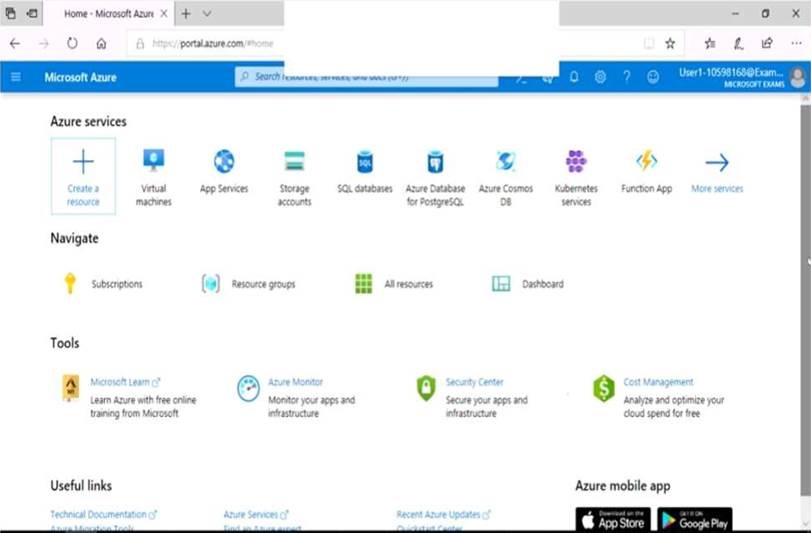
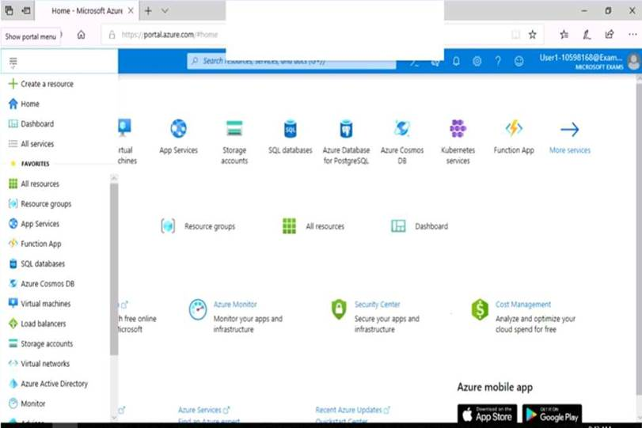
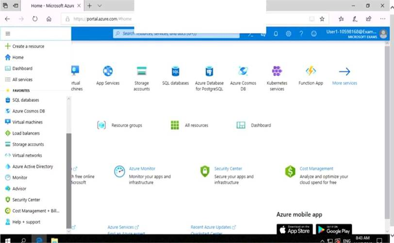

- [x] 1. In the Settings blade for virtual network VNET, select Locks. 2. To add a lock, select Add. 3. For Lock type select Delete lock, and click OK.

**[⬆ Back to Top](#table-of-contents)**

### Please wait while the virtual machine loads. Once loaded, you may proceed to the lab section. This may take a few minutes, and the wait time will not be deducted from your overall test time. Use the following login credentials as needed: To enter your username, place your cursor in the Sign in box and click on the username below. To enter your password, place your cursor in the Enter password box and click on the password below. Azure Username: <admin@abc.com>. Azure Password: XXXXXXXX. The following information is for technical support purposes only: Lab Instance: 12345678. The developers at your company plan to create a web app named App10598168 and to publish the app to <https://www.contoso.com>. The developers at your company plan to create a web app named App12345678 and to publish the app to <https://www.contoso.com>. You need to perform the following tasks: Ensure that App12345678 is registered to Azure Active Directory (Azure AD). Generate a password for App12345678. To complete this task, sign in to the Azure portal. This task might take several minutes to complete. You can perform other tasks while the task completes.

- [x] 1. Sign in to your Azure Account through the Azure portal. 2. Select Azure Active Directory. 3. Select App registrations. 4. Select New registration. 5. Name the application 12345678. Select a supported account type, which determines who can use the application. Under Redirect URI, select Web for the type of application you want to create. Enter the URI: https://www.contoso.com , where the access token is sent to. 6. Click Register. 7. Select Certificates & secrets. 8. Select Client secrets -> New client secret. 9. Provide a description of the secret, and a duration. When done, select Add. 10. After saving the client secret, the value of the client secret is displayed. Copy this value because you aren't able to retrieve the key later. You provide the key value with the application ID to sign in as the application. Store the key value where your application can retrieve it.
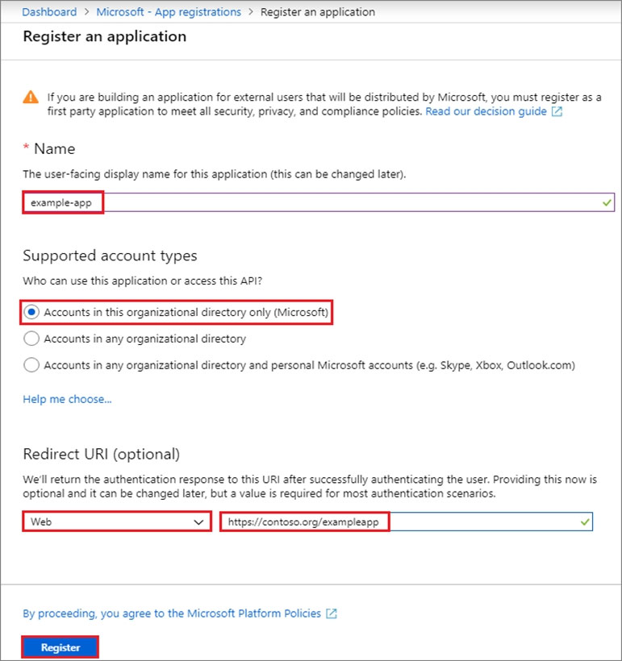

**[⬆ Back to Top](#table-of-contents)**

### Please wait while the virtual machine loads. Once loaded, you may proceed to the lab section. This may take a few minutes, and the wait time will not be deducted from your overall test time. Use the following login credentials as needed: To enter your username, place your cursor in the Sign in box and click on the username below. To enter your password, place your cursor in the Enter password box and click on the password below. Azure Username: <admin@abc.com>. Azure Password: XXXXXXXX. The following information is for technical support purposes only: Lab Instance: 12345678. You need to email an alert to a user named <admin1@contoso.com> if the average CPU usage of a virtual machine named VM1 is greater than 70 percent for a period of 15 minutes. To complete this task, sign in to the Azure portal. This task might take several minutes to complete. You can perform other tasks while the task completes.

- [x] 1. In the portal, locate the resource, here VM1, you are interested in monitoring and select it. Select Alerts under the MONITORING section. Select New alert rule. Fill in Condition, Actions, Alert rule details. Click Create alert rule.

**[⬆ Back to Top](#table-of-contents)**

### Please wait while the virtual machine loads. Once loaded, you may proceed to the lab section. This may take a few minutes, and the wait time will not be deducted from your overall test time. Use the following login credentials as needed: To enter your username, place your cursor in the Sign in box and click on the username below. To enter your password, place your cursor in the Enter password box and click on the password below. Azure Username: <admin@abc.com>. Azure Password: XXXXXXXX. The following information is for technical support purposes only: Lab Instance: 12345678. You need to create a new Azure Active Directory (Azure AD) directory named 12345678.onmicrosoft.com. The new directory must contain a user named user12345678 who is configured to sign in by using Azure Multi-Factor Authentication (MFA). To complete this task, sign in to the Azure portal. This task might take several minutes to complete. You can perform other tasks while the task completes.

- [x] 1. Browse to the Azure portal and sign in with an account that has an Azure subscription. 2. Select the plus icon (+) and search for Azure Active Directory. 3. Select Azure Active Directory in the search results. 4. Select Create. 5. Provide an Organization name (12345678) and an Initial domain name (12345678). Then select Create. This will create the directory named 12345678.onmicrosoft.com. 6. After directory creation is complete, select the information box to manage your new directory. 7. In the Azure portal, make sure you are on the Azure Active Directory fly out. If not, select the Azure Active Directory icon from the left services navigation. 8. Under Manage, select Users. 9. Select All users and then select + New user. 10. Provide a Name and User name (user12345678) for the user. When you're done, select Create. 11. In the Azure portal, make sure you are on the Azure Active Directory fly out. If not, select the Azure Active Directory icon from the left services navigation. 12. Under Manage, select Users. 13. Click on the Multi-Factor Authentication link. 14. Tick the checkbox next to the user's name and click the Enable link.
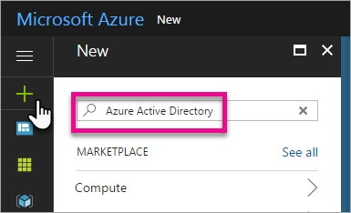
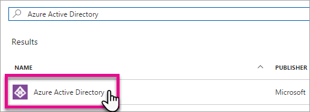
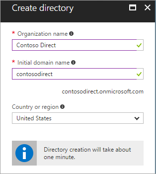
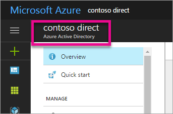
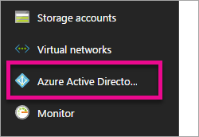
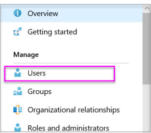

**[⬆ Back to Top](#table-of-contents)**

### Please wait while the virtual machine loads. Once loaded, you may proceed to the lab section. This may take a few minutes, and the wait time will not be deducted from your overall test time. Use the following login credentials as needed: To enter your username, place your cursor in the Sign in box and click on the username below. To enter your password, place your cursor in the Enter password box and click on the password below. Azure Username: <admin@abc.com>. Azure Password: XXXXXXXX. The following information is for technical support purposes only: Lab Instance: 12345678. You need to ensure that only devices connected to a 131.107.0.0/16 subnet can access data in the rg1lod1234578 Azure Storage account. To complete this task, sign in to the Azure portal. This task might take several minutes to complete. You can perform other tasks while the task completes.

- [x] 1. Go to the storage account. 2. Under 'Security + networking' SELECT 'Networking'. 2. Select 'Firewalls and virtual networks' on the top (next to Custom domain). 3. Under Public network access, CHOOSE the 'Enable from selected virtual network and IP addresses RADIO button. 4. Under 'Virtual networks' add existing virtual network. 5. Add the network with the CIDR.

**[⬆ Back to Top](#table-of-contents)**

### Please wait while the virtual machine loads. Once loaded, you may proceed to the lab section. This may take a few minutes, and the wait time will not be deducted from your overall test time. Use the following login credentials as needed: To enter your username, place your cursor in the Sign in box and click on the username below. To enter your password, place your cursor in the Enter password box and click on the password below. Azure Username: <admin@abc.com>. Azure Password: XXXXXXXX. The following information is for technical support purposes only: Lab Instance: 12345678. You need to collect all the audit failure data from the security log of a virtual machine named VM1 to an Azure Storage account. To complete this task, sign in to the Azure portal. This task might take several minutes to complete. You can perform other tasks while the task completes.

- [x] 1. Go to VM. 2. Diagnostic Settings. 3. Enable it. 4. Point to storage account. 5. Under Logs check (Security > Audit Failure) is ticked.

**[⬆ Back to Top](#table-of-contents)**

### Please wait while the virtual machine loads. Once loaded, you may proceed to the lab section. This may take a few minutes, and the wait time will not be deducted from your overall test time. Use the following login credentials as needed: To enter your username, place your cursor in the Sign in box and click on the username below. To enter your password, place your cursor in the Enter password box and click on the password below. Azure Username: <admin@abc.com>. Azure Password: XXXXXXXX. The following information is for technical support purposes only: Lab Instance: 12345678. You need to configure Azure to allow RDP connections from the Internet to a virtual machine named VM1. The solution must minimize the attack surface of VM1.To complete this task, sign in to the Azure portal. This task might take several minutes to complete. You can perform other tasks while the task completes.

- [x] 1. Sign in to the Azure portal. 2. In Virtual Machines, select VM1. 3. In Settings, select Networking. 4. In Inbound port rules, check whether the port for RDP is set correctly. The following is an example of the configuration: Priority: 300. Name: Port_3389. Port(Destination): 3389. Protocol: TCP. Source: Service Tag - Internet. Destinations: Any. Action: Allow.

**[⬆ Back to Top](#table-of-contents)**

### Please wait while the virtual machine loads. Once loaded, you may proceed to the lab section. This may take a few minutes, and the wait time will not be deducted from your overall test time. Use the following login credentials as needed: To enter your username, place your cursor in the Sign in box and click on the username below. To enter your password, place your cursor in the Enter password box and click on the password below. Azure Username: <admin@abc.com>. Azure Password: XXXXXXXX. The following information is for technical support purposes only: Lab Instance: 12345678. You need to add the network interface of a virtual machine named VM1 to an application security group named ASG1. To complete this task, sign in to the Azure portal. This task might take several minutes to complete. You can perform other tasks while the task completes.

- [x] 1. In the Search resources, services, and docs box at the top of the portal, begin typing the name of a virtual machine that has a network interface that you want to add to, or remove from, an application security group. When the name of your VM appears in the search results, select it. 2. Under SETTINGS, select Networking. Select Application Security Groups then Configure the application security groupselect the application security groups that you want to add the network interface to, or unselect the application security groups that you want to remove the network interface from, and then select Save. Only network interfaces that exist in the same virtual network can be added to the same application security group. The application security group must exist in the same location as the network interface.

**[⬆ Back to Top](#table-of-contents)**

### Please wait while the virtual machine loads. Once loaded, you may proceed to the lab section. This may take a few minutes, and the wait time will not be deducted from your overall test time. Use the following login credentials as needed: To enter your username, place your cursor in the Sign in box and click on the username below. To enter your password, place your cursor in the Enter password box and click on the password below. Azure Username: <admin@abc.com>. Azure Password: XXXXXXXX. The following information is for technical support purposes only: Lab Instance: 12345678. You need to ensure that a user named user2-12345678 can manage the properties of the virtual machines in the RG1lod12345678 resource group. The solution must use the principle of least privilege. To complete this task, sign in to the Azure portal. This task might take several minutes to complete. You can perform other tasks while the task completes.

- [x] 1. Sign in to the Azure portal. 2. Browse to Resource Groups. 3. Select the RG1lod12345678 resource group. 4. Select Access control (IAM). 5. Select Add > role assignment. 6. Select Virtual Machine Contributor (you can filter the list of available roles by typing 'virtual' in the search box) then click Next. 7. Select the +Select members option and select user2-12345678 then click the Select button. 8. Click the Review + assign button twice.

**[⬆ Back to Top](#table-of-contents)**

### Please wait while the virtual machine loads. Once loaded, you may proceed to the lab section. This may take a few minutes, and the wait time will not be deducted from your overall test time. Use the following login credentials as needed: To enter your username, place your cursor in the Sign in box and click on the username below. To enter your password, place your cursor in the Enter password box and click on the password below. Azure Username: <admin@abc.com>. Azure Password: XXXXXXXX. The following information is for technical support purposes only: Lab Instance: 12345678. You need to ensure that the rg1lod1234578n1 Azure Storage account is encrypted by using a key stored in the KeyVault12345678 Azure Key Vault. To complete this task, sign in to the Azure portal. This task might take several minutes to complete. You can perform other tasks while the task completes.

- [x] 1. Go to Storage Accounts. 2. Click on your storage account. 3. In the search box type encryption and select it. 4. From the encryption page select Customer-managed keys. 5. And then click the link to select a key vault and key. 6. A new page opens and then you select the appropriate key vault and key.

**[⬆ Back to Top](#table-of-contents)**

### Please wait while the virtual machine loads. Once loaded, you may proceed to the lab section. This may take a few minutes, and the wait time will not be deducted from your overall test time. Use the following login credentials as needed: To enter your username, place your cursor in the Sign in box and click on the username below. To enter your password, place your cursor in the Enter password box and click on the password below. Azure Username: <admin@abc.com>. Azure Password: XXXXXXXX. The following information is for technical support purposes only: Lab Instance: 12345678. You need to perform a full malware scan every Sunday at 02:00 on a virtual machine named VM1 by using Microsoft Antimalware for Virtual Machines. To complete this task, sign in to the Azure portal. This task might take several minutes to complete. You can perform other tasks while the task completes.

- [x] 1. In Azure Portal, go to the Azure VM1's blade, navigate to the Extensions section and press Add. 2. Select the Microsoft Antimalware extension and press Create. 3. Fill the Install extension form as desired and press OK. Scheduled: Enable. Scan type: Full. Scan day: Sunday (note: picture wrongly shows 'Saturday'). The scan time is measured in minutes after midnight so 60 would be 01:00, 120 would be 02:00 etc.
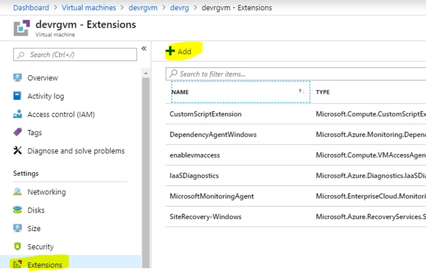
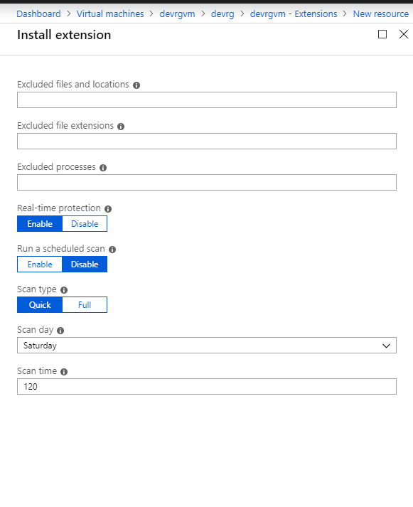

**[⬆ Back to Top](#table-of-contents)**

### Please wait while the virtual machine loads. Once loaded, you may proceed to the lab section. This may take a few minutes, and the wait time will not be deducted from your overall test time. Use the following login credentials as needed: To enter your username, place your cursor in the Sign in box and click on the username below. To enter your password, place your cursor in the Enter password box and click on the password below. Azure Username: <admin@abc.com>. Azure Password: XXXXXXXX. The following information is for technical support purposes only: Lab Instance: 12345678. You need to prevent HTTP connections to the rg1lod1234578n1 Azure Storage account. To complete this task, sign in to the Azure portal. This task might take several minutes to complete. You can perform other tasks while the task completes.

- [x] 1. In Azure Portal select you Azure Storage account rg1lod12345678n1. 2. Select Configuration, and Secure Transfer required.
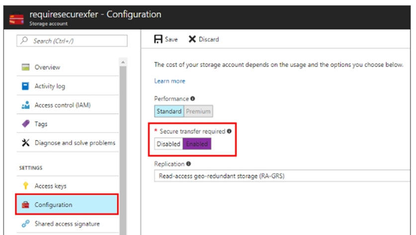

**[⬆ Back to Top](#table-of-contents)**

### Contoso, Ltd. is a consulting company that has a main office in Montreal and two branch offices in Seattle and New York. The company hosts its entire server infrastructure in Azure. Contoso has two Azure subscriptions named Sub1 and Sub2. Both subscriptions are associated to an Azure Active Directory (Azure AD) tenant named contoso.com. Contoso identifies the following technical requirements: Deploy Azure Firewall to VNetwork1 in Sub2. Register an application named App2 in contoso.com. Whenever possible, use the principle of least privilege. Enable Azure AD Privileged Identity Management (PIM) for contoso.com. Contoso.com contains the users shown in the following table. Contoso.com contains the security groups shown in the following table. Sub1 contains six resource groups named RG1, RG2, RG3, RG4, RG5, and RG6. User9 creates the virtual networks shown in the following table. Sub1 contains the locks shown in the following table. Sub1 contains the Azure policies shown in the following table. Sub2 contains the virtual networks shown in the following table. Sub2 contains the virtual machines shown in the following table. All virtual machines have the public IP addresses and the Web Server (IIS) role installed. The firewalls for each virtual machine allow ping requests and web requests. Sub2 contains the network security groups (NSGs) shown in the following table. NSG1 has the inbound security rules shown in the following table. NSG2 has the inbound security rules shown in the following table. NSG3 has the inbound security rules shown in the following table. NSG4 has the inbound security rules shown in the following table. NSG1, NSG2, NSG3, and NSG4 have the outbound security rules shown in the following table. You are evaluating the security of the network communication between the virtual machines in Sub2. From VM1, you can successfully ping the public IP address of VM3.

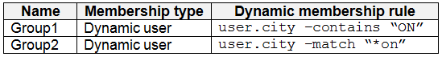

- [x] Yes.
- [ ] No.

**[⬆ Back to Top](#table-of-contents)**

### Contoso, Ltd. is a consulting company that has a main office in Montreal and two branch offices in Seattle and New York. The company hosts its entire server infrastructure in Azure. Contoso has two Azure subscriptions named Sub1 and Sub2. Both subscriptions are associated to an Azure Active Directory (Azure AD) tenant named contoso.com. Contoso identifies the following technical requirements: Deploy Azure Firewall to VNetwork1 in Sub2. Register an application named App2 in contoso.com. Whenever possible, use the principle of least privilege. Enable Azure AD Privileged Identity Management (PIM) for contoso.com. Contoso.com contains the users shown in the following table. Contoso.com contains the security groups shown in the following table. Sub1 contains six resource groups named RG1, RG2, RG3, RG4, RG5, and RG6. User9 creates the virtual networks shown in the following table. Sub1 contains the locks shown in the following table. Sub1 contains the Azure policies shown in the following table. Sub2 contains the virtual networks shown in the following table. Sub2 contains the virtual machines shown in the following table. All virtual machines have the public IP addresses and the Web Server (IIS) role installed. The firewalls for each virtual machine allow ping requests and web requests. Sub2 contains the network security groups (NSGs) shown in the following table. NSG1 has the inbound security rules shown in the following table. NSG2 has the inbound security rules shown in the following table. NSG3 has the inbound security rules shown in the following table. NSG4 has the inbound security rules shown in the following table. NSG1, NSG2, NSG3, and NSG4 have the outbound security rules shown in the following table. You are evaluating the security of the network communication between the virtual machines in Sub2. From VM1, you can successfully ping the private IP address of VM3.

- [x] Yes.
- [ ] No.

**[⬆ Back to Top](#table-of-contents)**

### Contoso, Ltd. is a consulting company that has a main office in Montreal and two branch offices in Seattle and New York. The company hosts its entire server infrastructure in Azure. Contoso has two Azure subscriptions named Sub1 and Sub2. Both subscriptions are associated to an Azure Active Directory (Azure AD) tenant named contoso.com. Contoso identifies the following technical requirements: Deploy Azure Firewall to VNetwork1 in Sub2. Register an application named App2 in contoso.com. Whenever possible, use the principle of least privilege. Enable Azure AD Privileged Identity Management (PIM) for contoso.com. Contoso.com contains the users shown in the following table. Contoso.com contains the security groups shown in the following table. Sub1 contains six resource groups named RG1, RG2, RG3, RG4, RG5, and RG6. User9 creates the virtual networks shown in the following table. Sub1 contains the locks shown in the following table. Sub1 contains the Azure policies shown in the following table. Sub2 contains the virtual networks shown in the following table. Sub2 contains the virtual machines shown in the following table. All virtual machines have the public IP addresses and the Web Server (IIS) role installed. The firewalls for each virtual machine allow ping requests and web requests. Sub2 contains the network security groups (NSGs) shown in the following table. NSG1 has the inbound security rules shown in the following table. NSG2 has the inbound security rules shown in the following table. NSG3 has the inbound security rules shown in the following table. NSG4 has the inbound security rules shown in the following table. NSG1, NSG2, NSG3, and NSG4 have the outbound security rules shown in the following table. You are evaluating the security of the network communication between the virtual machines in Sub2. From VM1, you can successfully ping the private IP address of VM5.

- [ ] Yes.
- [x] No.

**[⬆ Back to Top](#table-of-contents)**

### Contoso, Ltd. is a consulting company that has a main office in Montreal and two branch offices in Seattle and New York. The company hosts its entire server infrastructure in Azure. Contoso has two Azure subscriptions named Sub1 and Sub2. Both subscriptions are associated to an Azure Active Directory (Azure AD) tenant named contoso.com. Contoso identifies the following technical requirements: Deploy Azure Firewall to VNetwork1 in Sub2. Register an application named App2 in contoso.com. Whenever possible, use the principle of least privilege. Enable Azure AD Privileged Identity Management (PIM) for contoso.com. Contoso.com contains the users shown in the following table. Contoso.com contains the security groups shown in the following table. Sub1 contains six resource groups named RG1, RG2, RG3, RG4, RG5, and RG6. User9 creates the virtual networks shown in the following table. Sub1 contains the locks shown in the following table. Sub1 contains the Azure policies shown in the following table. Sub2 contains the virtual networks shown in the following table. Sub2 contains the virtual machines shown in the following table. All virtual machines have the public IP addresses and the Web Server (IIS) role installed. The firewalls for each virtual machine allow ping requests and web requests. Sub2 contains the network security groups (NSGs) shown in the following table. NSG1 has the inbound security rules shown in the following table. NSG2 has the inbound security rules shown in the following table. NSG3 has the inbound security rules shown in the following table. NSG4 has the inbound security rules shown in the following table. NSG1, NSG2, NSG3, and NSG4 have the outbound security rules shown in the following table. You are evaluating the effect of the application security groups on the network communication between the virtual machines in Sub2. From VM1, you can successfully ping the private IP address of VM4.

- [ ] Yes.
- [x] No.

**[⬆ Back to Top](#table-of-contents)**

### Contoso, Ltd. is a consulting company that has a main office in Montreal and two branch offices in Seattle and New York. The company hosts its entire server infrastructure in Azure. Contoso has two Azure subscriptions named Sub1 and Sub2. Both subscriptions are associated to an Azure Active Directory (Azure AD) tenant named contoso.com. Contoso identifies the following technical requirements: Deploy Azure Firewall to VNetwork1 in Sub2. Register an application named App2 in contoso.com. Whenever possible, use the principle of least privilege. Enable Azure AD Privileged Identity Management (PIM) for contoso.com. Contoso.com contains the users shown in the following table. Contoso.com contains the security groups shown in the following table. Sub1 contains six resource groups named RG1, RG2, RG3, RG4, RG5, and RG6. User9 creates the virtual networks shown in the following table. Sub1 contains the locks shown in the following table. Sub1 contains the Azure policies shown in the following table. Sub2 contains the virtual networks shown in the following table. Sub2 contains the virtual machines shown in the following table. All virtual machines have the public IP addresses and the Web Server (IIS) role installed. The firewalls for each virtual machine allow ping requests and web requests. Sub2 contains the network security groups (NSGs) shown in the following table. NSG1 has the inbound security rules shown in the following table. NSG2 has the inbound security rules shown in the following table. NSG3 has the inbound security rules shown in the following table. NSG4 has the inbound security rules shown in the following table. NSG1, NSG2, NSG3, and NSG4 have the outbound security rules shown in the following table. You are evaluating the effect of the application security groups on the network communication between the virtual machines in Sub2. From VM2, you can successfully ping the private IP address of VM4.

- [x] Yes.
- [ ] No.

**[⬆ Back to Top](#table-of-contents)**

### Contoso, Ltd. is a consulting company that has a main office in Montreal and two branch offices in Seattle and New York. The company hosts its entire server infrastructure in Azure. Contoso has two Azure subscriptions named Sub1 and Sub2. Both subscriptions are associated to an Azure Active Directory (Azure AD) tenant named contoso.com. Contoso identifies the following technical requirements: Deploy Azure Firewall to VNetwork1 in Sub2. Register an application named App2 in contoso.com. Whenever possible, use the principle of least privilege. Enable Azure AD Privileged Identity Management (PIM) for contoso.com. Contoso.com contains the users shown in the following table. Contoso.com contains the security groups shown in the following table. Sub1 contains six resource groups named RG1, RG2, RG3, RG4, RG5, and RG6. User9 creates the virtual networks shown in the following table. Sub1 contains the locks shown in the following table. Sub1 contains the Azure policies shown in the following table. Sub2 contains the virtual networks shown in the following table. Sub2 contains the virtual machines shown in the following table. All virtual machines have the public IP addresses and the Web Server (IIS) role installed. The firewalls for each virtual machine allow ping requests and web requests. Sub2 contains the network security groups (NSGs) shown in the following table. NSG1 has the inbound security rules shown in the following table. NSG2 has the inbound security rules shown in the following table. NSG3 has the inbound security rules shown in the following table. NSG4 has the inbound security rules shown in the following table. NSG1, NSG2, NSG3, and NSG4 have the outbound security rules shown in the following table. You are evaluating the effect of the application security groups on the network communication between the virtual machines in Sub2. From VM1, you can connect to the web server on VM4.

- [x] Yes.
- [ ] No.

**[⬆ Back to Top](#table-of-contents)**

### Contoso, Ltd. is a consulting company that has a main office in Montreal and two branch offices in Seattle and New York. The company hosts its entire server infrastructure in Azure. Contoso has two Azure subscriptions named Sub1 and Sub2. Both subscriptions are associated to an Azure Active Directory (Azure AD) tenant named contoso.com. Contoso identifies the following technical requirements: Deploy Azure Firewall to VNetwork1 in Sub2. Register an application named App2 in contoso.com. Whenever possible, use the principle of least privilege. Enable Azure AD Privileged Identity Management (PIM) for contoso.com. Contoso.com contains the users shown in the following table. Contoso.com contains the security groups shown in the following table. Sub1 contains six resource groups named RG1, RG2, RG3, RG4, RG5, and RG6. User9 creates the virtual networks shown in the following table. Sub1 contains the locks shown in the following table. Sub1 contains the Azure policies shown in the following table. Sub2 contains the virtual networks shown in the following table. Sub2 contains the virtual machines shown in the following table. All virtual machines have the public IP addresses and the Web Server (IIS) role installed. The firewalls for each virtual machine allow ping requests and web requests. Sub2 contains the network security groups (NSGs) shown in the following table. NSG1 has the inbound security rules shown in the following table. NSG2 has the inbound security rules shown in the following table. NSG3 has the inbound security rules shown in the following table. NSG4 has the inbound security rules shown in the following table. NSG1, NSG2, NSG3, and NSG4 have the outbound security rules shown in the following table. You need to ensure that User2 can implement PIM. What should you do first?

- [x] Assign User2 the Global administrator role.
- [ ] Configure authentication methods for contoso.com.
- [ ] Configure the identity secure score for contoso.com.
- [ ] Enable multi-factor authentication (MFA) for User2.

**[⬆ Back to Top](#table-of-contents)**

### Contoso, Ltd. is a consulting company that has a main office in Montreal and two branch offices in Seattle and New York. The company hosts its entire server infrastructure in Azure. Contoso has two Azure subscriptions named Sub1 and Sub2. Both subscriptions are associated to an Azure Active Directory (Azure AD) tenant named contoso.com. Contoso identifies the following technical requirements: Deploy Azure Firewall to VNetwork1 in Sub2. Register an application named App2 in contoso.com. Whenever possible, use the principle of least privilege. Enable Azure AD Privileged Identity Management (PIM) for contoso.com. Contoso.com contains the users shown in the following table. Contoso.com contains the security groups shown in the following table. Sub1 contains six resource groups named RG1, RG2, RG3, RG4, RG5, and RG6. User9 creates the virtual networks shown in the following table. Sub1 contains the locks shown in the following table. Sub1 contains the Azure policies shown in the following table. Sub2 contains the virtual networks shown in the following table. Sub2 contains the virtual machines shown in the following table. All virtual machines have the public IP addresses and the Web Server (IIS) role installed. The firewalls for each virtual machine allow ping requests and web requests. Sub2 contains the network security groups (NSGs) shown in the following table. NSG1 has the inbound security rules shown in the following table. NSG2 has the inbound security rules shown in the following table. NSG3 has the inbound security rules shown in the following table. NSG4 has the inbound security rules shown in the following table. NSG1, NSG2, NSG3, and NSG4 have the outbound security rules shown in the following table. Which virtual networks in Sub1 can User9 modify and delete in their current state?

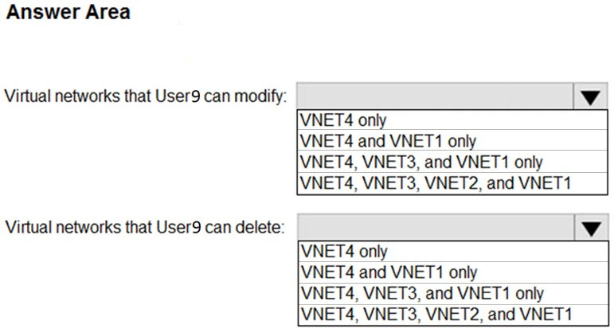

- [x] Virtual networks that User9 can modify: VNET4 and VNET1 only. Virtual networks that User9 can delete: VNET4 only.
- [ ] Virtual networks that User9 can modify: VNET4 and VNET1 only. Virtual networks that User9 can delete: VNET4, VNET3,VNET 2 and VNET1.
- [ ] Virtual networks that User9 can modify: VNET4, VNET3, and VNET1 only. Virtual networks that User9 can delete: VNET4, VNET3,VNET 2 and VNET1.
- [ ] Virtual networks that User9 can modify: VNET4, VNET3,VNET 2 and VNET1. Virtual networks that User9 can delete: VNET4 only.

**[⬆ Back to Top](#table-of-contents)**

### Your network contains an Active Directory forest named contoso.com. The forest contains a single domain. You have an Azure subscription named Sub1 that is associated to an Azure Active Directory (Azure AD) tenant named contoso.com. You plan to deploy Azure AD Connect and to integrate Active Directory and the Azure AD tenant. You need to recommend an integration solution that meets the following requirements: Ensures that password policies and user logon restrictions apply to user accounts that are synced to the Tenant. Minimizes the number of servers required for the solution. Which authentication method should you include in the recommendation?

- [ ] Federated identity with Active Directory Federation Services (AD FS).
- [ ] Password hash synchronization with seamless single sign-on (SSO).
- [x] Pass-through authentication with seamless single sign-on (SSO)

**[⬆ Back to Top](#table-of-contents)**

### You need to deploy Microsoft Antimalware to meet the platform protection requirements. What should you do?

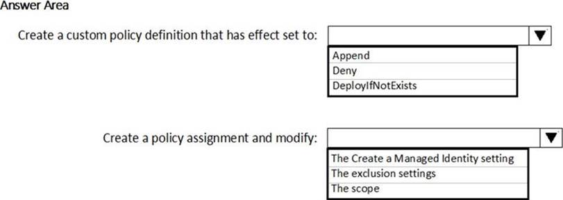

- [ ] Create a custom policy definition that has effect set to: Append. Create a policy assignment and modify: The exclusion settings.
- [ ] Create a custom policy definition that has effect set to: Deny. Create a policy assignment and modify: The Create a Managed Identity setting.
- [x] Create a custom policy definition that has effect set to: DeployIfNotExists. Create a policy assignment and modify: The scope.
- [ ] Create a custom policy definition that has effect set to: DeployIfNotExists. Create a policy assignment and modify: The exclusion settings.

**[⬆ Back to Top](#table-of-contents)**

### Fabrikam, Inc. is a consulting company that has a main office in Montreal and branch offices in Seattle and New York. Fabrikam has IT, human resources (HR), and finance departments. Fabrikam has a Microsoft 365 subscription and an Azure subscription named subscription1. The network contains an on-premises Active Directory domain named Fabrikam.com. The domain contains two organizational units (OUs) named OU1 and OU2. Azure AD Connect cloud sync syncs only OU1. The Azure resources hierarchy is shown in the following exhibit. The Azure Active Directory (Azure AD) tenant contains the users shown in the following table. Azure AD contains the resources shown in the following table. Subscription1 contains the virtual networks shown in the following table. Subscription1 contains the network security groups (NSGs) shown in the following table. Subscription1 contains the virtual machines shown in the following table. Subscription1 contains the Azure Key Vaults shown in the following table. Subscription1 contains a storage account named storage1 in the West US Azure region. Fabrikam plans to implement the following changes: Create two application security groups as shown in the following table. Associate the network interface of VM1 to ASG1. Deploy SecPol1 by using Azure Security Center. Deploy a third-party app named App1. A version of App1 exists for all available operating systems. Create a resource group named RG2. Sync OU2 to Azure AD. Add User1 to Group1. Fabrikam identifies the following technical requirements: The finance department users must reauthenticate after three hours when they access SharePoint Online. Storage1 must be encrypted by using customer-managed keys and automatic key rotation. From Sentinel1, you must ensure that the following notebooks can be launched: Entity Explorer – Account. Entity Explorer – Windows Host. Guided Investigation Process Alerts. VM1, VM2, and VM3 must be encrypted by using Azure Disk Encryption. Just in time (JIT) VM access for VM1, VM2, and VM3 must be enabled. App1 must use a secure connection string stored in KeyVault1. KeyVault1 traffic must NOT travel over the internet. You need to configure support for Microsoft Sentinel notebooks to meet the technical requirements. What is the minimum number of Azure container registries and Azure Machine Learning workspaces required?

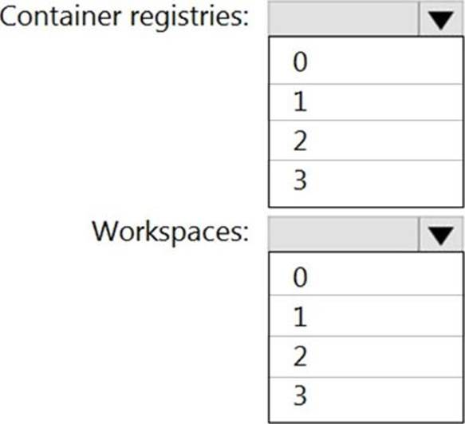

- [ ] Container registries: 0. Workspaces: 2.
- [ ] Container registries: 1. Workspaces: 3.
- [ ] Container registries: 2. Workspaces: 0.
- [x] Container registries: 0. Workspaces: 1.

**[⬆ Back to Top](#table-of-contents)**

### You have an Azure web app named WebApp1. You upload a certificate to WebApp1. You need to make the certificate accessible to the app code of WebApp1. What should you do?

- [ ] Add a user-assigned managed identity to WebApp1.
- [x] Add an app setting to the WebApp1 configuration.
- [ ] Enable system-assigned managed identity for the WebApp1.
- [ ] Configure the TLS/SSL binding for WebApp1.

**[⬆ Back to Top](#table-of-contents)**

### Your company plans to create separate subscriptions for each department. Each subscription will be associated to the same Azure Active Directory (Azure AD) tenant. You need to configure each subscription to have the same role assignments. What should you use?

- [ ] Azure Security Center.
- [x] Azure Blueprints.
- [ ] Azure AD Privileged Identity Management (PIM).
- [ ] Azure Policy.

**[⬆ Back to Top](#table-of-contents)**

### You have an Azure subscription that contains the resources shown in the following table. User1 is a member of Group1. Group1 and User2 are assigned the Key Vault Contributor role for Vault1. On January 1, 2019, you create a secret in Vault1. The secret is configured as shown in the exhibit. User2 is assigned an access policy to Vault1. The policy has the following configurations: Key Management Operations: Get, List, and Restore. Cryptographic Operations: Decrypt and Unwrap Key. Secret Management Operations: Get, List, and Restore. Group1 is assigned an access to Vault1. The policy has the following configurations: Key Management Operations: Get and Recover. Secret Management Operations: List, Backup, and Recover. On January 1, 2019, User1 can view the value of Password1.

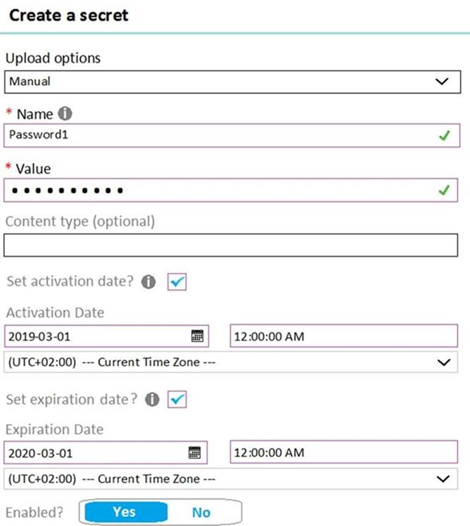

- [ ] Yes.
- [x] No.

**[⬆ Back to Top](#table-of-contents)**

### You have an Azure subscription that contains the resources shown in the following table. User1 is a member of Group1. Group1 and User2 are assigned the Key Vault Contributor role for Vault1. On January 1, 2019, you create a secret in Vault1. The secret is configured as shown in the exhibit. User2 is assigned an access policy to Vault1. The policy has the following configurations: Key Management Operations: Get, List, and Restore. Cryptographic Operations: Decrypt and Unwrap Key. Secret Management Operations: Get, List, and Restore. Group1 is assigned an access to Vault1. The policy has the following configurations: Key Management Operations: Get and Recover. Secret Management Operations: List, Backup, and Recover. On June 1, 2019, User2 can view the value of Password1.

- [x] Yes.
- [ ] No.

**[⬆ Back to Top](#table-of-contents)**

### You have an Azure subscription that contains the resources shown in the following table. User1 is a member of Group1. Group1 and User2 are assigned the Key Vault Contributor role for Vault1. On January 1, 2019, you create a secret in Vault1. The secret is configured as shown in the exhibit. User2 is assigned an access policy to Vault1. The policy has the following configurations: Key Management Operations: Get, List, and Restore. Cryptographic Operations: Decrypt and Unwrap Key. Secret Management Operations: Get, List, and Restore. Group1 is assigned an access to Vault1. The policy has the following configurations: Key Management Operations: Get and Recover. Secret Management Operations: List, Backup, and Recover. On June 1, 2019, User1 can view the value of Password1.

- [ ] Yes.
- [x] No.

**[⬆ Back to Top](#table-of-contents)**

### You have Azure Resource Manager templates that you use to deploy Azure virtual machines. You need to disable unused Windows features automatically as instances of the virtual machines are provisioned. What should you use?

- [ ] Device compliance policies in Microsoft Intune.
- [x] Azure Automation State Configuration.
- [ ] Application security groups.
- [ ] Azure Advisor.

**[⬆ Back to Top](#table-of-contents)**

### You have a Azure subscription. You enable Azure Active Directory (Azure AD) Privileged identify (PIM). Your company's security policy for administrator accounts has the following conditions: The accounts must use multi-factor authentication (MFA). The account must use 20-character complex passwords. The passwords must be changed every 180 days. The account must be managed by using PIM. You receive alerts about administrator who have not changed their password during the last 90 days. You need to minimize the number of generated alerts. Which PIM alert should you modify?

- [ ] Roles don't require multi-factor authentication for activation.
- [ ] Administrator aren't using their privileged roles.
- [ ] Roles are being assigned outside of Privileged identity Management.
- [x] Potential stale accounts in a privileged role.

**[⬆ Back to Top](#table-of-contents)**

### You have an Azure subscription that contains an Azure Active Directory (Azure AD) tenant and a user named User1. The App registrations settings for the tenant are configured as shown in the following exhibit. You plan to deploy an app named App1. You need to ensure that User1 can register App1 in Azure AD. The solution must use the principle of least privilege. Which role should you assign to User1?

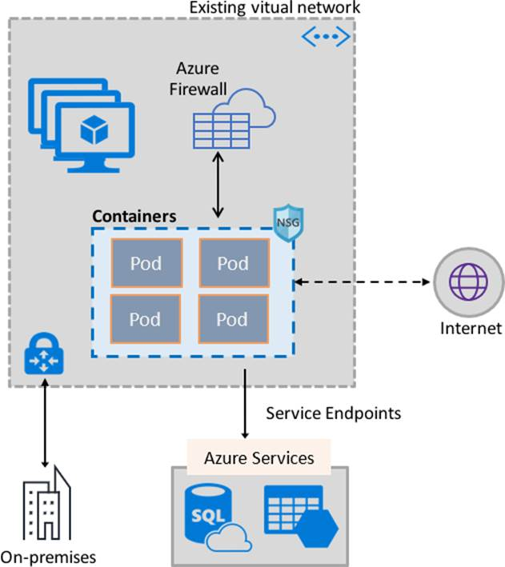

- [ ] App Configuration Data Owner for the subscription.
- [ ] Managed Application Contributor for the subscription.
- [ ] Cloud application administrator in Azure AD.
- [x] Application developer in Azure AD.

**[⬆ Back to Top](#table-of-contents)**

### You have three Azure subscriptions and a user named User1. You need to provide User1 with the ability to manage and view costs for the resources across all three subscriptions. The solution must use the principle of least privilege. Which three actions should you perform in sequence?

- [x] Box 1: Assign User1 the Cost Management Contributor role for the management group. Box 2: Assign User1 the Global administrator role. Box 3: Add the three subscriptions to the management group.
- [ ] Box 1: Assign User1 the Global administrator role. Box 2: Assign User1 the Owner role for the management group. Box 3: Create a management group.
- [ ] Box 1: Create a management group. Box 2: Assign User1 the Cost Management Contributor role for the management group. Box 3: Create a management group.
- [ ] Box 1: Assign User1 the Cost Management Contributor role for the management group. Box 2: Assign User1 the Global administrator role. Box 3: Assign User1 the Owner role for the management group.

**[⬆ Back to Top](#table-of-contents)**

### You have an Azure web app named webapp1. You need to configure continuous deployment for webapp1 by using an Azure Repo. What should you create first?

- [ ] Azure Application Insights service.
- [x] Azure DevOps organization.
- [ ] Azure Storage account.
- [ ] Azure DevTest Labs lab.

**[⬆ Back to Top](#table-of-contents)**

### You plan to connect several Windows servers to the WS12345678 Azure Log Analytics workspace. You need to ensure that the events in the System event logs are collected automatically to the workspace after you connect the Windows servers. To complete this task, sign in to the Azure portal and modify the Azure resources.

- [x] 1. In the Azure portal, locate the WS12345678 Azure Log Analytics workspace then select Advanced settings. 2. Select Data, and then select Windows Event Logs. 3. You add an event log by typing in the name of the log. Type System and then select the plus sign +. 4. In the table, check the severities Error and Warning. (for this question, select all severities to ensure that ALL logs are collected). 5. Select Save at the top of the page to save the configuration.

**[⬆ Back to Top](#table-of-contents)**

### You need to ensure that web11597200 is protected from malware by using Microsoft Antimalware for Virtual Machines and is scanned every Friday at 01:00. To complete this task, sign in to the Azure portal.

- [x] 1. In the Azure portal, type Virtual Machines in the search box, select Virtual Machines from the search results then select web1234578. Alternatively, browse to Virtual Machines in the left navigation pane. 2. In the properties of web11597200, click on Extensions + Applications under Settings of VM. 3. Click the Add button to add an Extension. 4. Scroll down the list of extensions and select Microsoft Antimalware. 5. Click the Create button. This will open the settings panel for the Microsoft Antimalware Extension. 6. In the Scan day field, select Friday. 7. In the Scan time field, enter 60. The scan time is measured in minutes after midnight so 60 would be 01:00, 120 would be 02:00 etc. 8. Click the OK button to save the configuration and install the extension.

**[⬆ Back to Top](#table-of-contents)**

### You have an Azure Active Directory (Azure AD) tenant named Contoso.com and an Azure Service (AKS) cluster AKS1. You discover that AKS1 cannot be accessed by using accounts from Contoso.com. You need to ensure AKS1 can be accessed by using accounts from Contoso.com. The solution must minimize administrative effort. What should you do first?

- [x] From Azure recreate AKS1.
- [ ] From AKS1, upgrade the version of Kubermetes.
- [ ] From Azure AD, implement Azure AD Premium P2.
- [ ] From Azure AD, configure the User settings.

**[⬆ Back to Top](#table-of-contents)**

### You need to ensure that the AzureBackupReport log for the Vault1 Recovery Services vault is stored in the WS11641655 Azure Log Analytics workspace. To complete this task, sign in to the Azure portal and modify the Azure resources.

- [x] 1. In the Azure portal, type Recovery Services Vaults in the search box, select Recovery Services Vaults from the search results then select Vault1. Alternatively, browse to Recovery Services Vaults in the left navigation panel. 2. In the properties of Vault1, scroll down to the Monitoring section and select Diagnostic Settings. 3. Click the Add a diagnostic setting link. 4. Enter a name in the Diagnostic settings name box. 5. In the Log section, select AzureBackupReport. 6. In the Destination details section, select Send to log analytics. 7. Select the WS12345678 Azure Log Analytics workspace. 8. Click the Save button to save the changes.
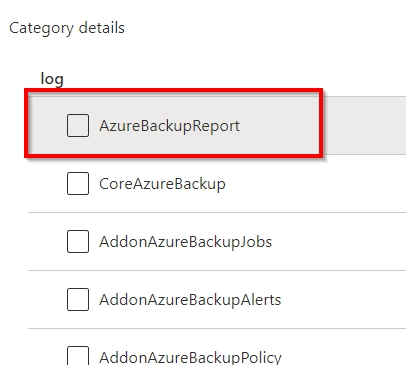

**[⬆ Back to Top](#table-of-contents)**

### You create resources in an Azure subscription as shown in the following table. VNET1 contains two subnets named Subnet1 and Subnet2. Subnet1 has a network ID of 10.0.0.0/24. Subnet2 has a network ID of 10.1.1.0/24. Contoso1901 is configured as shown in the exhibit. An Azure virtual machine on Subnet1 can access data on Contoso1901.

- [x] Yes.
- [ ] No.

**[⬆ Back to Top](#table-of-contents)**

### You create resources in an Azure subscription as shown in the following table. VNET1 contains two subnets named Subnet1 and Subnet2. Subnet1 has a network ID of 10.0.0.0/24. Subnet2 has a network ID of 10.1.1.0/24. Contoso1901 is configured as shown in the exhibit. An Azure virtual machine on Subnet2 can access data in Cantoso1901.

- [ ] Yes.
- [x] No.

**[⬆ Back to Top](#table-of-contents)**

### You create resources in an Azure subscription as shown in the following table. VNET1 contains two subnets named Subnet1 and Subnet2. Subnet1 has a network ID of 10.0.0.0/24. Subnet2 has a network ID of 10.1.1.0/24. Contoso1901 is configured as shown in the exhibit. A computer on the Internet that has an IP address of 193.77.10.2 can access data in Contoso1901.

- [x] Yes.
- [ ] No.

**[⬆ Back to Top](#table-of-contents)**

### You have an Azure subscription. You configure the subscription to use a different Azure Active Directory (Azure AD) tenant. What are two possible effects of the change?

- [x] Role assignments at the subscription level are lost.
- [x] Virtual machine managed identities are lost.
- [ ] Virtual machine disk snapshots are lost.
- [ ] Existing Azure resources are deleted.

**[⬆ Back to Top](#table-of-contents)**

### You need to create a web app named Intranet11597200 and enable users to authenticate to the web app by using Azure Active Directory (Azure AD). To complete this task, sign in to the Azure portal.

- [x] 1. In the Azure portal, type App services in the search box and select App services from the search results. 2. Click the Create app service button to create a new app service. 3. In the Resource Group section, click the Create new link to create a new resource group. 4. Give the resource group a name such as Intranet11597200RG and click OK. 5. In the Instance Details section, enter Intranet11597200 in the Name field. 6. In the Runtime stack field, select any runtime stack such as .NET Core 3.1. 7. Click the Review + create button. 8. Click the Create button to create the web app. 9. Click the Go to resource button to open the properties of the new web app. 10. In the Settings section, click on Authentication / Authorization. 11. Click the App Service Authentication slider to set it to On. 12. In the Action to take when request is not authentication box, select Log in with Azure Active Directory. 13. Click Save to save the changes. 14. Sign in to the Azure portal: Go to the Azure portal (https://portal.azure.com/) and sign in with your Azure account credentials. 15. Create a new web app: In the Azure portal, click on the '+ Create a resource' button and search for 'Web App'. Click on 'Web App' and then click on the 'Create' button. 16. Fill in the web app details: In the 'Web App' section, fill in the details for your web app such as name, subscription, resource group, operating system, and other required details. 17. Configure authentication: After creating the web app, you need to configure authentication using Azure AD. To do this, navigate to your newly created web app and click on 'Authentication / Authorization' under the 'Settings' section. 18. Enable authentication: On the 'Authentication / Authorization' screen, switch the 'App Service Authentication' toggle to 'On'. This will allow you to configure authentication using Azure AD. 19. Configure Azure AD authentication: In the 'Authentication / Authorization' screen, click on the 'Azure Active Directory' tab. Here, you need to configure Azure AD authentication. To do this, select 'Express' as the authentication provider and click on 'OK'. 20. Configure Azure AD: After configuring Azure AD authentication, you need to configure Azure AD. Click on the 'Manage Azure AD' button to go to the Azure AD portal. 21. Create a new Azure AD app: In the Azure AD portal, click on 'App registrations' under the 'Manage' section. Click on the '+ New registration' button to create a new Azure AD app. 22. Configure the Azure AD app: In the 'Register an application' section, fill in the details for your Azure AD app such as name, supported account types, and redirect URI. 23. Grant permissions: After configuring the Azure AD app, you need to grant permissions to the app. Click on the 'API permissions' tab and click on the 'Add a permission' button. Select the required permissions and click on 'Add permissions'. 24. Configure the web app: After configuring the Azure AD app and granting permissions, you need to configure the web app to use Azure AD for authentication. Go back to the Azure portal and navigate to your web app. Click on 'Authentication / Authorization' under the 'Settings' section. 25. Configure Azure AD authentication: In the 'Authentication / Authorization' screen, click on the 'Azure Active Directory' tab. Here, you need to configure Azure AD authentication. Select 'Advanced' as the authentication provider and fill in the details for your Azure AD app. 26. Save the configuration: After configuring Azure AD authentication, click on the 'Save' button to save the configuration. 27. Once you have completed these steps, your web app named Intranet11597200 should be configured to enable users to authenticate to the web app by using Azure Active Directory (Azure AD).

**[⬆ Back to Top](#table-of-contents)**

### You have an Azure subscription that contains the resources shown in the following table. You create the Azure Storage accounts shown in the following table. You need to configure auditing for SQL1. Which storage accounts and Log Analytics workspaces can you use as the audit log destination?

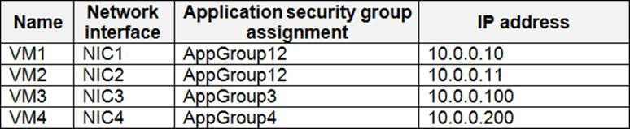
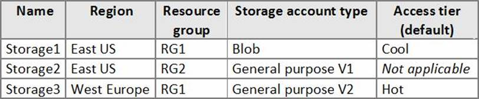
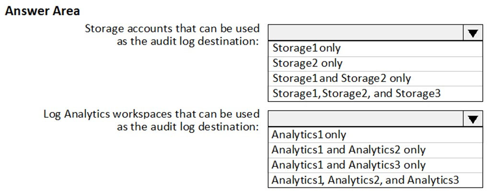

- [ ] Storage accounts that can be used as the audit log destination: Storage1 only. Log Analytics workspaces that can be used as the audio log destination: Analytics1 only.
- [x] Storage accounts that can be used as the audit log destination: Storage1 and Storage2 only. Log Analytics workspaces that can be used as the audio log destination: Analytics1, Analytics2, and Analytics3.
- [ ] Storage accounts that can be used as the audit log destination: Storage1 and Storage2 only. Log Analytics workspaces that can be used as the audio log destination: Analytics1 and Analytics3 only.
- [ ] Storage accounts that can be used as the audit log destination: Storage1, Storage2, and Storage3. Log Analytics workspaces that can be used as the audio log destination: Analytics1 and Analytics3 only.

**[⬆ Back to Top](#table-of-contents)**

### You have an Azure subscription that contains three storage accounts, an Azure SQL managed instance named SQL1, and three Azure SQL databases. The storage accounts are configured as shown in the following table. SQL1 has the following settings: Auditing: On. Audit log destination: storage1. The Azure SQL databases are configured as shown in the following table. Audit events for DB1 are written to storage1.

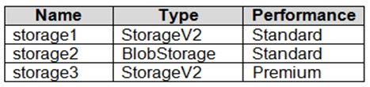
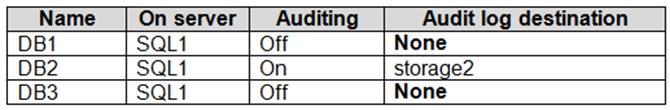

- [x] Yes.
- [ ] No.

**[⬆ Back to Top](#table-of-contents)**

### You have an Azure subscription that contains three storage accounts, an Azure SQL managed instance named SQL1, and three Azure SQL databases. The storage accounts are configured as shown in the following table. SQL1 has the following settings: Auditing: On. Audit log destination: storage1. The Azure SQL databases are configured as shown in the following table. Audit events for DB2 are written to storage1 and storage2.

- [x] Yes.
- [ ] No.

**[⬆ Back to Top](#table-of-contents)**

### You have an Azure subscription that contains three storage accounts, an Azure SQL managed instance named SQL1, and three Azure SQL databases. The storage accounts are configured as shown in the following table. SQL1 has the following settings: Auditing: On. Audit log destination: storage1. The Azure SQL databases are configured as shown in the following table. Storage3 can be used as an audit log destination for DB3.

- [x] Yes.
- [ ] No.

**[⬆ Back to Top](#table-of-contents)**

### You have an Azure subscription named Sub1. Sub1 contains a virtual network named VNet1 that contains one subnet named Subnet1. You create a service endpoint for Subnet1. Subnet1 contains an Azure virtual machine named VM1 that runs Ubuntu Server 18.04. You create a service endpoint for MicrosoftStorage in Subnet1. You need to ensure that when you deploy Docker containers to VM1, the containers can access Azure Storage resources by using the service endpoint. What should you do on VM1 before you deploy the container?

- [ ] Create an application security group and a network security group (NSG).
- [ ] Edit the docker-compose.yml file.
- [x] Install the container network interface (CNI) plug-in.

**[⬆ Back to Top](#table-of-contents)**

### Your Company's Azure subscription includes a virtual network that has a single subnet configured. You have created a service endpoint for the subnet, which includes an Azure virtual machine that has Ubuntu Server 18.04 installed. You are preparing to deploy Docker containers to the virtual machine. You need to make sure that the containers can access Azure Storage resources and Azure SQL databases via the service endpoint. You need to perform a task on the virtual machine prior to deploying containers. Solution: You create an application security group. Does the solution meet the goal?

- [ ] Yes.
- [x] No.

**[⬆ Back to Top](#table-of-contents)**

### Your Company's Azure subscription includes a virtual network that has a single subnet configured. You have created a service endpoint for the subnet, which includes an Azure virtual machine that has Ubuntu Server 18.04 installed. You are preparing to deploy Docker containers to the virtual machine. You need to make sure that the containers can access Azure Storage resources and Azure SQL databases via the service endpoint. You need to perform a task on the virtual machine prior to deploying containers. Solution: You install the container network interface (CNI) plug-in. Does the solution meet the goal?

- [x] Yes.
- [ ] No.

**[⬆ Back to Top](#table-of-contents)**

### Your Company's Azure subscription includes a virtual network that has a single subnet configured. You have created a service endpoint for the subnet, which includes an Azure virtual machine that has Ubuntu Server 18.04 installed. You are preparing to deploy Docker containers to the virtual machine. You need to make sure that the containers can access Azure Storage resources and Azure SQL databases via the service endpoint. You need to perform a task on the virtual machine prior to deploying containers. Solution: You create an AKS Ingress controller. Does the solution meet the goal?

- [ ] Yes.
- [x] No.

**[⬆ Back to Top](#table-of-contents)**

### Your company has an Azure Container Registry. You have been tasked with assigning a user a role that allows for the uploading of images to the Azure Container Registry. The role assigned should not require more privileges than necessary. Which of the following is the role you should assign?

- [ ] Owner.
- [ ] Contributor.
- [x] AcrPush.
- [ ] AcrPull.

**[⬆ Back to Top](#table-of-contents)**

### Your company has an Azure Container Registry.You have been tasked with assigning a user a role that allows for the downloading of images from the Azure Container Registry. The role assigned should not require more privileges than necessary. Which of the following is the role you should assign?

- [ ] Reader.
- [ ] Contributor.
- [ ] AcrDelete.
- [x] AcrPull.

**[⬆ Back to Top](#table-of-contents)**

### You make use of Azure Resource Manager templates to deploy Azure virtual machines. You have been tasked with making sure that Windows features that are not in use, are automatically inactivated when instances of the virtual machines are provisioned. Which of the following actions should you take?

- [ ] You should make use of Azure DevOps.
- [x] You should make use of Azure Automation State Configuration.
- [ ] You should make use of network security groups (NSG).
- [ ] You should make use of Azure Blueprints.

**[⬆ Back to Top](#table-of-contents)**

### Your company's Azure subscription includes Windows Server 2016 Azure virtual machines.You are informed that every virtual machine must have a custom antimalware virtual machine extension installed. You are writing the necessary code for a policy that will help you achieve this. Which of the following is an effect that must be included in your code?

- [ ] Disabled.
- [ ] Modify.
- [ ] AuditIfNotExists.
- [x] DeployIfNotExists.

**[⬆ Back to Top](#table-of-contents)**

### Your company makes use of Azure Active Directory (Azure AD) in a hybrid configuration. All users are making use of hybrid Azure AD joined Windows 10 computers. You manage an Azure SQL database that allows for Azure AD authentication. You need to make sure that database developers are able to connect to the SQL database via Microsoft SQL Server Management Studio (SSMS). You also need to make sure the developers use their on-premises Active Directory account for authentication. Your strategy should allow for authentication prompts to be kept to a minimum. Which of the following is the authentication method the developers should use?

- [ ] Azure AD token.
- [ ] Azure Multi-Factor authentication.
- [x] Active Directory integrated authentication.

**[⬆ Back to Top](#table-of-contents)**

### You have been tasked with enabling Advanced Threat Protection for an Azure SQL Database server. Advanced Threat Protection must be configured to identify all types of threat detection. Which of the following will happen if when a faulty SQL statement is generate in the database by an application?

- [x] Potential SQL injection alert is triggered.
- [ ] Vulnerability to SQL injection alert is triggered.
- [ ] Access from a potentially harmful application alert is triggered.
- [ ] Brute force SQL credentials alert is triggered.

**[⬆ Back to Top](#table-of-contents)**

### You are in the process of creating an Azure Kubernetes Service (AKS) cluster. The Azure Kubernetes Service (AKS) cluster must be able to connect to an Azure Container Registry. You want to make sure that Azure Kubernetes Service (AKS) cluster authenticates to the Azure Container Registry by making use of the auto-generated service principal. Solution: You create an Azure Active Directory (Azure AD) role assignment. Does the solution meet the goal?

- [ ] Yes.
- [x] No.

**[⬆ Back to Top](#table-of-contents)**

### You company has an Azure Active Directory (Azure AD) tenant named contoso.com. You plan to create several security alerts by using Azure Monitor. You need to prepare the Azure subscription for the alerts. What should you create first?

- [ ] Azure Storage account.
- [x] Azure Log Analytics workspace.
- [ ] Azure event hub.
- [ ] Azure Automation account.

**[⬆ Back to Top](#table-of-contents)**

### Litware, Inc. is a digital media company that has 500 employees in the Chicago area and 20 employees in the San Francisco area. Existing Environment Litware has an Azure subscription named Sub1 that has a subscription ID of 43894a43-17c2-4a39-8cfc-3540c2653ef4. Sub1 is associated to an Azure Active Directory (Azure AD) tenant named litwareinc.com. The tenant contains the user objects and the device objects of all the Litware employees and their devices. Each user is assigned an Azure AD Premium P2 license. Azure AD Privileged Identity Management (PIM) isactivated. The tenant contains the groups shown in the following table. The Azure subscription contains the objects shown in the following table. Azure Security Center is set to the Free tier. Planned changes Litware plans to deploy the Azure resources shown in the following table. All San Francisco users and their devices must be members of Group1. The members of Group2 must be assigned the Contributor role to Resource Group2 by using a permanent eligible assignment. Users must be prevented from registering applications in Azure AD and from consenting to applications that access company information on the users' behalf. Microsoft Antimalware must be installed on the virtual machines in Resource Group1. The members of Group2 must be assigned the Azure Kubernetes Service Cluster Admin Role. Azure AD users must be to authenticate to AKS1 by using their Azure AD credentials. Following the implementation of the planned changes, the IT team must be able to connect to VM0 by using JIT VM access. A new custom RBAC role named Role1 must be used to delegate the administration of the managed disks in Resource Group1. Role1 must be available only for Resource Group1. Litware must be able to customize the operating system security configurations in Azure Security Center. The users in Group2 must be able to authenticate to SQLDB1 by using their Azure AD credentials. WebApp1 must enforce mutual authentication. Whenever possible, administrative effort must be minimized. Whenever possible, use of automation must be maximized. You need to deploy AKS1 to meet the platform protection requirements. Which four actions should you perform in sequence?

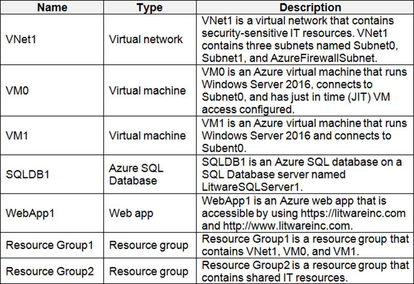

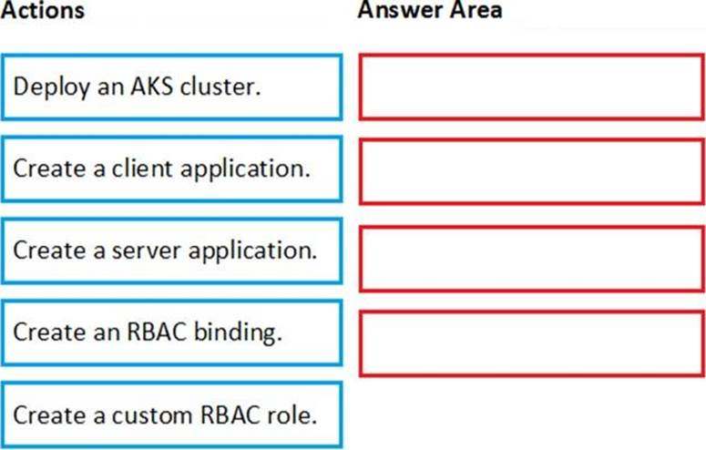

- [ ] Box 1: Create a client application. Box 2: Create an RBAC binding. Box 3: Create a custom RBAC role. Box 4: Create a server application.
- [x] Box 1: Create a server application. Box 2: Create a client application. Box 3: Deploy an AKS cluster. Box 4: Create an RBAC binding.
- [ ] Box 1: Create a server application. Box 2: Create a client application. Box 3: Deploy an AKS cluster. Box 4: Create a custom RBAC role.
- [ ] Box 1: Create a custom RBAC role. Box 2: Create an RBAC binding. Box 3: Create a client application. Box 4: Create a server application.

**[⬆ Back to Top](#table-of-contents)**

### You plan to use Azure Resource Manager templates to perform multiple deployments of identically configured Azure virtual machines. The password for the administrator account of each deployment is stored as a secret in different Azure Key Vaults. You need to identify a method to dynamically construct a resource ID that will designate the key vault containing the appropriate secret during each deployment. The name of the key vault and the name of the secret will be provided as inline parameters. What should you use to construct the resource ID?

- [ ] Key vault access policy.
- [x] Linked template.
- [ ] Parameters file.
- [ ] Automation account.

**[⬆ Back to Top](#table-of-contents)**

### You have an Azure subscription that contains the virtual machines shown in the following table. Subnet1 and Subnet2 have a Microsoft.Storage service endpoint configured. You have an Azure Storage account named storageacc1 that is configured as shown in the following exhibit. From VM1, you can upload a blob to storageacc1.

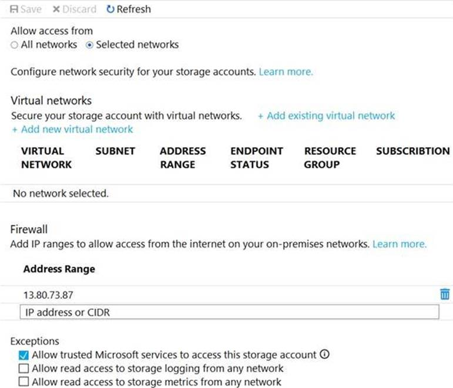

- [x] Yes.
- [ ] No.

**[⬆ Back to Top](#table-of-contents)**

### You have an Azure subscription that contains the virtual machines shown in the following table. Subnet1 and Subnet2 have a Microsoft.Storage service endpoint configured. You have an Azure Storage account named storageacc1 that is configured as shown in the following exhibit. From VM2, you can upload a blob to storageacc1.

- [ ] Yes.
- [x] No.

**[⬆ Back to Top](#table-of-contents)**

### You have an Azure subscription that contains the virtual machines shown in the following table. Subnet1 and Subnet2 have a Microsoft.Storage service endpoint configured. You have an Azure Storage account named storageacc1 that is configured as shown in the following exhibit. From VM3, you can upload a blob to storageacc1.

- [ ] Yes.
- [x] No.

**[⬆ Back to Top](#table-of-contents)**

### You have an Azure subscription named Sub1 that contains the Azure Key Vaults shown in the following table. In Sub1, you create a virtual machine that has the following configurations: Name: VM1. Size: DS2v2. Resource group: RG1. Region: West Europe. Operating system: Windows Server 2016. You plan to enable Azure Disk Encryption on VM1. In which key vaults can you store the encryption key for VM1?

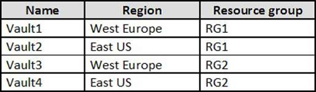

- [x] Vault1 or Vault3 only.
- [ ] Vault1, Vault2, Vault3, or Vault4.
- [ ] Vault1 only.
- [ ] Vault1 or Vault2 only.

**[⬆ Back to Top](#table-of-contents)**

### You have an Azure Subscription named Sub1. Sub1 contains an Azure virtual machine named VM1 that runs Windows Server 2016. You need to encrypt VM1 disks by using Azure Disk Encryption. Which three actions should you perform in sequence?

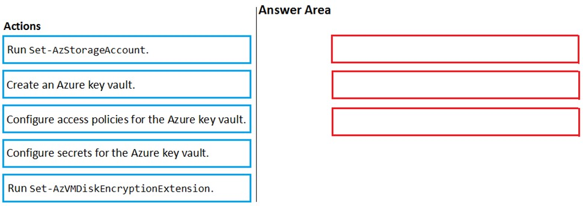

- [x] Box 1: Create an Azure Key Vault. Box 2: Configure access policies for the Azure Key Vault. Box 3: Run Set-AzureRmVmDiskEncryptiomExtension.
- [ ] Box 1: Configure secrets for the Azure Key Vault. Box 2: Configure access policies for the Azure Key Vault. Box 3: Run Set-AzureRmVmDiskEncryptiomExtension.
- [ ] Box 1: Create an Azure Key Vault. Box 2: Configure secrets for the Azure Key Vault. Box 3: Run Set-AzureRmStorageAccount.
- [ ] Box 1: Create an Azure Key Vault. Box 2: Run Set-AzureRmStorageAccount. Box 3: Configure secrets for the Azure Key Vault.

**[⬆ Back to Top](#table-of-contents)**

### Contoso, Ltd. is a consulting company that has a main office in Montreal and two branch offices in Seattle and New York. The company hosts its entire server infrastructure in Azure. Contoso has two Azure subscriptions named Sub1 and Sub2. Both subscriptions are associated to an Azure Active Directory (Azure AD) tenant named contoso.com. Contoso identifies the following technical requirements: Deploy Azure Firewall to VNetwork1 in Sub2. Register an application named App2 in contoso.com. Whenever possible, use the principle of least privilege. Enable Azure AD Privileged Identity Management (PIM) for contoso.com. Contoso.com contains the users shown in the following table. Contoso.com contains the security groups shown in the following table. Sub1 contains six resource groups named RG1, RG2, RG3, RG4, RG5, and RG6. User9 creates the virtual networks shown in the following table. Sub1 contains the locks shown in the following table. Sub1 contains the Azure policies shown in the following table. Sub2 contains the virtual networks shown in the following table. Sub2 contains the virtual machines shown in the following table. All virtual machines have the public IP addresses and the Web Server (IIS) role installed. The firewalls for each virtual machine allow ping requests and web requests. Sub2 contains the network security groups (NSGs) shown in the following table. NSG1 has the inbound security rules shown in the following table. NSG2 has the inbound security rules shown in the following table. NSG3 has the inbound security rules shown in the following table. NSG4 has the inbound security rules shown in the following table. NSG1, NSG2, NSG3, and NSG4 have the outbound security rules shown in the following table. You are evaluating the security of the network communication between the virtual machines in Sub2. From VM1, you can successfully ping the public IP address of VM2.

- [x] Yes.
- [ ] No.

**[⬆ Back to Top](#table-of-contents)**

### Contoso, Ltd. is a consulting company that has a main office in Montreal and two branch offices in Seattle and New York. The company hosts its entire server infrastructure in Azure. Contoso has two Azure subscriptions named Sub1 and Sub2. Both subscriptions are associated to an Azure Active Directory (Azure AD) tenant named contoso.com. Contoso identifies the following technical requirements: Deploy Azure Firewall to VNetwork1 in Sub2. Register an application named App2 in contoso.com. Whenever possible, use the principle of least privilege. Enable Azure AD Privileged Identity Management (PIM) for contoso.com. Contoso.com contains the users shown in the following table. Contoso.com contains the security groups shown in the following table. Sub1 contains six resource groups named RG1, RG2, RG3, RG4, RG5, and RG6. User9 creates the virtual networks shown in the following table. Sub1 contains the locks shown in the following table. Sub1 contains the Azure policies shown in the following table. Sub2 contains the virtual networks shown in the following table. Sub2 contains the virtual machines shown in the following table. All virtual machines have the public IP addresses and the Web Server (IIS) role installed. The firewalls for each virtual machine allow ping requests and web requests. Sub2 contains the network security groups (NSGs) shown in the following table. NSG1 has the inbound security rules shown in the following table. NSG2 has the inbound security rules shown in the following table. NSG3 has the inbound security rules shown in the following table. NSG4 has the inbound security rules shown in the following table. NSG1, NSG2, NSG3, and NSG4 have the outbound security rules shown in the following table. You are evaluating the security of VM1, VM2, and VM3 in Sub2. From the Internet, you can connect to the web server on VM2 by using HTTP.

- [ ] Yes.
- [x] No.

**[⬆ Back to Top](#table-of-contents)**

### Contoso, Ltd. is a consulting company that has a main office in Montreal and two branch offices in Seattle and New York. The company hosts its entire server infrastructure in Azure. Contoso has two Azure subscriptions named Sub1 and Sub2. Both subscriptions are associated to an Azure Active Directory (Azure AD) tenant named contoso.com. Contoso identifies the following technical requirements: Deploy Azure Firewall to VNetwork1 in Sub2. Register an application named App2 in contoso.com. Whenever possible, use the principle of least privilege. Enable Azure AD Privileged Identity Management (PIM) for contoso.com. Contoso.com contains the users shown in the following table. Contoso.com contains the security groups shown in the following table. Sub1 contains six resource groups named RG1, RG2, RG3, RG4, RG5, and RG6. User9 creates the virtual networks shown in the following table. Sub1 contains the locks shown in the following table. Sub1 contains the Azure policies shown in the following table. Sub2 contains the virtual networks shown in the following table. Sub2 contains the virtual machines shown in the following table. All virtual machines have the public IP addresses and the Web Server (IIS) role installed. The firewalls for each virtual machine allow ping requests and web requests. Sub2 contains the network security groups (NSGs) shown in the following table. NSG1 has the inbound security rules shown in the following table. NSG2 has the inbound security rules shown in the following table. NSG3 has the inbound security rules shown in the following table. NSG4 has the inbound security rules shown in the following table. NSG1, NSG2, NSG3, and NSG4 have the outbound security rules shown in the following table. You are evaluating the security of VM1, VM2, and VM3 in Sub2. From the Internet, you can connect to the web server on VM3 by using HTTP.

- [x] Yes.
- [ ] No.

**[⬆ Back to Top](#table-of-contents)**

### Litware, Inc. is a digital media company that has 500 employees in the Chicago area and 20 employees in the San Francisco area. Existing Environment Litware has an Azure subscription named Sub1 that has a subscription ID of 43894a43-17c2-4a39-8cfc-3540c2653ef4. Sub1 is associated to an Azure Active Directory (Azure AD) tenant named litwareinc.com. The tenant contains the user objects and the device objects of all the Litware employees and their devices. Each user is assigned an Azure AD Premium P2 license. Azure AD Privileged Identity Management (PIM) isactivated. The tenant contains the groups shown in the following table. The Azure subscription contains the objects shown in the following table. Azure Security Center is set to the Free tier. Planned changes Litware plans to deploy the Azure resources shown in the following table. All San Francisco users and their devices must be members of Group1. The members of Group2 must be assigned the Contributor role to Resource Group2 by using a permanent eligible assignment. Users must be prevented from registering applications in Azure AD and from consenting to applications that access company information on the users' behalf. Microsoft Antimalware must be installed on the virtual machines in Resource Group1. The members of Group2 must be assigned the Azure Kubernetes Service Cluster Admin Role. Azure AD users must be to authenticate to AKS1 by using their Azure AD credentials. Following the implementation of the planned changes, the IT team must be able to connect to VM0 by using JIT VM access. A new custom RBAC role named Role1 must be used to delegate the administration of the managed disks in Resource Group1. Role1 must be available only for Resource Group1. Litware must be able to customize the operating system security configurations in Azure Security Center. The users in Group2 must be able to authenticate to SQLDB1 by using their Azure AD credentials. WebApp1 must enforce mutual authentication. Whenever possible, administrative effort must be minimized. Whenever possible, use of automation must be maximized. You need to configure SQLDB1 to meet the data and application requirements. Which three actions should you recommend be performed in sequence?

- [ ] Box 1: From the Azure portal, create an Azure AD administrator for LitwareSQLServer1. Box 2: In SQLDB1, create contained database users. Box 3: Connect to SQLDB1 by using Microsoft SQL Server Management Studio (SSMS).
- [ ] Box 1: From the Azure portal, create a managed identity. Box 2: From the Azure portal, create an Azure AD administrator for LitwareSQLServer1. Box 3: In Azure AD, enable authentication method policy.
- [ ] Box 1: In Azure AD, enable authentication method policy. Box 2: From the Azure portal, create a managed identity. Box 3: Connect to SQLDB1 by using Microsoft SQL Server Management Studio (SSMS).
- [x] Box 1: From the Azure portal, create an Azure AD administrator for LitwareSQLServer1. Box 2: Connect to SQLDB1 by using Microsoft SQL Server Management Studio (SSMS). Box 3: In SQLDB1, create contained database users.

**[⬆ Back to Top](#table-of-contents)**

### You have a hybrid configuration of Azure Active Directory (Azure AD). You have an Azure HDInsight cluster on a virtual network. You plan to allow users to authenticate to the cluster by using their on-premises Active Directory credentials. You need to configure the environment to support the planned authentication. Solution: You deploy Azure Active Directory Domain Services (Azure AD DS) to the Azure subscription. Does this meet the goal?

- [x] Yes.
- [ ] No.

**[⬆ Back to Top](#table-of-contents)**

### You have a hybrid configuration of Azure Active Directory (AzureAD). You have an Azure HDInsight cluster on a virtual network. You plan to allow users to authenticate to the cluster by using their on-premises Active Directory credentials. You need to configure the environment to support the planned authentication. Solution: You create a site-to-site VPN between the virtual network and the on-premises network. Does this meet the goal?

- [ ] Yes.
- [x] No.

**[⬆ Back to Top](#table-of-contents)**

### You have a hybrid configuration of Azure Active Directory (AzureAD). You have an Azure HDInsight cluster on a virtual network. You plan to allow users to authenticate to the cluster by using their on-premises Active Directory credentials. You need to configure the environment to support the planned authentication. Solution: You deploy the On-premises data gateway to the on-premises network. Does this meet the goal?

- [ ] Yes.
- [x] No.

**[⬆ Back to Top](#table-of-contents)**

### You have a hybrid configuration of Azure Active Directory (Azure AD). You have an Azure HDInsight cluster on a virtual network. You plan to allow users to authenticate to the cluster by using their on-premises Active Directory credentials. You need to configure the environment to support the planned authentication. Solution: You deploy an Azure AD Application Proxy. Does this meet the goal?

- [ ] Yes.
- [x] No.

**[⬆ Back to Top](#table-of-contents)**

### You have an Azure subscription named Sub1 that is associated to an Azure Active Directory (Azure AD) tenant named contoso.com. An administrator named Admin1 has access to the following identities: An OpenID-enabled user account. A Hotmail account. An account in contoso.com. An account in an Azure AD tenant named fabrikam.com. You plan to use Azure Account Center to transfer the ownership of Sub1 to Admin1. To which accounts can you transfer the ownership of Sub1?

- [ ] contoso.com only.
- [ ] contoso.com, fabrikam.com, and Hotmail only.
- [x] contoso.com and fabrikam.com only.
- [ ] contoso.com, fabrikam.com, Hotmail, and OpenID-enabled user account.

**[⬆ Back to Top](#table-of-contents)**

### You have an Azure subscription named Sub1. You create a virtual network that contains one subnet. On the subnet, you provision the virtual machines shown in the following table. Currently, you have not provisioned any network security groups (NSGs). You need to implement network security to meet the following requirements: Allow traffic to VM4 from VM3 only. Allow traffic from the Internet to VM1 and VM2 only. Minimize the number of NSGs and network security rules. How many NSGs and network security rules should you create?

- [x] NSGs: 1. Network security rules: 3.
- [ ] NSGs: 2. Network security rules: 3.
- [ ] NSGs: 3. Network security rules: 2.
- [ ] NSGs: 4. Network security rules: 4.

**[⬆ Back to Top](#table-of-contents)**

### You have an Azure Active Directory (Azure AD) tenant that contains the users shown in the following table. In Azure AD Privileged Identity Management (PIM), the Role settings for the Contributor role are configured as shown in the exhibit. You assign users the Contributor role on May 1, 2019 as shown in the following table. On May 15, 2019, User1 can activate the Contributor role.

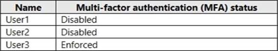
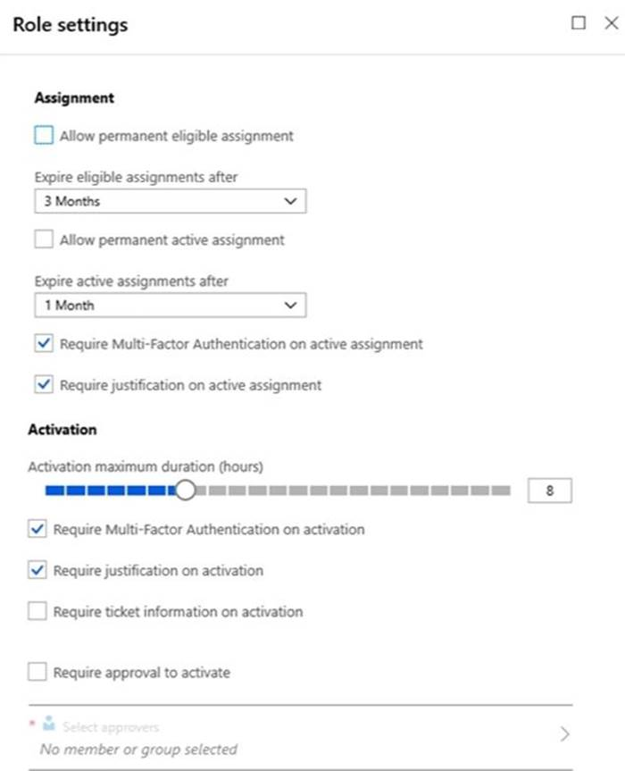
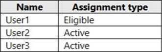

- [x] Yes.
- [ ] No.

**[⬆ Back to Top](#table-of-contents)**

### You have an Azure Active Directory (Azure AD) tenant that contains the users shown in the following table. In Azure AD Privileged Identity Management (PIM), the Role settings for the Contributor role are configured as shown in the exhibit. You assign users the Contributor role on May 1, 2019 as shown in the following table. On May 15, 2019, User2 can use the Contributor role.

- [x] Yes.
- [ ] No.

**[⬆ Back to Top](#table-of-contents)**

### You have an Azure Active Directory (Azure AD) tenant that contains the users shown in the following table. In Azure AD Privileged Identity Management (PIM), the Role settings for the Contributor role are configured as shown in the exhibit. You assign users the Contributor role on May 1, 2019 as shown in the following table. On June 15, 2019, User3 can activate the Contributor role.

- [ ] Yes.
- [x] No.

**[⬆ Back to Top](#table-of-contents)**

### You have an Azure subscription that contains a web app named App1 and an Azure key vault named Vault1. You need to configure App1 to store and access the secrets in Vault1. How should you configure App1?

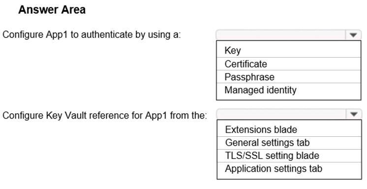

- [ ] Configure App1 to authenticate by using a: Key. Configure a Key Vault reference foe App1 from the: Extensions blade.
- [ ] Configure App1 to authenticate by using a: Certificate. Configure a Key Vault reference foe App1 from the: General settings tab.
- [ ] Configure App1 to authenticate by using a: Passphrase. Configure a Key Vault reference foe App1 from the: TLS/SSL settings blade.
- [x] Configure App1 to authenticate by using a: Managed identity. Configure a Key Vault reference foe App1 from the: Application settings tab.

**[⬆ Back to Top](#table-of-contents)**

### You have an Azure subscription that contains an app named App1. App1 has the app registration shown in the following table. You need to ensure that App1 can read all user calendars and create appointments. The solution must use the principle of least privilege. What should you do?

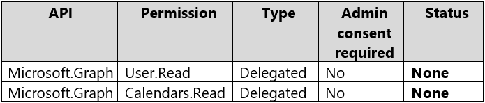

- [ ] Add a new Delegated API permission for Microsoft.Graph Calendars.ReadWrite.
- [x] Add a new Application API permission for Microsoft.Graph Calendars.ReadWrite.
- [ ] Select Grant admin consent.
- [ ] Add a new Delegated API permission for Microsoft.Graph Calendars.ReadWrite.Shared.

**[⬆ Back to Top](#table-of-contents)**

### You have an Azure subscription that contains the Azure virtual machines shown in the following table. You create an MDM Security Baseline profile named Profile1. You need to identify to which virtual machines Profile1 can be applied. Which virtual machines should you identify?

- [x] VM1 only.
- [ ] VM1, VM2, and VM3 only.
- [ ] VM1 and VM3 only.
- [ ] VM1, VM2, VM3, and VM4.

**[⬆ Back to Top](#table-of-contents)**

### Litware, Inc. is a digital media company that has 500 employees in the Chicago area and 20 employees in the San Francisco area. Existing Environment Litware has an Azure subscription named Sub1 that has a subscription ID of 43894a43-17c2-4a39-8cfc-3540c2653ef4. Sub1 is associated to an Azure Active Directory (Azure AD) tenant named litwareinc.com. The tenant contains the user objects and the device objects of all the Litware employees and their devices. Each user is assigned an Azure AD Premium P2 license. Azure AD Privileged Identity Management (PIM) isactivated. The tenant contains the groups shown in the following table. The Azure subscription contains the objects shown in the following table. Azure Security Center is set to the Free tier. Planned changes Litware plans to deploy the Azure resources shown in the following table. All San Francisco users and their devices must be members of Group1. The members of Group2 must be assigned the Contributor role to Resource Group2 by using a permanent eligible assignment. Users must be prevented from registering applications in Azure AD and from consenting to applications that access company information on the users' behalf. Microsoft Antimalware must be installed on the virtual machines in Resource Group1. The members of Group2 must be assigned the Azure Kubernetes Service Cluster Admin Role. Azure AD users must be to authenticate to AKS1 by using their Azure AD credentials. Following the implementation of the planned changes, the IT team must be able to connect to VM0 by using JIT VM access. A new custom RBAC role named Role1 must be used to delegate the administration of the managed disks in Resource Group1. Role1 must be available only for Resource Group1. Litware must be able to customize the operating system security configurations in Azure Security Center. The users in Group2 must be able to authenticate to SQLDB1 by using their Azure AD credentials. WebApp1 must enforce mutual authentication. Whenever possible, administrative effort must be minimized. Whenever possible, use of automation must be maximized. You need to create Role1 to meet the platform protection requirements. How should you complete the role definition of Role1?

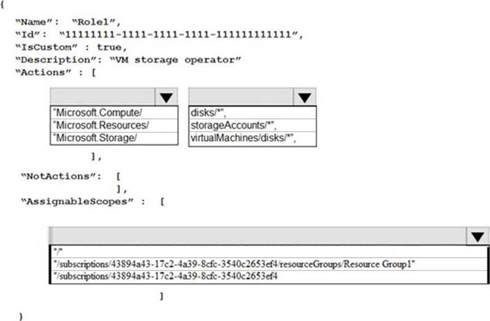

- [ ] Box 1: 'Microsoft.Compute/. Box 2: disks/*',. Box 3: '/subscription/43894a43-17c2-4a39-8cfc-3540c2653ef4/resourceGroups/RG1'.
- [ ] Box 1: 'Microsoft.Resources/ Box 2: storageAccounts/*',. Box 3: /subscription/43894a43-17c2-4a39-8cfc-3540c2653ef4.
- [ ] Box 1: 'Microsoft.Storage/. Box 2: virtualMachines/disks/*',. Box 3: '/' .
- [x] Box 1: 'Microsoft.Compute/. Box 2: disks/*',. Box 3: '/subscription/43894a43-17c2-4a39-8cfc-3540c2653ef4/resourceGroups/RG1'.

**[⬆ Back to Top](#table-of-contents)**

### Litware, Inc. is a digital media company that has 500 employees in the Chicago area and 20 employees in the San Francisco area. Existing Environment Litware has an Azure subscription named Sub1 that has a subscription ID of 43894a43-17c2-4a39-8cfc-3540c2653ef4. Sub1 is associated to an Azure Active Directory (Azure AD) tenant named litwareinc.com. The tenant contains the user objects and the device objects of all the Litware employees and their devices. Each user is assigned an Azure AD Premium P2 license. Azure AD Privileged Identity Management (PIM) isactivated. The tenant contains the groups shown in the following table. The Azure subscription contains the objects shown in the following table. Azure Security Center is set to the Free tier. Planned changes Litware plans to deploy the Azure resources shown in the following table. All San Francisco users and their devices must be members of Group1. The members of Group2 must be assigned the Contributor role to Resource Group2 by using a permanent eligible assignment. Users must be prevented from registering applications in Azure AD and from consenting to applications that access company information on the users' behalf. Microsoft Antimalware must be installed on the virtual machines in Resource Group1. The members of Group2 must be assigned the Azure Kubernetes Service Cluster Admin Role. Azure AD users must be to authenticate to AKS1 by using their Azure AD credentials. Following the implementation of the planned changes, the IT team must be able to connect to VM0 by using JIT VM access. A new custom RBAC role named Role1 must be used to delegate the administration of the managed disks in Resource Group1. Role1 must be available only for Resource Group1. Litware must be able to customize the operating system security configurations in Azure Security Center. The users in Group2 must be able to authenticate to SQLDB1 by using their Azure AD credentials. WebApp1 must enforce mutual authentication. Whenever possible, administrative effort must be minimized. Whenever possible, use of automation must be maximized. You need to meet the identity and access requirements for Group1. What should you use?

- [ ] Add a membership rule to Group1.
- [x] Delete Group1. Create a new group named Group1 that has a membership type of Office 365. Add users and devices to the group.
- [ ] Modify the membership rule of Group1.
- [ ] Change the membership type of Group1 to Assigned. Create two groups that have dynamic memberships. Add the new groups to Group1.

**[⬆ Back to Top](#table-of-contents)**

### Litware, Inc. is a digital media company that has 500 employees in the Chicago area and 20 employees in the San Francisco area. Existing Environment Litware has an Azure subscription named Sub1 that has a subscription ID of 43894a43-17c2-4a39-8cfc-3540c2653ef4. Sub1 is associated to an Azure Active Directory (Azure AD) tenant named litwareinc.com. The tenant contains the user objects and the device objects of all the Litware employees and their devices. Each user is assigned an Azure AD Premium P2 license. Azure AD Privileged Identity Management (PIM) isactivated. The tenant contains the groups shown in the following table. The Azure subscription contains the objects shown in the following table. Azure Security Center is set to the Free tier. Planned changes Litware plans to deploy the Azure resources shown in the following table. All San Francisco users and their devices must be members of Group1. The members of Group2 must be assigned the Contributor role to Resource Group2 by using a permanent eligible assignment. Users must be prevented from registering applications in Azure AD and from consenting to applications that access company information on the users' behalf. Microsoft Antimalware must be installed on the virtual machines in Resource Group1. The members of Group2 must be assigned the Azure Kubernetes Service Cluster Admin Role. Azure AD users must be to authenticate to AKS1 by using their Azure AD credentials. Following the implementation of the planned changes, the IT team must be able to connect to VM0 by using JIT VM access. A new custom RBAC role named Role1 must be used to delegate the administration of the managed disks in Resource Group1. Role1 must be available only for Resource Group1. Litware must be able to customize the operating system security configurations in Azure Security Center. The users in Group2 must be able to authenticate to SQLDB1 by using their Azure AD credentials. WebApp1 must enforce mutual authentication. Whenever possible, administrative effort must be minimized. Whenever possible, use of automation must be maximized. You need to ensure that users can access VM0. The solution must meet the platform protection requirements. What should you do?

- [x] Move VM0 to Subnet1.
- [ ] On Firewall, configure a network traffic filtering rule.
- [ ] Assign RT1 to AzureFirewallSubnet.
- [ ] On Firewall, configure a DNAT rule.

**[⬆ Back to Top](#table-of-contents)**

### Litware, Inc. is a digital media company that has 500 employees in the Chicago area and 20 employees in the San Francisco area. Existing Environment Litware has an Azure subscription named Sub1 that has a subscription ID of 43894a43-17c2-4a39-8cfc-3540c2653ef4. Sub1 is associated to an Azure Active Directory (Azure AD) tenant named litwareinc.com. The tenant contains the user objects and the device objects of all the Litware employees and their devices. Each user is assigned an Azure AD Premium P2 license. Azure AD Privileged Identity Management (PIM) isactivated. The tenant contains the groups shown in the following table. The Azure subscription contains the objects shown in the following table. Azure Security Center is set to the Free tier. Planned changes Litware plans to deploy the Azure resources shown in the following table. All San Francisco users and their devices must be members of Group1. The members of Group2 must be assigned the Contributor role to Resource Group2 by using a permanent eligible assignment. Users must be prevented from registering applications in Azure AD and from consenting to applications that access company information on the users' behalf. Microsoft Antimalware must be installed on the virtual machines in Resource Group1. The members of Group2 must be assigned the Azure Kubernetes Service Cluster Admin Role. Azure AD users must be to authenticate to AKS1 by using their Azure AD credentials. Following the implementation of the planned changes, the IT team must be able to connect to VM0 by using JIT VM access. A new custom RBAC role named Role1 must be used to delegate the administration of the managed disks in Resource Group1. Role1 must be available only for Resource Group1. Litware must be able to customize the operating system security configurations in Azure Security Center. The users in Group2 must be able to authenticate to SQLDB1 by using their Azure AD credentials. WebApp1 must enforce mutual authentication. Whenever possible, administrative effort must be minimized. Whenever possible, use of automation must be maximized. You need to ensure that the Azure AD application registration and consent configurations meet the identity and access requirements. What should you use in the Azure portal?

- [x] To configure the registration settings: Azure AD - User settings. To configure the consent settings: Enterprise Applications - User settings.
- [ ] To configure the registration settings: App registrations settings To configure the consent settings: Azure AD - User settings.
- [ ] To configure the registration settings: Enterprise Applications - User settings. To configure the consent settings: Azure AD - App registrations settings.
- [ ] To configure the registration settings: Azure AD - User settings. To configure the consent settings: Azure AD - App registrations settings.

**[⬆ Back to Top](#table-of-contents)**

### Litware, Inc. is a digital media company that has 500 employees in the Chicago area and 20 employees in the San Francisco area. Existing Environment Litware has an Azure subscription named Sub1 that has a subscription ID of 43894a43-17c2-4a39-8cfc-3540c2653ef4. Sub1 is associated to an Azure Active Directory (Azure AD) tenant named litwareinc.com. The tenant contains the user objects and the device objects of all the Litware employees and their devices. Each user is assigned an Azure AD Premium P2 license. Azure AD Privileged Identity Management (PIM) isactivated. The tenant contains the groups shown in the following table. The Azure subscription contains the objects shown in the following table. Azure Security Center is set to the Free tier. Planned changes Litware plans to deploy the Azure resources shown in the following table. All San Francisco users and their devices must be members of Group1. The members of Group2 must be assigned the Contributor role to Resource Group2 by using a permanent eligible assignment. Users must be prevented from registering applications in Azure AD and from consenting to applications that access company information on the users' behalf. Microsoft Antimalware must be installed on the virtual machines in Resource Group1. The members of Group2 must be assigned the Azure Kubernetes Service Cluster Admin Role. Azure AD users must be to authenticate to AKS1 by using their Azure AD credentials. Following the implementation of the planned changes, the IT team must be able to connect to VM0 by using JIT VM access. A new custom RBAC role named Role1 must be used to delegate the administration of the managed disks in Resource Group1. Role1 must be available only for Resource Group1. Litware must be able to customize the operating system security configurations in Azure Security Center. The users in Group2 must be able to authenticate to SQLDB1 by using their Azure AD credentials. WebApp1 must enforce mutual authentication. Whenever possible, administrative effort must be minimized. Whenever possible, use of automation must be maximized. You need to ensure that you can meet the security operations requirements. What should you do first?

- [ ] Turn on Auto Provisioning in Security Center.
- [ ] Integrate Security Center and Microsoft Cloud App Security.
- [ ] Upgrade the pricing tier of Security Center to Standard.
- [x] Modify the Security Center workspace configuration.

**[⬆ Back to Top](#table-of-contents)**

### Litware, Inc. is a digital media company that has 500 employees in the Chicago area and 20 employees in the San Francisco area. Existing Environment Litware has an Azure subscription named Sub1 that has a subscription ID of 43894a43-17c2-4a39-8cfc-3540c2653ef4. Sub1 is associated to an Azure Active Directory (Azure AD) tenant named litwareinc.com. The tenant contains the user objects and the device objects of all the Litware employees and their devices. Each user is assigned an Azure AD Premium P2 license. Azure AD Privileged Identity Management (PIM) isactivated. The tenant contains the groups shown in the following table. The Azure subscription contains the objects shown in the following table. Azure Security Center is set to the Free tier. Planned changes Litware plans to deploy the Azure resources shown in the following table. All San Francisco users and their devices must be members of Group1. The members of Group2 must be assigned the Contributor role to Resource Group2 by using a permanent eligible assignment. Users must be prevented from registering applications in Azure AD and from consenting to applications that access company information on the users' behalf. Microsoft Antimalware must be installed on the virtual machines in Resource Group1. The members of Group2 must be assigned the Azure Kubernetes Service Cluster Admin Role. Azure AD users must be to authenticate to AKS1 by using their Azure AD credentials. Following the implementation of the planned changes, the IT team must be able to connect to VM0 by using JIT VM access. A new custom RBAC role named Role1 must be used to delegate the administration of the managed disks in Resource Group1. Role1 must be available only for Resource Group1. Litware must be able to customize the operating system security configurations in Azure Security Center. The users in Group2 must be able to authenticate to SQLDB1 by using their Azure AD credentials. WebApp1 must enforce mutual authentication. Whenever possible, administrative effort must be minimized. Whenever possible, use of automation must be maximized. You need to configure WebApp1 to meet the data and application requirements. Which two actions should you perform?

- [ ] Upload a public certificate.
- [x] Turn on the HTTPS Only protocol setting.
- [ ] Set the Minimum TLS Version protocol setting to 1.2.
- [ ] Change the pricing tier of the App Service plan.
- [x] Turn on the Incoming client certificates protocol setting.

**[⬆ Back to Top](#table-of-contents)**

### You have an Azure subscription that contains the virtual machines shown in the following table. From Azure Security Center, you turn on Auto Provisioning. You deploy the virtual machines shown in the following table. On which virtual machines is the Microsoft Monitoring agent installed?

- [ ] VM3 only.
- [ ] VM1 and VM3 only.
- [ ] VM3 and VM4 only.
- [x] VM1, VM2, VM3, and VM4.

**[⬆ Back to Top](#table-of-contents)**

### You have an Azure subscription that contains four Azure SQL managed instances. You need to evaluate the vulnerability of the managed instances to SQL injection attacks. What should you do first?

- [ ] Create an Azure Sentinel workspace.
- [x] Enable Advanced Data Security.
- [ ] Add the SQL Health Check solution to Azure Monitor.
- [ ] Create an Azure Advanced Threat Protection (ATP) instance.

**[⬆ Back to Top](#table-of-contents)**

### You have an app that uses an Azure SQL database. You need to be notified if a SQL injection attack is launched against the database. What should you do?

- [ ] Modify the Diagnostics settings for the database.
- [ ] Deploy the SQL Health Check solution in Azure Monitor.
- [x] Enable Azure Defender for SQL for the database.
- [ ] Enable server-level auditing for the database.

**[⬆ Back to Top](#table-of-contents)**

### You have an Azure subscription that contains a storage account named storage1 and several virtual machines. The storage account and virtual machines are in the same Azure region. The network configurations of the virtual machines are shown in the following table. The virtual network subnets have service endpoints defined as shown in the following table. You configure the following Firewall and virtual networks settings for storage1: Allow access from: Selected networks. Virtual networks: VNET3\Subnet3. Firewall Address range: 52.233.129.0/24. VM1 can connect to storage1.

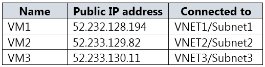
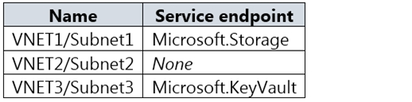

- [ ] Yes.
- [x] No.

**[⬆ Back to Top](#table-of-contents)**

### You have an Azure subscription that contains a storage account named storage1 and several virtual machines. The storage account and virtual machines are in the same Azure region. The network configurations of the virtual machines are shown in the following table. The virtual network subnets have service endpoints defined as shown in the following table. You configure the following Firewall and virtual networks settings for storage1: Allow access from: Selected networks. Virtual networks: VNET3\Subnet3. Firewall Address range: 52.233.129.0/24. VM2 can connect to storage1.

- [x] Yes.
- [ ] No.

**[⬆ Back to Top](#table-of-contents)**

### You have an Azure subscription that contains a storage account named storage1 and several virtual machines. The storage account and virtual machines are in the same Azure region. The network configurations of the virtual machines are shown in the following table. The virtual network subnets have service endpoints defined as shown in the following table. You configure the following Firewall and virtual networks settings for storage1: Allow access from: Selected networks. Virtual networks: VNET3\Subnet3. Firewall Address range: 52.233.129.0/24. VM3 can connect to storage1.

- [ ] Yes.
- [x] No.

**[⬆ Back to Top](#table-of-contents)**

### You need to create an Azure Key Vault. The solution must ensure that any object deleted from the key vault be retained for 90 days. How should you complete the command?

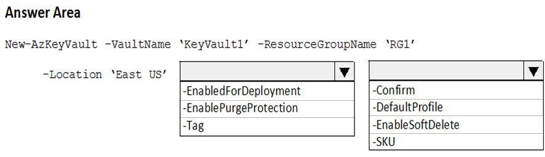

- [ ] Box 1: -EnableForDeployment. Box 2: -Confirm.
- [x] Box 1: -EnablePurgeProtection. Box 2: -EnableSoftDelete.
- [ ] Box 1: -Tag. Box 2: -DefaultProfile.
- [ ] Box 1: -EnableForDeployment. Box 2: -SKU.

**[⬆ Back to Top](#table-of-contents)**

### You are troubleshooting a security issue for an Azure Storage account. You enable the diagnostic logs for the storage account. What should you use to retrieve the diagnostics logs?

- [x] Azure Storage Explorer.
- [ ] SQL query editor in Azure.
- [ ] File Explorer in Windows.
- [ ] Azure Security Center.

**[⬆ Back to Top](#table-of-contents)**

### Fabrikam, Inc. is a consulting company that has a main office in Montreal and branch offices in Seattle and New York. Fabrikam has IT, human resources (HR), and finance departments. Fabrikam has a Microsoft 365 subscription and an Azure subscription named subscription1. The network contains an on-premises Active Directory domain named Fabrikam.com. The domain contains two organizational units (OUs) named OU1 and OU2. Azure AD Connect cloud sync syncs only OU1. The Azure resources hierarchy is shown in the following exhibit. The Azure Active Directory (Azure AD) tenant contains the users shown in the following table. Azure AD contains the resources shown in the following table. Subscription1 contains the virtual networks shown in the following table. Subscription1 contains the network security groups (NSGs) shown in the following table. Subscription1 contains the virtual machines shown in the following table. Subscription1 contains the Azure Key Vaults shown in the following table. Subscription1 contains a storage account named storage1 in the West US Azure region. Fabrikam plans to implement the following changes: Create two application security groups as shown in the following table. Associate the network interface of VM1 to ASG1. Deploy SecPol1 by using Azure Security Center. Deploy a third-party app named App1. A version of App1 exists for all available operating systems. Create a resource group named RG2. Sync OU2 to Azure AD. Add User1 to Group1. Fabrikam identifies the following technical requirements: The finance department users must reauthenticate after three hours when they access SharePoint Online. Storage1 must be encrypted by using customer-managed keys and automatic key rotation. From Sentinel1, you must ensure that the following notebooks can be launched: Entity Explorer – Account. Entity Explorer – Windows Host. Guided Investigation Process Alerts. VM1, VM2, and VM3 must be encrypted by using Azure Disk Encryption. Just in time (JIT) VM access for VM1, VM2, and VM3 must be enabled. App1 must use a secure connection string stored in KeyVault1. KeyVault1 traffic must NOT travel over the internet. You need to meet the technical requirements for the finance department users. Which CAPolicy1 settings should you modify?

- [ ] Cloud apps or actions.
- [ ] Conditions.
- [ ] Grant.
- [x] Session.

**[⬆ Back to Top](#table-of-contents)**

### Fabrikam, Inc. is a consulting company that has a main office in Montreal and branch offices in Seattle and New York. Fabrikam has IT, human resources (HR), and finance departments. Fabrikam has a Microsoft 365 subscription and an Azure subscription named subscription1. The network contains an on-premises Active Directory domain named Fabrikam.com. The domain contains two organizational units (OUs) named OU1 and OU2. Azure AD Connect cloud sync syncs only OU1. The Azure resources hierarchy is shown in the following exhibit. The Azure Active Directory (Azure AD) tenant contains the users shown in the following table. Azure AD contains the resources shown in the following table. Subscription1 contains the virtual networks shown in the following table. Subscription1 contains the network security groups (NSGs) shown in the following table. Subscription1 contains the virtual machines shown in the following table. Subscription1 contains the Azure Key Vaults shown in the following table. Subscription1 contains a storage account named storage1 in the West US Azure region. Fabrikam plans to implement the following changes: Create two application security groups as shown in the following table. Associate the network interface of VM1 to ASG1. Deploy SecPol1 by using Azure Security Center. Deploy a third-party app named App1. A version of App1 exists for all available operating systems. Create a resource group named RG2. Sync OU2 to Azure AD. Add User1 to Group1. Fabrikam identifies the following technical requirements: The finance department users must reauthenticate after three hours when they access SharePoint Online. Storage1 must be encrypted by using customer-managed keys and automatic key rotation. From Sentinel1, you must ensure that the following notebooks can be launched: Entity Explorer – Account. Entity Explorer – Windows Host. Guided Investigation Process Alerts. VM1, VM2, and VM3 must be encrypted by using Azure Disk Encryption. Just in time (JIT) VM access for VM1, VM2, and VM3 must be enabled. App1 must use a secure connection string stored in KeyVault1. KeyVault1 traffic must NOT travel over the internet. You need to perform the planned changes for OU2 and User1. Which tools should you use?

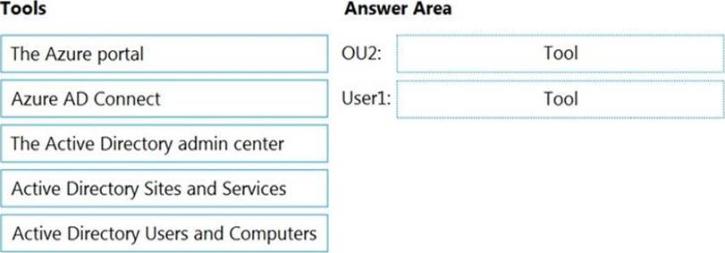

- [ ] OU2: The Active Directory admin center. User1: Active Directory Users and Computers.
- [ ] OU2: Active Directory Users and Computers. User1: Active Directory Sites and Services.
- [ ] OU2: Active Directory Users and Computers. User1: The Azure portal.
- [x] OU2: Azure AD Connect. User1: The Azure portal.

**[⬆ Back to Top](#table-of-contents)**

### You have an Azure Subscription named Sub1. You have an Azure Storage account named Sa1 in a resource group named RG1. Users and applications access the blob service and the file service in Sa1 by using several shared access signatures (SASs) and stored access policies. You discover that unauthorized users accessed both the file service and the blob service. You need to revoke all access to Sa1. Solution: You create a lock on Sa1. Does this meet the goal?

- [ ] Yes.
- [x] No.

**[⬆ Back to Top](#table-of-contents)**

### You have an Azure Subscription named Sub1. You have an Azure Storage account named Sa1 in a resource group named RG1. Users and applications access the blob service and the file service in Sa1 by using several shared access signatures (SASs) and stored access policies. You discover that unauthorized users accessed both the file service and the blob service. You need to revoke all access to Sa1. Solution: You generate new SASs. Does this meet the goal?

- [ ] Yes.
- [x] No.

**[⬆ Back to Top](#table-of-contents)**

### You have an Azure Subscription named Sub1. You have an Azure Storage account named Sa1 in a resource group named RG1. Users and applications access the blob service and the file service in Sa1 by using several shared access signatures (SASs) and stored access policies. You discover that unauthorized users accessed both the file service and the blob service. You need to revoke all access to Sa1. Solution: You regenerate the access keys. Does this meet the goal?

- [x] Yes.
- [ ] No.

**[⬆ Back to Top](#table-of-contents)**

### You have an Azure Subscription named Sub1. You have an Azure Storage account named Sa1 in a resource group named RG1. Users and applications access the blob service and the file service in Sa1 by using several shared access signatures (SASs) and stored access policies. You discover that unauthorized users accessed both the file service and the blob service. You need to revoke all access to Sa1. Solution: You create a new stored access policy. Does this meet the goal?

- [ ] Yes.
- [x] No.

**[⬆ Back to Top](#table-of-contents)**

### You have an Azure Active Directory (Azure AD) tenant named contoso.com that contains the users shown in the following table. You create and enforce an Azure AD Identity Protection user risk policy that has the following settings: Assignment: Include Group1, Exclude Group2. Conditions: Sign-in risk of Medium and above. Access: Allow access, Require password change. If User1 signs in from an unfamiliar location, he must change his password.

- [x] Yes.
- [ ] No.

**[⬆ Back to Top](#table-of-contents)**

### You have an Azure Active Directory (Azure AD) tenant named contoso.com that contains the users shown in the following table. You create and enforce an Azure AD Identity Protection user risk policy that has the following settings: Assignment: Include Group1, Exclude Group2. Conditions: Sign-in risk of Medium and above. Access: Allow access, Require password change. If User2 signs in from an anonymous IP addres, she must change her password.

- [ ] Yes.
- [x] No.

**[⬆ Back to Top](#table-of-contents)**

### You have an Azure Active Directory (Azure AD) tenant named contoso.com that contains the users shown in the following table. You create and enforce an Azure AD Identity Protection user risk policy that has the following settings: Assignment: Include Group1, Exclude Group2. Conditions: Sign-in risk of Medium and above. Access: Allow access, Require password change. If User3 signs in from a computer containing malware that is communicating with know bot servers, he must change his password.

- [x] Yes.
- [ ] No.

**[⬆ Back to Top](#table-of-contents)**

### You have an Azure Active Directory (Azure AD) tenant that contains the users shown in the following table. You create and enforce an Azure AD Identity Protection sign-in risk policy that has the following settings: Assignments: Include Group1, exclude Group2. Conditions: Sign-in risk level: Medium and above. Access: Allow access, Require multi-factor authentication. You need to identify what occurs when the users sign in to Azure AD. What should you identify for each user? When User1 signs in from an anonymous IP address, the user will:

- [ ] Be blocked.
- [x] Be prompted for MFA.
- [ ] Sign in by using a username and password only.

**[⬆ Back to Top](#table-of-contents)**

### You have an Azure Active Directory (Azure AD) tenant that contains the users shown in the following table. You create and enforce an Azure AD Identity Protection sign-in risk policy that has the following settings: Assignments: Include Group1, exclude Group2. Conditions: Sign-in risk level: Medium and above. Access: Allow access, Require multi-factor authentication. You need to identify what occurs when the users sign in to Azure AD. What should you identify for each user? When User2 signs in from an unfamiliar location, the user will:

- [x] Be blocked.
- [ ] Be prompted for MFA.
- [ ] Sign in by using a username and password only.

**[⬆ Back to Top](#table-of-contents)**

### You have an Azure Active Directory (Azure AD) tenant that contains the users shown in the following table. You create and enforce an Azure AD Identity Protection sign-in risk policy that has the following settings: Assignments: Include Group1, exclude Group2. Conditions: Sign-in risk level: Medium and above. Access: Allow access, Require multi-factor authentication. You need to identify what occurs when the users sign in to Azure AD. What should you identify for each user? When User3 signs in from an infceted device, the user will:

- [x] Be blocked.
- [ ] Be prompted for MFA.
- [ ] Sign in by using a username and password only.

**[⬆ Back to Top](#table-of-contents)**

### You have the Azure virtual networks shown in the following table. You have the Azure virtual machines shown in the following table. The firewalls on all the virtual machines allow ping traffic. NSG1 is configured as shown in the following exhibit. Inbound security rules. Outbound security rules. VM1 can ping VM3 successfully.

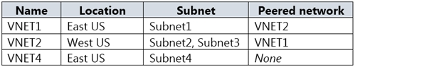
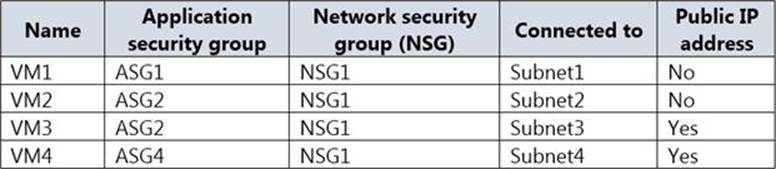
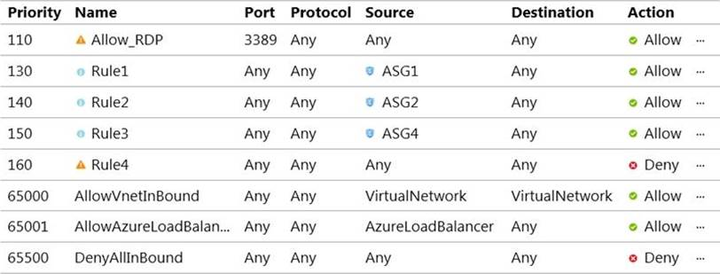
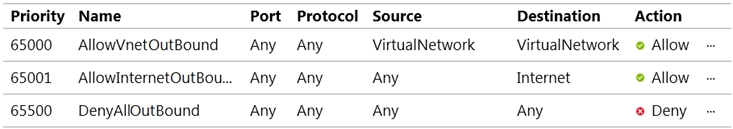

- [x] Yes.
- [ ] No.

**[⬆ Back to Top](#table-of-contents)**

### You have the Azure virtual networks shown in the following table. You have the Azure virtual machines shown in the following table. The firewalls on all the virtual machines allow ping traffic. NSG1 is configured as shown in the following exhibit. Inbound security rules. Outbound security rules. VM2 can ping VM4 successfully.

- [ ] Yes.
- [x] No.

**[⬆ Back to Top](#table-of-contents)**

### You have the Azure virtual networks shown in the following table. You have the Azure virtual machines shown in the following table. The firewalls on all the virtual machines allow ping traffic. NSG1 is configured as shown in the following exhibit. Inbound security rules. Outbound security rules. VM3 can be accessed by using Remote Desktop from the internet.

- [x] Yes.
- [ ] No.

**[⬆ Back to Top](#table-of-contents)**

### You have an Azure subscription named Subcription1 that contains an Azure Active Directory (Azure AD) tenant named contosos.com and a resource group named RG1. You create a custom role named Role1 for contoso.com. You need to identify where you can use Role1 for permission delegation. What should you identify?

- [x] contoso.com only.
- [ ] contoso.com and RGT only.
- [ ] contoso.com and Subscription1 only.
- [ ] contoso.com, RG1, and Subcription1

**[⬆ Back to Top](#table-of-contents)**

### You are configuring network connectivity for two Azure virtual networks named VNET1 and VNET2. You need to implement VPN gateways for the virtual networks to meet the following requirements: VNET1 must have six site-to-site connections that use BGP. VNET2 must have 12 site-to-site connections that use BGP. Costs must be minimized. Which VPN gateway SKI should you use for each virtual network?

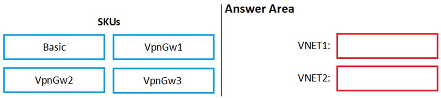

- [ ] VNET1: Basic. VNET2: VpnGw1.
- [ ] VNET1: VpnGw1. VNET2: VpnGw2.
- [ ] VNET1: VpnGw2. VNET2: VpnGw1.
- [x] VNET1: VpnGw1. VNET2: VpnGw1.

**[⬆ Back to Top](#table-of-contents)**

### You have an Azure Key Vault. You need to delegate administrative access to the key vault to meet the following requirements: Provide a user named User1 with the ability to set advanced access policies for the key vault. Provide a user named User2 with the ability to add and delete certificates in the key vault. Use the principle of least privilege. What should you use to assign access to each user?

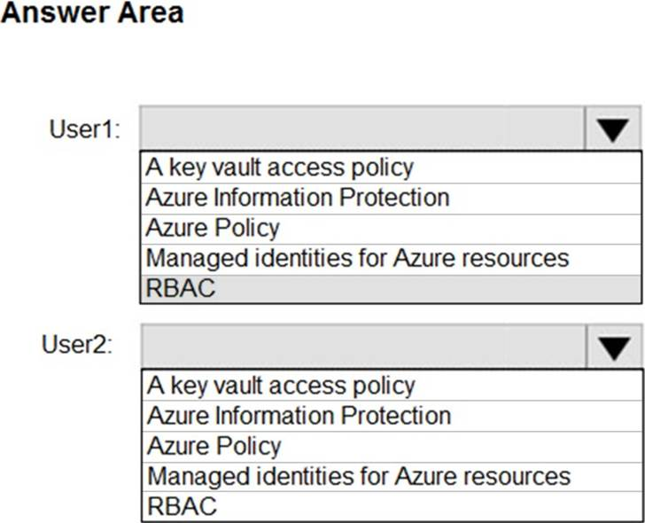

- [x] User1: RBAC. User2: A key vault access policy.
- [ ] User1: A key vault access policy. User2: Azure Policy.
- [ ] User1: Azure Policy. User2: Managed identities for Azure resources.
- [ ] User1: Managed identities for Azure resources. User2: Azure Policy.

**[⬆ Back to Top](#table-of-contents)**

### You have an Azure Active Din-dory (Azure AD) tenant named contoso.com that contains a user named User1. You plan to publish several apps in the tenant. You need to ensure that User1 can grant admin consent for the published apps. Which two possible user roles can you assign to User! to achieve this goal?

- [ ] Application developer.
- [ ] Security administrator.
- [x] Application administrator.
- [ ] User administrator.
- [x] Cloud application administrator.

**[⬆ Back to Top](#table-of-contents)**

### Contoso, Ltd. is a consulting company that has a main office in Montreal and two branch offices in Seattle and New York. The company hosts its entire server infrastructure in Azure. Contoso has two Azure subscriptions named Sub1 and Sub2. Both subscriptions are associated to an Azure Active Directory (Azure AD) tenant named contoso.com. Contoso identifies the following technical requirements: Deploy Azure Firewall to VNetwork1 in Sub2. Register an application named App2 in contoso.com. Whenever possible, use the principle of least privilege. Enable Azure AD Privileged Identity Management (PIM) for contoso.com. Contoso.com contains the users shown in the following table. Contoso.com contains the security groups shown in the following table. Sub1 contains six resource groups named RG1, RG2, RG3, RG4, RG5, and RG6. User9 creates the virtual networks shown in the following table. Sub1 contains the locks shown in the following table. Sub1 contains the Azure policies shown in the following table. Sub2 contains the virtual networks shown in the following table. Sub2 contains the virtual machines shown in the following table. All virtual machines have the public IP addresses and the Web Server (IIS) role installed. The firewalls for each virtual machine allow ping requests and web requests. Sub2 contains the network security groups (NSGs) shown in the following table. NSG1 has the inbound security rules shown in the following table. NSG2 has the inbound security rules shown in the following table. NSG3 has the inbound security rules shown in the following table. NSG4 has the inbound security rules shown in the following table. NSG1, NSG2, NSG3, and NSG4 have the outbound security rules shown in the following table. You need to meet the technical requirements for VNetwork1. What should you do first?

- [x] Create a new subnet on VNetwork1.
- [ ] Remove the NSGs from Subnet11 and Subnet13.
- [ ] Associate an NSG to Subnet12.
- [ ] Configure DDoS protection for VNetwork1.

**[⬆ Back to Top](#table-of-contents)**

### Contoso, Ltd. is a consulting company that has a main office in Montreal and two branch offices in Seattle and New York. The company hosts its entire server infrastructure in Azure. Contoso has two Azure subscriptions named Sub1 and Sub2. Both subscriptions are associated to an Azure Active Directory (Azure AD) tenant named contoso.com. Contoso identifies the following technical requirements: Deploy Azure Firewall to VNetwork1 in Sub2. Register an application named App2 in contoso.com. Whenever possible, use the principle of least privilege. Enable Azure AD Privileged Identity Management (PIM) for contoso.com. Contoso.com contains the users shown in the following table. Contoso.com contains the security groups shown in the following table. Sub1 contains six resource groups named RG1, RG2, RG3, RG4, RG5, and RG6. User9 creates the virtual networks shown in the following table. Sub1 contains the locks shown in the following table. Sub1 contains the Azure policies shown in the following table. Sub2 contains the virtual networks shown in the following table. Sub2 contains the virtual machines shown in the following table. All virtual machines have the public IP addresses and the Web Server (IIS) role installed. The firewalls for each virtual machine allow ping requests and web requests. Sub2 contains the network security groups (NSGs) shown in the following table. NSG1 has the inbound security rules shown in the following table. NSG2 has the inbound security rules shown in the following table. NSG3 has the inbound security rules shown in the following table. NSG4 has the inbound security rules shown in the following table. NSG1, NSG2, NSG3, and NSG4 have the outbound security rules shown in the following table. What is the membership of Group1 and Group2?

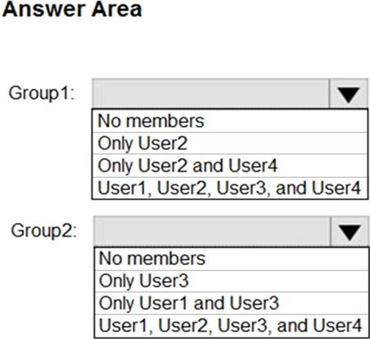

- [x] Group 1: User1, User2, User3, and User4. Group 2: Only User3.
- [ ] Group 1: No members. Group 2: User1, User2, User3, and User4.
- [ ] Group 1: Only User2. Group 2: Only User1 and User3.
- [ ] Group 1: Only User1 and User3. Group 2: No members.

**[⬆ Back to Top](#table-of-contents)**

### You have an Azure subscription that contains the resources shown in the following table. The subscription is linked to an Azure Active Directory (Azure AD) tenant that contains the users shown in the following table. You create the groups shown in the following table. The membership rules for Group1 and Group2 are configured as shown in the following exhibit. User1 is a member of Group1 and Group2.

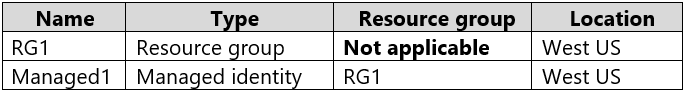
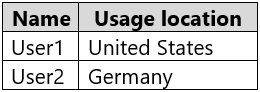
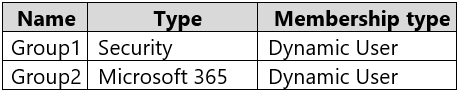
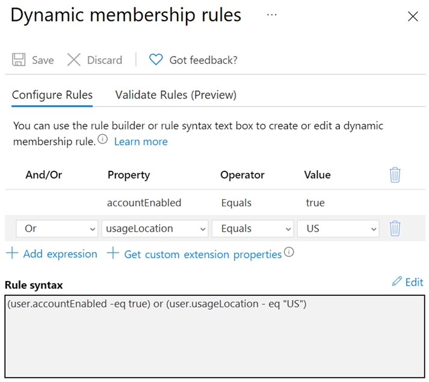

- [x] Yes.
- [ ] No.

**[⬆ Back to Top](#table-of-contents)**

### You have an Azure subscription that contains the resources shown in the following table. The subscription is linked to an Azure Active Directory (Azure AD) tenant that contains the users shown in the following table. You create the groups shown in the following table. The membership rules for Group1 and Group2 are configured as shown in the following exhibit. User2 is a member of Group2 only.

- [ ] Yes.
- [x] No.

**[⬆ Back to Top](#table-of-contents)**

### You have an Azure subscription that contains the resources shown in the following table. The subscription is linked to an Azure Active Directory (Azure AD) tenant that contains the users shown in the following table. You create the groups shown in the following table. The membership rules for Group1 and Group2 are configured as shown in the following exhibit. Managed1 is a member of Group1 and Group2.

- [ ] Yes.
- [x] No.

**[⬆ Back to Top](#table-of-contents)**

### You have an Azure Sentinel workspace that contains an Azure Active Directory (Azure AD) connector, an Azure Log Analytics query named Query1 and a playbook named Playbook1. Query1 returns a subset of security events generated by Azure AD. You plan to create an Azure Sentinel analytic rule based on Query1 that will trigger Playbook1. You need to ensure that you can add Playbook1 to the new rule. What should you do?

- [ ] Create the rule and set the type to: Fusion. Configure the playbook to include: A managed connector.
- [x] Create the rule and set the type to: Scheduled. Configure the playbook to include: A trigger.
- [ ] Create the rule and set the type to: Microsoft Security incident creation. Configure the playbook to include: A system-assigned managed identity.
- [ ] Create the rule and set the type to: Fusion. Configure the playbook to include: Diagnostic settings.

**[⬆ Back to Top](#table-of-contents)**

### You have an Azure subscription named Subscription1. You need to view which security settings are assigned to Subscription1 by default. Which Azure policy or initiative definition should you review?

- [ ] Audit diagnostic setting policy definition.
- [x] Enable Monitoring in Azure Security Center (Microsfot Defender for cloud) initiative definition.
- [ ] Enable Azure Monitor for VMs initiative definition.
- [ ] Azure Monitor solution 'Security and Audit' must be deployed policy definition.

**[⬆ Back to Top](#table-of-contents)**

### You have an Azure subscription named Sub1. Sub1 has an Azure Storage account named Storage1 that contains the resources shown in the following table. You generate a shared access signature (SAS) to connect to the blob service and the file service. Which tool can you use to access the contents in Container1 and Share1 by using the SAS?

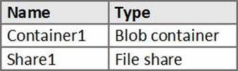

- [ ] Tools for Container1: Robocopy.exe. Tools for Share1: Azure Storage Explorer.
- [ ] Tools for Container1: Azure Storage Explorer. Tools for Share1: Robocopy.exe.
- [ ] Tools for Container1: File Explorer. Tools for Share1: File Explorer.
- [x] Tools for Container1: Azure Storage Explorer. Tools for Share1: Azure Storage Explorer.

**[⬆ Back to Top](#table-of-contents)**

### You have an Azure Active Directory (Azure AD) tenant named contoso.onmicrosoft.com. The User administrator role is assigned to a user named Admin1. An external partner has a Microsoft account that uses the <user1@outlook.com> sign in. Admin1 attempts to invite the external partner to sign in to the Azure AD tenant and receives the following error message: 'Unable to invite user <user1@outlook.com> Generic authorization exception.' You need to ensure that Admin1 can invite the external partner to sign in to the Azure AD tenant. What should you do? What should you do?

- [ ] From the Roles and administrators blade, assign the Security administrator role to Admin1.
- [ ] From the Organizational relationships blade, add an identity provider..
- [ ] From the Custom domain names blade, add a custom domain.
- [x] From the Users settings blade, modify the External collaboration settings.

**[⬆ Back to Top](#table-of-contents)**

### You have an Azure virtual machines shown in the following table. You create an Azure Log Analytics workspace named Analytics1 in RG1 in the East US region. Which virtual machines can be enrolled in Analytics1?

- [ ] VM1 only.
- [ ] VM1, VM2, and VM3 only.
- [x] VM1, VM2, VM3, and VM4.
- [ ] VM1 and VM4 only.

**[⬆ Back to Top](#table-of-contents)**

### You have an Azure subscription that contains the virtual machines shown in the following table. From Azure Security Center, you turn on Auto Provisioning. You deploy the virtual machines shown in the following table. On which virtual machines is the Log Analytics agent installed?

- [ ] VM3 only.
- [ ] VM1 and VM3 only.
- [ ] VM3 and VM4 only.
- [x] VM1, VM2, VM3, and VM4.

**[⬆ Back to Top](#table-of-contents)**

### You are securing access to the resources in an Azure subscription. A new company policy states that all the Azure virtual machines in the subscription must use managed disks. You need to prevent users from creating virtual machines that use unmanaged disks. What should you use?

- [ ] Azure Monitor.
- [x] Azure Policy.
- [ ] Azure Security Center.
- [ ] Azure Service Health.

**[⬆ Back to Top](#table-of-contents)**

### You have a management group named Group1 that contains an Azure subscription named sub1. Sub1 has a subscription ID of 11111111-1234-1234-1234-1111111111. You need to create a custom Azure role-based access control (RBAC) role that will delegate permissions to manage the tags on all the objects in Group1. What should you include in the role definition of Role1?

- [x] Resource provider: Microsoft.Resources. Assignable scope: /subscription/11111111-1234-1234-1234-1111111111.
- [ ] Resource provider: Microsoft.Authorization. Assignable scope: /.
- [ ] Resource provider: Microsoft.Support. Assignable scope: /Group1.
- [ ] Resource provider: Microsoft.Resources. Assignable scope: /.

**[⬆ Back to Top](#table-of-contents)**

### You have 10 virtual machines on a single subnet that has a single network security group (NSG). You need to log the network traffic to an Azure Storage account. Which two actions should you perform?

- [ ] Install the Network Performance Monitor solution.
- [x] Enable Azure Network Watcher.
- [ ] Enable diagnostic logging for the NS.
- [x] Enable NSG flow logs.
- [ ] Create an Azure Log Analytics workspace.

**[⬆ Back to Top](#table-of-contents)**

### From Azure Security Center, you need to deploy SecPol1. What should you do first?

- [x] Enable Microsoft Defender for Cloud.
- [ ] Create an Azure Management group.
- [ ] Create an initiative.
- [ ] Configure continuous export.

**[⬆ Back to Top](#table-of-contents)**

### You have an Azure subscription that is associated with an Azure Active Directory (Azure AD) tenant. When a developer attempts to register an app named App1 in the tenant, the developer receives the error message shown in the following exhibit. You need to ensure that the developer can register App1 in the tenant. What should you do for the tenant?

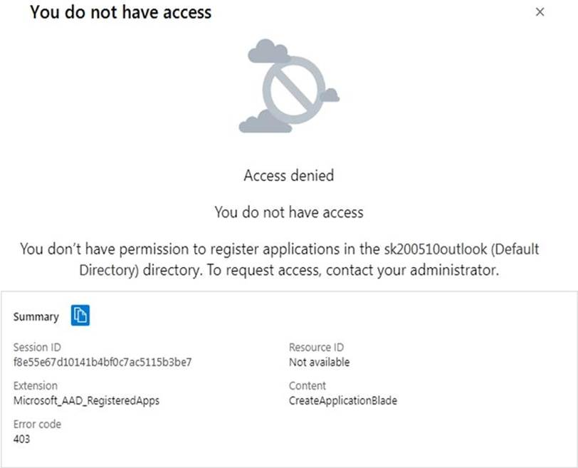

- [x] Modify the User settings.
- [ ] Set Enable Security default to Yes.
- [ ] Modify the Directory properties.
- [ ] Configure the Consent and permissions settings for enterprise applications.

**[⬆ Back to Top](#table-of-contents)**

### You have an Azure subscription that contains an Azure Key Vault named ContosoKey1. You create users and assign them roles as shown in the following table. You need to identify which users can perform the following actions: Delegate permissions for ContosoKey1. Configure network access to ContosoKey1. Which users should you identify?

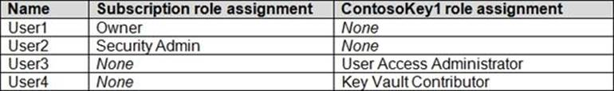
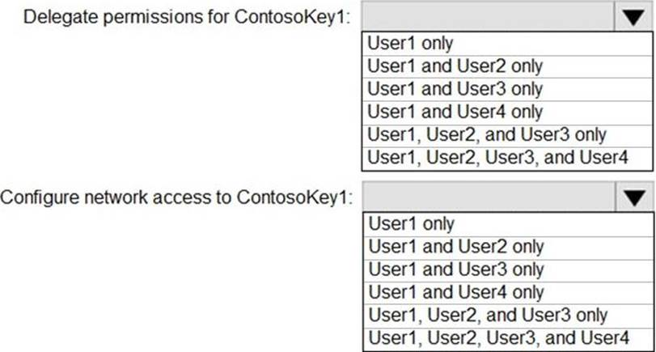

- [ ] Delegate permissions for ContosoKey1: User1 and User3 only. Configure network access to ContosoKey1: User1 only.
- [x] Delegate permissions for ContosoKey1: User1 and User3 only. Configure network access to ContosoKey1: User1 and User4 only.
- [ ] Delegate permissions for ContosoKey1: User1 and User2. only Configure network access to ContosoKey1: User1 and User3 only.
- [ ] Delegate permissions for ContosoKey1: User1 and User4 only. Configure network access to ContosoKey1: User1, User2, User3, and User4.

**[⬆ Back to Top](#table-of-contents)**

### Contoso, Ltd. is a consulting company that has a main office in Montreal and two branch offices in Seattle and New York. The company hosts its entire server infrastructure in Azure. Contoso has two Azure subscriptions named Sub1 and Sub2. Both subscriptions are associated to an Azure Active Directory (Azure AD) tenant named contoso.com. Contoso identifies the following technical requirements: Deploy Azure Firewall to VNetwork1 in Sub2. Register an application named App2 in contoso.com. Whenever possible, use the principle of least privilege. Enable Azure AD Privileged Identity Management (PIM) for contoso.com. Contoso.com contains the users shown in the following table. Contoso.com contains the security groups shown in the following table. Sub1 contains six resource groups named RG1, RG2, RG3, RG4, RG5, and RG6. User9 creates the virtual networks shown in the following table. Sub1 contains the locks shown in the following table. Sub1 contains the Azure policies shown in the following table. Sub2 contains the virtual networks shown in the following table. Sub2 contains the virtual machines shown in the following table. All virtual machines have the public IP addresses and the Web Server (IIS) role installed. The firewalls for each virtual machine allow ping requests and web requests. Sub2 contains the network security groups (NSGs) shown in the following table. NSG1 has the inbound security rules shown in the following table. NSG2 has the inbound security rules shown in the following table. NSG3 has the inbound security rules shown in the following table. NSG4 has the inbound security rules shown in the following table. NSG1, NSG2, NSG3, and NSG4 have the outbound security rules shown in the following table. You assign User8 the Owner role for RG4, RG5, and RG6. In which resource groups can User8 create virtual networks and NSGs?

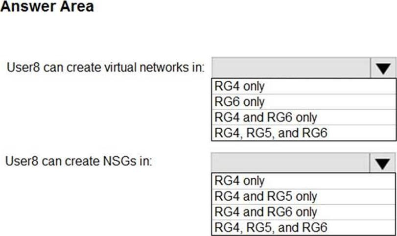

- [x] User8 can create virtual networks in: RG4 only. User8 can create NSGs in: RG4 and RG6 only.
- [ ] User8 can create virtual networks in: RG6 only. User8 can create NSGs in: RG4 and RG6 only.
- [ ] User8 can create virtual networks in: RG4 and RG6 only. User8 can create NSGs in: RG6 only.
- [ ] User8 can create virtual networks in: RG4, RG5, and RG6. User8 can create NSGs in: RG4, RG5, and RG6.

**[⬆ Back to Top](#table-of-contents)**

### Contoso, Ltd. is a consulting company that has a main office in Montreal and two branch offices in Seattle and New York. The company hosts its entire server infrastructure in Azure. Contoso has two Azure subscriptions named Sub1 and Sub2. Both subscriptions are associated to an Azure Active Directory (Azure AD) tenant named contoso.com. Contoso identifies the following technical requirements: Deploy Azure Firewall to VNetwork1 in Sub2. Register an application named App2 in contoso.com. Whenever possible, use the principle of least privilege. Enable Azure AD Privileged Identity Management (PIM) for contoso.com. Contoso.com contains the users shown in the following table. Contoso.com contains the security groups shown in the following table. Sub1 contains six resource groups named RG1, RG2, RG3, RG4, RG5, and RG6. User9 creates the virtual networks shown in the following table. Sub1 contains the locks shown in the following table. Sub1 contains the Azure policies shown in the following table. Sub2 contains the virtual networks shown in the following table. Sub2 contains the virtual machines shown in the following table. All virtual machines have the public IP addresses and the Web Server (IIS) role installed. The firewalls for each virtual machine allow ping requests and web requests. Sub2 contains the network security groups (NSGs) shown in the following table. NSG1 has the inbound security rules shown in the following table. NSG2 has the inbound security rules shown in the following table. NSG3 has the inbound security rules shown in the following table. NSG4 has the inbound security rules shown in the following table. NSG1, NSG2, NSG3, and NSG4 have the outbound security rules shown in the following table. You are evaluating the security of VM1, VM2, and VM3 in Sub2. From the Internet, you can connect to the web server on VM1 by using HTTP.

- [x] Yes.
- [ ] No.

**[⬆ Back to Top](#table-of-contents)**

### You have an Azure subscription that contains an Azure Active Directory (Azure AD) tenant named contoso.com. The tenant contains the users shown in the following table. You create a resource group named RG1. Which users can modify the permissions for RG1 and which users can create virtual networks in RG1?

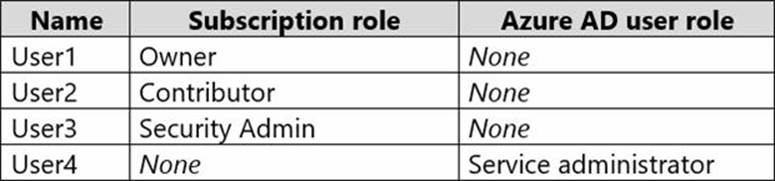
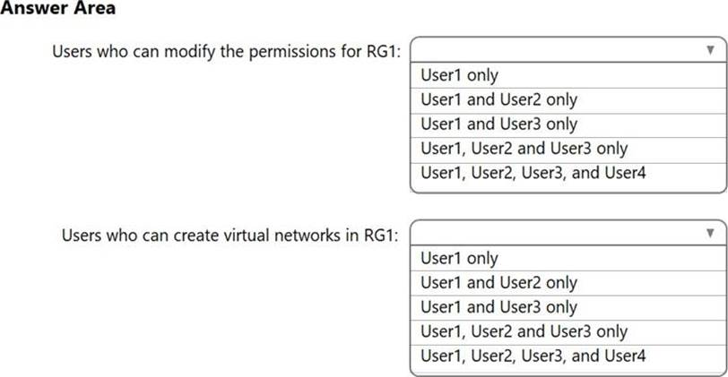

- [x] Users who can modify the permissions for RG1: User1 only. Users who can create virtual networks in RG1: User1 and User2 only.
- [ ] Users who can modify the permissions for RG1: User1 and User2 only. Users who can create virtual networks in RG1: User1 only.
- [ ] Users who can modify the permissions for RG1: User1 and User3 only. Users who can create virtual networks in RG1: User1, User2, User3, and User4.
- [ ] Users who can modify the permissions for RG1: User1, User2 and User3 only. Users who can create virtual networks in RG1: User1 and User2 only.

**[⬆ Back to Top](#table-of-contents)**

### You have an Azure subscription named Sub 1 that is associated to an Azure Active Directory (Azure AD) tenant named contoso.com. The tenant contains the users shown in the following table. Each user is assigned an Azure AD Premium P2 license. You plan to onboard and configure Azure AD Identity Protection. Which users can onboard Azure AD Identity Protection, remediate users, and configure policies?

- [x] Users who can onboard Azure AD Identity Protection: User1 only. Users who can remediate users and configure policies: User1 and User2 only.
- [ ] Users who can onboard Azure AD Identity Protection: User1 and User2 only. Users who can remediate users and configure policies: User1 and User3 only.
- [ ] Users who can onboard Azure AD Identity Protection: User1, User2, and User3 only. Users who can remediate users and configure policies: User1, User2, User3 and User4 only.
- [ ] Users who can onboard Azure AD Identity Protection: User1, User2, User3 and User4 only. Users who can remediate users and configure policies: User1, User2, and User3 only.

**[⬆ Back to Top](#table-of-contents)**

### You need to configure network connectivity between a virtual network named VNET1 and a virtual network named VNET2. The solution must ensure that virtual machines connected to VNET1 can communicate with virtual machines connected to VNET2. To complete this task, sign in to the Azure portal and modify the Azure resources.

- [x] 1. In the Azure portal, type Virtual Networks in the search box, select Virtual Networks from the search results then select VNET1. Alternatively, browse to
Virtual Networks in the left navigation pane. 2. In the properties of VNET1, click on Peerings. 3. In the Peerings blade, click Add to add a new peering. 4. In the Name of the peering from VNET1 to remote virtual network box, enter a name such as VNET1-VNET2 (this is the name that the peering will be displayed as in VNET1) 5. In the Virtual Network box, select VNET2. 6. In the Name of the peering from remote virtual network to VNET1 box, enter a name such as VNET2-VNET1 (this is the name that the peering will be displayed as in VNET2). There is an option Allow virtual network access from VNET to remote virtual network. This should be left as Enabled. 7. For the option Allow virtual network access from remote network to VNET1, click the slider button to Disabled. 8. Click the OK button to save the changes.

**[⬆ Back to Top](#table-of-contents)**

### A user named Debbie has the Azure app installed on her mobile device. You need to ensure that <debbie@contoso.com> is alerted when a resource lock is deleted. To complete this task, sign in to the Azure portal.

- [x] 1. Type Monitor into the search box and select Monitor from the search results. 2. Click on Alerts. 3. Click on +New Alert Rule. 4. In the Scope section, click on the Select resource link. 5. In the Filter by resource type box, type locks and select Management locks (locks) from the filtered results. 6. Select the subscription then click the Done button. 7. In the Condition section, click on the Select condition link. 8. Select the Delete management locks condition the click the Done button. 9. In the Action group section, click on the Select action group link. 10. Click the Create action group button to create a new action group. 11. Give the group a name such as Debbie Mobile App (it doesn't matter what name you enter for the exam) then click the Next: Notifications > button. 12. In the Notification type box, select the Email/SMS message/Push/Voice option. 13. In the Email/SMS message/Push/Voice window, tick the Azure app Push Notifications checkbox and enter debbie@contoso.com in the Azure account email field. 14. Click the OK button to close the window. 15. Enter a name such as Debbie Mobile App in the notification name box. 16. Click the Review & Create button then click the Create button to create the action group. 17. Back in the Create alert rule window, in the Alert rule details section, enter a name such as Management lock deletion in the Alert rule name field. 18. Click the Create alert rule button to create the alert rule.

**[⬆ Back to Top](#table-of-contents)**

### You are configuring just in time (JIT) VM access to a set of Azure virtual machines. You need to grant users PowerShell access to the virtual machine by using JIT VM access. What should you configure?

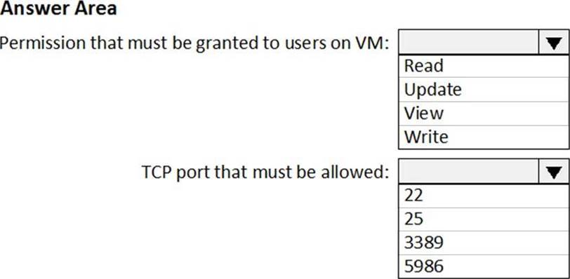

- [ ] Permission that must be granted to users on VM: Write. TCP potal that must be allowed: 5986.
- [ ] Permission that must be granted to users on VM: Update. TCP potal that must be allowed: 23.
- [x] Permission that must be granted to users on VM: Read. TCP potal that must be allowed: 5986.
- [ ] Permission that must be granted to users on VM: View. TCP potal that must be allowed: 3389.

**[⬆ Back to Top](#table-of-contents)**

### Contoso, Ltd. is a consulting company that has a main office in Montreal and two branch offices in Seattle and New York. The company hosts its entire server infrastructure in Azure. Contoso has two Azure subscriptions named Sub1 and Sub2. Both subscriptions are associated to an Azure Active Directory (Azure AD) tenant named contoso.com. Contoso identifies the following technical requirements: Deploy Azure Firewall to VNetwork1 in Sub2. Register an application named App2 in contoso.com. Whenever possible, use the principle of least privilege. Enable Azure AD Privileged Identity Management (PIM) for contoso.com. Contoso.com contains the users shown in the following table. Contoso.com contains the security groups shown in the following table. Sub1 contains six resource groups named RG1, RG2, RG3, RG4, RG5, and RG6. User9 creates the virtual networks shown in the following table. Sub1 contains the locks shown in the following table. Sub1 contains the Azure policies shown in the following table. Sub2 contains the virtual networks shown in the following table. Sub2 contains the virtual machines shown in the following table. All virtual machines have the public IP addresses and the Web Server (IIS) role installed. The firewalls for each virtual machine allow ping requests and web requests. Sub2 contains the network security groups (NSGs) shown in the following table. NSG1 has the inbound security rules shown in the following table. NSG2 has the inbound security rules shown in the following table. NSG3 has the inbound security rules shown in the following table. NSG4 has the inbound security rules shown in the following table. NSG1, NSG2, NSG3, and NSG4 have the outbound security rules shown in the following table. You are evaluating the security of the network communication between the virtual machines in Sub2. From VM1, you can successfully ping the public IP address of VM5.

- [ ] Yes.
- [x] No.

**[⬆ Back to Top](#table-of-contents)**

### From Azure Security Center, you enable Azure Container Registry vulnerability scanning of the images in Registry1. You perform the following actions: Push a Windows image named Image1 to Registry1. Push a Linux image named Image2 to Registry1. Push a Windows image named Image3 to Registry1. Modify Image1 and push the new image as Image4 to Registry1. Modify Image2 and push the new image as Image5 to Registry1. Which two images will be scanned for vulnerabilities?

- [ ] Image4.
- [x] Image2.
- [ ] Image1.
- [ ] Image3
- [x] Image5.

**[⬆ Back to Top](#table-of-contents)**

### You have a web app named WebApp1. You create a web application firewall (WAF) policy named WAF1. You need to protect WebApp1 by using WAF1. What should you do first?

- [x] Deploy an Azure Front Door.
- [ ] Add an extension to WebApp1.
- [ ] Deploy Azure Firewall.

**[⬆ Back to Top](#table-of-contents)**

### You have a hybrid configuration of Azure Active Directory (Azure AD). You have an Azure SQL Database instance that is configured to support Azure AD authentication. Database developers must connect to the database instance and authenticate by using their on-premises Active Directory account. You need to ensure that developers can connect to the instance by using Microsoft SQL Server Management Studio. The solution must minimize authentication prompts. Which authentication method should you recommend?

- [ ] Active Directory – Password.
- [ ] Active Directory – Universal with MFA support.
- [ ] SQL Server Authentication.
- [x] Active Directory – Integrated.

**[⬆ Back to Top](#table-of-contents)**

### You have an Azure subscription that contains a resource group named RG1 and a security group serverless RG1 contains 10 virtual machine, a virtual network VNET1, and a network security group (NSG) named NSG1. ServerAdmins can access the virtual machines by using RDP. You need to ensure that NSG1 only RDP connections to the virtual for a maximum of 60 minutes when a member of ServerAdmins requests access. What should you configure?

- [ ] Azure Active Directory (Azure AD) Privileged identity Management (PIM) role assignment.
- [x] Just in time (JIT) VM access policy in Azure Security Center.
- [ ] Azure policy assigned to RG1.
- [ ] Azure Bastion host on VNET1.

**[⬆ Back to Top](#table-of-contents)**

### Your company has an Azure subscription named Subscription1 that contains the users shown in the following table. The company is sold to a new owner. The company needs to transfer ownership of Subscription1. Which user can transfer the ownership and which tool should the user use?

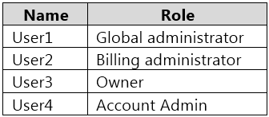
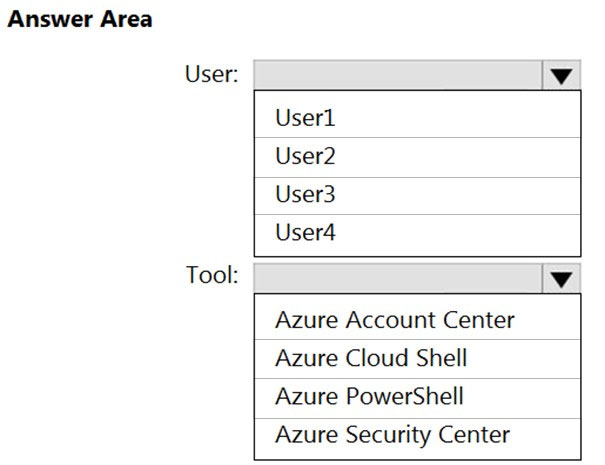

- [ ] Box 1: User 1. Box 2: Azure Cloud Shell.
- [x] Box 1: User 2. Box 2: Azure Account Center.
- [ ] Box 1: User 3. Box 2: Azure PowerShell.
- [ ] Box 1: User 4. Box 2: Azure Security Center.

**[⬆ Back to Top](#table-of-contents)**

### You have an Azure subscription. You create an Azure web app named Contoso1812 that uses an S1 App service plan. You create a CNAME DNS record for <www.contoso.com> that points to the IP address of Contoso1812. You need to ensure that users can access Contoso1812 by using the <https://www.contoso.com> URL. Which two actions should you perform?

- [ ] Turn on the system-assigned managed identity for Contoso1812.
- [x] Add a hostname to Contoso1812.
- [ ] Scale out the App Service plan of Contoso1812.
- [ ] Add a deployment slot to Contoso1812.
- [ ] Scale up the App Service plan of Contoso1812.
- [x] Upload a PFX file to Contoso1812.

**[⬆ Back to Top](#table-of-contents)**

### You have an Azure subscription that contains an Azure Key Vault named Vault1. On January 1, 2019, Vault1 stores the following secrets. When can each secret be used by an application?

- [x] Password1: Never. Password2: Only between March 1, 2019 and May 1, 2019.
- [ ] Password1: Always. Password2: Never.
- [ ] Password1: Only after May 1, 2019. Password2: Always.
- [ ] Password1: Only after May 1, 2019. Password2: Only between March 1, 2019 and May 1, 2019.

**[⬆ Back to Top](#table-of-contents)**

### You have an Azure subscription that contains an Azure Key Vault named Vault1. In Vault1, you create a secret named Secret1. An application developer registers an application in Azure Active Directory (Azure AD). You need to ensure that the application can use Secret1. What should you do?

- [ ] In Azure AD, create a role.
- [ ] In Azure Key Vault, create a key.
- [x] In Azure Key Vault, create an access policy.
- [ ] In Azure AD, enable Azure AD Application Proxy.

**[⬆ Back to Top](#table-of-contents)**

### You have the Azure Information Protection conditions shown in the following table. You plan to use Azure Sentinel to monitor Windows Defender Firewall on the virtual machines. Which virtual machines you can connect to Azure Sentinel?

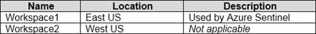

- [ ] VM1 and VM3 only.
- [ ] VM1 Only.
- [ ] VM1 and VM2 only.
- [x] VM1, VM2, VM3 and VM4.

**[⬆ Back to Top](#table-of-contents)**

### You have the Azure Information Protection conditions shown in the following table. You have the Azure Information Protection policies as shown in the following table. You need to identify how Azure Information Protection will label files. What should you identify?

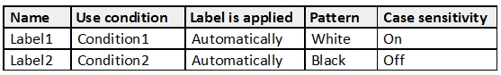
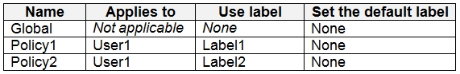
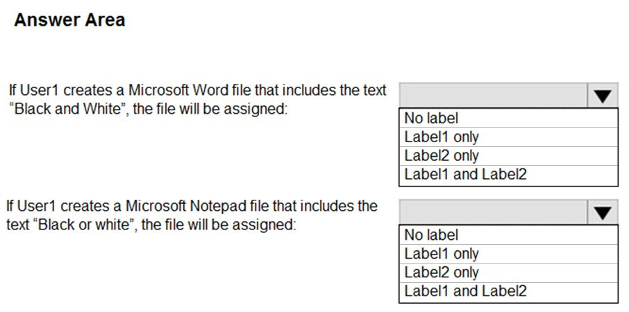

- [x] If User1 creates a Microsoft Word file that includes the text 'Black and White', the file will be assigned: Label2 only. If User1 creates a Microsoft Notepad file that includes the text 'Black or white', the file will be assigned: No label.
- [ ] If User1 creates a Microsoft Word file that includes the text 'Black and White', the file will be assigned: No label. If User1 creates a Microsoft Notepad file that includes the text 'Black or white', the file will be assigned: Label1 only.
- [ ] If User1 creates a Microsoft Word file that includes the text 'Black and White', the file will be assigned: Label1 only. If User1 creates a Microsoft Notepad file that includes the text 'Black or white', the file will be assigned: Label and Label2 only.
- [ ] If User1 creates a Microsoft Word file that includes the text 'Black and White', the file will be assigned: Label1 and Label2 only. If User1 creates a Microsoft Notepad file that includes the text 'Black or white', the file will be assigned: Label2 only.

**[⬆ Back to Top](#table-of-contents)**

### You have an Azure subscription that is linked to an Azure Active Directory (Azure AD) tenant. From the Azure portal, you register an enterprise application. Which additional resource will be created in Azure AD?

- [x] Service principal.
- [ ] 509 certificate.
- [ ] Managed identity.
- [ ] User account.

**[⬆ Back to Top](#table-of-contents)**

### You have an Azure subscription. You plan to create a custom role-based access control (RBAC) role that will provide permission to read the Azure Storage account. Which property of the RBAC role definition should you configure?

- [ ] NotActions [].
- [ ] DataActions [].
- [ ] AssignableScopes [].
- [x] Actions [].

**[⬆ Back to Top](#table-of-contents)**

### You have the Azure virtual machines shown in the following table. For which virtual machines can you enable Update Management?

- [ ] VM2 and VM3 only.
- [ ] VM2, VM3, and VM4 only.
- [x] VM1, VM2, and VM4 only.
- [ ] VM1, VM2, VM3, and VM4.
- [ ] VM1, VM2, and VM3 only.

**[⬆ Back to Top](#table-of-contents)**

### You have Azure virtual machines that have Update Management enabled. The virtual machines are configured as shown in the following table. You schedule two update deployments named Update1 and Update2. Update1 updates VM3. Update2 updates VM6. Which additional virtual machines can be updated by using Update1 and Update2?

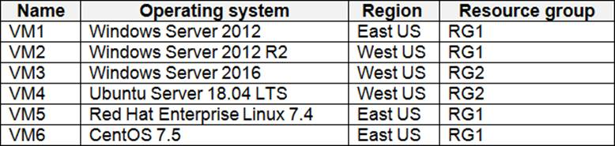
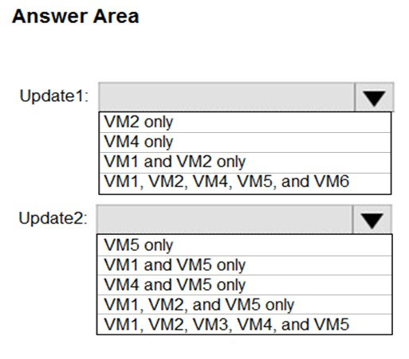

- [x] Update1: VM1 and VM2 only. Update2: VM4 and VM5 only.
- [ ] Update1: VM2 only. Update2: VM5 only.
- [ ] Update1: VM4 only. Update2: VM1 and VM2 only.
- [ ] Update1: VM1, VM2, VM4, VM4, and VM6. Update2: VM1, VM2, and VM5 only.

**[⬆ Back to Top](#table-of-contents)**

### You have the Azure virtual machines shown in the following table. Each virtual machine has a single network interface. You add the network interface of VM1 to an application security group named ASG1. You need to identify the network interfaces of which virtual machines you can add to ASG1. What should you identify?

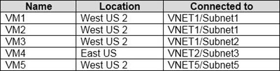

- [ ] VM2 only.
- [ ] VM2, VM3, VM4, and VM5.
- [ ] VM2, VM3, and VM5 only.
- [x] VM2 and VM3 only.

**[⬆ Back to Top](#table-of-contents)**

### You have Azure virtual machines that have Update Management enabled. The virtual machines are configured as shown in the following table. You need to ensure that all critical and security updates are applied to each virtual machine every month. What is the minimum number of update deployments you should create?

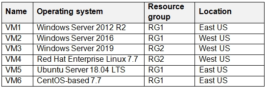

- [ ] 4.
- [ ] 6.
- [x] 2.
- [ ] 1.

**[⬆ Back to Top](#table-of-contents)**

### You have an Azure subscription named Sub1. In Azure Security Center, you have a security playbook named Play1. Play1 is configured to send an email message to a user named User1. You need to modify Play1 to send email messages to a distribution group named Alerts. What should you use to modify Play1?

- [ ] Azure DevOps.
- [ ] Azure Application Insights.
- [ ] Azure Monitor.
- [x] Azure Logic Apps Designer.

**[⬆ Back to Top](#table-of-contents)**

### You have an Azure subscription named Sub1 that contains the virtual machines shown in the following table. You need to ensure that the virtual machines in RG1 have the Remote Desktop port closed until an authorized user requests access. What should you configure?

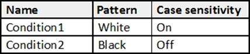

- [ ] Azure Active Directory (Azure AD) Privileged Identity Management (PIM).
- [ ] Application security group.
- [ ] Azure Active Directory (Azure AD) conditional access.
- [x] Just in time (JIT) VM access.

**[⬆ Back to Top](#table-of-contents)**

### You have an Azure subscription named Sub1 that contains an Azure Storage account named Contosostorage1 and an Azure Key Vault named Contosokeyvault1. You plan to create an Azure Automation runbook that will rotate the keys of Contosostorage1 and store them in Contosokeyvault1. You need to implement prerequisites to ensure that you can implement the runbook. Which three actions should you perform in sequence?

- [ ] Box 1: Create an Azure Automation account. Box 2: Create a user-assigned managed identity. Box 3: Import PowerShell modules to the Azure Automation account.
- [x] Box 1: Create an Azure Automation account. Box 2: Import PowerShell modules to the Azure Automation account. Box 3: Run Set-AzureRmKeyVaultAccessPolicy.
- [ ] Box 1: Create an Azure Automation account. Box 2: Import PowerShell modules to the Azure Automation account. Box 3: Create a connection resource in the Azure Automation account.
- [ ] Box 1: Run Set-AzureRmKeyVaultAccessPolicy. Box 2: Create a connection resource in the Azure Automation account. Box 3: Create a user-assigned managed identity.

**[⬆ Back to Top](#table-of-contents)**

### Your company has an Azure Active Directory (Azure AD) tenant named contoso.com. The company is developing an application named App1. App1 will run as a service on server that runs Windows Server 2016. App1 will authenticate to contoso.com and access Microsoft Graph to read directory data. You need to delegate the minimum required permissions to App1. Which three actions should you perform in sequence from the Azure portal?

- [x] Box 1: Create an app registration. Box 2: Add an application permission. Box 3: Grant permissions.
- [ ] Box 1: Create an app registration. Box 2: Grant permissions. Box 3: Add an application permission.
- [ ] Box 1: Configure Azure AD Application Proxy. Box 2: Grant permissions. Box 3: Add a delegated permission.
- [ ] Box 1: Add a delegated permission. Box 2: Configure Azure AD Application Proxy. Box 3: Create an app registration.

**[⬆ Back to Top](#table-of-contents)**

### You suspect that users are attempting to sign in to resources to which they have no access. You need to create an Azure Log Analytics query to identify failed user sign-in attempts from the last three days. The results must only show users who had more than five failed sign-in attempts. How should you configure the query?

- [ ] Box 1: ActivityID. Box 2: Countif(),.
- [ ] Box 1: DataTypen. Box 2: Makeset(),.
- [x] Box 1: EventID. Box 2: Count(),.
- [ ] Box 1: QuantityUnit. Box 2: Split(),.

**[⬆ Back to Top](#table-of-contents)**

### You have an Azure Active Directory (Azure AD) tenant named contoso.com that contains the users shown in the following table. Contoso.com contains a group naming policy. The policy has a custom blocked word list rule that includes the word Contoso. Which users can create a group named Contoso Sales in contoso.com?

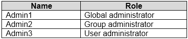
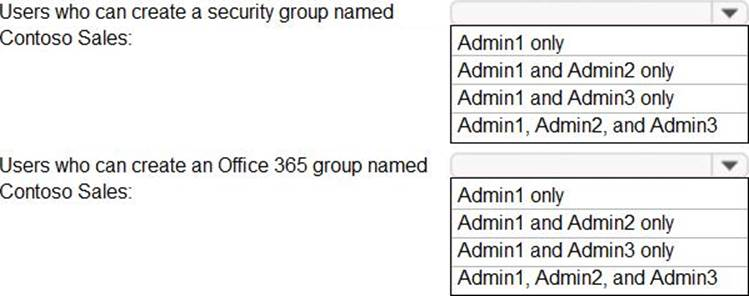

- [ ] Users who can create a security group named Contoso Sales: Admin1 and Admin3 only. Users who can create an Office 365 group named Cantoso Sales: Admin1 and Admin3 only.
- [ ] Users who can create a security group named Contoso Sales: Admin1 only. Users who can create an Office 365 group named Cantoso Sales: Admin1 and Admin2 only.
- [x] Users who can create a security group named Contoso Sales: Admin1, Admin2, and Admin3. Users who can create an Office 365 group named Cantoso Sales: Admin1 and Admin3 only.
- [ ] Users who can create a security group named Contoso Sales: Admin1 and Admin2 only. Users who can create an Office 365 group named Cantoso Sales: Admin1, Admin2, and Admin3.

**[⬆ Back to Top](#table-of-contents)**

### You need to ensure that the events in the NetworkSecurityGroupRuleCounter log of the VNET01-Subnet0-NSG network security group (NSG) are stored in the logs11597200 Azure Storage account for 30 days. To complete this task, sign in to the Azure portal.

- [x] 1. In the Azure portal, type Network Security Groups in the search box, select Network Security Groups from the search results then select VNET01-Subnet0-NSG. 2. Alternatively, browse to Network Security Groups in the left navigation panel. 3. In the properties of the Network Security Group, click on Diagnostic Settings. 4. Click on the Add diagnostic setting link. 5. Provide a name in the Diagnostic settings name field. It doesn't matter what name you provide for the exam. 6. In the Log section, select NetworkSecurityGroupRuleCounter. 7. In the Destination details section, select Archive to a storage account. 8. In the Storage account field, select the logs11597200 storage account. 9. In the Retention (days) field, enter 30. 10. Click the Save button to save the changes.

**[⬆ Back to Top](#table-of-contents)**

### You have an Azure Active Directory (Azure AD) tenant and a root management group. You create 10 Azure subscriptions and add the subscriptions to the root management group. You need to create an Azure Blueprints definition that will be stored in the root management group. What should you do first?

- [ ] Add an Azure Policy definition to the root management group.
- [x] Modify the role-based access control (RBAC) role assignments for the root management group.
- [ ] Create a user-assigned identity.
- [ ] Create a service principal.

**[⬆ Back to Top](#table-of-contents)**

### You have 15 Azure virtual machines in a resource group named RG1. All virtual machines run identical applications. You need to prevent unauthorized applications and malware from running on the virtual machines. What should you do?

- [ ] Apply an Azure policy to RG1.
- [x] From Azure Security Center, configure adaptive application controls.
- [ ] Configure Azure Active Directory (Azure AD) Identity Protection.
- [ ] Apply a resource lock to RG1.

**[⬆ Back to Top](#table-of-contents)**

### You have an Azure Active Directory (Azure AD) tenant named contoso1812.onmicrosoft.com that contains the users shown in the following table. You create an Azure Information Protection label named Label1. The Protection settings for Label1 are configured as shown in the exhibit. Label1 is applied to a file named File1. User1 can print File1.

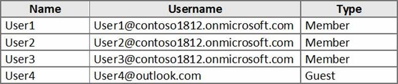
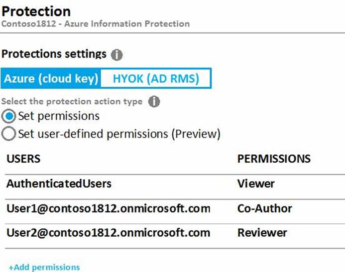

- [x] Yes.
- [ ] No.

**[⬆ Back to Top](#table-of-contents)**

### You have an Azure Active Directory (Azure AD) tenant named contoso1812.onmicrosoft.com that contains the users shown in the following table. You create an Azure Information Protection label named Label1. The Protection settings for Label1 are configured as shown in the exhibit. Label1 is applied to a file named File1. User3 can read File1.

- [x] Yes.
- [ ] No.

**[⬆ Back to Top](#table-of-contents)**

### You have an Azure Active Directory (Azure AD) tenant named contoso1812.onmicrosoft.com that contains the users shown in the following table. You create an Azure Information Protection label named Label1. The Protection settings for Label1 are configured as shown in the exhibit. Label1 is applied to a file named File1. User4 can print File1.

- [ ] Yes.
- [x] No.

**[⬆ Back to Top](#table-of-contents)**

### You have an Azure subscription named Sub1. In Azure Security Center, you have a workflow automation named WF1. WF1 is configured to send an email message to a user named User1. You need to modify WF1 to send email messages to a distribution group named Alerts. What should you use to modify WF1?

- [ ] Azure Application Insights.
- [ ] Azure Monitor.
- [x] Azure Logic Apps Designer.
- [ ] Azure DevOps.

**[⬆ Back to Top](#table-of-contents)**

### You have an Azure subscription named Sub1. You have an Azure Active Directory (Azure AD) group named Group1 that contains all the members of your IT team. You need to ensure that the members of Group1 can stop, start, and restart the Azure virtual machines in Sub1. The solution must use the principle of least privilege. Which three actions should you perform in sequence?

- [ ] Box 1: Create a JSON file. Box 2: Run the Update-AzManagementGroup cmdlet. Box 3: Run the New-AzRoleAssignment cmdlet.
- [x] Box 1: Create a JSON file. Box 2: Run the New-AzRoleDefinition cmdlet. Box 3: Run the New-AzRoleAssignment cmdlet.
- [ ] Box 1: Create an XML file. Box 2: Run the Update-AzManagementGroup cmdlet. Box 3: Run the New-AzRoleAssignment cmdlet.
- [ ] Box 1: Create an XML file. Box 2: Run the New-AzRoleDefinition cmdlet. Box 3: Run the New-AzRoleAssignment cmdlet.

**[⬆ Back to Top](#table-of-contents)**

### You have three on-premises servers named Server1, Server2, and Server3 that run Windows Server1 and Server2 and located on the Internal network. Server3 is located on the premises network. All servers have access to Azure. From Azure Sentinel, you install a Windows firewall data connector. You need to collect Microsoft Defender Firewall data from the servers for Azure Sentinel. What should you do?

- [ ] Create an event subscription from Server1, Server2 and Server3.
- [ ] Install the On-premises data gateway on each server.
- [x] Install the Microsoft Agent on each server.
- [ ] Install the Microsoft Agent on Server1 and Server2 install the on-premises data gateway on Server3.

**[⬆ Back to Top](#table-of-contents)**

### You plan to use Azure Log Analytics to collect logs from 200 servers that run Windows Server 2016. You need to automate the deployment of the Microsoft Monitoring Agent to all the servers by using an Azure Resource Manager template. How should you complete the template?

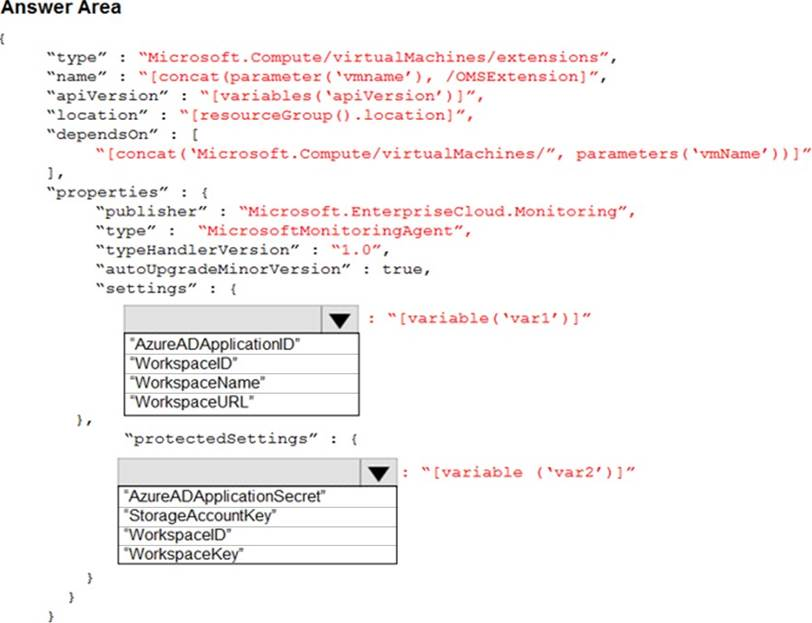

- [x] Box 1: "WorkspaceID". Box 2: "WorkspaceKey".
- [ ] Box 1: "AzureADApplicationID". Box 2: "WorkspaceID".
- [ ] Box 1: "WorkspaceName". Box 2: "StorageAccountKey".
- [ ] Box 1: "AzureADApplicationSecret". Box 2: "WorkspaceURL".

**[⬆ Back to Top](#table-of-contents)**

### You have an Azure Kubernetes Service (AKS) cluster that will connect to an Azure Container Registry. You need to use automatically generated service principal for the AKS cluster to authenticate to the Azure Container Registry. What should you create?

- [ ] Secret in Azure Key Vault.
- [x] Role assignment.
- [ ] Azure Active Directory (Azure AD) user.
- [ ] Azure Active Directory (Azure AD) group.

**[⬆ Back to Top](#table-of-contents)**

### You are configuring an Azure Kubernetes Service (AKS) cluster that will connect to an Azure Container Registry. You need to use the auto-generated service principal to authenticate to the Azure Container Registry. What should you create?

- [ ] Azure Active Directory (Azure AD) group.
- [x] Azure Active Directory (Azure AD) role assignment.
- [ ] Azure Active Directory (Azure AD) user.
- [ ] Secret in Azure Key Vault.

**[⬆ Back to Top](#table-of-contents)**

### You have an Azure subscription that contains an Azure Container Registry named Registry1. The subscription uses the Standard use tier of Azure Security Center. You upload several container images to Register1. You discover that vulnerability security scans were not performed. You need to ensured that the images are scanned for vulnerabilities when they are uploaded to Registry1. What should you do?

- [x] From the Azure portal modify the Pricing tier settings.
- [ ] From Azure CLI, lock the container images.
- [ ] Upload the container images by using AzCopy.
- [ ] Push the container images to Registry1 by using Docker.

**[⬆ Back to Top](#table-of-contents)**

### You have the Azure Key Vaults shown in the following table. KV1 stores a secret named Secret1 and a key for a managed storage account named Key1. You back up Secret1 and Key1. To which key vaults can you restore each backup?

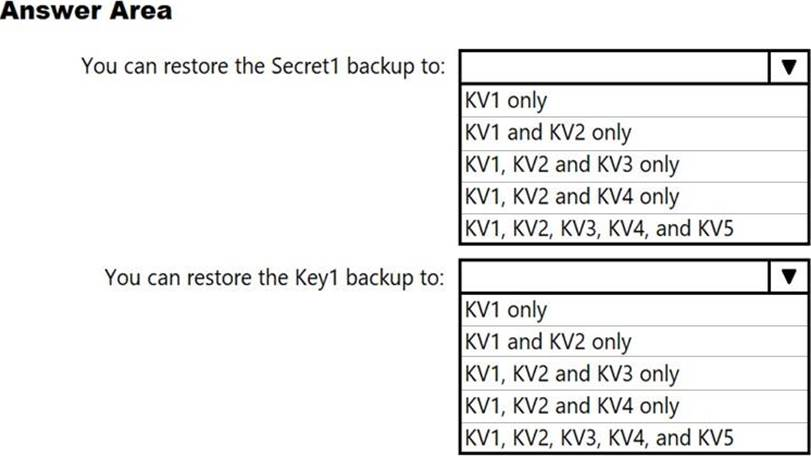

- [ ] You can restore the Secret1 backup to: KV1 only. You can restore the Key1 backup to: KV1, KV2, KV3, KV4, and KV5.
- [ ] You can restore the Secret1 backup to: KV1 and KV2 only. You can restore the Key1 backup to: KV1, KV2 and KV4 only Box.
- [x] You can restore the Secret1 backup to: KV1, KV2 and KV3 only. You can restore the Key1 backup to: KV1, KV2 and KV3 only.
- [ ] You can restore the Secret1 backup to: KV1, KV2 and KV4 only. You can restore the Key1 backup to: KV1 and KV2 only Box.

**[⬆ Back to Top](#table-of-contents)**

### You network contains an on-premises Active Directory domain that syncs to an Azure Active Directory (Azure AD) tenant. The tenant contains the users shown in the following table. The tenant contains the groups shown in the following table. The tenant contains the groups shown in the following table. You configure a multi-factor authentication (MFA) registration policy that and the following settings: Assignments: Include: Group1. Exclude: Group2. Controls: Require Azure MFA registration. Enforce Policy: On. User1 will be prompted to configure MFA registration during the user's next Azure AD authentication.

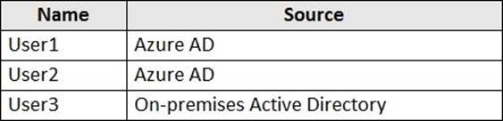

- [x] Yes.
- [ ] No.

**[⬆ Back to Top](#table-of-contents)**

### You network contains an on-premises Active Directory domain that syncs to an Azure Active Directory (Azure AD) tenant. The tenant contains the users shown in the following table. The tenant contains the groups shown in the following table. The tenant contains the groups shown in the following table. You configure a multi-factor authentication (MFA) registration policy that and the following settings: Assignments: Include: Group1. Exclude: Group2. Controls: Require Azure MFA registration. Enforce Policy: On. User2 must configure MFA during the user's next Azure AD authentication.

- [ ] Yes.
- [x] No.

**[⬆ Back to Top](#table-of-contents)**

### You network contains an on-premises Active Directory domain that syncs to an Azure Active Directory (Azure AD) tenant. The tenant contains the users shown in the following table. The tenant contains the groups shown in the following table. The tenant contains the groups shown in the following table. You configure a multi-factor authentication (MFA) registration policy that and the following settings: Assignments: Include: Group1. Exclude: Group2. Controls: Require Azure MFA registration. Enforce Policy: On. User3 will be prompted to configure MFA registration during the user's next Azure AD authentication.

- [x] Yes.
- [ ] No.

**[⬆ Back to Top](#table-of-contents)**

### You have an Azure subscription that contains virtual machines. You enable just in time (JIT) VM access to all the virtual machines. You need to connect to a virtual machine by using Remote Desktop. What should you do first?

- [ ] From Azure Directory (Azure AD) Privileged Identity Management (PIM), activate the Security administrator user role.
- [ ] From Azure Active Directory (Azure AD) Privileged Identity Management (PIM), activate the Owner role for the virtual machine.
- [x] From the Azure portal, select the virtual machine, select Connect, and then select Request access.
- [ ] From the Azure portal, select the virtual machine and add the Network Watcher Agent machine extension.

**[⬆ Back to Top](#table-of-contents)**

### You have an azure active Directory (Azure AD) tenant that contains the resources shown in the following table. User2 is the owner of Group2. The user and group settings for App1 are configured as shown in the following exhibit. You enable self-service application access for App1 as shown in the following exhibit. User3 is configured to approve access to App1. After you enable self-service application access for App1, who will be configured as the Group2 owner and who will be configured as the App1 users?

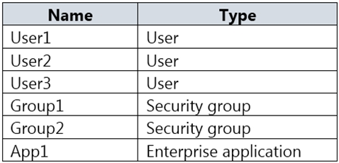
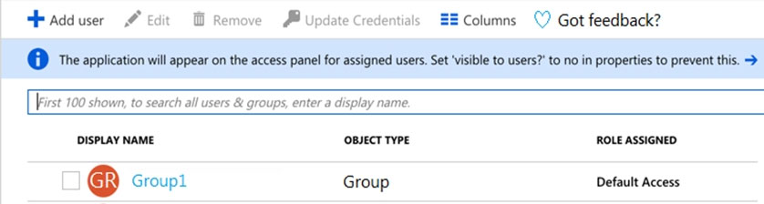
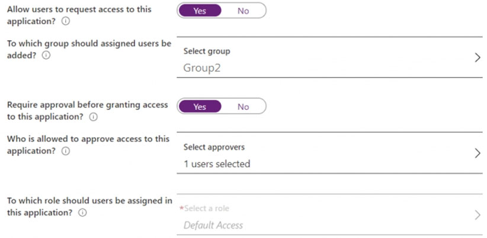

- [ ] Group2 owners: User2 and User3 only. App1 users: Group1 members only.
- [x] Group2 owners: User2 only. App1 users: Group1 and Group2 members only.
- [ ] Group2 owners: User1, User2, and User3. App1 users: Group1 and Group2 members and User1 only.
- [ ] Group2 owners: User1 and User2 only. App1 users: Group1 and Group2 members only.

**[⬆ Back to Top](#table-of-contents)**

### You have an Azure Active Directory (Azure AD) tenant named contoso.com that contains three security groups named Group1, Group2, and Group3 and the users shown in the following table. Group3 is a member of Group2. In contoso.com, you register an enterprise application named App1 that has the following settings: Owners: User1. Users and groups: Group2. You configure the properties of App1 as shown in the following exhibit. User1 has App1 listed on his My Apps portal.

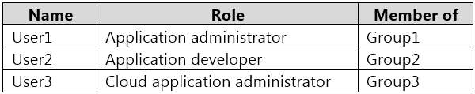
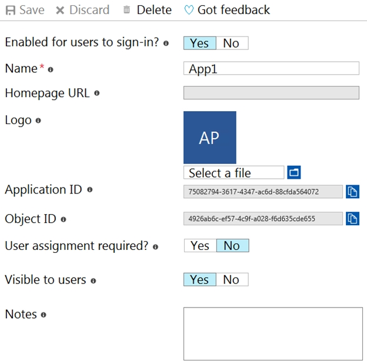

- [ ] Yes.
- [x] No.

**[⬆ Back to Top](#table-of-contents)**

### You have an Azure Active Directory (Azure AD) tenant named contoso.com that contains three security groups named Group1, Group2, and Group3 and the users shown in the following table. Group3 is a member of Group2. In contoso.com, you register an enterprise application named App1 that has the following settings: Owners: User1. Users and groups: Group2. You configure the properties of App1 as shown in the following exhibit. User2 has App1 listed on his My Apps portal.

- [x] Yes.
- [ ] No.

**[⬆ Back to Top](#table-of-contents)**

### You have an Azure Active Directory (Azure AD) tenant named contoso.com that contains three security groups named Group1, Group2, and Group3 and the users shown in the following table. Group3 is a member of Group2. In contoso.com, you register an enterprise application named App1 that has the following settings: Owners: User1. Users and groups: Group2. You configure the properties of App1 as shown in the following exhibit. User3 has App1 listed on his My Apps portal.

- [ ] Yes.
- [x] No.

**[⬆ Back to Top](#table-of-contents)**

### You have an Azure subscription named Sub1 that contains an Azure Log Analytics workspace named LAW1. You have 100 on-premises servers that run Windows Server 2012 R2 and Windows Server 2016. The servers connect to LAW1. LAW1 is configured to collect security-related performance counters from the connected servers. You need to configure alerts based on the data collected by LAW1. The solution must meet the following requirements: Alert rules must support dimensions. The time it takes to generate an alert must be minimized. Alert notifications must be generated only once when the alert is generated and once when the alert is resolved. Which signal type should you use when you create the alert rules?

- [ ] Log.
- [ ] Log (Saved Query).
- [x] Metric.
- [ ] Activity Log.

**[⬆ Back to Top](#table-of-contents)**

### You have an Azure subscription named Sub1 that contains an Azure Log Analytics workspace named LAW1. You have 500 Azure virtual machines that run Windows Server 2016 and are enrolled in LAW1. You plan to add the System Update Assessment solution to LAW1. You need to ensure that System Update Assessment-related logs are uploaded to LAW1 from 100 of the virtual machines only. Which three actions should you perform in sequence?

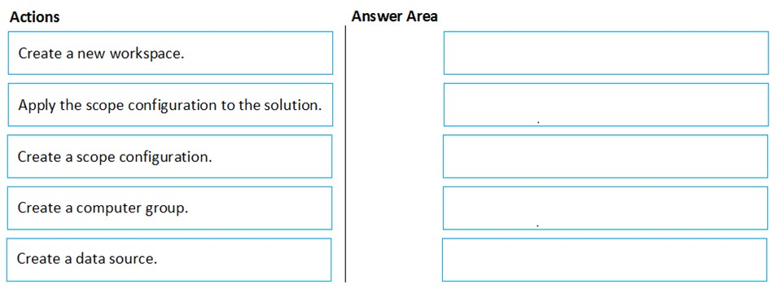

- [ ] Box 1: Create a new workspace. Box 2: Create a computer group. Box 3: Apply the scope configuration to the solution.
- [ ] Box 1: Create a data source. Box 2: Create a scope configuration. Box 3: Apply the scope configuration to the solution.
- [ ] Box 1: Create a computer group. Box 2: Create a new workspace. Box 3: Apply the scope configuration to the solution.
- [x] Box 1: Create a computer group. Box 2: Create a scope configuration. Box 3: Apply the scope configuration to the solution.

**[⬆ Back to Top](#table-of-contents)**

### Your network contains an Active Directory forest named contoso.com. You have an Azure Directory (Azure AD) tenant named contoso.com. You plan to configure synchronization by using the Express Settings installation option in Azure AD Connect. You need to identify which roles and groups are required to perform the planned configurations. The solution must use the principle of least privilege. Which two roles and groups should you identify?

- [ ] Domain Admins group in Active Directory.
- [ ] Security administrator role in Azure AD.
- [x] Global administrator role in Azure AD.
- [ ] User administrator role in Azure AD.
- [x] Enterprise Admins group in Active Directory.

**[⬆ Back to Top](#table-of-contents)**

### You onboard Azure Sentinel. You connect Azure Sentinel to Azure Security Center. You need to automate the mitigation of incidents in Azure Sentinel. The solution must minimize administrative effort. What should you create?

- [ ] Alert rule.
- [x] Playbook.
- [ ] Function app.
- [ ] Runbook.

**[⬆ Back to Top](#table-of-contents)**

### You need to ensure that connections from the Internet to VNET1subnet0 are allowed only over TCP port 7777. The solution must use only currently deployed resources. To complete this task, sign in to the Azure portal.

- [x] 1. All services or type 'network security groups' on the search bar. 2. Click your target NSG. 3. on Settings. 4. Click 'Inbound security rules'. 5. Click + Add. 6. Source: service tag, destination port: 7777, Protocol: TCP, Priority: 100, Name:<provide name>. 7. Leave the rest as defaults. 8. Click Add.

**[⬆ Back to Top](#table-of-contents)**

### You need to configure a weekly backup of an Azure SQL database named Homepage. The backup must be retained for eight weeks. To complete this task, sign in to the Azure portal.

- [x] 1. Go to Search. 2. 'Homepage'. 3. Database overview. 4. Click on Server name. 5. Manage Backups. 6. Choose database 'Homepage'. 7. Configure retention. 8. Long-term Retention Configurations set to 8 weeks.

**[⬆ Back to Top](#table-of-contents)**

### You need to ensure that connections through an Azure Application Gateway named Homepage-AGW are inspected for malicious requests. To complete this task, sign in to the Azure portal.

- [x] 1. In the Azure portal, type Application gateways in the search box, select Application gateways from the search results then select the gateway named Homepage-AGW. Alternatively, browse to Application Gateways in the left navigation panel. 2. In the properties section of the application gateway, click on Web application firewall. 3. For the Tier setting, select WAF V2. 4. In the Firewall status section, click the slider to switch to Enabled. 5. In the Firewall mode section, click the slider to switch to Prevention. 6. Click Save to save the changes.

**[⬆ Back to Top](#table-of-contents)**

### You have an Azure subscription that contains a user named Admin1 and a resource group named RG1. In Azure Monitor, you create the alert rules shown in the following table. Admin1 performs the following actions on RG1: Adds a virtual network named VNET1. Adds a Delete lock named Lock1. Which rules will trigger an alert as a result of the actions of Admin1?

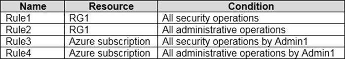
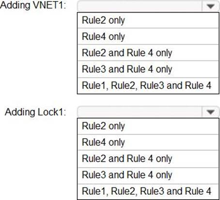

- [ ] Adding VNET1: Rule2 only. Adding Lock1: Rule1, Rule2, Rule3, and Rule 4 Box 2.
- [ ] Adding VNET1: Rule4 only. Adding Lock1: Rule3 and Rule 4 only Box 2.
- [x] Adding VNET1: Rule2 and Rule 4 only. Adding Lock1: Rule2 and Rule 4 only.
- [ ] Adding VNET1: Rule3 and Rule 4 only. Adding Lock1: Rule4 only.

**[⬆ Back to Top](#table-of-contents)**

### You need to configure a virtual network named VNET2 to meet the following requirements: Administrators must be prevented from deleting VNET2 accidentally. Administrators must be able to add subnets to VNET2 regularly. To complete this task, sign in to the Azure portal and modify the Azure resources.

- [x] 1. In the Azure portal, type Virtual Networks in the search box, select Virtual Networks from the search results then select VNET2. Alternatively, browse to Virtual Networks in the left navigation panel. 2. In the Settings blade for virtual network VNET2, select Locks. 3. To add a lock, select Add. 4. For Lock type select Delete lock, and click OK.
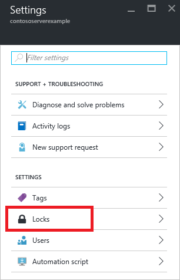
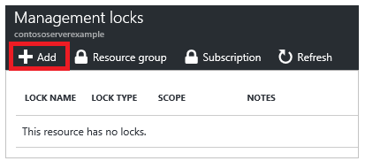

**[⬆ Back to Top](#table-of-contents)**

### You need to enable Advanced Data Security for the SQLdb1 Azure SQL database. The solution must ensure that Azure Advanced Threat Protection (ATP) alerts are sent to <User1@contoso.com>. To complete this task, sign in to the Azure portal and modify the Azure resources.

- [x] 1. Database. 2. Security. 3. Security Center. 4. Click on Settings icon in the bar above the graphs. 5. Check 'Enable Azure Defender for SQL server settings'.

**[⬆ Back to Top](#table-of-contents)**

### You have an Azure subscription that contains the resources shown in the following table. An IP address of 10.1.0.4 is assigned to VM5. VM5 does not have a public IP address. VM5 has just in time (JIT) VM access configured as shown in the following exhibit. You enable JIT VM access for VM5. NSG1 has the inbound rules shown in the following exhibit. Deleting the security rule that has a priority of 100 will revoke the approved JIT access request.

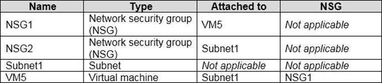
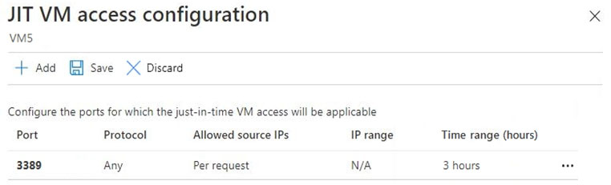
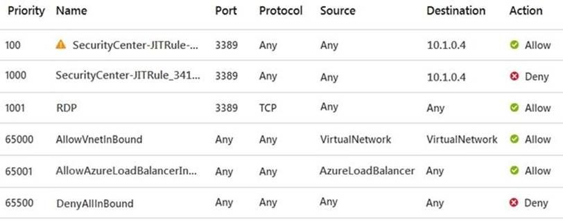

- [x] Yes.
- [ ] No.

**[⬆ Back to Top](#table-of-contents)**

### You have an Azure subscription that contains the resources shown in the following table. An IP address of 10.1.0.4 is assigned to VM5. VM5 does not have a public IP address. VM5 has just in time (JIT) VM access configured as shown in the following exhibit. You enable JIT VM access for VM5. NSG1 has the inbound rules shown in the following exhibit. Deleting the security rule that has a priority of 100 will revoke the approved JIT access request. Remote Desktop access to VM5 is blocked.

- [ ] Yes.
- [x] No.

**[⬆ Back to Top](#table-of-contents)**

### You have an Azure subscription that contains the resources shown in the following table. An IP address of 10.1.0.4 is assigned to VM5. VM5 does not have a public IP address. VM5 has just in time (JIT) VM access configured as shown in the following exhibit. You enable JIT VM access for VM5. NSG1 has the inbound rules shown in the following exhibit. An Azure Bastion host will enable Remote Desktop access to VM5 from the Internet.

- [ ] Yes.
- [x] No.

**[⬆ Back to Top](#table-of-contents)**

### You are implementing conditional access policies. You must evaluate the existing Azure Active Directory (Azure AD) risk events and risk levels to configure and implement the policies. You need to identify the risk level of the following risk events: Users with leaked credentials. Impossible travel to atypical locations. Sign ins from IP addresses with suspicious activity. Which level should you identify for each risk event?

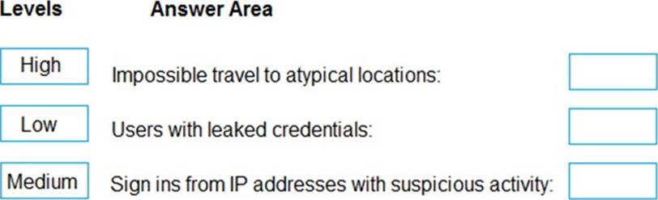

- [ ] Impossible travel to a typical location: Low. Users with leaked credentials: High. Sign-ins from IP addresses with suspicious activity: Low.
- [x] Impossible travel to a typical location: Medium. Users with leaked credentials: High. Sign-ins from IP addresses with suspicious activity: Medium.
- [ ] Impossible travel to a typical location: Medium. Users with leaked credentials: Low. Sign-ins from IP addresses with suspicious activity: Low.
- [ ] Impossible travel to a typical location: Low. Users with leaked credentials: Medium. Sign-ins from IP addresses with suspicious activity: Low.

**[⬆ Back to Top](#table-of-contents)**

### You create an Azure subscription with Azure AD Premium P2. You need to ensure that you can use Azure Active Directory (Azure AD) Privileged Identity Management (PIM) to secure Azure roles. Which three actions should you perform in sequence?

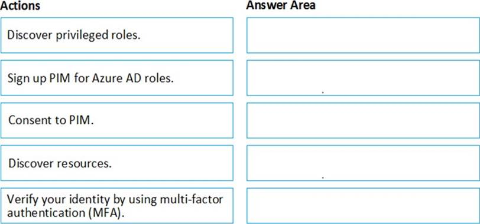

- [x] Box 1: Sign up PIM for Azure AD roles. Box 2: Discover privileged roles. Box 3: Consent to PIM.
- [ ] Box 1: Verify your identity by using multi-factor authentication (MFA). Box 2: Discover privileged roles. Box 3: Sign up PIM for Azure AD roles.
- [ ] Box 1: Discover privileged roles. Box 2: Sign up PIM for Azure AD roles. Box 3: Discover resources.
- [ ] Box 1: Consent to PIM. Box 2: Verify your identity by using multi-factor authentication (MFA). Box 3: Sign up PIM for Azure AD roles.

**[⬆ Back to Top](#table-of-contents)**

### You use Azure Security Center for the centralized policy management of three Azure subscriptions. You use several policy definitions to manage the security of the subscriptions. You need to deploy the policy definitions as a group to all three subscriptions. Solution: You create an initiative and an assignment that is scoped to a management group. Does this meet the goal?

- [x] Yes.
- [ ] No.

**[⬆ Back to Top](#table-of-contents)**

### You use Azure Security Center for the centralized policy management of three Azure subscriptions. You use several policy definitions to manage the security of the subscriptions. You need to deploy the policy definitions as a group to all three subscriptions. Solution: You create a policy definition and assignments that are scoped to resource groups. Does this meet the goal?

- [ ] Yes.
- [x] No.

**[⬆ Back to Top](#table-of-contents)**

### You use Azure Security Center for the centralized policy management of three Azure subscriptions. You use several policy definitions to manage the security of the subscriptions. You need to deploy the policy definitions as a group to all three subscriptions. Solution: You create a resource graph and an assignment that is scoped to a management group. Does this meet the goal?

- [ ] Yes.
- [x] No.

**[⬆ Back to Top](#table-of-contents)**

### You use Azure Security Center for the centralized policy management of three Azure subscriptions. You use several policy definitions to manage the security of the subscriptions. You need to deploy the policy definitions as a group to all three subscriptions. Solution: You create a policy initiative and assignments that are scoped to resource groups. Does this meet the goal?

- [ ] Yes.
- [x] No.

**[⬆ Back to Top](#table-of-contents)**

### You use Azure Security Center for the centralized policy management of three Azure subscriptions. You use several policy definitions to manage the security of the subscriptions. You need to deploy the policy definitions as a group to all three subscriptions. Solution: You create a policy initiative and an assignment that is scoped to the Tenant Root Group management group. Does this meet the goal?

- [x] Yes.
- [ ] No.

**[⬆ Back to Top](#table-of-contents)**

### You have an Azure subscription that contains the resources shown in the following table. You need to ensure that ServerAdmins can perform the following tasks: Create virtual machines in RG1 only. Connect the virtual machines to the existing virtual networks in RG2 only. The solution must use the principle of least privilege. Which two role-based access control (RBAC) roles should you assign to ServerAdmins?

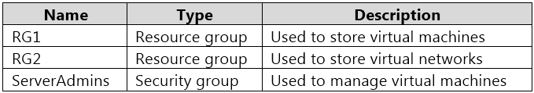

- [ ] Contributor role for the subscription.
- [ ] Network Contributor role for RG2
- [ ] Custom RBAC role for the subscription.
- [x] Custom RBAC role for RG2.
- [ ] Network Contributor role for RG1.
- [x] Virtual Machine Contributor role for RG1.

**[⬆ Back to Top](#table-of-contents)**

### You create a new Azure subscription that is associated to a new Azure Active Directory (Azure AD) tenant. You create one active conditional access policy named Portal Policy. Portal Policy is used to provide access to the Microsoft Azure Management cloud app. The Conditions settings for Portal Policy are configured as shown in the Conditions exhibit. Users from the Contoso named location must use multi-factor authentication (MFA) to access the Azure portal.

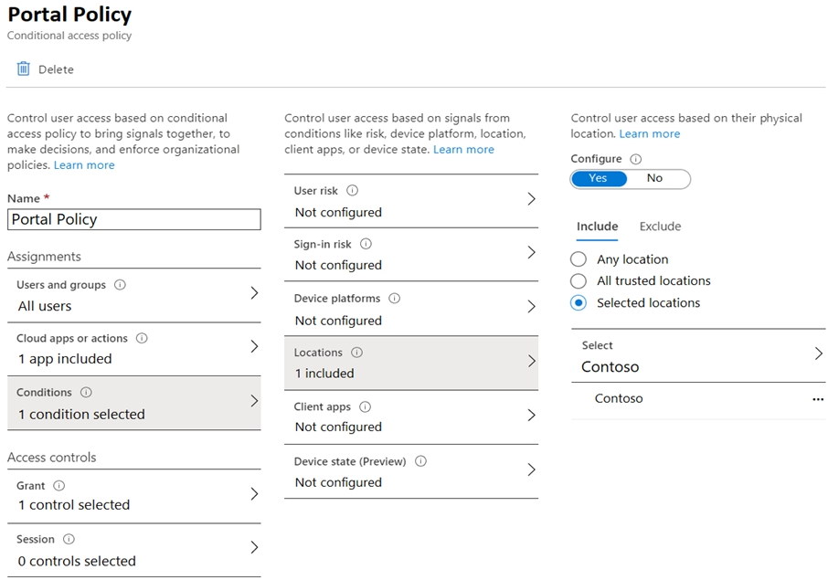
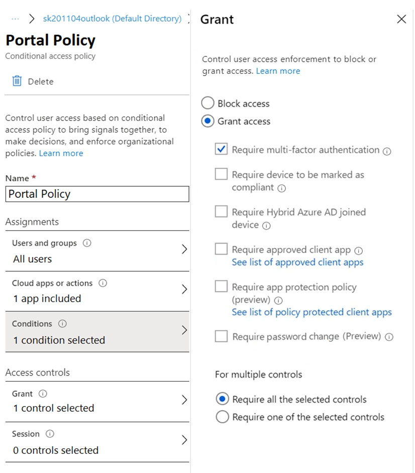

- [x] Yes.
- [ ] No.

**[⬆ Back to Top](#table-of-contents)**

### You create a new Azure subscription that is associated to a new Azure Active Directory (Azure AD) tenant. You create one active conditional access policy named Portal Policy. Portal Policy is used to provide access to the Microsoft Azure Management cloud app. The Conditions settings for Portal Policy are configured as shown in the Conditions exhibit. Users from the Contoso named location must use multi-factor authentication (MFA) to access the web services hosted in the Azure subscription.

- [ ] Yes.
- [x] No.

**[⬆ Back to Top](#table-of-contents)**

### You create a new Azure subscription that is associated to a new Azure Active Directory (Azure AD) tenant. You create one active conditional access policy named Portal Policy. Portal Policy is used to provide access to the Microsoft Azure Management cloud app. The Conditions settings for Portal Policy are configured as shown in the Conditions exhibit. Users external to the Contoso named location must use multi-factor authentication (MFA) to access the Azure portal.

- [ ] Yes.
- [x] No.

**[⬆ Back to Top](#table-of-contents)**

### You need to deploy an Azure firewall to a virtual network named VNET3. To complete this task, sign in to the Azure portal and modify the Azure resources. This task might take several minutes to complete. You can perform other tasks while the task completes.

- [x] When you open the subnet in VNET3, you can already see an existing subnet. Simply delete that and reuse the same subnet with the new AzureFirewallSubnet.

**[⬆ Back to Top](#table-of-contents)**

### You have an Azure Container Registry named Registry1. You add role assignment for Registry1 as shown in the following table. Which users can upload images to Registry1 and download images from Registry1?

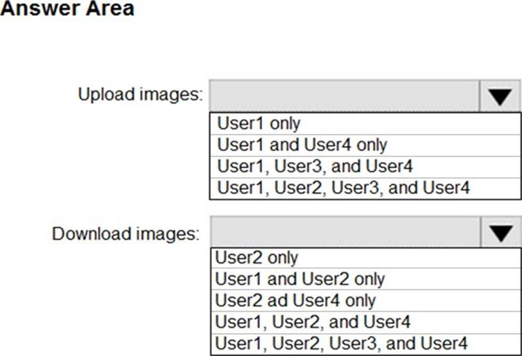

- [x] Upload images: User1 and User4 only. Download images: User1, User2, and User4.
- [ ] Upload images: User1 only. Download images: User2 only.
- [ ] Upload images: User1 and User2 only. Download images: User1 and User2 only.
- [ ] Upload images: User2 and User4 only. Download images: User1, User2, User3 and User4.

**[⬆ Back to Top](#table-of-contents)**

### You have been tasked with configuring an access review, which you plan to assigned to a new collection of reviews. You also have to make sure that the reviews can be reviewed by resource owners. You start by creating an access review program and an access review control. You now need to configure the Reviewers. Which of the following should you set Reviewers to?

- [x] Selected users.
- [ ] Members (Self).
- [ ] Group Owners.
- [ ] Anyone.

**[⬆ Back to Top](#table-of-contents)**

### You need to configure an access review. The review will be assigned to a new collection of reviews and reviewed by resource owners. Which three actions should you perform in sequence?

- [ ] Box 1: Create an access review program. Box 2: Set Reviewers to Group owners. Box 3: Set Reviewers to Members.
- [ ] Box 1: Create an access review program. Box 2: Set Reviewers to Selected users. Box 3: Set Reviewers to Members.
- [x] Box 1: Create an access review program. Box 2: Create an access review control. Box 3: Set Reviewers to Group owners.
- [ ] Box 1: Create an access review audit. Box 2: Set Reviewers to Members. Box 3: Set Reviewers to Group owners.

**[⬆ Back to Top](#table-of-contents)**

### You have an Azure Active Directory (Azure AD) tenant. You have the deleted objects shown in the following table. On May 4, 2020, you attempt to restore the deleted objects by using the Azure Active Directory admin center. Which two objects can you restore?

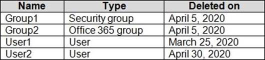

- [ ] Group1.
- [x] Group2
- [x] User2.
- [ ] User1.

**[⬆ Back to Top](#table-of-contents)**

### You have an Azure Active Directory (Azure AD) tenant named contoso.com that contains the users shown in the following table. Azure AD Privileged Identity Management (PIM) is used in contoso.com. In PIM, the Password Administrator role has the following settings: Maximum activation duration (hours): 2. Send email notifying admins of activation: Disable. Require incident/request ticket number during activation: Disable. Require Azure Multi-Factor Authentication for activation: Enable. Require approval to activate this role: Enable. Selected approver: Group1. You assign users the Password Administrator role as shown in the following table. When User1 signs in, the user is assigned the password Administraror role automatically.

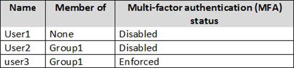

- [x] Yes.
- [ ] No.

**[⬆ Back to Top](#table-of-contents)**

### You have an Azure Active Directory (Azure AD) tenant named contoso.com that contains the users shown in the following table. Azure AD Privileged Identity Management (PIM) is used in contoso.com. In PIM, the Password Administrator role has the following settings: Maximum activation duration (hours): 2. Send email notifying admins of activation: Disable. Require incident/request ticket number during activation: Disable. Require Azure Multi-Factor Authentication for activation: Enable. Require approval to activate this role: Enable. Selected approver: Group1. You assign users the Password Administrator role as shown in the following table. User2 can request to activate the Password Administrator role.

- [x] Yes.
- [ ] No.

**[⬆ Back to Top](#table-of-contents)**

### You have an Azure Active Directory (Azure AD) tenant named contoso.com that contains the users shown in the following table. Azure AD Privileged Identity Management (PIM) is used in contoso.com. In PIM, the Password Administrator role has the following settings: Maximum activation duration (hours): 2. Send email notifying admins of activation: Disable. Require incident/request ticket number during activation: Disable. Require Azure Multi-Factor Authentication for activation: Enable. Require approval to activate this role: Enable. Selected approver: Group1. You assign users the Password Administrator role as shown in the following table. If User3 wants to activate the Password Administrator role, the user can approve their own request.

- [ ] Yes.
- [x] No.

**[⬆ Back to Top](#table-of-contents)**

### You have an Azure subscription that contains the following resources: A virtual network named VNET1 that contains two subnets named Subnet1 and Subnet2. A virtual machine named VM1 that has only a private IP address and connects to Subnet1. You need to ensure that Remote Desktop connections can be established to VM1 from the internet. Which three actions should you perform in sequence?

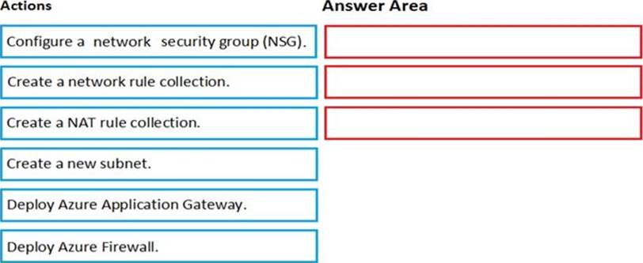

- [ ] Box 1: Create a new subnet. Box 2: Create a NAT rule collection. Box 3: Deploy Azure Firewall.
- [ ] Box 1: Deploy Azure Application Gateway. Box 2: Create a network rule collection. Box 3: Deploy Azure Firewall.
- [ ] Box 1: Deploy Azure Application Gateway. Box 2: Create a NAT rule collection. Box 3: Create a network rule collection.
- [x] Box 1: Create a new subnet. Box 2: Deploy Azure Firewall. Box 3: Create a NAT rule collection.

**[⬆ Back to Top](#table-of-contents)**

### Your network contains an on-premises Active Directory domain named corp.contoso.com. You have an Azure subscription named Sub1 that is associated to an Azure Active Directory (Azure AD) tenant named contoso.com. You sync all on-premises identities to Azure AD. You need to prevent users who have a givenName attribute that starts with TEST from being synced to Azure AD. The solution must minimize administrative effort. What should you use?

- [x] Synchronization Rules Editor.
- [ ] Web Service Configuration Tool.
- [ ] Azure AD Connect wizard.
- [ ] Active Directory Users and Computers.

**[⬆ Back to Top](#table-of-contents)**

### Your company has an Azure subscription named Sub1 that is associated to an Azure Active Directory Azure (Azure AD) tenant named contoso.com. The company develops a mobile application named App1. App1 uses the OAuth 2 implicit grant type to acquire Azure AD access tokens. You need to register App1 in Azure AD. What information should you obtain from the developer to register the application?

- [x] Redirect URI.
- [ ] Reply URL.
- [ ] Key.
- [ ] Application ID.

**[⬆ Back to Top](#table-of-contents)**

### Your company has an Azure subscription named Sub1 that is associated to an Azure Active Directory (Azure AD) tenant named contoso.com. The company develops an application named App1. App1 is registered in Azure AD. You need to ensure that App1 can access secrets in Azure Key Vault on behalf of the application users. What should you configure?

- [ ] Application permission without admin consent.
- [x] Delegated permission without admin consent.
- [ ] Delegated permission that requires admin consent.
- [ ] Application permission that requires admin consent.

**[⬆ Back to Top](#table-of-contents)**

### You have an Azure subscription named Subscription1 that contains the resources shown in the following table. You create an Azure role by using the following JSON file. You assign Role1 to User1 for RG1. User1 can create a new virtual machine in RG1.

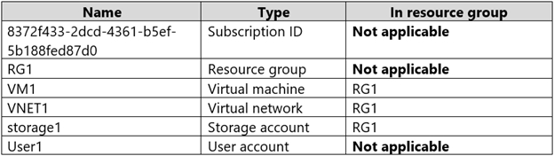
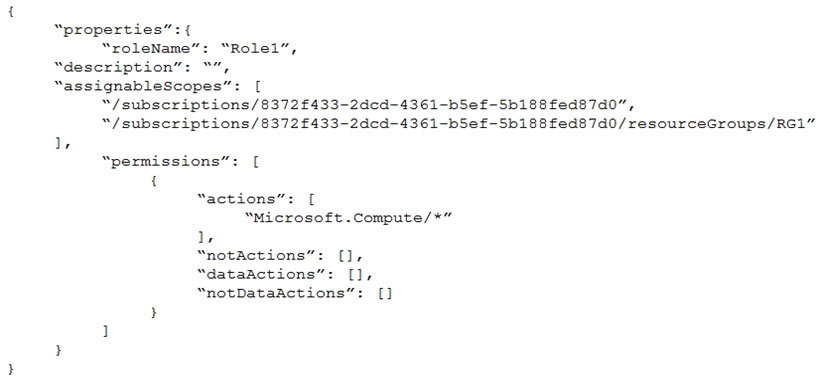

- [ ] Yes.
- [x] No.

**[⬆ Back to Top](#table-of-contents)**

### You have an Azure subscription named Subscription1 that contains the resources shown in the following table. You create a custom RBAC role in Subscription1 by using the following JSON file. You assign Role1 to User1 for RG1. User1 can modify the properties of storage1.

- [ ] Yes.
- [x] No.

**[⬆ Back to Top](#table-of-contents)**

### You have an Azure subscription named Subscription1 that contains the resources shown in the following table. You create a custom RBAC role in Subscription1 by using the following JSON file. You assign Role1 to User1 for RG1. User1 can attach the network interface of VM1 to VNET1.

- [ ] Yes.
- [x] No.

**[⬆ Back to Top](#table-of-contents)**

### You have an Azure subscription named Subscription1 that contains the resources shown in the following table. You create a custom RBAC role in Subscription1 by using the following JSON file. You assign Role1 to User1 on RG1. User1 can add VM1 to VNET1.

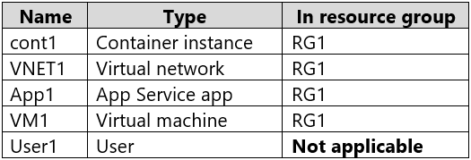
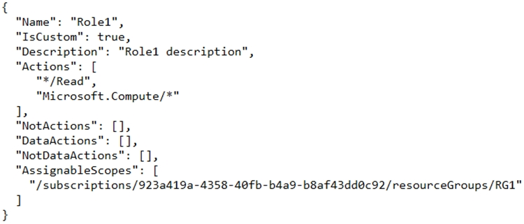

- [ ] Yes.
- [x] No.

**[⬆ Back to Top](#table-of-contents)**

### You have an Azure subscription named Subscription1 that contains the resources shown in the following table. You create a custom RBAC role in Subscription1 by using the following JSON file. You assign Role1 to User1 on RG1. User1 can start and stop App1.

- [ ] Yes.
- [x] No.

**[⬆ Back to Top](#table-of-contents)**

### You have an Azure subscription named Subscription1 that contains the resources shown in the following table. You create a custom RBAC role in Subscription1 by using the following JSON file. You assign Role1 to User1 on RG1. User1 can start and stop cont1.

- [ ] Yes.
- [x] No.

**[⬆ Back to Top](#table-of-contents)**

### You are testing an Azure Kubernetes Service (AKS) cluster. The cluster is configured as shown in the exhibit. You plan to deploy the cluster to production. You disable HTTP application routing. You need to implement application routing that will provide reverse proxy and TLS termination for AKS services by using a single IP address. What should you do?

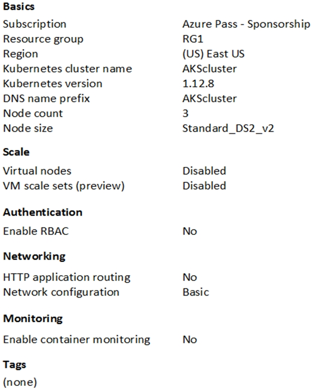

- [x] Create an AKS Ingress controller.
- [ ] Install the container network interface (CNI) plug-in.
- [ ] Create an Azure Standard Load Balancer.
- [ ] Create an Azure Basic Load Balancer.

**[⬆ Back to Top](#table-of-contents)**

### You need to consider the underlined segment to establish whether it is accurate. You have configured an Azure Kubernetes Service (AKS) cluster in your testing environment. You are currently preparing to deploy the cluster to the production environment. After disabling HTTP application routing, you want to replace it with an application routing solution that allows for reverse proxy and TLS termination for AKS services via a solitary IP address. You must create an AKS Ingress controller.

- [x] No adjustment required.
- [ ] Network security group.
- [ ] Application security group.
- [ ] Azure Basic Load Balancer.

**[⬆ Back to Top](#table-of-contents)**

### You have a hybrid configuration of Azure Active Directory (Azure AD). All users have computers that run Windows 10 and are hybrid Azure AD joined. You have an Azure SQL database that is configured to support Azure AD authentication. Database developers must connect to the SQL database by using Microsoft SQL Server Management Studio (SSMS) and authenticate by using their on-premises Active Directory account. You need to tell the developers which authentication method to use to connect to the SQL database from SSMS. The solution must minimize authentication prompts. Which authentication method should you instruct the developers to use?

- [ ] SQL Login.
- [ ] Active Directory - Universal with MFA support.
- [x] Active Directory - Integrated.
- [ ] Active Directory - Password.

**[⬆ Back to Top](#table-of-contents)**

### You have a hybrid configuration of Azure Active Directory (Azure AD) that has Single Sign-On (SSO) enabled. You have an Azure SQL Database instance that is configured to support Azure AD authentication. Database developers must connect to the database instance from the domain joined device and authenticate by using their on-premises Active Directory account. You need to ensure that developers can connect to the instance by using Microsoft SQL Server Management Studio. The solution must minimize authentication prompts. Which authentication method should you recommend?

- [ ] SQL Login.
- [ ] Active Directory - Universal with MFA support.
- [x] Active Directory - Integrated.
- [ ] Active Directory - Password.

**[⬆ Back to Top](#table-of-contents)**

### You have an Azure subscription. The subscription contains Azure virtual machines that run Windows Server 2016. You need to implement a policy to ensure that each virtual machine has a custom antimalware virtual machine extension installed. How should you complete the policy?

- [ ] Box 1: Append. Box 2: existenceCondition.
- [ ] Box 1: Deny. Box 2: resources.
- [x] Box 1: DeployNotExists. Box 2: template.
- [ ] Box 1: DeployNotExists. Box 2: resources.

**[⬆ Back to Top](#table-of-contents)**

### You have an Azure subscription named Sub1 that is associated to an Azure Active Directory (Azure AD) tenant named contoso.com. You are assigned the Global administrator role for the tenant. You are responsible for managing Azure Security Center settings. You need to create a custom sensitivity label. What should you do?

- [x] Create a custom sensitive information type.
- [ ] Elevate access for global administrators in Azure AD.
- [ ] Upgrade the pricing tier of the Security Center to Standard.
- [ ] Enable integration with Microsoft Cloud App Security.

**[⬆ Back to Top](#table-of-contents)**

### You have an Azure subscription that contains 100 virtual machines. Azure Diagnostics is enabled on all the virtual machines. You are planning the monitoring of Azure services in the subscription. You need to retrieve the following details: Identify the user who deleted a virtual machine three weeks ago. Query the security events of a virtual machine that runs Windows Server 2016. What should you use in Azure Monitor?

- [ ] Identify the user who deleted a virtual machine three weeks ago: Metrics. Query the security events of a virtual machine that runs Windows Server 2016: Activity log.
- [x] Identify the user who deleted a virtual machine three weeks ago: Activity log. Query the security events of a virtual machine that runs Windows Server 2016: Logs.
- [ ] Identify the user who deleted a virtual machine three weeks ago: Logs. Query the security events of a virtual machine that runs Windows Server 2016: Logs.
- [ ] Identify the user who deleted a virtual machine three weeks ago: Service Health. Query the security events of a virtual machine that runs Windows Server 2016: Metrics.

**[⬆ Back to Top](#table-of-contents)**

### You have two Azure virtual machines in the East US2 region as shown in the following table. You deploy and configure an Azure Key vault. You need to ensure that you can enable Azure Disk Encryption on VM1 and VM2. What should you modify on each virtual machine?

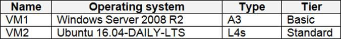

- [ ] VM1: The tier. VM2: The operating system version.
- [ ] VM1: The operating system version. VM2: The type.
- [ ] VM1: The type. VM2: The tier.
- [x] VM1: The tier. VM2: The type.

**[⬆ Back to Top](#table-of-contents)**

### You have an Azure SQL database. You implement Always Encrypted. You need to ensure that application developers can retrieve and decrypt data in the database. Which two pieces of information should you provide to the developers?

- [ ] Stored access policy.
- [ ] Shared access signature (SAS).
- [x] Column encryption key.
- [ ] User credentials.
- [x] Column master key.

**[⬆ Back to Top](#table-of-contents)**

### Your company has an Azure SQL database that has Always Encrypted enabled. You are required to make the relevant information available to application developers to allow them to access data in the database. Which two of the following options should be made available?

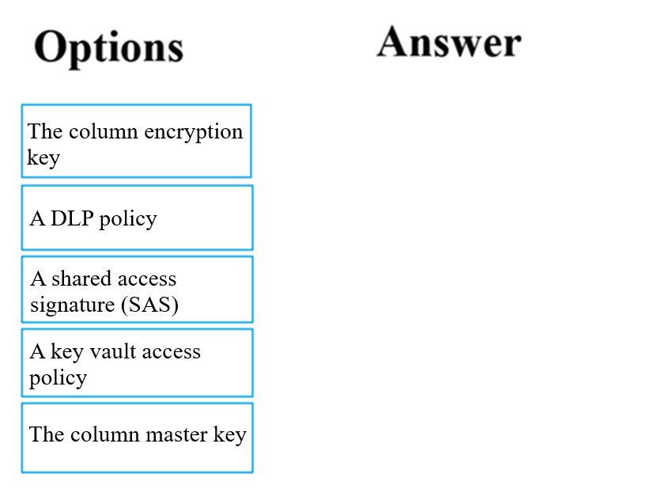

- [ ] Key vault access policy.
- [ ] Shared access signature (SAS).
- [x] Column encryption key.
- [ ] DLP policy.
- [x] Column master key.

**[⬆ Back to Top](#table-of-contents)**

### You have an Azure SQL Database server named SQL1. You plan to turn on Advanced Threat Protection for SQL1 to detect all threat detection types. Which action will Advanced Threat Protection detect as a threat?

- [ ] User updates more than 50 percent of the records in a table.
- [x] User attempts to sign as SELECT * FROM table1.
- [ ] User is added to the db_owner database role.
- [ ] User deletes more than 100 records from the same table.

**[⬆ Back to Top](#table-of-contents)**

### You have an Azure SQL Database server named SQL1. For SQL1, you turn on Azure Defender for SQL to detect all threat detection types. Which action will Azure Defender for SQL detect as a threat?

- [ ] User updates more than 50 percent of the records in a table.
- [x] User attempts to sign as SELECT * FROM table1.
- [ ] User is added to the db_owner database role.
- [ ] User deletes more than 100 records from the same table.

**[⬆ Back to Top](#table-of-contents)**

### Your company uses Azure DevOps. You need to recommend a method to validate whether the code meets the company's quality standards and code review standards. What should you recommend implementing in Azure DevOps?

- [ ] Branch folders.
- [ ] Branch permissions.
- [x] Branch policies.
- [ ] Branch locking.

**[⬆ Back to Top](#table-of-contents)**

### You have an Azure Active Directory (Azure AD) tenant named contoso.com. The tenant contains the users shown in the following table. You configure an access review named Review1 as shown in the following exhibit. Use the drop-down menus to select the answer choice that completes each statement based on the information presented in the graphic.

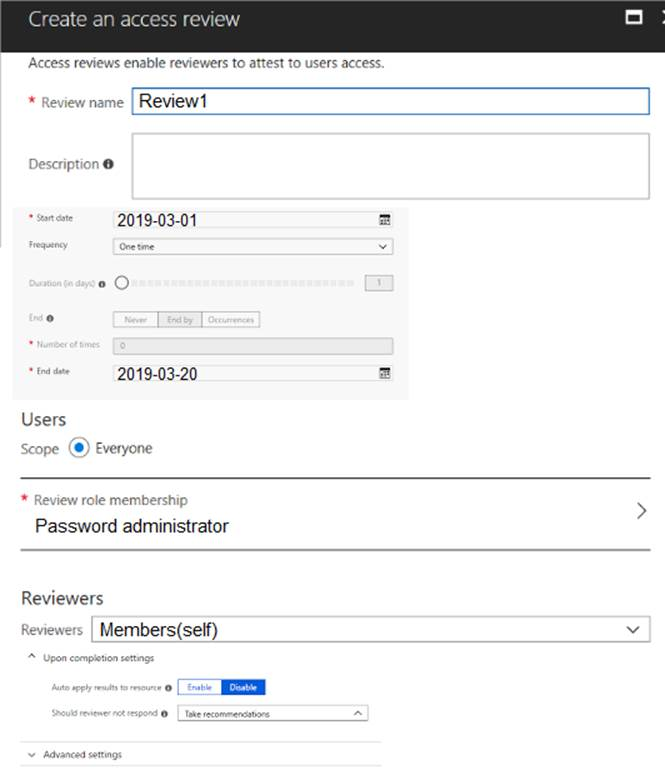

- [ ] User3 can perform Review1 for: User3 only. If User2 fails to complete Review1 by March 20, 2019: User3 will receive a confirmation request.
- [ ] User3 can perform Review1 for: User1 and User2 only. If User2 fails to complete Review1 by March 20, 2019: The Password administrator role will be revoked from User2.
- [ ] User3 can perform Review1 for: User1, User2 and User3. If User2 fails to complete Review1 by March 20, 2019: User2 will retain the Password administrator role.
- [x] User3 can perform Review1 for: User3 only. If User2 fails to complete Review1 by March 20, 2019: User2 will retain the Password administrator role.

**[⬆ Back to Top](#table-of-contents)**

### Contoso, Ltd. is a consulting company that has a main office in Montreal and two branch offices in Seattle and New York. The company hosts its entire server infrastructure in Azure. Contoso has two Azure subscriptions named Sub1 and Sub2. Both subscriptions are associated to an Azure Active Directory (Azure AD) tenant named contoso.com. Contoso identifies the following technical requirements: Deploy Azure Firewall to VNetwork1 in Sub2. Register an application named App2 in contoso.com. Whenever possible, use the principle of least privilege. Enable Azure AD Privileged Identity Management (PIM) for contoso.com. Contoso.com contains the users shown in the following table. Contoso.com contains the security groups shown in the following table. Sub1 contains six resource groups named RG1, RG2, RG3, RG4, RG5, and RG6. User9 creates the virtual networks shown in the following table. Sub1 contains the locks shown in the following table. Sub1 contains the Azure policies shown in the following table. Sub2 contains the virtual networks shown in the following table. Sub2 contains the virtual machines shown in the following table. All virtual machines have the public IP addresses and the Web Server (IIS) role installed. The firewalls for each virtual machine allow ping requests and web requests. Sub2 contains the network security groups (NSGs) shown in the following table. NSG1 has the inbound security rules shown in the following table. NSG2 has the inbound security rules shown in the following table. NSG3 has the inbound security rules shown in the following table. NSG4 has the inbound security rules shown in the following table. NSG1, NSG2, NSG3, and NSG4 have the outbound security rules shown in the following table. Which virtual networks in Sub1 can User2 modify and delete in their current state?

- [x] Virtual networks that User2 can modify: VNET4 and VNET1 only. Virtual networks that User2 can delete: VNET4 only.
- [ ] Virtual networks that User2 can modify: VNET4 and VNET1 only. Virtual networks that User2 can delete: VNET4, VNET3,VNET 2 and VNET1.
- [ ] Virtual networks that User2 can modify: VNET4, VNET3, and VNET1 only. Virtual networks that User2 can delete: VNET4, VNET3,VNET 2 and VNET1.
- [ ] Virtual networks that User2 can modify: VNET4, VNET3,VNET 2 and VNET1. Virtual networks that User2 can delete: VNET4 only.

**[⬆ Back to Top](#table-of-contents)**

### Your company has two offices in Seattle and New York. Each office connects to the Internet by using a NAT device. The offices use the IP addresses shown in the following table. The company has an Azure Active Directory (Azure AD) tenant named contoso.com. The tenant contains the users shown in the following table. The MFA service settings are configured as shown in the exhibit. If User1 signs in to Azure from a device that users an IP address of 134.18.14.10, User1 must be authenticated by using a phone.

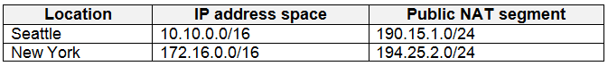
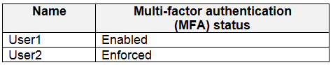
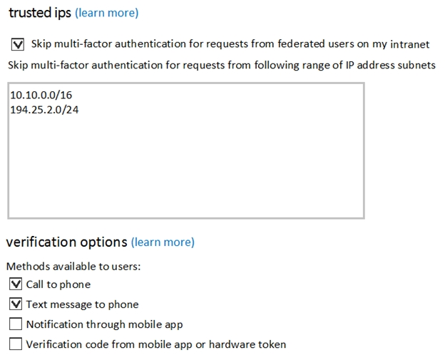

- [x] Yes.
- [ ] No.

**[⬆ Back to Top](#table-of-contents)**

### Your company has two offices in Seattle and New York. Each office connects to the Internet by using a NAT device. The offices use the IP addresses shown in the following table. The company has an Azure Active Directory (Azure AD) tenant named contoso.com. The tenant contains the users shown in the following table. The MFA service settings are configured as shown in the exhibit. If User2 signs in to Azure from a device in the Seattle office, User2 must be authenticated by using the Microsoft Authenticator app.

- [ ] Yes.
- [x] No.

**[⬆ Back to Top](#table-of-contents)**

### Your company has two offices in Seattle and New York. Each office connects to the Internet by using a NAT device. The offices use the IP addresses shown in the following table. The company has an Azure Active Directory (Azure AD) tenant named contoso.com. The tenant contains the users shown in the following table. The MFA service settings are configured as shown in the exhibit. If User2 signs in to Azure from a device in the New York office, User2 must be authenticated by using a phone.

- [ ] Yes.
- [x] No.

**[⬆ Back to Top](#table-of-contents)**

### From the Azure portal, you are configuring an Azure policy. You plan to assign policies that use the DeployIfNotExist, AuditIfNotExist, Append, and Deny effects. Which effect requires a managed identity for the assignment?

- [ ] AuditIfNotExist.
- [ ] Append.
- [x] DeployIfNotExist.
- [ ] Deny.

**[⬆ Back to Top](#table-of-contents)**

### You are in the process of configuring an Azure policy via the Azure portal. Your policy will include an effect that will need a managed identity for it to be assigned. Which of the following is the effect in question?

- [ ] AuditIfNotExist.
- [ ] Disabled.
- [x] DeployIfNotExist.
- [ ] EnforceOPAConstraint.

**[⬆ Back to Top](#table-of-contents)**

### You create a new Azure subscription. You need to ensure that you can create custom alert rules in Azure Security Center. Which two actions should you perform?

- [ ] Onboard Azure Active Directory (Azure AD) Identity Protection.
- [ ] Create an Azure Storage account.
- [ ] Implement Azure Advisor recommendations.
- [x] Create an Azure Log Analytics workspace.
- [x] Upgrade the pricing tier of Security Center to Standard.

**[⬆ Back to Top](#table-of-contents)**

### After creating a new Azure subscription, you are tasked with making sure that custom alert rules can be created in Azure Security Center. You have created an Azure Storage account. Which of the following is the action you should take?

- [ ] You should make sure that Azure Active Directory (Azure AD) Identity Protection is removed.
- [ ] You should create a DLP policy.
- [x] You should create an Azure Log Analytics workspace.
- [ ] You should make sure that Security Center has the necessary tier configured.

**[⬆ Back to Top](#table-of-contents)**

### You have an Azure subscription that contains the virtual networks shown in the following table. The Azure virtual machines on SpokeVNetSubnet0 can communicate with the computers on the on-premises network. You plan to deploy an Azure firewall to HubVNet. You create the following two routing tables: RT1: Includes a user-defined route that points to the private IP address of the Azure firewall as a next hop address. RT2: Disables BGP route propagation and defines the private IP address of the Azure firewall as the default gateway. You need to ensure that traffic between SpokeVNetSubnet0 and the on-premises network flows through the Azure firewall. To which subnet should you associate each route table?

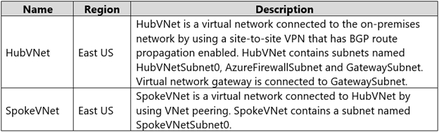
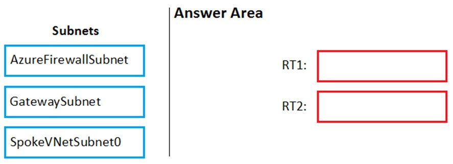

- [ ] RT1: AzureFirewallSubnet. RT2: GatewaySubnet.
- [x] RT1: GatewaySubnet. RT2: SpokeVNetSubnet0.
- [ ] RT1: SpokeVNetSubnet0. RT2: GatewaySubnet.
- [ ] RT1: GatewaySubnet. RT2: AzureFirewallSubnet.

**[⬆ Back to Top](#table-of-contents)**

### You have an Azure subscription that contains the virtual machines shown in the following table. You create the Azure policies shown in the following table. You create the resource locks shown in the following table. You can start VM1.

- [ ] Yes.
- [x] No.

**[⬆ Back to Top](#table-of-contents)**

### You have an Azure subscription that contains the virtual machines shown in the following table. You create the Azure policies shown in the following table. You create the resource locks shown in the following table. You can start VM2.

- [ ] Yes.
- [x] No.

**[⬆ Back to Top](#table-of-contents)**

### You have an Azure subscription that contains the virtual machines shown in the following table. You create the Azure policies shown in the following table. You create the resource locks shown in the following table. You can create a virtual machine in RG2.

- [ ] Yes.
- [x] No.

**[⬆ Back to Top](#table-of-contents)**

### You have an Azure subscription. The subscription contains 50 virtual machines that run Windows Server 2012 R2 or Windows Server 2016. You need to deploy Microsoft Antimalware to the virtual machines. Solution: You connect to each virtual machine and add a Windows feature. Does this meet the goal?

- [ ] Yes.
- [x] No.

**[⬆ Back to Top](#table-of-contents)**

### The developers at your company plan to publish an app named App11641655 to Azure. You need to ensure that the app is registered to Azure Active Directory (Azure AD). The registration must use the sign-on URLs of <https://app.contoso.com>. To complete this task, sign in to the Azure portal and modify the Azure resources.

- [x] 1. Register the Application. 2. Sign in to your Azure Account through the Azure portal. 3. Select Azure Active Directory. 4. Select App registrations. 5. Select New registration. 6. Name the application App12345678. 7. Select a supported account type, which determines who can use the application. 8. Under Redirect URI, select Web for the type of application you want to create. 9. Enter the URI: https://app.contoso.com, where the access token is sent to. 10. Click Register.
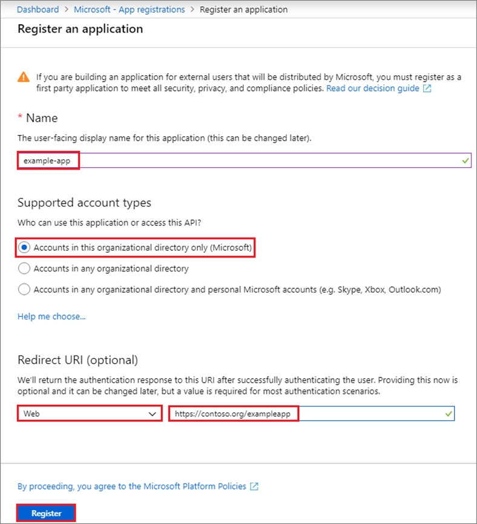

**[⬆ Back to Top](#table-of-contents)**

### From Azure Security Center, you create a custom alert rule. You need to configure which users will receive an email message when the alert is triggered. What should you do?

- [x] From Azure Monitor, create an action group.
- [ ] From Security Center, modify the Security policy settings of the Azure subscription.
- [ ] From Azure Active Directory (Azure AD), modify the members of the Security Reader role group.
- [ ] From Security Center, modify the alert rule.

**[⬆ Back to Top](#table-of-contents)**

### You have an Azure subscription. The subscription contains 50 virtual machines that run Windows Server 2012 R2 or Windows Server 2016. You need to deploy Microsoft Antimalware to the virtual machines. Solution: You add an extension to each virtual machine. Does this meet the goal?

- [x] Yes
- [ ] No.

**[⬆ Back to Top](#table-of-contents)**

### You have an Azure Active Directory (Azure AD) tenant that contains the users shown in the following table. The tenant contains the named locations shown in the following table. You create the conditional access policies for a cloud app named App1 as shown in the following table. User1 can access App1 from an IP address of 154.12.18.10.

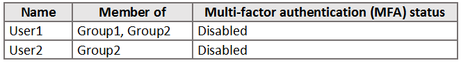
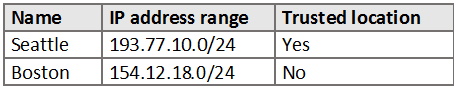
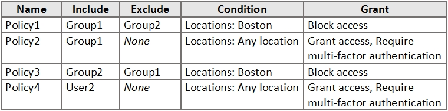

- [x] Yes.
- [ ] No.

**[⬆ Back to Top](#table-of-contents)**

### You have an Azure Active Directory (Azure AD) tenant that contains the users shown in the following table. The tenant contains the named locations shown in the following table. You create the conditional access policies for a cloud app named App1 as shown in the following table. User2 can access App1 from an IP address of 193.77.10.15.

- [x] Yes.
- [ ] No.

**[⬆ Back to Top](#table-of-contents)**

### You have an Azure Active Directory (Azure AD) tenant that contains the users shown in the following table. The tenant contains the named locations shown in the following table. You create the conditional access policies for a cloud app named App1 as shown in the following table. User2 can access App1 from an IP address of 154.12.18.10.

- [ ] Yes.
- [x] No.

**[⬆ Back to Top](#table-of-contents)**

### You have an Azure Active Directory (Azure AD) tenant that contains the users shown in the following table. From Azure AD Privileged Identity Management (PIM), you configure the settings for the Security Administrator role as shown in the following exhibit. From PIM, you assign the Security Administrator role to the following groups: Group1: Active assignment type, permanently assigned. Group2: Eligible assignment type, permanently eligible. User1 can only activate the Security Administrator role in five hours.

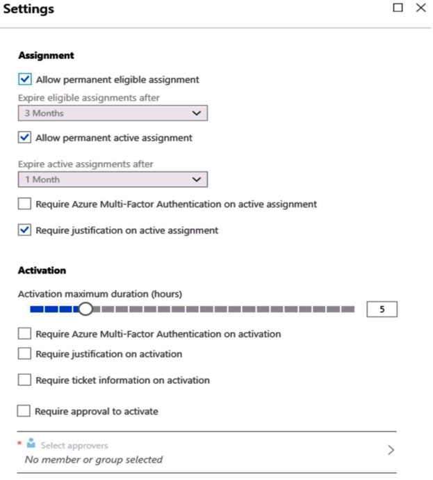

- [ ] Yes.
- [x] No.

**[⬆ Back to Top](#table-of-contents)**

### You have an Azure Active Directory (Azure AD) tenant that contains the users shown in the following table. From Azure AD Privileged Identity Management (PIM), you configure the settings for the Security Administrator role as shown in the following exhibit. From PIM, you assign the Security Administrator role to the following groups: Group1: Active assignment type, permanently assigned. Group2: Eligible assignment type, permanently eligible. If User2 activates the security Administrator role, the user will be assigned the role immediately.

- [x] Yes.
- [ ] No.

**[⬆ Back to Top](#table-of-contents)**

### You have an Azure Active Directory (Azure AD) tenant that contains the users shown in the following table. From Azure AD Privileged Identity Management (PIM), you configure the settings for the Security Administrator role as shown in the following exhibit. From PIM, you assign the Security Administrator role to the following groups: Group1: Active assignment type, permanently assigned. Group2: Eligible assignment type, permanently eligible. User3 can activate the Security Administrator role.

- [ ] Yes.
- [x] No.

**[⬆ Back to Top](#table-of-contents)**

### You work at a company named Contoso, Ltd. that has the offices shown in the following table. Contoso has an Azure Active Directory (Azure AD) tenant named contoso.com. All contoso.com users have Azure Multi-Factor Authentication (MFA) enabled. The tenant contains the users shown in the following table. The multi-factor settings for contoso.com are configured as shown in the following exhibit. When User1 signs in to Device1 from the Seattle office on June 10, the user will be prompted for MFA.

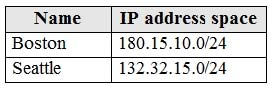
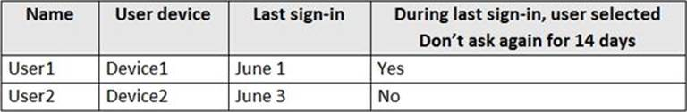

- [ ] Yes.
- [x] No.

**[⬆ Back to Top](#table-of-contents)**

### You work at a company named Contoso, Ltd. that has the offices shown in the following table. Contoso has an Azure Active Directory (Azure AD) tenant named contoso.com. All contoso.com users have Azure Multi-Factor Authentication (MFA) enabled. The tenant contains the users shown in the following table. The multi-factor settings for contoso.com are configured as shown in the following exhibit. When User2 signs in to Device2 from the Seattle office on June 5, the user will be prompted for MFA.

- [ ] Yes.
- [x] No.

**[⬆ Back to Top](#table-of-contents)**

### You work at a company named Contoso, Ltd. that has the offices shown in the following table. Contoso has an Azure Active Directory (Azure AD) tenant named contoso.com. All contoso.com users have Azure Multi-Factor Authentication (MFA) enabled. The tenant contains the users shown in the following table. The multi-factor settings for contoso.com are configured as shown in the following exhibit. When User1 signs in to to a new device from the Seattle office on June 7, the user will be prompted for MFA.

- [x] Yes.
- [ ] No.

**[⬆ Back to Top](#table-of-contents)**

### Your company has the offices shown in the following table. The company has an Azure Active Directory (Azure AD) tenant named contoso.com that contains a user named User1.Users connect to a Windows Virtual Desktop deployment named WVD1. WVD1 contains session hosts that have public IP addresses from the 52.166.253.0/24 subnet.Contoso.com has a conditional access policy that has the following settings: Name: Policy1. Assignments: Users and groups: User1. Cloud apps or actions: Windows Virtual Desktop. Access controls: Grant: Grant access, Require multi-factor authentication. Enable policy: On. If User1 connects to Windows Virtual Desktop from the office in Boston, User1 is prompted for multi-factor authentication (MFA).

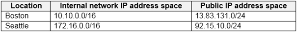

- [x] Yes.
- [ ] No.

**[⬆ Back to Top](#table-of-contents)**

### Your company has the offices shown in the following table. The company has an Azure Active Directory (Azure AD) tenant named contoso.com that contains a user named User1.Users connect to a Windows Virtual Desktop deployment named WVD1. WVD1 contains session hosts that have public IP addresses from the 52.166.253.0/24 subnet.Contoso.com has a conditional access policy that has the following settings: Name: Policy1. Assignments: Users and groups: User1. Cloud apps or actions: Windows Virtual Desktop. Access controls: Grant: Grant access, Require multi-factor authentication. Enable policy: On. If User1 connects to Windows Virtual Desktop from home, User1 is prompted for multi-factor authentication (MFA).

- [x] Yes.
- [ ] No.

**[⬆ Back to Top](#table-of-contents)**

### Your company has the offices shown in the following table. The company has an Azure Active Directory (Azure AD) tenant named contoso.com that contains a user named User1.Users connect to a Windows Virtual Desktop deployment named WVD1. WVD1 contains session hosts that have public IP addresses from the 52.166.253.0/24 subnet.Contoso.com has a conditional access policy that has the following settings: Name: Policy1. Assignments: Users and groups: User1. Cloud apps or actions: Windows Virtual Desktop. Access controls: Grant: Grant access, Require multi-factor authentication. Enable policy: On. If User1 connects to Microsoft Exchange Online from a Windows Virtual Desktop session, User1 is prompted for multi-factor authentication (MFA).

- [ ] Yes.
- [x] No.

**[⬆ Back to Top](#table-of-contents)**

### You have a file named File1.yaml that contains the following contents. You create an Azure container instance named container1 by using File1.yaml. You need to identify where you can access the values of Variable1 and Variable2. What should you identify?

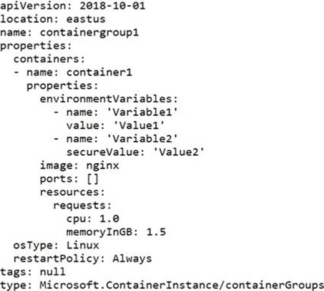
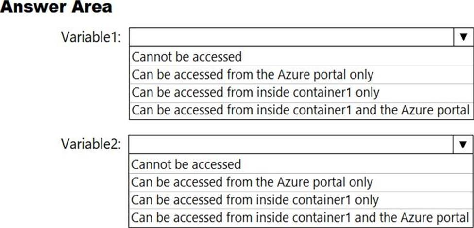

- [ ] Variable1: Cannot be accessed. Variable2: Cannot be accessed.
- [ ] Variable1: Can be accessed from inside container1 only. Variable2: Cannot be accessed.
- [x] Variable1: Can be accessed from inside container1 and the Azure portal. Variable2: Can be accessed from inside container1 only.
- [ ] Variable1: Can be accessed from inside container1 and the Azure portal. Variable2: Cannot be accessed.

**[⬆ Back to Top](#table-of-contents)**

### Fabrikam, Inc. is a consulting company that has a main office in Montreal and branch offices in Seattle and New York. Fabrikam has IT, human resources (HR), and finance departments. Fabrikam has a Microsoft 365 subscription and an Azure subscription named subscription1. The network contains an on-premises Active Directory domain named Fabrikam.com. The domain contains two organizational units (OUs) named OU1 and OU2. Azure AD Connect cloud sync syncs only OU1. The Azure resources hierarchy is shown in the following exhibit. The Azure Active Directory (Azure AD) tenant contains the users shown in the following table. Azure AD contains the resources shown in the following table. Subscription1 contains the virtual networks shown in the following table. Subscription1 contains the network security groups (NSGs) shown in the following table. Subscription1 contains the virtual machines shown in the following table. Subscription1 contains the Azure Key Vaults shown in the following table. Subscription1 contains a storage account named storage1 in the West US Azure region. Fabrikam plans to implement the following changes: Create two application security groups as shown in the following table. Associate the network interface of VM1 to ASG1. Deploy SecPol1 by using Azure Security Center. Deploy a third-party app named App1. A version of App1 exists for all available operating systems. Create a resource group named RG2. Sync OU2 to Azure AD. Add User1 to Group1. Fabrikam identifies the following technical requirements: The finance department users must reauthenticate after three hours when they access SharePoint Online. Storage1 must be encrypted by using customer-managed keys and automatic key rotation. From Sentinel1, you must ensure that the following notebooks can be launched: Entity Explorer – Account. Entity Explorer – Windows Host. Guided Investigation Process Alerts. VM1, VM2, and VM3 must be encrypted by using Azure Disk Encryption. Just in time (JIT) VM access for VM1, VM2, and VM3 must be enabled. App1 must use a secure connection string stored in KeyVault1. KeyVault1 traffic must NOT travel over the internet. You implement the planned changes for ASG1 and ASG2. In which NSGs can you use ASG1 and the network interfaces of which virtual machines can you assign to ASG2?

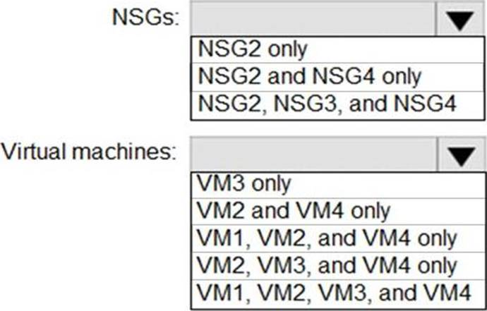

- [ ] NSGs: NSG2 only. Virtual machines: VM1, VM2, and VM4 only.
- [ ] NSGs: NSG2 and NSG4 only. Virtual machines: VM1, VM2, and VM4 only.
- [ ] NSGs: NSG2 and NSG4 only. Virtual machines: VM3 only.
- [x] NSGs: NSG2 only. Virtual machines: VM3 only.

**[⬆ Back to Top](#table-of-contents)**

### Your company has an Active Directory forest with a single domain, named weylandindustries.com. They also have an Azure Active Directory (Azure AD) tenant with the same name.You have been tasked with integrating Active Directory and the Azure AD tenant. You intend to deploy Azure AD Connect. Your strategy for the integration must make sure that password policies and user logon limitations affect user accounts that are synced to the Azure AD tenant, and that the amount of necessary servers are reduced. Solution: You recommend the use of password hash synchronization and seamless SSO. Does the solution meet the goal?

- [ ] Yes.
- [x] No.

**[⬆ Back to Top](#table-of-contents)**

### Your company recently created an Azure subscription. You have been tasked with making sure that a specified user is able to implement Azure AD Privileged Identity Management (PIM). Which of the following is the role you should assign to the user?

- [x] The Global administrator role.
- [ ] The Security administrator role.
- [ ] The Password administrator role.
- [ ] The Compliance administrator role.

**[⬆ Back to Top](#table-of-contents)**

### Your company has an Active Directory forest with a single domain, named weylandindustries.com. They also have an Azure Active Directory (Azure AD) tenant with the same name. You have been tasked with integrating Active Directory and the Azure AD tenant. You intend to deploy Azure AD Connect. Your strategy for the integration must make sure that password policies and user logon limitations affect user accounts that are synced to the Azure AD tenant, and that the amount of necessary servers are reduced. Solution: You recommend the use of federation with Active Directory Federation Services (AD FS). Does the solution meet the goal?

- [ ] Yes.
- [x] No.

**[⬆ Back to Top](#table-of-contents)**

### Your company has an Active Directory forest with a single domain, named weylandindustries.com. They also have an Azure Active Directory (Azure AD) tenant with the same name.You have been tasked with integrating Active Directory and the Azure AD tenant. You intend to deploy Azure AD Connect. Your strategy for the integration must make sure that password policies and user logon limitations affect user accounts that are synced to the Azure AD tenant, and that the amount of necessary servers are reduced. Solution: You recommend the use of pass-through authentication and seamless SSO with password hash synchronization. Does the solution meet the goal?

- [x] Yes.
- [ ] No.

**[⬆ Back to Top](#table-of-contents)**

### You need to delegate the creation of RG2 and the management of permissions for RG1. Which users can perform each task?

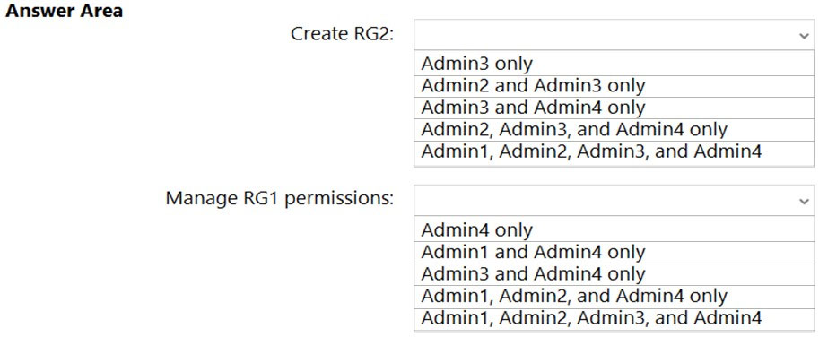

- [ ] Create RG2: Admin3 only. Manage RG1 permissions: Admin4 only.
- [x] Create RG2: Admin3 only. Manage RG1 permissions: Admin1 and Admin4 only.
- [ ] Create RG2: Admin2, Admin3, and Admin4 only. Manage RG1 permissions: Admin1, Admin2, and Admin4 only.
- [ ] Create RG2: Admin1, Admin2, Admin3, and Admin4. Manage RG1 permissions: Admin1, Admin2, Admin3, and Admin4.

**[⬆ Back to Top](#table-of-contents)**

### You have an Azure subscription. You plan to create a workflow automation in Azure Security Center that will automatically remediate a security vulnerability. What should you create first?

- [ ] Automation account.
- [ ] Managed identity.
- [x] Azure Logic App.
- [ ] Azure function app.
- [ ] Alert rule.

**[⬆ Back to Top](#table-of-contents)**

### Your network contains an on-premises Active Directory domain named adatum.com that syncs to Azure Active Directory (Azure AD). Azure AD Connect is installed on a domain member server named Server1. You need to ensure that a domain administrator for the adatum.com domain can modify the synchronization options. The solution must use the principle of least privilege. Which Azure AD role should you assign to the domain administrator?

- [ ] Security administrator.
- [x] Global administrator.
- [ ] User administrator.

**[⬆ Back to Top](#table-of-contents)**

### Your network contains an on-premises Active Directory domain named adatum.com that syncs to Azure Active Directory (Azure AD). The Azure AD tenant contains the users shown in the following table. You configure the Authentication methods Password Protection settings for adatum.com as shown in the following exhibit. User1 will be prompted to change the password on the next sign-in.

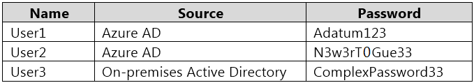

- [ ] Yes.
- [x] No.

**[⬆ Back to Top](#table-of-contents)**

### Your network contains an on-premises Active Directory domain named adatum.com that syncs to Azure Active Directory (Azure AD). The Azure AD tenant contains the users shown in the following table. You configure the Authentication methods Password Protection settings for adatum.com as shown in the following exhibit. User2 can change the password to @d@tum_C0mpleX123.

- [x] Yes.
- [ ] No.

**[⬆ Back to Top](#table-of-contents)**

### Your network contains an on-premises Active Directory domain named adatum.com that syncs to Azure Active Directory (Azure AD). The Azure AD tenant contains the users shown in the following table. You configure the Authentication methods Password Protection settings for adatum.com as shown in the following exhibit. User3 can change the password for Adatum123!.

- [x] Yes.
- [ ] No.

**[⬆ Back to Top](#table-of-contents)**

### You have an Azure Subscription named Sub1. You have an Azure Storage account named Sa1 in a resource group named RG1. Users and applications access the blob service and the file service in Sa1 by using several shared access signatures (SASs) and stored access policies. You discover that unauthorized users accessed both the file service and the blob service. You need to revoke all access to Sa1. Solution: You regenerate the Azure storage account access keys. Does this meet the goal?

- [x] Yes.
- [ ] No.

**[⬆ Back to Top](#table-of-contents)**

### Fabrikam, Inc. is a consulting company that has a main office in Montreal and branch offices in Seattle and New York. Fabrikam has IT, human resources (HR), and finance departments. Fabrikam has a Microsoft 365 subscription and an Azure subscription named subscription1. The network contains an on-premises Active Directory domain named Fabrikam.com. The domain contains two organizational units (OUs) named OU1 and OU2. Azure AD Connect cloud sync syncs only OU1. The Azure resources hierarchy is shown in the following exhibit. The Azure Active Directory (Azure AD) tenant contains the users shown in the following table. Azure AD contains the resources shown in the following table. Subscription1 contains the virtual networks shown in the following table. Subscription1 contains the network security groups (NSGs) shown in the following table. Subscription1 contains the virtual machines shown in the following table. Subscription1 contains the Azure Key Vaults shown in the following table. Subscription1 contains a storage account named storage1 in the West US Azure region. Fabrikam plans to implement the following changes: Create two application security groups as shown in the following table. Associate the network interface of VM1 to ASG1. Deploy SecPol1 by using Azure Security Center. Deploy a third-party app named App1. A version of App1 exists for all available operating systems. Create a resource group named RG2. Sync OU2 to Azure AD. Add User1 to Group1. Fabrikam identifies the following technical requirements: The finance department users must reauthenticate after three hours when they access SharePoint Online. Storage1 must be encrypted by using customer-managed keys and automatic key rotation. From Sentinel1, you must ensure that the following notebooks can be launched: Entity Explorer – Account. Entity Explorer – Windows Host. Guided Investigation Process Alerts. VM1, VM2, and VM3 must be encrypted by using Azure Disk Encryption. Just in time (JIT) VM access for VM1, VM2, and VM3 must be enabled. App1 must use a secure connection string stored in KeyVault1. KeyVault1 traffic must NOT travel over the internet. You plan to configure Azure Disk Encryption for VM4. Which key vault can you use to store the encryption key?

- [x] KeyVault1.
- [ ] KeyVault3.
- [ ] KeyVault2.

**[⬆ Back to Top](#table-of-contents)**

### You have an Azure resource group that contains 100 virtual machines. You have an initiative named Initiative1 that contains multiple policy definitions. Initiative1 is assigned to the resource group. You need to identify which resources do NOT match the policy definitions. What should you do?

- [x] From Azure Security Center, view the Regulatory compliance assessment.
- [ ] From the Policy blade of the Azure Active Directory admin center, select Compliance.
- [ ] From Azure Security Center, view the Secure Score.
- [ ] From the Policy blade of the Azure Active Directory admin center, select Assignments.

**[⬆ Back to Top](#table-of-contents)**

### You have an Azure environment. You need to identify any Azure configurations and workloads that are non-compliant with ISO 27001 standards. What should you use?

- [ ] Azure Sentinel.
- [ ] Azure Active Directory (Azure AD) Identity Protection.
- [x] Microsoft Defender for Cloud.
- [ ] Microsoft Defender for Identity.

**[⬆ Back to Top](#table-of-contents)**

### You have the Azure virtual machines shown in the following table. For which virtual machine can you enable Update Management?

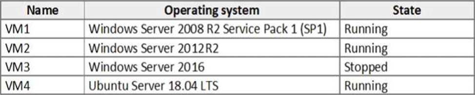

- [ ] VM2 and VM3 only.
- [ ] VM2, VM3, and VM4 only.
- [x] VM1, VM2, and VM4 only.
- [ ] VM1, VM2, VM3, and VM4.
- [ ] VM1, VM2, and VM3 only.

**[⬆ Back to Top](#table-of-contents)**

### You have an Azure Sentinel workspace that has an Azure Active Directory (Azure AD) data connector. You are threat hunting suspicious traffic from a specific IP address. You need to annotate an intermediate event stored in the workspace and be able to reference the IP address when navigating through the investigation graph. Which three actions should you perform in sequence?

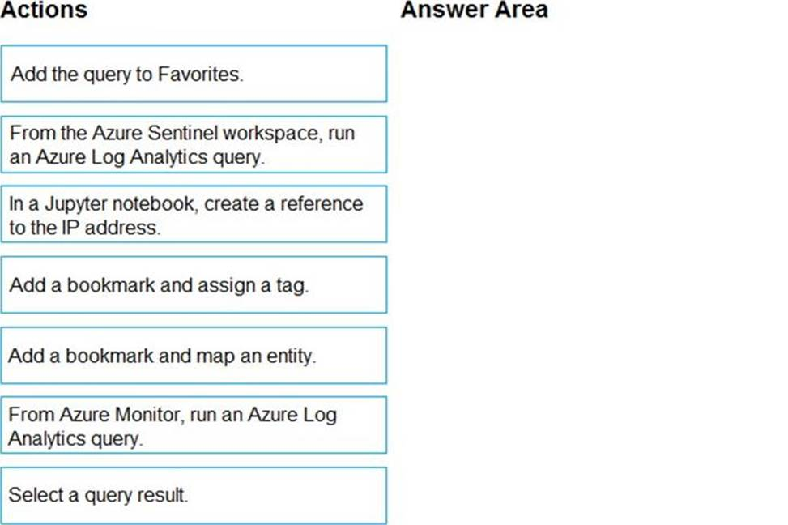

- [x] Box 1: From the Azure Sentinel workspace, run an Azure Log Analytics query. Box 2: Select a query result. Box 3: Add a bookmark and map an entity.
- [ ] Box 1: In a Jupyter notebook, create a reference to the IP address. Box 2: From the Azure Sentinel workspace, run an Azure Log Analytics query. Box 3: Select a query result.
- [ ] Box 1: From Azure Monitor, run an Azure Log Analytics query. Box 2: Add a bookmark and map an entity. Box 3: Add a bookmark and assign a tag.
- [ ] Box 1: Add the query to Favorites. Box 2: From Azure Monitor, run an Azure Log Analytics query. Box 3: In a Jupyter notebook, create a reference to the IP address.

**[⬆ Back to Top](#table-of-contents)**

### You have five Azure subscriptions linked to a single Azure Active Directory (Azure AD) tenant. You create an Azure Policy initiative named SecurityPolicyInitiative1. You identify which standard role assignments must be configured on all new resource groups. You need to enforce SecurityPolicyInitiative1 and the role assignments when a new resource group is created. Which three actions should you perform in sequence?

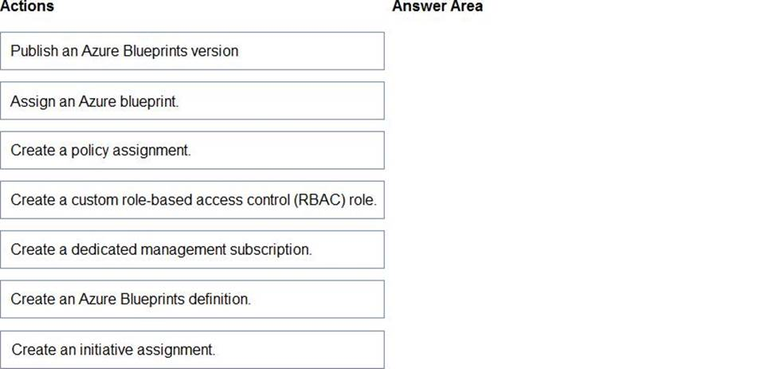

- [ ] Box 1: Publish an Azure Blueprints version. Box 2: Create a policy assignment. Box 3: Create a dedicated management subscription.
- [ ] Box 1: Create an Azure Blueprints definition. Box 2: Publish an Azure Blueprints version. Box 3: Create an initiative assignment.
- [x] Box 1: Create an Azure Blueprints definition. Box 2: Publish an Azure Blueprints version. Box 3: Assign an Azure blueprint.
- [ ] Box 1: Publish an Azure Blueprints version. Box 2: Create a custom role-based access control (RBAC) role. Box 3: Create a dedicated management solution.

**[⬆ Back to Top](#table-of-contents)**

### You plan to use Azure Sentinel to create an analytic rule that will detect suspicious threats and automate responses. Which components are required for the rule?

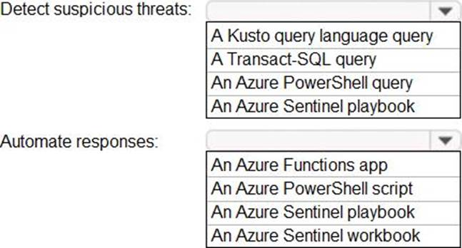

- [ ] Detect suspicious threats: A Transact-SQL query. Automate responses: An Azure Sentinel playbook.
- [ ] Detect suspicious threats: An Azure PowerShell script. Automate responses: An Azure PowerShell script.
- [ ] Detect suspicious threats: A Kusto query language query. Automate responses: An Azure Function app.
- [x] Detect suspicious threats: A Kusto query language query. Automate responses: An Azure Sentinel playbook.

**[⬆ Back to Top](#table-of-contents)**

### You have an Azure Active Directory (Azure AD) tenant. You need to prevent nonprivileged Azure AD users from creating service principals in Azure AD. What should you do in the Azure Active Directory admin center of the tenant?

- [x] From the User settings blade, set Users can register applications to No.
- [ ] From the Properties blade, set Access management for Azure resources to No.
- [ ] From the User settings blade, set Restrict access to Azure AD administration portal to Yes.
- [ ] From the Properties blade, set Enable Security defaults to Yes.

**[⬆ Back to Top](#table-of-contents)**

### You have an Azure subscription that contains the resources shown in the following table. VM1 and VM2 are stopped. You create an alert rule that has the following settings: Resource: RG1. Condition: All Administrative operations. Actions: Action groups configured for this alert rule: ActionGroup1. Alert rule name: Alert1. You create an action rule that has the following settings: Scope: VM1. Filter criteria: Resource Type = 'Virtual Machines'. Define on this scope: Suppression. Suppression config: From now (always). Name: ActionRule1. If you start VM1, an alert is triggered.

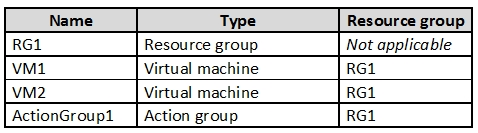

- [ ] Yes.
- [x] No.

**[⬆ Back to Top](#table-of-contents)**

### You have an Azure subscription that contains the resources shown in the following table. VM1 and VM2 are stopped. You create an alert rule that has the following settings: Resource: RG1. Condition: All Administrative operations. Actions: Action groups configured for this alert rule: ActionGroup1. Alert rule name: Alert1. You create an action rule that has the following settings: Scope: VM1. Filter criteria: Resource Type = 'Virtual Machines'. Define on this scope: Suppression. Suppression config: From now (always). Name: ActionRule1. If you start VM2, an alert is triggered.

- [x] Yes.
- [ ] No.

**[⬆ Back to Top](#table-of-contents)**

### You have an Azure subscription that contains the resources shown in the following table. VM1 and VM2 are stopped. You create an alert rule that has the following settings: Resource: RG1. Condition: All Administrative operations. Actions: Action groups configured for this alert rule: ActionGroup1. Alert rule name: Alert1. You create an action rule that has the following settings: Scope: VM1. Filter criteria: Resource Type = 'Virtual Machines'. Define on this scope: Suppression. Suppression config: From now (always). Name: ActionRule1. If you add a tag to RG1, an alert is triggered.

- [x] Yes.
- [ ] No.

**[⬆ Back to Top](#table-of-contents)**

### Fabrikam, Inc. is a consulting company that has a main office in Montreal and branch offices in Seattle and New York. Fabrikam has IT, human resources (HR), and finance departments. Fabrikam has a Microsoft 365 subscription and an Azure subscription named subscription1. The network contains an on-premises Active Directory domain named Fabrikam.com. The domain contains two organizational units (OUs) named OU1 and OU2. Azure AD Connect cloud sync syncs only OU1. The Azure resources hierarchy is shown in the following exhibit. The Azure Active Directory (Azure AD) tenant contains the users shown in the following table. Azure AD contains the resources shown in the following table. Subscription1 contains the virtual networks shown in the following table. Subscription1 contains the network security groups (NSGs) shown in the following table. Subscription1 contains the virtual machines shown in the following table. Subscription1 contains the Azure Key Vaults shown in the following table. Subscription1 contains a storage account named storage1 in the West US Azure region. Fabrikam plans to implement the following changes: Create two application security groups as shown in the following table. Associate the network interface of VM1 to ASG1. Deploy SecPol1 by using Azure Security Center. Deploy a third-party app named App1. A version of App1 exists for all available operating systems. Create a resource group named RG2. Sync OU2 to Azure AD. Add User1 to Group1. Fabrikam identifies the following technical requirements: The finance department users must reauthenticate after three hours when they access SharePoint Online. Storage1 must be encrypted by using customer-managed keys and automatic key rotation. From Sentinel1, you must ensure that the following notebooks can be launched: Entity Explorer – Account. Entity Explorer – Windows Host. Guided Investigation Process Alerts. VM1, VM2, and VM3 must be encrypted by using Azure Disk Encryption. Just in time (JIT) VM access for VM1, VM2, and VM3 must be enabled. App1 must use a secure connection string stored in KeyVault1. KeyVault1 traffic must NOT travel over the internet. You need to encrypt storage1 to meet the technical requirements. Which key vaults can you use?

- [ ] KeyVault1 only.
- [ ] KeyVault1 and KeyVault3 only.
- [x] KeyVault1, KeyVault2, and KeyVault3.
- [ ] KeyVault2 and KeyVault3 only.

**[⬆ Back to Top](#table-of-contents)**

### You have an Azure subscription name Sub1 that contains an Azure Policy definition named Policy1. Policy1 has the following settings: Definition location: Tenant Root Group. Category: Monitoring. You need to ensure that resources that are noncompliant with Policy1 are listed in the Azure Security Center dashboard. What should you do first?

- [ ] Change the Category of Policy1 to Security Center.
- [x] Add Policy1 to a custom initiative.
- [ ] Change the Definition location of Policy1 to Sub1.
- [ ] Assign Policy1 to Sub1.

**[⬆ Back to Top](#table-of-contents)**

### You have an Azure subscription that contains the storage accounts shown in the following table. You need to configure authorization access. Which authorization types can you use for each storage account?

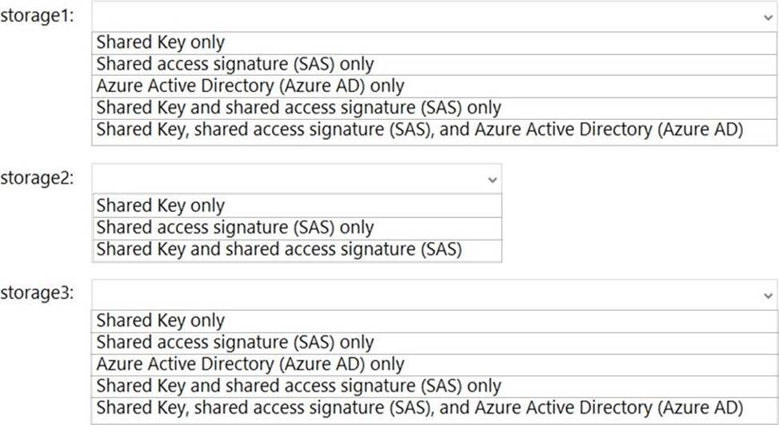

- [ ] storage1: Shared Key only. storage2: Shared access signature (SAS) only. storage3: Azure Active Directory (Azure AD) only.
- [x] storage1: Shared Key, shared access signature (SAS), and Azure Active Directory (Azure AD). storage2: Shared Key only. storage3: Shared Key, shared access signature (SAS), and Azure Active Directory (Azure AD).
- [ ] storage1: Azure Active Directory (Azure AD) only. storage2: Shared Key only. storage3: Shared Key, shared access signature (SAS), and Azure Active Directory (Azure AD).
- [ ] storage1: Shared Key, shared access signature (SAS), and Azure Active Directory (Azure AD). storage2: Shared Key only. storage3: Shared Key only.

**[⬆ Back to Top](#table-of-contents)**

### You have an Azure subscription that uses Azure Active Directory (Azure AD) Privileged Identity Management (PIM). A PIM user that is assigned the User Access Administrator role reports receiving an authorization error when performing a role assignment or viewing the list of assignments. You need to resolve the issue by ensuring that the PIM service principal has the correct permissions for the subscription. The solution must use the principle of least privilege. Which role should you assign to the PIM service principle?

- [ ] Contributor.
- [x] User Access Administrator.
- [ ] Managed Application Operator.
- [ ] Resource Policy Contributor.

**[⬆ Back to Top](#table-of-contents)**

### You have an Azure subscription that uses Azure AD Privileged Identity Management (PIM). A user named User1 is eligible for the Billing administrator role. You need to ensure that the role can only be used for a maximum of two hours. What should you do?

- [ ] Create a new access review.
- [ ] Edit the role assignment settings.
- [ ] Update the end date of the user assignment.
- [x] Edit the role activation settings.

**[⬆ Back to Top](#table-of-contents)**

### You have an Azure subscription that contains the custom roles shown in the following table. In the Azure portal, you plan to create new custom roles by cloning existing roles. The new roles will be configured as shown in the following table. Which roles can you clone to create each new role?

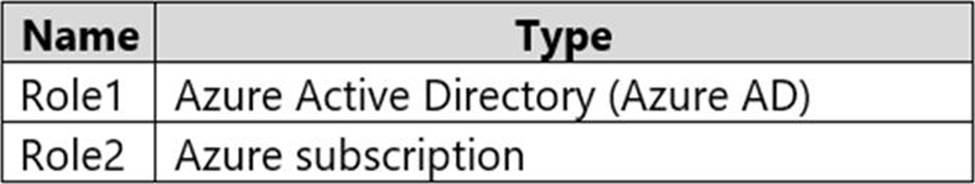
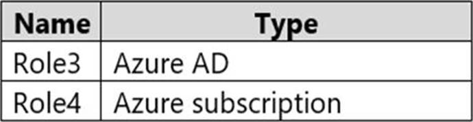
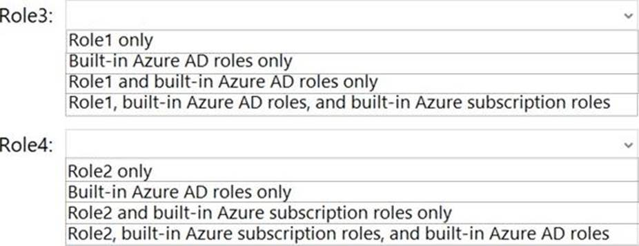

- [x] Role3: Role1 only. Role4: Role2 and built-in Azure subscription roles only.
- [ ] Role3: Built-in Azure AD roles only. Role4: Role2 only.
- [ ] Role3: Built-in Azure AD roles only. Role4: Built-in Azure AD roles only.
- [ ] Role3: Role1 and built-in Azure subscription roles only. Role4: Role2 and built-in Azure subscription roles only.

**[⬆ Back to Top](#table-of-contents)**

### You have an Azure subscription that contains an Azure SQL database named SQLDB1. SQLDB1 contains the columns shown in the following table. For the Email and Birthday columns, you implement dynamic data masking by using the default masking function. Which value will the users see in each column?

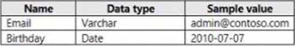
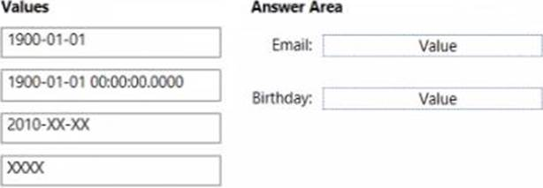

- [ ] Email: 1900-01-01. Birthday: 2010-XX-XX.
- [ ] Email: XXXX. Birthday: XXXX.
- [x] Email: XXXX. Birthday: 1900-01-01.
- [ ] Email: 1900-01-01. Birthday: XXXX.

**[⬆ Back to Top](#table-of-contents)**

### You plan to create an Azure Kubernetes Service (AKS) cluster in an Azure subscription. The manifest of the registered server application is shown in the following exhibit. You need to ensure that the AKS cluster and Azure Active Directory (Azure AD) are integrated. Which property should you modify in the manifest?

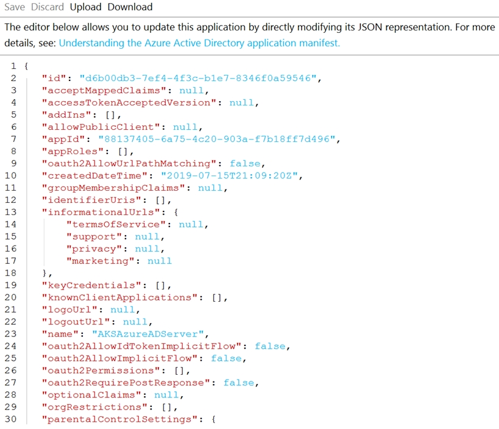

- [ ] accessTokenAcceptedVersion.
- [ ] keyCredentials.
- [x] groupMembershipClaims.
- [ ] acceptMappedClaims.

**[⬆ Back to Top](#table-of-contents)**

### You plan to implement JIT VM access. Which virtual machines will be supported?

- [x] VM2, VM3, and VM4 only.
- [ ] VM1, VM2, VM3, and VM4.
- [ ] VM1 and VM3 only.
- [ ] VM1 only.

**[⬆ Back to Top](#table-of-contents)**

### You have an Azure subscription that contains a virtual network. The virtual network contains the subnets shown in the following table. The subscription contains the virtual machines shown in the following table. You enable just in time (JIT) VM access for all the virtual machines. You need to identify which virtual machines are protected by JIT. Which virtual machines should you identify?

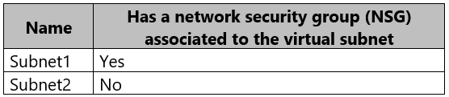
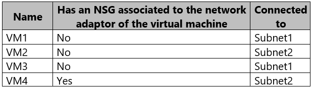

- [ ] VM4 only.
- [ ] VM1 and VM3 only.
- [x] VM1, VM3 and VM4 only.
- [ ] VM1, VM2, VM3, and VM4.

**[⬆ Back to Top](#table-of-contents)**

### You have an Azure subscription that contains a virtual machine named VM1. You create an Azure key vault that has the following configurations: Name: Vault5. Region: West US. Resource group: RG1. You need to use Vault5 to enable Azure Disk Encryption on VM1. The solution must support backing up VM1 by using Azure Backup. Which key vault settings should you configure?

- [x] Access policies.
- [ ] Secrets.
- [ ] Keys.
- [ ] Locks.

**[⬆ Back to Top](#table-of-contents)**

### You are configuring and securing a network environment. You deploy an Azure virtual machine named VM1 that is configured to analyze network traffic. You need to ensure that all network traffic is routed through VM1. What should you configure?

- [ ] System route.
- [ ] Network Security Group (NSG).
- [x] User-defined route.

**[⬆ Back to Top](#table-of-contents)**

### You have an Azure subscription named Sub1 that contains the resources shown in the following table. You need to ensure that you can provide VM1 with secure access to a database on SQL1 by using a contained database user. What should you do?

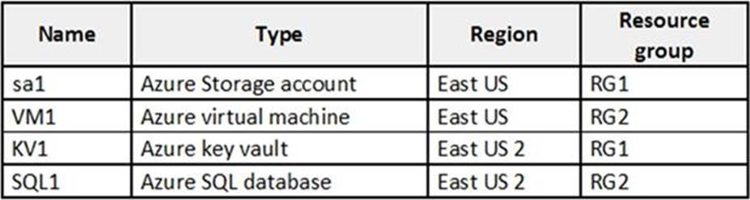

- [x] Enable a managed service identity on VM1.
- [ ] Create a secret in KV1.
- [ ] Configure a service endpoint on SQL1.
- [ ] Create a key in KV1.

**[⬆ Back to Top](#table-of-contents)**

### You have an Azure subscription named Sub1 that is associated to an Azure Active Directory (Azure AD) tenant named contoso.com. You plan to implement an application that will consist of the resources shown in the following table. Users will authenticate by using their Azure AD user account and access the Cosmos DB account by using resource tokens. You need to identify which tasks will be implemented in CosmosDB1 and WebApp1. Which task should you identify for each resource?

- [ ] CosmosDB1: Authenticate Azure AD users and generate resource tokens. WebApp1: Authenticate Azure AD users and relay resource tokens.
- [ ] CosmosDB1: Authenticate Azure AD users and relay resource tokens. WebApp1: Authenticate Azure AD users and generate resource tokens.
- [x] CosmosDB1: Create database users and generate resource tokens. WebApp1: Authenticate Azure AD users and relay resource tokens.
- [ ] CosmosDB1: Create database users and generate resource tokens. WebApp1: Authenticate Azure AD users and generate resource tokens.

**[⬆ Back to Top](#table-of-contents)**

### You are troubleshooting a security issue for an Azure Storage account. You enable the diagnostic logs for the storage account. What should you use to retrieve the diagnostics logs?

- [ ] Security & Compliance admin center.
- [ ] Azure Security Center.
- [ ] Azure Cosmos DB explorer.
- [x] AzCopy.

**[⬆ Back to Top](#table-of-contents)**

### You have Azure Resource Manager templates that you use to deploy Azure virtual machines. You need to disable unused Windows features automatically as instances of the virtual machines are provisioned. What should you use?

- [ ] Device configuration policies in Microsoft Intune.
- [x] Azure Desired State Configuration (DSC) virtual machine extension.
- [ ] Application security groups.
- [ ] Device compliance policies in Microsoft Intune.

**[⬆ Back to Top](#table-of-contents)**

### You are troubleshooting a security issue for an Azure Storage account. You enable the diagnostic logs for the storage account. What should you use to retrieve the diagnostics logs?

- [ ] Azure Security Center.
- [ ] Azure Monitor.
- [ ] Security admin center.
- [x] Azure Storage Explorer.

**[⬆ Back to Top](#table-of-contents)**
